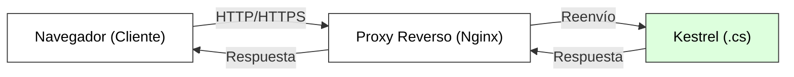
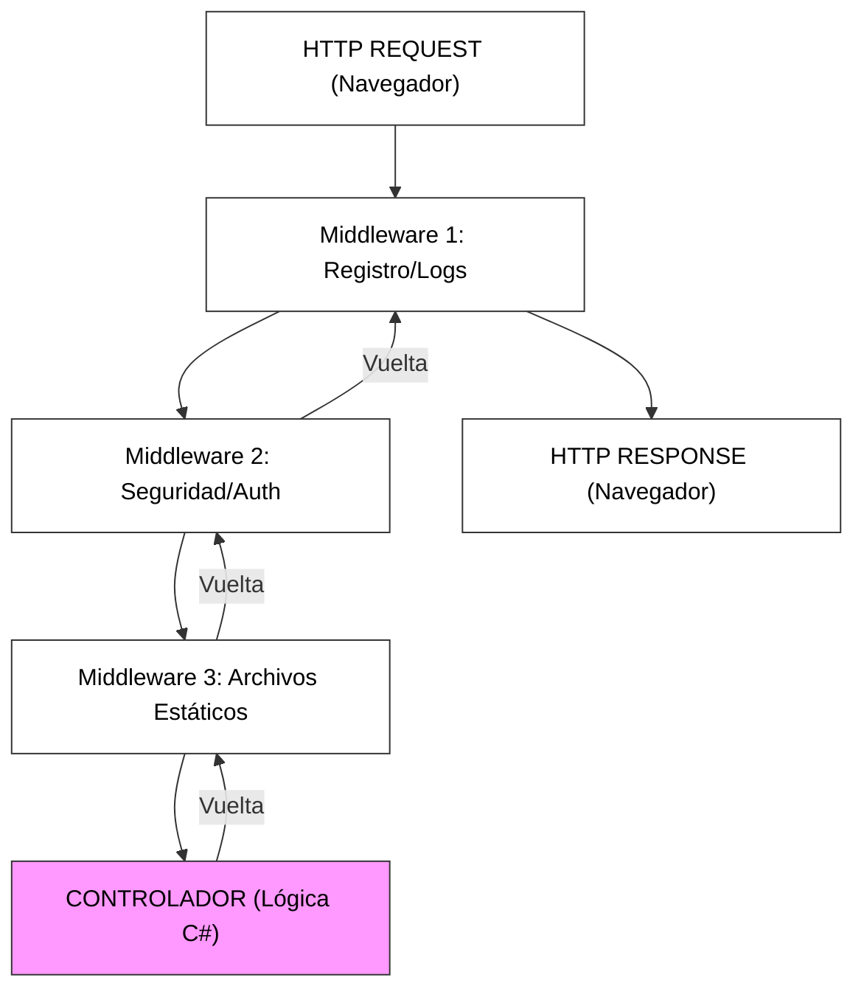
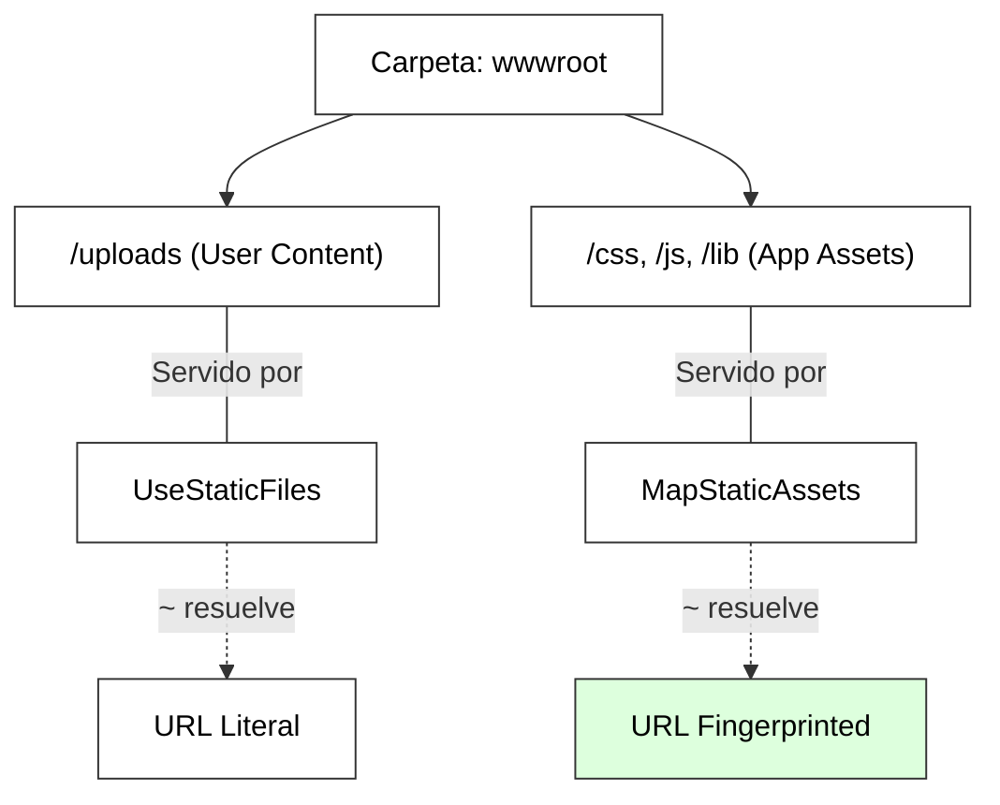
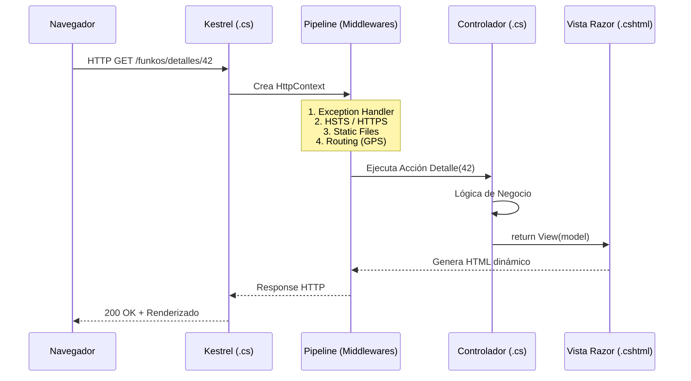
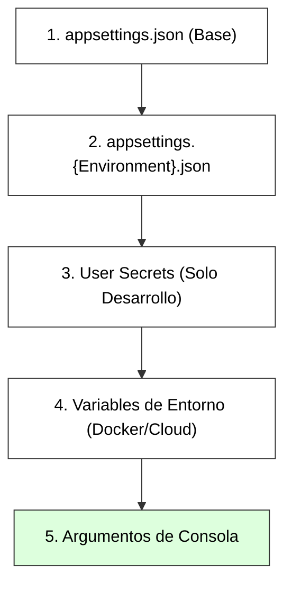
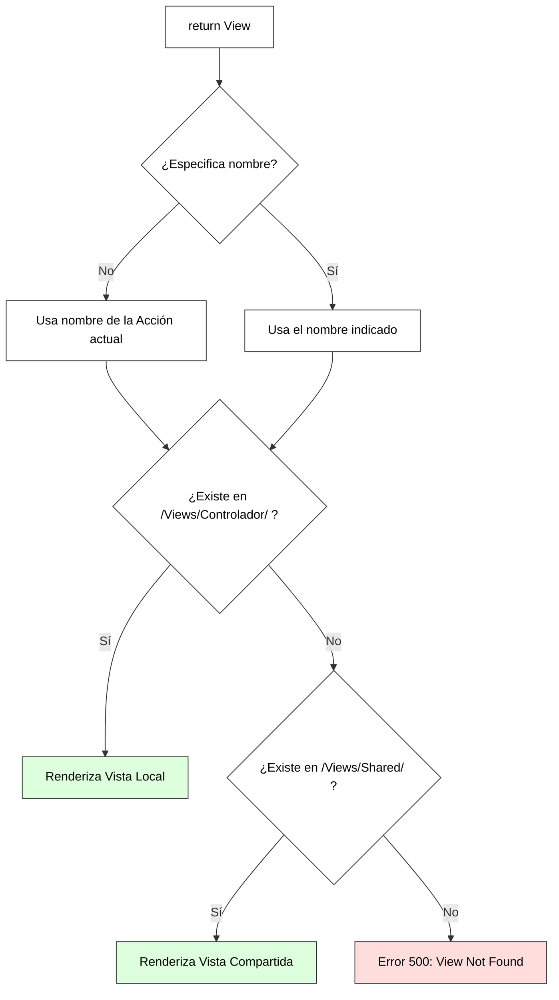
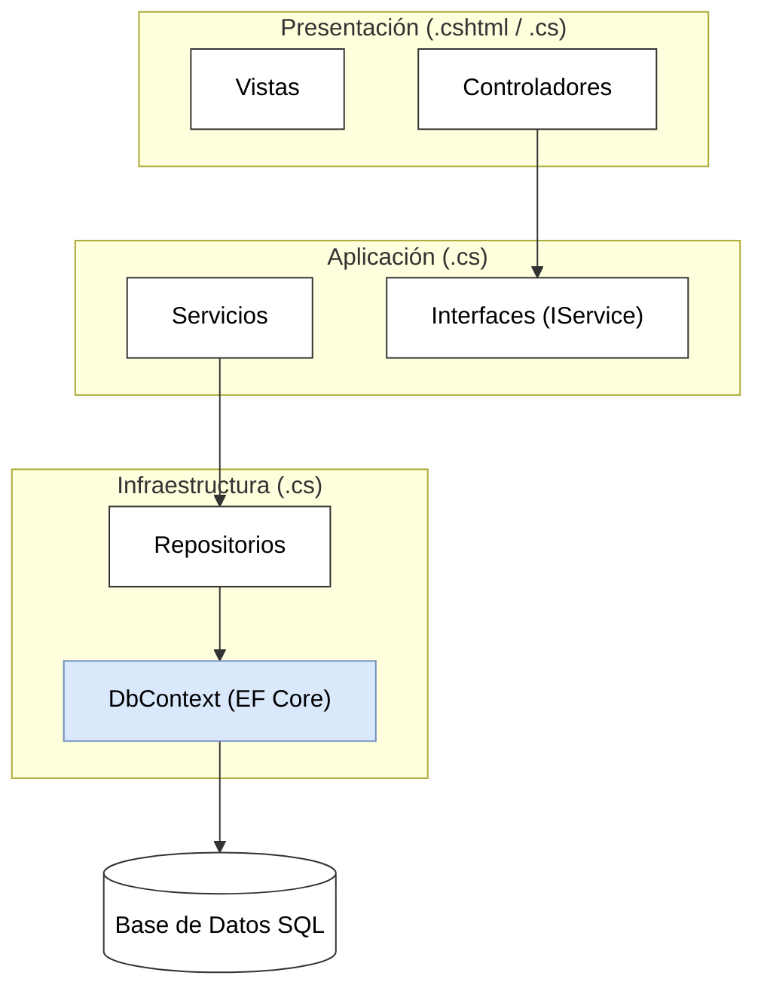
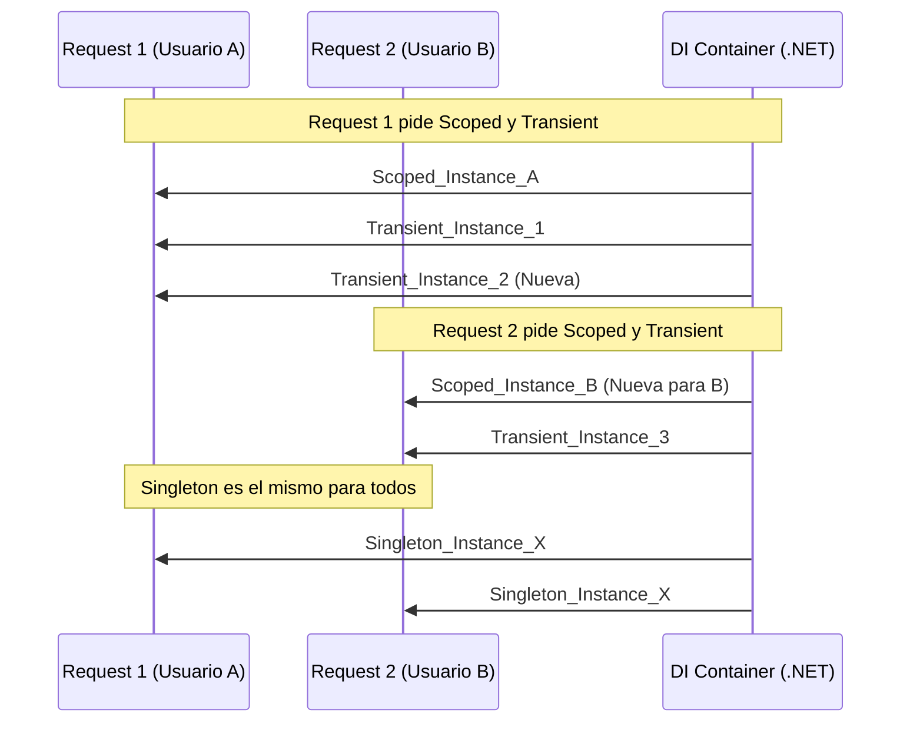
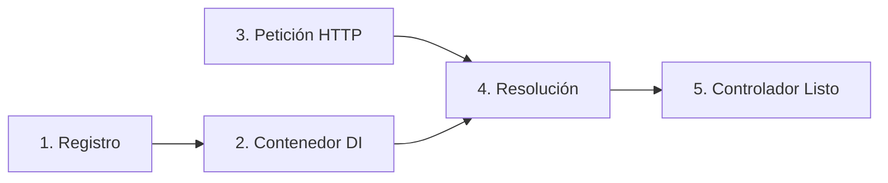

# 1. Fundamentos y Arquitectura de Aplicaciones Web

## Indice

- [1. Fundamentos y Arquitectura de Aplicaciones Web](#1-fundamentos-y-arquitectura-de-aplicaciones-web)
  - [Indice](#indice)
  - [1.1. Arquitectura de ASP.NET Core](#11-arquitectura-de-aspnet-core)
    - [1.1.1. Kestrel: El Servidor Web Integrado](#111-kestrel-el-servidor-web-integrado)
    - [1.1.2. El Pipeline de Middleware: El Corazón del Sistema](#112-el-pipeline-de-middleware-el-corazón-del-sistema)
      - [La Secuencia Bidireccional: Ida y Vuelta](#la-secuencia-bidireccional-ida-y-vuelta)
      - [¿Por qué el orden en Program.cs es Crítico?](#por-qué-el-orden-en-programcs-es-crítico)
    - [1.1.3. Anatomía de un Middleware: Paso vs Terminal](#113-anatomía-de-un-middleware-paso-vs-terminal)
    - [1.1.4. El Objeto HttpContext: La Estrella del Pipeline](#114-el-objeto-httpcontext-la-estrella-del-pipeline)
    - [1.1.5. El Pipeline Estándar Profesional: Orden y Propósito](#115-el-pipeline-estándar-profesional-orden-y-propósito)
    - [1.1.6. El Directorio wwwroot y la Gestión de Activos (.NET 10)](#116-el-directorio-wwwroot-y-la-gestión-de-activos-net-10)
  - [1.2. Ciclo de Vida de una Petición HTTP](#12-ciclo-de-vida-de-una-petición-http)
    - [1.2.1. Viaje del Browser al Endpoint](#121-viaje-del-browser-al-endpoint)
    - [1.2.2. El Orden de Ejecución: La Regla de Oro](#122-el-orden-de-ejecución-la-regla-de-oro)
  - [1.3. Estructura Unificada: Program.cs y Top-Level Statements](#13-estructura-unificada-programcs-y-top-level-statements)
    - [1.3.1. Evolución y Anatomía del nuevo Program.cs](#131-evolución-y-anatomía-del-nuevo-programcs)
    - [1.3.2. Estructura de Carpetas Profesional](#132-estructura-de-carpetas-profesional)
      - [1.3.3. La Jerarquía de Configuración: El sistema de Capas](#133-la-jerarquía-de-configuración-el-sistema-de-capas)
      - [1.3.4. El Patrón Options: Configuración Fuerte y Segura](#134-el-patrón-options-configuración-fuerte-y-segura)
  - [1.4. El Patrón MVC (Model-View-Controller)](#14-el-patrón-mvc-model-view-controller)
    - [1.4.1. Responsabilidades y Separación de Conceptos](#141-responsabilidades-y-separación-de-conceptos)
    - [1.4.2. Tipos de Modelos: Entities, ViewModels e InputModels](#142-tipos-de-modelos-entities-viewmodels-e-inputmodels)
      - [1.4.2.4. ViewData: El Almacén Auxiliar](#1424-viewdata-el-almacén-auxiliar)
    - [1.4.3. Anatomía de un Controlador Moderno](#143-anatomía-de-un-controlador-moderno)
    - [1.4.4. El Algoritmo de Resolución de Vistas (Lookup Path)](#144-el-algoritmo-de-resolución-de-vistas-lookup-path)
    - [1.4.5. Razor: El Motor de Vistas](#145-razor-el-motor-de-vistas)
  - [1.5. Enrutamiento y Navegación](#15-enrutamiento-y-navegación)
    - [1.5.1. Enrutamiento por Convención vs Atributos](#151-enrutamiento-por-convención-vs-atributos)
      - [A. Enrutamiento por Convención (Global)](#a-enrutamiento-por-convención-global)
      - [B. Enrutamiento por Atributos (Granular)](#b-enrutamiento-por-atributos-granular)
    - [1.5.2. Restricciones de Ruta (Route Constraints)](#152-restricciones-de-ruta-route-constraints)
  - [1.6. Controladores Híbridos: Vistas y APIs](#16-controladores-híbridos-vistas-y-apis)
  - [1.7. Gestión de Errores y Seguridad](#17-gestión-de-errores-y-seguridad)
  - [1.8. Inyección de Dependencias (DI) y Capas](#18-inyección-de-dependencias-di-y-capas)
    - [1.8.1. Arquitectura en Capas y Flujo de Datos](#181-arquitectura-en-capas-y-flujo-de-datos)
    - [1.8.2. Ciclos de Vida en Inyección de Dependencias (DI)](#182-ciclos-de-vida-en-inyección-de-dependencias-di)
      - [Visualización de Instancias por Petición](#visualización-de-instancias-por-petición)
    - [1.8.3. El Flujo de la Inyección: Del Registro al Uso](#183-el-flujo-de-la-inyección-del-registro-al-uso)
  - [1.9. Resumen](#19-resumen)

---

## 1.1. Arquitectura de ASP.NET Core

ASP.NET Core es el framework modular de Microsoft para construir aplicaciones web modernas. Su diseño se basa en la ligereza y el alto rendimiento.

### 1.1.1. Kestrel: El Servidor Web Integrado

**Kestrel** es el servidor HTTP multiplataforma, ligero y rápido desarrollado en C# que viene por defecto.

🎓 **Analogía del Profesor**:
> Imagina que montas una tienda. Kestrel es el **mostrador físico** donde los clientes entregan sus pedidos (peticiones HTTP). El mostrador no cocina, solo recibe el pedido y lo pasa a la cocina.

📝 **Nota del Profesor**:
> En producción, Kestrel nunca va solo. Se coloca detrás de un **Proxy Inverso** como Nginx o IIS. Kestrel es el motor, pero el Proxy es el "portero" que gestiona el SSL y el balanceo de carga.



### 1.1.2. El Pipeline de Middleware: El Corazón del Sistema

El **Pipeline** es una tubería por la que viaja la petición. Está formada por **Middlewares**: componentes que procesan la petición (Request) y la respuesta (Response).

#### La Secuencia Bidireccional: Ida y Vuelta
Es vital entender que un middleware no solo actúa cuando la petición entra, sino también cuando la respuesta sale hacia el navegador.



#### ¿Por qué el orden en Program.cs es Crítico?
El orden en el que escribes `app.Use...` define la lógica de tu aplicación. Un error en el orden puede dejar tu aplicación abierta a ataques o hacer que no funcione en absoluto.

**Ejemplos de Fallos por Orden Incorrecto:**

1.  **Autenticación vs Autorización**:
    - ❌ **Mal**: `app.UseAuthorization();` antes de `app.UseAuthentication();`.
    - **Resultado**: Intentamos verificar permisos de alguien que no sabemos quién es.
    - ✅ **Bien**: Primero identificamos (`Authentication`), luego autorizamos (`Authorization`).

2.  **Static Files vs Routing**:
    - ❌ **Mal**: `app.UseRouting();` antes de `app.UseStaticFiles();`.
    - **Resultado**: .NET busca controladores para cada imagen o CSS, destruyendo el rendimiento.
    - ✅ **Bien**: Los estáticos van primero para servir el archivo y terminar la petición rápido.

🎓 **Analogía del Profesor**:
> Es una **cadena de montaje**. La petición es el producto. Una estación verifica la identidad (Autenticación), otra decide si puede pasar (Autorización), otra empaqueta el producto (Compresión) y el final de la cinta es el Controlador.

### 1.1.3. Anatomía de un Middleware: Paso vs Terminal

Existen dos formas de comportarse dentro de la tubería:

1. **Middleware de Paso (`app.Use`)**: Realiza una acción y llama a `next()` para que la petición siga su camino.
2. **Middleware Terminal (`app.Run`)**: No llama a `next()`. Cortocircuita el pipeline y devuelve la respuesta inmediatamente.

```csharp
// Middleware de Paso
app.Use(async (context, next) => {
    // Lógica antes (Ida)
    await next(); 
    // Lógica después (Vuelta)
});

// Middleware Terminal
app.Run(async context => {
    await context.Response.WriteAsync("¡Fin de la tubería!");
});
```

### 1.1.4. El Objeto HttpContext: La Estrella del Pipeline

Cada middleware recibe un objeto `HttpContext`. Es la "caja negra" que contiene **todo** lo que necesitas saber:
- `Request`: URL, cabeceras, cookies, body.
- `Response`: Código de estado, cabeceras de respuesta.
- `User`: Información del usuario autenticado.
- `Session`: Datos temporales del usuario.

### 1.1.5. El Pipeline Estándar Profesional: Orden y Propósito

| Orden  | Middleware            | Método                | ¿Por qué en este lugar?                                           |
| :----- | :-------------------- | :-------------------- | :---------------------------------------------------------------- |
| **1º** | **Exception Handler** | `UseExceptionHandler` | Para capturar errores en TODOS los pasos siguientes.              |
| **2º** | **HSTS / HTTPS**      | `UseHttpsRedirection` | Seguridad básica: Nadie debe navegar en HTTP inseguro.            |
| **3º** | **Static Files**      | `UseStaticFiles`      | **Clásico**: Sirve archivos literales (uploads, imágenes de usuario). |
| **4º** | **Static Assets**     | `MapStaticAssets`     | **Moderno**: Sirve activos optimizados (CSS/JS) con huella digital. |
| **5º** | **Routing**           | `UseRouting`          | Identifica el destino. **OBLIGATORIO** antes de Auth.             |
| **6º** | **CORS**              | `UseCors`             | Decide si navegadores externos pueden consultar nuestra app.      |
| **7º** | **Authentication**    | `UseAuthentication`   | Identifica quién es el usuario.                                   |
| **8º** | **Authorization**     | `UseAuthorization`    | Verifica si el usuario tiene permiso para el destino.             |
| **9º** | **Session**           | `UseSession`          | Carga datos temporales del usuario identificado.                  |
| **10º**| **Endpoints**         | `MapControllerRoute`  | **TERMINAL**: Ejecuta la lógica final y genera la respuesta.      |

📝 **Nota del Profesor**:
> El pipeline es como un sistema de esclusas en un canal. Cada compuerta debe estar en su sitio para que el barco (la petición) no se hunda.
>
> **¿Por qué MapStaticAssets aparece ahora?**
> En .NET 10, separamos los archivos estáticos "tontos" (un PDF que sube un usuario) de los activos "inteligentes" de la aplicación (el CSS de tu marca). 
> - `UseStaticFiles` es el método tradicional. 
> - `MapStaticAssets` es el nuevo estándar profesional: comprime los archivos en tiempo de compilación y les añade una "huella digital" (un código en el nombre) para que el navegador sepa si el archivo ha cambiado sin tener que preguntar al servidor. ¡Es puro rendimiento!

### 1.1.6. El Directorio wwwroot y la Gestión de Activos (.NET 10)

En ASP.NET Core, existe una frontera física infranqueable: la carpeta **`wwwroot`**. Por seguridad, el servidor web solo puede servir archivos que estén dentro de esta carpeta (el "Web Root"). Ningún usuario podrá acceder a tus archivos `.cs` o secretos, ya que están fuera de este directorio.

Sin embargo, .NET 10 permite gestionar lo que hay dentro de `wwwroot` de dos formas distintas:

**A. UseStaticFiles (Acceso Literal)**
Considera a `wwwroot` como un simple disco duro. Se usa para:
- Archivos subidos por usuarios (uploads).
- PDF o documentos para descargar.
- Contenido que cambia en tiempo de ejecución.
- **Resolución con `~`**: `` -> ``.

**B. MapStaticAssets (Acceso Optimizado)**
Es la nueva forma endpoint-aware de servir los recursos de tu aplicación (CSS, JS, Imágenes del diseño). 
- **Huella Digital (Fingerprinting)**: Cambia el nombre del archivo automáticamente si el contenido cambia (adiós a los problemas de caché).
- **Compresión**: Pre-comprime los archivos en el build (Gzip/Brotli).
- **Rendimiento**: Se integra con el sistema de enrutamiento para ser más rápido.
- **Resolución con `~`**: `<link href="~/css/site.css" />` -> `<link href="/css/site.v8a2...css" />`.



📝 **Nota del Profesor**: 
> La virgulilla (**`~`**) es tu mejor amiga. Siempre que veas un atributo que empiece por `src` o `href` en una vista Razor, úsala. Ella se encarga de que tus rutas no se rompan si mueves la aplicación de servidor o si activas las optimizaciones de .NET 10. Solo recuerda: **lo que no esté en `wwwroot`, no existe para el navegador.**

---

## 1.2. Ciclo de Vida de una Petición HTTP

### 1.2.1. Viaje del Browser al Endpoint



### 1.2.2. El Orden de Ejecución: La Regla de Oro

El orden en el que escribes el código en `Program.cs` determina la seguridad y el rendimiento de tu app.

🏆 **Regla de Oro**:
> **Primero protege, luego enruta, luego autoriza.**

---

## 1.3. Estructura Unificada: Program.cs y Top-Level Statements

### 1.3.1. Evolución y Anatomía del nuevo Program.cs

En .NET 10, no hay clases ni métodos `Main`. El código empieza directamente.

```csharp
// 1. CONFIGURACIÓN DEL BUILDER (Servicios y DI)
var builder = WebApplication.CreateBuilder(args);
builder.Services.AddControllersWithViews(); // Activa MVC
builder.Services.AddScoped<IFunkoService, FunkoService>();

// 2. CONSTRUCCIÓN
var app = builder.Build();

// 3. CONFIGURACIÓN DEL PIPELINE (Middlewares)
if (!app.Environment.IsDevelopment()) {
    app.UseExceptionHandler("/Home/Error");
}
app.UseStaticFiles();
app.UseRouting();
app.UseAuthorization();

app.MapDefaultControllerRoute(); 

// 4. ARRANQUE
app.Run();
```

### 1.3.2. Estructura de Carpetas Profesional

```text
Proyecto/
├── Controllers/    # Orquestadores (.cs)
├── Models/         # Entities (.cs)
├── ViewModels/     # Escudos de datos (.cs)
├── Services/       # Lógica de Negocio (.cs)
├── Views/          # Interfaces (.cshtml)
│   ├── Shared/     # Layouts y Parciales
│   └── Funkos/     # Vistas del controlador
└── wwwroot/        # CSS, JS, Imágenes
```

#### 1.3.3. La Jerarquía de Configuración: El sistema de Capas

En .NET 10, la configuración no es un único bloque, sino una **cebolla de capas**. El sistema carga los archivos en un orden específico y los valores de las capas superiores "aplastan" a los de las inferiores.

**El Orden de Prioridad (De menor a mayor):**



🎓 **Analogía del Profesor**:
> Imagina que estás pintando una pared. La capa 1 (`appsettings.json`) es la imprimación blanca. La capa 2 (`appsettings.Development.json`) es el color azul. Al final, la pared es azul. Si en producción usas una Variable de Env, es como poner un cuadro encima.

📝 **Regla de Oro**: 
> **Nunca guardes contraseñas en `appsettings.json`**. Usa el archivo base para configuraciones genéricas y las **Variables de Entorno** o **User Secrets** para datos sensibles.

#### 1.3.4. El Patrón Options: Configuración Fuerte y Segura

Aunque puedes leer la configuración usando `Configuration["Clave"]`, en el mundo profesional usamos el **Patrón Options**. Este patrón consiste en mapear secciones del `appsettings.json` directamente a clases C#.

**Ventajas Técnicas:**
1.  **Tipado Fuerte**: Evitas errores tipográficos al escribir el nombre de una clave.
2.  **Validación**: Puedes usar DataAnnotations (`[Required]`, `[Range]`) para asegurar que la configuración es válida al arrancar la app.
3.  **Desacoplamiento**: Tus servicios no dependen de todo el sistema de configuración, solo de la clase que necesitan.

**Ejemplo de Implementación Profesional:**

1.  **El archivo (`appsettings.json`)**:
    ```json
    "ConfiguracionTienda": {
      "Nombre": "Funko Central",
      "Iva": 21.0
    }
    ```

2.  **La Clase de Configuración (`Models/TiendaOptions.cs`)**:
    ```csharp
    public class TiendaOptions {
        public string Nombre { get; set; } = string.Empty;
        public decimal Iva { get; set; }
    }
    ```

3.  **El Registro (`Program.cs`)**:
    ```csharp
    builder.Services.Configure<TiendaOptions>(
        builder.Configuration.GetSection("ConfiguracionTienda"));
    ```

4.  **El Uso (`Services/VentasService.cs`)**:
    ```csharp
    public class VentasService(IOptions<TiendaOptions> options) {
        private readonly TiendaOptions _config = options.Value;
        
        public void Procesar() {
            Console.WriteLine($"Venta en: {_config.Nombre}");
        }
    }
    ```

🎓 **Analogía del Profesor**:
> Usar la configuración directa es como **rebuscar en un cajón desastre** cada vez que necesitas un destornillador. El Patrón Options es tener una **caja de herramientas organizada**: sabes exactamente dónde está cada cosa y de qué tamaño es.

---

## 1.4. El Patrón MVC (Model-View-Controller)

### 1.4.1. Responsabilidades y Separación de Conceptos

🎓 **Analogía del Profesor**:
> - **Modelo (Cocina)**: Recetas y alimentos (Datos y Lógica).
> - **Controlador (Camarero)**: Atiende al cliente y coordina.
> - **Vista (Emplatado)**: La presentación final al cliente (HTML).

### 1.4.2. Tipos de Modelos: Entities, ViewModels e InputModels

1. **Entities (.cs)**: Reflejo fiel de la Base de Datos. Contienen datos sensibles.
2. **ViewModels (.cs)**: Solo contienen lo que la vista va a mostrar. Es un "escudo" protector.
3. **InputModels (.cs)**: Optimizados para recibir y validar datos de formularios.

#### 1.4.2.4. ViewData: El Almacén Auxiliar

A diferencia de los modelos anteriores, **ViewData** es un diccionario de objetos (`ViewDataDictionary`) que permite pasar pequeñas cantidades de datos entre el Controlador y la Vista.

*   **Tipo**: Diccionario Clave-Valor (`string` -> `object`).
*   **Tipado**: Débil (requiere casting).
*   **Uso Ideal**: Metadatos de la página (títulos, migas de pan).

📝 **Nota del Profesor**: 
> Si el Modelo es el **Plato Principal**, `ViewData` es la **Sal y la Pimienta**. No lo uses para datos complejos de negocio.

---

### 1.4.3. Anatomía de un Controlador Moderno

```csharp
[Route("[controller]")] 
public class FunkosController(IFunkoService service) : Controller 
{
    [HttpGet("[action]")] 
    public async Task<IActionResult> Listado() 
    {
        var data = await service.GetAllAsync();
        return View(data);
    }

    [HttpGet("ver/{id:int}")] 
    public async Task<IActionResult> Detalle(int id) 
    {
        var funko = await service.GetByIdAsync(id);
        if (funko == null) return NotFound();
        return View(funko);
    }
}
```

### 1.4.4. El Algoritmo de Resolución de Vistas (Lookup Path)

Cuando un controlador ejecuta la instrucción `return View();`, el motor Razor no busca al azar. Sigue este GPS:

1.  `Views/{Controlador}/{Acción}.cshtml` (Carpeta del Controlador)
2.  `Views/Shared/{Acción}.cshtml` (Carpeta Compartida)



---

### 1.4.5. Razor: El Motor de Vistas

Razor mezcla C# y HTML de forma fluida usando el símbolo `@`.

| Elemento             | Ejemplo                              |
| :------------------- | :----------------------------------- |
| **Directiva @model** | `@model IEnumerable<FunkoViewModel>` |
| **Expresión**        | `<h3>@Model.Nombre</h3>`             |
| **Bloque**           | `@{ var css = "text-danger"; }`      |
| **Control**          | `@if(Model.Stock > 0) { ... }`       |

---

## 1.5. Enrutamiento y Navegación

### 1.5.1. Enrutamiento por Convención vs Atributos

#### A. Enrutamiento por Convención (Global)
`{controller=Home}/{action=Index}/{id?}`. Ideal para sitios web estándar.

#### B. Enrutamiento por Atributos (Granular)
`[Route("tienda/oferta-del-dia/{id:int}")]`. Ideal para APIs y SEO.

### 1.5.2. Restricciones de Ruta (Route Constraints)

| Restricción  | Ejemplo              | Propósito                                                       |
| :----------- | :------------------- | :-------------------------------------------------------------- |
| **`int`**    | `{id:int}`           | **Protección**: Evita inyectar texto donde esperamos un número. |
| **`guid`**   | `{id:guid}`          | Obliga a usar un identificador único global.                    |
| **`min(n)`** | `{edad:int:min(18)}` | **Regla de Negocio**: Filtra por valor mínimo.                  |

---

## 1.6. Controladores Híbridos: Vistas y APIs

Un controlador MVC puede decidir qué devolver basándose en la petición del cliente (**Negociación de Contenido**).

```csharp
public async Task<IActionResult> Detalle(int id) 
{
    var funko = await service.GetByIdAsync(id);
    if (funko == null) return NotFound();

    if (Request.Headers["Accept"] == "application/json") {
        return Ok(funko); 
    }
    return View(funko); 
}
```

---

## 1.7. Gestión de Errores y Seguridad

💡 **Metáfora del Profesor**:
> Imagina una **red de seguridad** bajo un trapecista. El trapecista es tu código. Si el trapecista se cae (excepción), la red lo captura suavemente.

---

## 1.8. Inyección de Dependencias (DI) y Capas

### 1.8.1. Arquitectura en Capas y Flujo de Datos

Un proyecto profesional no es una "bola de barro". Separamos por responsabilidades.



### 1.8.2. Ciclos de Vida en Inyección de Dependencias (DI)

| Ciclo de Vida | Registro en C# | Comportamiento                                       | Duración          |
| :------------ | :------------- | :--------------------------------------------------- | :---------------- |
| **Transient** | `AddTransient` | **Efímero**: Instancia nueva cada vez que se pide.   | Un solo uso.      |
| **Scoped**    | `AddScoped`    | **Por Petición**: Instancia única por petición HTTP. | Vida del Request. |
| **Singleton** | `AddSingleton` | **Global**: Una sola instancia para toda la app.     | Vida de la App.   |

#### Visualización de Instancias por Petición



### 1.8.3. El Flujo de la Inyección: Del Registro al Uso

🎓 **Analogía del Profesor**:
> El sistema de DI es como un **bibliotecario inteligente**. 
> 1. En `Program.cs` (**Registro**), tú le das la lista de servicios.
> 2. Cuando un Controlador (**Usuario**) pide un servicio, el bibliotecario lo busca y se lo entrega en la mano (**Inyección**).



---

## 1.9. Resumen

1. **Pipeline**: Proceso bidireccional de middlewares. El orden importa.
2. **wwwroot**: Carpeta pública protegida. Uso de `~` y `MapStaticAssets`.
3. **Configuración**: Sistema de capas por prioridad (Secrets > AppSettings).
4. **MVC**: Patrón profesional para separar lógica de presentación.
5. **Vistas**: Resolución por convención (Controlador -> Shared).
6. **DI**: Fundamental para el desacoplamiento y testing.