# 2. Motor de Vistas Razor: Generación de Contenido Dinámico

## Indice

- [2. Motor de Vistas Razor: Generación de Contenido Dinámico](#2-motor-de-vistas-razor-generación-de-contenido-dinámico)
  - [Indice](#indice)
  - [2.1. ¿Qué es Razor? ¿Cómo funciona? Sintaxis Razor y C# 14](#21-qué-es-razor-cómo-funciona-sintaxis-razor-y-c-14)
    - [2.1.1. Ciclo de Vida: Razor Pages vs MVC](#211-ciclo-de-vida-razor-pages-vs-mvc)
      - [Ciclo de Vida de una Razor Page (Orientado a Páginas)](#ciclo-de-vida-de-una-razor-page-orientado-a-páginas)
      - [Ciclo de Vida en MVC (Orientado a Acciones)](#ciclo-de-vida-en-mvc-orientado-a-acciones)
    - [2.1.2. Delimitadores Razor: Diferencias entre @ (expresión) y @{ } (bloque de código)](#212-delimitadores-razor-diferencias-entre--expresión-y---bloque-de-código)
      - [Tipos de delimitadores](#tipos-de-delimitadores)
      - [Ejemplo completo: Combinando todos los delimitadores](#ejemplo-completo-combinando-todos-los-delimitadores)
      - [Nota del Profesor 📝:](#nota-del-profesor-)
    - [2.1.3. Tipado fuerte en vistas: Ventajas del IntelliSense frente a motores débiles (Pebble)](#213-tipado-fuerte-en-vistas-ventajas-del-intellisense-frente-a-motores-débiles-pebble)
      - [Comparativa: Razor vs Pebble (Spring Boot)](#comparativa-razor-vs-pebble-spring-boot)
        - [Pebble (Motor débilmente tipado)](#pebble-motor-débilmente-tipado)
        - [Razor (Motor fuertemente tipado)](#razor-motor-fuertemente-tipado)
  - [2.2. Estructuras de Control en la Interfaz](#22-estructuras-de-control-en-la-interfaz)
    - [2.2.1. Lógica condicional: @if, @else y expresiones ternarias](#221-lógica-condicional-if-else-y-expresiones-ternarias)
    - [2.2.2. Renderizado de colecciones: @foreach y manejo de estados vacíos](#222-renderizado-de-colecciones-foreach-y-manejo-de-estados-vacíos)
  - [2.3. Composición y Reutilización (Layouts)](#23-composición-y-reutilización-layouts)
    - [2.3.1. El sistema de Layouts: \_ViewStart.cshtml, \_Layout.cshtml y \_ViewImports.cshtml](#231-el-sistema-de-layouts-_viewstartcshtml-_layoutcshtml-y-_viewimportscshtml)
      - [🎓 Ejemplo de Layouts Anidados (Arquitectura Pro)](#-ejemplo-de-layouts-anidados-arquitectura-pro)
    - [2.3.2. Secciones y RenderBody: @RenderSection para scripts y estilos](#232-secciones-y-renderbody-rendersection-para-scripts-y-estilos)
    - [2.3.3. Componentes de UI: Vistas Parciales y ViewComponents](#233-componentes-de-ui-vistas-parciales-y-viewcomponents)
      - [2.3.3.1. ¿Qué es un ViewComponent?](#2331-qué-es-un-viewcomponent)
      - [2.3.3.2. Estructura y Parámetros en ViewComponents](#2332-estructura-y-parámetros-en-viewcomponents)
      - [2.3.3.3. Invocación Moderna: ViewComponents como Tag Helpers](#2333-invocación-moderna-viewcomponents-como-tag-helpers)
    - [2.3.4. Anatomía de un Layout Profesional: Navbar, Footer y Contenido](#234-anatomía-de-un-layout-profesional-navbar-footer-y-contenido)
      - [1. El Gancho Global: \_ViewStart.cshtml](#1-el-gancho-global-_viewstartcshtml)
      - [2. El Chasis: \_Layout.cshtml](#2-el-chasis-_layoutcshtml)
      - [3. Los Componentes Reutilizables: \_Navbar.cshtml y \_Footer.cshtml](#3-los-componentes-reutilizables-_navbarcshtml-y-_footercshtml)
      - [4. La Pieza Final: La Vista de Contenido (Index.cshtml)](#4-la-pieza-final-la-vista-de-contenido-indexcshtml)
      - [Ubicación y Diferencias: MVC vs Razor Pages](#ubicación-y-diferencias-mvc-vs-razor-pages)
  - [2.4. MVC vs Razor Pages: Arquitectura, Enrutamiento y Gestión de Estado](#24-mvc-vs-razor-pages-arquitectura-enrutamiento-y-gestión-de-estado)
    - [2.4.1. Configuración en el Corazón: Program.cs](#241-configuración-en-el-corazón-programcs)
    - [2.4.2. El Binomio Indisoluble: Vista (.cshtml) + PageModel (.cshtml.cs)](#242-el-binomio-indisoluble-vista-cshtml--pagemodel-cshtmlcs)
      - [Resolución de Vistas: Libertad (MVC) vs Convención (Razor Pages)](#resolución-de-vistas-libertad-mvc-vs-convención-razor-pages)
    - [2.4.3. El Corazón del Motor: Handlers y Ciclo de Vida](#243-el-corazón-del-motor-handlers-y-ciclo-de-vida)
      - [🎓 Los "Named Handlers" (Múltiples acciones en una página)](#-los-named-handlers-múltiples-acciones-en-una-página)
    - [2.4.4. Gestión de Estado y Model Binding: El Secreto de \[BindProperty\]](#244-gestión-de-estado-y-model-binding-el-secreto-de-bindproperty)
      - [¿Cómo funciona técnicamente?](#cómo-funciona-técnicamente)
    - [2.4.5. Navegación, Resultados y Validación: La Guía del Flujo](#245-navegación-resultados-y-validación-la-guía-del-flujo)
      - [A. Los Retornos (Action Results)](#a-los-retornos-action-results)
      - [B. Validación del Modelo (ModelState)](#b-validación-del-modelo-modelstate)
      - [C. El Arte de la Redirección: MVC vs Razor Pages](#c-el-arte-de-la-redirección-mvc-vs-razor-pages)
    - [2.4.6. Enrutamiento Técnico y Seguridad: La Guía de Rutas](#246-enrutamiento-técnico-y-seguridad-la-guía-de-rutas)
      - [2.4.6.1. Resolución de Archivos: GPS (MVC) vs Geografía (Razor Pages)](#2461-resolución-de-archivos-gps-mvc-vs-geografía-razor-pages)
      - [2.4.6.2. Seguridad Estructural: AuthorizeFolder vs Atributos](#2462-seguridad-estructural-authorizefolder-vs-atributos)
    - [2.4.7. Comparativa Técnica Directa: ViewModels vs PageModel](#247-comparativa-técnica-directa-viewmodels-vs-pagemodel)
    - [2.4.8. ViewData: La Mochila Compartida](#248-viewdata-la-mochila-compartida)
      - [A. Concepto y Funcionamiento](#a-concepto-y-funcionamiento)
      - [B. Ejemplo Práctico: El Título de la Página](#b-ejemplo-práctico-el-título-de-la-página)
      - [C. Comparativa: Modelo vs ViewData](#c-comparativa-modelo-vs-viewdata)
    - [2.4.9. El Binomio en Acción: Anatomía de un Formulario Profesional](#249-el-binomio-en-acción-anatomía-de-un-formulario-profesional)
      - [2.4.9.1. Escenario: Crear un Nuevo Funko (Create)](#2491-escenario-crear-un-nuevo-funko-create)
      - [2.4.9.2. Escenario: Modificar un Funko (Update)](#2492-escenario-modificar-un-funko-update)
      - [2.4.9.3. Escenario: Visualizar Detalle (Read)](#2493-escenario-visualizar-detalle-read)
      - [2.4.9.4. Escenario: Eliminar un Funko (Delete)](#2494-escenario-eliminar-un-funko-delete)
    - [2.4.10. El Bucle de Validación: Retorno de Datos y Errores](#2410-el-bucle-de-validación-retorno-de-datos-y-errores)
      - [A. El Mecanismo de "Re-renderizado"](#a-el-mecanismo-de-re-renderizado)
      - [B. ¿Por qué los datos siguen ahí? (El secreto de asp-for)](#b-por-qué-los-datos-siguen-ahí-el-secreto-de-asp-for)
      - [C. Comparativa: Retorno vs Redirección](#c-comparativa-retorno-vs-redirección)
    - [2.4.11. ¿Cuál elegir? Guía de Decisión y Proyectos Mixtos](#2411-cuál-elegir-guía-de-decisión-y-proyectos-mixtos)
      - [El Superpoder de MVC: Controladores Mixtos](#el-superpoder-de-mvc-controladores-mixtos)
    - [2.4.12. Tag Helpers de Navegación: El puente entre mundos (asp-action vs asp-page)](#2412-tag-helpers-de-navegación-el-puente-entre-mundos-asp-action-vs-asp-page)
      - [A. Navegación en MVC: asp-action y asp-controller](#a-navegación-en-mvc-asp-action-y-asp-controller)
      - [B. Navegación en Razor Pages: asp-page](#b-navegación-en-razor-pages-asp-page)
      - [Tabla Comparativa de Tag Helpers](#tabla-comparativa-de-tag-helpers)
  - [2.5. Resumen](#25-resumen)

---

## 2.1. ¿Qué es Razor? ¿Cómo funciona? Sintaxis Razor y C# 14

**Razor** es el **motor de plantillas** de ASP.NET Core que permite combinar HTML con código C# de forma natural, segura y eficiente. Es el sistema que transforma archivos `.cshtml` en HTML puro que el navegador puede renderizar. 

**Analogía del Profesor 🎓:**
> Razor es como un chef que tiene una receta (la plantilla `.cshtml`) con ingredientes variables (los datos del modelo). El chef sigue la receta paso a paso, sustituyendo los ingredientes según lo que tenga disponible, y al final sirve un plato completo (HTML) al cliente.

***Un mismo sabor, dos filosofías distintas***

Para dominar .NET 10, debemos entender no solo la sintaxis, sino cómo fluye la información. 

**MVC vs Razor Pages: ¿Cuál elegir?**
Mientras que MVC separa el Controlador de la Vista, **Razor Pages** los une en un archivo `.cshtml` y un `PageModel` (`.cshtml.cs`). Es el enfoque recomendado para aplicaciones basadas en páginas.

- **MVC (Orientado a Acciones)**: Controlador + Vista separados. Si tienes lógica tipo APIs o microservicios es mejor (Un mismo controlador puede devolver una API REST y o una vista usando los mismos servicios), además de separar claramente la lógica de negocio de las vistas.
- **Razor Pages (Orientado a Páginas)**: Página + PageModel juntos. Ideal para aplicaciones web tradicionales basadas en páginas.

```mermaid
graph LR
    subgraph "Patrón MVC (Orientado a Acciones)"
        C["Controlador (.cs)"] --> M["Modelo (.cs)"]
        C --> V["Vista (.cshtml)"]
    end
    subgraph "Patrón Razor Pages (Orientado a Páginas)"
        P["Página (Vista .cshtml)"] <--> PM["PageModel (Clase .cshtml.cs)<br/>(Hereda de PageModel)"]
        PM --> M2["Modelo (Datos .cs)"]
    end
    style P fill:#f9f,stroke:#333,color:#000
    style PM fill:#cfc,stroke:#333,color:#000
```



### 2.1.1. Ciclo de Vida: Razor Pages vs MVC

Es crucial entender que en la web cada interacción es una nueva petición. No hay "memoria" entre el GET y el POST a menos que usemos persistencia (Cookies, Sesión o Base de Datos). Sin embargo, la forma en que .NET procesa esa petición cambia según el paradigma.

#### Ciclo de Vida de una Razor Page (Orientado a Páginas)
Aquí la petición va directa al archivo que "posee" la URL. El `PageModel` gestiona su propia vista.


#### Ciclo de Vida en MVC (Orientado a Acciones)
En MVC, la petición llega a un **Controlador** (el orquestador), quien debe buscar los datos y elegir explícitamente qué **Vista** entregar al usuario.


| Fase        | Razor Pages                               | MVC                                    |
| :---------- | :---------------------------------------- | :------------------------------------- |
| **Entrada** | Handler (`OnGet`, `OnPost`)               | Método de Acción (`Index`, `Create`)   |
| **Datos**   | Propiedades de clase con `[BindProperty]` | Parámetros del método o `ViewModel`    |
| **Salida**  | `return Page()` (la suya propia)          | `return View()` (puede ser cualquiera) |

---

### 2.1.2. Delimitadores Razor: Diferencias entre @ (expresión) y @{ } (bloque de código)

Razor utiliza el símbolo `@` como **delimitador** para diferenciar entre HTML estático y código C#. 

#### Tipos de delimitadores

```cshtml
@* 1. EXPRESIONES INLINE: @ seguido de código C# *@
<h1>@Model.Nombre</h1>
@* Genera: <h1>Funko Pop Darth Vader</h1> *@

<p>Precio: @Model.Precio.ToString("C")</p>

<p>Precio con IVA: @(Model.Precio * 1.21m)</p>

@* ⚠️ IMPORTANTE: Los paréntesis son obligatorios para expresiones complejas *@
<p>@(Model.Precio + Model.Descuento)</p>  @* ✅ Correcto *@
<p>@Model.Precio + Model.Descuento</p>    @* ❌ Incorrecto *@

@* 2. BLOQUES DE CÓDIGO: @{ ... } *@
@{
    // Variables locales
    var precioConIva = Model.Precio * 1.21m;
    var descuento = Model.Precio * 0.10m;
    var precioFinal = precioConIva - descuento;
    
    // Lógica compleja
    string cssClass = Model.EsNovedad ? "badge-success" : "badge-secondary";
}

@* 3. COMENTARIOS RAZOR: @* ... *@ *@
@* Este comentario NO se envía al navegador *@

<!-- Este comentario HTML SÍ se envía al navegador -->

@* 4. ESCAPE DEL SÍMBOLO @: @@ *@
<p>Contacto: info@@funkoshop.com</p>

@* 5. TRANSICIÓN EXPLÍCITA A HTML: <text> o @: *@
@{
    var mostrarMensaje = true;
    if (mostrarMensaje) {
        <text>Este es un mensaje desde el bloque de código</text>
        @:Este es otro mensaje sin etiquetas HTML
    }
}
```

#### Ejemplo completo: Combinando todos los delimitadores

```cshtml
@* Views/Funkos/Detalle.cshtml *@
@model FunkoDetalleViewModel

@{
    ViewData["Title"] = $"Detalle - {Model.Nombre}";
    
    var precioConDescuento = Model.TieneDescuento 
        ? Model.Precio * (1 - Model.PorcentajeDescuento / 100m)
        : Model.Precio;
    
    var cssClaseCard = Model.EsNovedad ? "border border-success shadow-lg" : "border";
    
    var icono = Model.Tipo switch
    {
        "Pop" => "fas fa-box",
        "Soda" => "fas fa-wine-bottle",
        "VinylSoda" => "fas fa-record-vinyl",
        "Mystery" => "fas fa-question-circle",
        _ => "fas fa-cube"
    };
    
    var cultura = new System.Globalization.CultureInfo("es-ES");
    var fechaFormateada = Model.FechaCreacion.ToString("D", cultura);
    
    string mensajeDisponibilidad;
    if (Model.Stock > 10) { mensajeDisponibilidad = "En stock"; }
    else if (Model.Stock > 0) { mensajeDisponibilidad = $"¡Solo quedan {Model.Stock} unidades!"; }
    else { mensajeDisponibilidad = "Agotado"; }
}

<div class="container mt-4">
    <div class="row">
        <div class="col-md-6">
            <div class="card @cssClaseCard">
                @if (!string.IsNullOrEmpty(Model.ImagenUrl)) {
                    
                }
                @if (Model.EsNovedad) {
                    <div class="position-absolute top-0 end-0 m-3">
                        <span class="badge bg-success fs-5">✨ Novedad</span>
                    </div>
                }
            </div>
        </div>
        <div class="col-md-6">
            <h1><i class="@icono text-primary"></i> @Model.Nombre</h1>
            <div class="mb-3">
                <span class="badge bg-primary">@Model.TipoNombre</span>
                @{ var cssClaseStock = Model.Stock > 10 ? "bg-success" : Model.Stock > 0 ? "bg-warning" : "bg-danger"; }
                <span class="badge @cssClaseStock">@mensajeDisponibilidad</span>
            </div>
            @* Lógica de antigüedad con C# 14 Switch Expression *@
            @{
                var diasDesdeCreacion = (DateTime.Now - Model.FechaCreacion).Days;
                string mensajeAntiguedad = diasDesdeCreacion switch {
                    0 => "¡Lanzado hoy!",
                    1 => "Lanzado ayer",
                    < 7 => $"Lanzado hace {diasDesdeCreacion} días",
                    _ => $"Lanzado el {fechaFormateada}"
                };
            }
            <p><strong>Antigüedad:</strong> @mensajeAntiguedad</p>
        </div>
    </div>
</div>
```

#### Nota del Profesor 📝:

**Buenas prácticas con delimitadores Razor:**

1. ✅ **Usa ` @{ }` para lógica preparatoria** (cálculos, variables locales)
2. ✅ **Usa ` @` para expresiones simples** inline en HTML
3. ✅ **Usa paréntesis ` @( )`** para expresiones complejas o con operadores
4. ✅ **Evita lógica compleja** en las vistas (muévela al ViewModel)

### 2.1.3. Tipado fuerte en vistas: Ventajas del IntelliSense frente a motores débiles (Pebble)

Una de las **mayores ventajas** de Razor sobre otros motores de plantillas es el **tipado fuerte**. Esto significa que el compilador conoce exactamente qué tipo de datos espera la vista. 

**Analogía del Profesor 🎓:**
> Imagina que estás montando un mueble de IKEA: 
> - **Motor débilmente tipado (Pebble)**: Te dan las piezas sin manual. Tienes que adivinar qué tornillo va dónde.
> - **Razor (tipado fuerte)**: Te dan el manual con diagramas detallados. Cada pieza tiene su lugar exacto.

#### Comparativa: Razor vs Pebble (Spring Boot)

##### Pebble (Motor débilmente tipado)
```html
<p>Precio: {{ funko.presio }}</p> {# ❌ Typo: no hay error hasta runtime #}
```

##### Razor (Motor fuertemente tipado)
```cshtml
@model FunkoDetalleViewModel
<p>Precio: @Model.Precio</p> @* ✅ IntelliSense muestra todo. Error de compilación si escribes mal *@
```

---

## 2.2. Estructuras de Control en la Interfaz

💡 **Metáfora del Navegador**:
> Imagina que el código C# es el sistema de navegación (GPS) y el HTML es la carretera. Las estructuras de control son las señales de tráfico que deciden por dónde debe fluir el usuario.

### 2.2.1. Lógica condicional: @if, @else y expresiones ternarias

```cshtml
@if (Model.EsNovedad)
{
    <span class="badge bg-success">✨ Novedad</span>
}

@* C# 14 Pattern Matching para estados complejos *@
@if (Model.Stock is > 0 and <= 5)
{
    <div class="alert alert-warning">¡Solo quedan @Model.Stock unidades!</div>
}

@switch (Model.CategoriaNombre)
{
    case "Star Wars": <i class="fas fa-jedi"></i> break;
    case "Marvel": <i class="fas fa-mask"></i> break;
    default: <i class="fas fa-box"></i> break;
}

@* 🎓 Switch Expression (C# 14): La forma más elegante para UI *@
@{
    var colorPrecio = Model.Precio switch {
        < 20 => "text-success",
        < 50 => "text-warning",
        _    => "text-danger"
    };
}
<h2 class="@colorPrecio">@Model.Precio.ToString("C")</h2>
```

### 2.2.2. Renderizado de colecciones: @foreach y manejo de estados vacíos

📝 **Nota del Profesor**:
> El manejo del **"Estado Vacío"** diferencia una aplicación profesional de una amateur. NUNCA lances un `foreach` sin comprobar si hay datos.

```cshtml
@model FunkosIndexViewModel

@if (!Model.Funkos.Any())
{
    <div class="empty-state text-center py-5">
        <i class="fas fa-search-minus fa-4x text-muted mb-3"></i>
        <h3>No hemos encontrado resultados</h3>
        <a asp-action="Index" class="btn btn-primary">Limpiar Filtros</a>
    </div>
}
else
{
    @foreach (var grupo in Model.Funkos.GroupBy(f => f.CategoriaNombre))
    {
        <h3 class="border-bottom pb-2 mt-4">@grupo.Key (@grupo.Count())</h3>
        <div class="row">
            @foreach (var funko in grupo)
            {
                <div class="col-md-4 mb-3">
                    <partial name="_FunkoCard" model="funko" />
                </div>
            }
        </div>
    }
}
```

---

## 2.3. Composición y Reutilización (Layouts)

### 2.3.1. El sistema de Layouts: _ViewStart.cshtml, _Layout.cshtml y _ViewImports.cshtml

```mermaid
graph TD
    VS["_ViewStart.cshtml<br/>(Lógica Inicial)"] --> VI["_ViewImports.cshtml<br/>(Directivas Globales)"]
    VI --> L["_Layout.cshtml<br/>(Estructura Maestra)"]
    L --> RB["@RenderBody()<br/>(Inyección)"]
    V1["Index.cshtml"] -- se inyecta en --> RB
    style L fill:#e6f3ff,stroke:#0066cc,stroke-width:2px,color:#000
    style RB fill:#fff2cc,stroke:#d6b656,stroke-width:2px,color:#000
```



- **`_ViewStart.cshtml`**: Establece el Layout global.
- **`_ViewImports.cshtml`**: Centraliza directivas `@using` y `@addTagHelper`.
- **`_Layout.cshtml`**: El contenedor HTML global.

#### 🎓 Ejemplo de Layouts Anidados (Arquitectura Pro)
```cshtml
@* 2. Layout Secundario: Views/Shared/_AdminLayout.cshtml *@
@{
    Layout = "_Layout"; // Hereda del base
}
<div class="row">
    <aside class="col-3">Menú de Gestión</aside>
    <main class="col-9">@RenderBody()</main>
</div>
```

### 2.3.2. Secciones y RenderBody: @RenderSection para scripts y estilos

```cshtml
@* En el Layout *@
@await RenderSectionAsync("Scripts", required: false)

@* En la Vista Detalle.cshtml *@
@section Scripts {
    <script src="~/js/detalle-funkos.js"></script>
}
```

### 2.3.3. Componentes de UI: Vistas Parciales y ViewComponents

| Herramienta       | Analogía          | Lógica (C#) | Cuándo usar                                                                                                          |
| :---------------- | :---------------- | :---------- | :------------------------------------------------------------------------------------------------------------------- |
| **Vista Parcial** | Una Pegatina      | ❌ No        | Fragmentos repetitivos que solo muestran datos ya tienes (ej: una tarjeta de producto).                              |
| **ViewComponent** | Un Robot Autónomo | ✅ Sí        | Widgets que necesitan consultar su propia información (ej: un carrito que se actualiza solo, un menú de categorías). |

#### 2.3.3.1. ¿Qué es un ViewComponent?
A diferencia de una Vista Parcial, un **ViewComponent** no depende de que el Controlador le pase los datos. Él mismo puede inyectar servicios, consultar la base de datos y procesar lógica antes de dibujarse. Es como un "Mini-Controlador" que solo vive para una pequeña parte de la pantalla.

#### 2.3.3.2. Estructura y Parámetros en ViewComponents
```csharp
// Components/OfertasViewComponent.cs (.cs)
public class OfertasViewComponent(IFunkoService service) : ViewComponent 
{
    // El método InvokeAsync es el "cerebro" del componente
    public async Task<IViewComponentResult> InvokeAsync(int limite) 
    {
        // El componente busca sus propios datos de forma independiente
        var items = await service.GetOfertas(limite);
        return View(items); // Devuelve su propia sub-vista
    }
}
```

#### 2.3.3.3. Invocación Moderna: ViewComponents como Tag Helpers

Aunque la forma clásica de invocar un componente es mediante código C#, .NET permite una sintaxis mucho más limpia que parece HTML nativo.

**Requisito previo**: Debes registrar los Tag Helpers de tu proyecto en el archivo `_ViewImports.cshtml`:
`@addTagHelper *, TuNombreDeProyecto`

| Método      | Sintaxis                                                      | Estilo                |
| :---------- | :------------------------------------------------------------ | :-------------------- |
| **Clásico** | `@await Component.InvokeAsync("Ofertas", new { limite = 5 })` | ❌ Pesado, mezcla C#   |
| **Moderno** | `<vc:ofertas limite="5" />`                                   | ✅ Limpio, estilo HTML |

📝 **Nota del Profesor**: 
> Para que funcione la sintaxis `<vc:>`, el nombre del componente debe convertirse de `PascalCase` a `kebab-case`. Si tu clase se llama `CarritoCompraViewComponent`, la etiqueta será `<vc:carrito-compra />`.

### 2.3.4. Anatomía de un Layout Profesional: Navbar, Footer y Contenido

Para mantener un código limpio y DRY (Don't Repeat Yourself), un Layout no debe contener miles de líneas de HTML. La práctica profesional consiste en trocear la interfaz en **Vistas Parciales** y ensamblarlas en el Layout maestro.

#### 1. El Gancho Global: _ViewStart.cshtml
Este archivo es el primero en ejecutarse y evita que tengamos que escribir `Layout = "_Layout"` en cada una de nuestras 50 páginas.

```cshtml
@{
    // Define el layout por defecto para todas las vistas de esta carpeta y subcarpetas
    Layout = "_Layout";
}
```
*   **Ubicación MVC**: `/Views/_ViewStart.cshtml`.
*   **Ubicación Razor Pages**: `/Pages/_ViewStart.cshtml`.

#### 2. El Chasis: _Layout.cshtml
Es la estructura de hormigón que contiene el HTML base, el `<head>` y los puntos de inyección.

```cshtml
<!DOCTYPE html>
<html lang="es">
<head>
    <meta charset="utf-8" />
    <title>@ViewData["Title"] - FunkoShop</title>
    <link rel="stylesheet" href="~/lib/bootstrap/dist/css/bootstrap.min.css" />
    @await RenderSectionAsync("Styles", required: false)
</head>
<body>
    <header>
        <partial name="_Navbar" /> @* Inyección de pieza independiente *@
    </header>

    <main role="main" class="container mt-4">
        @RenderBody() @* AQUÍ se "enchufa" el contenido de cada página individual *@
    </main>

    <footer class="border-top footer text-muted mt-5">
        <div class="container text-center">
            <partial name="_Footer" /> @* Otra pieza reutilizable *@
        </div>
    </footer>

    <script src="~/lib/jquery/dist/jquery.min.js"></script>
    @await RenderSectionAsync("Scripts", required: false)
</body>
</html>
```

#### 3. Los Componentes Reutilizables: _Navbar.cshtml y _Footer.cshtml
Son **Vistas Parciales** (empiezan por guion bajo por convención).

*   **_Navbar.cshtml**:
    ```cshtml
    <nav class="navbar navbar-expand-sm navbar-dark bg-dark shadow-sm">
        <div class="container">
            <a class="navbar-brand" asp-page="/Index">FunkoShop</a>
            <div class="navbar-collapse collapse">
                <ul class="navbar-nav flex-grow-1">
                    <li class="nav-item">
                        <a class="nav-link text-white" asp-controller="Funkos" asp-action="Index">Catálogo MVC</a>
                    </li>
                    <li class="nav-item">
                        <a class="nav-link text-white" asp-page="/Funkos/Index">Catálogo Razor</a>
                    </li>
                </ul>
            </div>
        </div>
    </nav>
    ```

*   **_Footer.cshtml**:
    ```cshtml
    <p>&copy; 2026 - Desarrollo Web en Entornos Servidor - <a asp-page="/Privacy">Privacidad</a></p>
    ```

#### 4. La Pieza Final: La Vista de Contenido (Index.cshtml)
Es lo que el alumno realmente escribe para cada funcionalidad. No necesita etiquetas `<html>` ni `<body>`.

```cshtml
@{
    ViewData["Title"] = "Inicio";
}
<div class="text-center">
    <h1 class="display-4">Bienvenidos a la tienda de Funkos</h1>
    <p>Este contenido se inyectará automáticamente en el @RenderBody() del Layout.</p>
</div>

@section Scripts {
    <script>console.log("Script específico cargado desde la página Index");</script>
}
```

#### Ubicación y Diferencias: MVC vs Razor Pages
Aunque el código Razor es idéntico, la ubicación física cambia para que el motor de búsqueda de .NET encuentre los archivos automáticamente.

| Concepto                      | Ubicación en MVC              | Ubicación en Razor Pages      |
| :---------------------------- | :---------------------------- | :---------------------------- |
| **Layout Maestro**            | `Views/Shared/_Layout.cshtml` | `Pages/Shared/_Layout.cshtml` |
| **Partiales (Navbar/Footer)** | `Views/Shared/_Navbar.cshtml` | `Pages/Shared/_Navbar.cshtml` |
| **Configuración Global**      | `Views/_ViewStart.cshtml`     | `Pages/_ViewStart.cshtml`     |

---

## 2.4. MVC vs Razor Pages: Arquitectura, Enrutamiento y Gestión de Estado

Este es el cambio más profundo en .NET moderno. Pasamos de una organización por **Capas de Archivo** (MVC) a una organización por **Funcionalidad de Página** (Razor Pages).

### 2.4.1. Configuración en el Corazón: Program.cs
```csharp
builder.Services.AddControllersWithViews(); // MVC
builder.Services.AddRazorPages();           // Razor Pages

app.MapDefaultControllerRoute(); // Ruta MVC
app.MapRazorPages();             // Ruta Razor Pages
```

### 2.4.2. El Binomio Indisoluble: Vista (.cshtml) + PageModel (.cshtml.cs)

💡 **Metáfora de las Almas Gemelas**:
> En MVC, el Controlador es un "soltero". En Razor Pages, la Vista y el PageModel son un **matrimonio**: viven en la misma carpeta y están hechos el uno para el otro (**Cohesión Vertical**).

#### Resolución de Vistas: Libertad (MVC) vs Convención (Razor Pages)

Una de las mayores dudas del alumnado es: *¿Cómo sabe .NET qué HTML mostrar?* La respuesta define la diferencia entre ambos paradigmas.

**1. En MVC: El Controlador es el Jefe**
El controlador tiene la **libertad total**. El motor Razor sigue un algoritmo de búsqueda llamado **Lookup Path**:
1.  `Views/{Controlador}/{Acción}.cshtml`
2.  `Views/Shared/{Acción}.cshtml` (Si no lo encuentra en la primera).

Tú puedes obligar al controlador a "saltar" la convención:
```csharp
public IActionResult Especial() {
    return View("../Tienda/Promocion"); // Salta a otra carpeta
}
```

**2. En Razor Pages: La URL es el Jefe**
La relación es **geográfica**. Si el usuario pide `/Funkos/Crear`, .NET va directo a la carpeta `/Pages/Funkos/` y busca el archivo `Crear.cshtml`. El código C# está pegado al archivo. No hay "búsqueda" ni "Shared" para páginas completas; o el archivo está en la ruta de la URL o da un 404.

**Comparativa de Búsqueda (El GPS Interno):**

```mermaid
graph TD
    subgraph "Búsqueda en MVC (Convención)"
        A[Controlador: Funkos] --> B[Acción: Edit]
        B --> C{¿return View?}
        C -- Default --> D["/Views/Funkos/Edit.cshtml"]
        C -- Si no existe --> E["/Views/Shared/Edit.cshtml"]
        C -- Custom --> F["/Views/Otra/Cualquiera.cshtml"]
    end

    subgraph "Búsqueda en Razor Pages (Geografía)"
        G[URL: /Admin/Users] --> H["Carpeta: /Pages/Admin/"]
        H --> I["Archivo: Users.cshtml"]
        I <--> J["Lógica: Users.cshtml.cs"]
    end

    %% Estilos de Alto Contraste
    classDef default fill:#fff,stroke:#333,color:#000
    classDef highlight fill:#dfd,stroke:#333,color:#000
    class D,I highlight
```



📝 **Resumen para el alumno**:
- En **MVC**, el Controlador (C#) elige la Vista (HTML).
- En **Razor Pages**, la URL (HTML) dicta qué PageModel (C#) se ejecuta.

### 2.4.3. El Corazón del Motor: Handlers y Ciclo de Vida

En Razor Pages no hay métodos arbitrarios como `Edit()`. Hay **Handlers** que responden al verbo HTTP:

| Handler        | Verbo HTTP | Propósito Docente (CRUD)                                    |
| :------------- | :--------- | :---------------------------------------------------------- |
| **`OnGet()`**  | GET        | **Lectura**: Carga el formulario vacío o la lista de datos. |
| **`OnPost()`** | POST       | **Creación**: Recibe los datos del formulario y los guarda. |

#### 🎓 Los "Named Handlers" (Múltiples acciones en una página)
- **C#**: `public IActionResult OnPostComprar() { ... }`
- **HTML**: `<button asp-page-handler="Comprar">Comprar</button>`

### 2.4.4. Gestión de Estado y Model Binding: El Secreto de [BindProperty]

📝 **Nota del Profesor**:
> En MVC los datos son "pasajeros" (argumentos de un método). En Razor Pages, los datos son **"miembros de la familia"** (propiedades de la clase).

#### ¿Cómo funciona técnicamente?
Cuando decoras una propiedad con `[BindProperty]`, le estás diciendo a .NET: "Cualquier dato en el formulario HTML que tenga el mismo nombre (`name`) que esta propiedad, mételo aquí automáticamente antes de ejecutar el `OnPost`".

```csharp
public class CrearModel : PageModel {
    [BindProperty] // 🎓 El "Pegamento" o imán de datos
    public FunkoInput Form { get; set; } = new();
}
```

### 2.4.5. Navegación, Resultados y Validación: La Guía del Flujo

#### A. Los Retornos (Action Results)
Un Handler (Razor Pages) o una Acción (MVC) debe decidir qué responder al navegador. .NET 10 ofrece una amplia gama de métodos auxiliares. Aunque muchos son universales, algunos son específicos de cada paradigma.

| Método auxiliar          | Código HTTP     | Tecnología  | Propósito Docente                               | Uso Típico                             |
| :----------------------- | :-------------- | :---------- | :---------------------------------------------- | :------------------------------------- |
| **`Page()`**             | 200 OK          | Razor Pages | **Permanencia**: Renderiza la página actual.    | Mostrar errores de validación.         |
| **`View()`**             | 200 OK          | MVC         | **Presentación**: Renderiza la vista asociada.  | Retornar el HTML de una Acción.        |
| **`RedirectToPage()`**   | 302 Found       | Ambos*      | **Navegación**: Salta a otra Razor Page.        | Tras un POST exitoso (Patrón PRG).     |
| **`RedirectToAction()`** | 302 Found       | Ambos*      | **Salto a MVC**: Llama a un método Controlador. | Integración con lógica MVC clásica.    |
| **`NotFound()`**         | 404 Not Found   | Universal   | **Ausencia**: El recurso no existe.             | ID de Funko no encontrado en DB.       |
| **`BadRequest()`**       | 400 Bad Request | Universal   | **Error Cliente**: Datos inválidos.             | Fallo crítico en la lógica de entrada. |
| **`Unauthorized()`**     | 401 Unauth      | Universal   | **Identidad**: No se ha logueado.               | Acceso a zona privada sin sesión.      |
| **`Forbid()`**           | 403 Forbidden   | Universal   | **Permisos**: Logueado pero sin rol.            | Usuario normal intentando borrar.      |
| **`Content()`**          | 200 OK          | Universal   | **Texto Plano**: String simple.                 | Respuestas rápidas para AJAX.          |
| **`File()`**             | 200 OK          | Universal   | **Descarga**: Envía un archivo.                 | Exportar catálogo a PDF o CSV.         |
| **`Json()`**             | 200 OK          | Universal   | **API Data**: Objeto serializado.               | Consumo desde JS (Fetch/Axios).        |
| **`Ok()`**               | 200 OK          | Universal   | **Éxito Puro**: Sin contenido visual.           | Confirmar acción en segundo plano.     |
| **`StatusCode(n)`**      | Personalizado   | Universal   | **Control Total**: Código específico.           | Errores de servidor (500).             |

*\* Nota: Aunque son compatibles, lo ideal es usar el método nativo de tu paradigma principal para mantener la claridad del código.*

#### B. Validación del Modelo (ModelState)
```csharp
public IActionResult OnPost() {
    if (!ModelState.IsValid) return Page(); 
    // Lógica de guardado...
    return RedirectToPage("./Index");
}
```

#### C. El Arte de la Redirección: MVC vs Razor Pages
En una arquitectura moderna de ASP.NET Core, es muy común que coexistan Controladores (MVC) y Páginas (Razor Pages). .NET permite una navegación fluida entre ambos mundos mediante métodos especializados.

| Origen         | Destino        | Método Recomendado | Ejemplo de Código                      |
| :------------- | :------------- | :----------------- | :------------------------------------- |
| **MVC**        | **MVC**        | `RedirectToAction` | `RedirectToAction("Index", "Home")`    |
| **Razor Page** | **Razor Page** | `RedirectToPage`   | `RedirectToPage("/Account/Login")`     |
| **Cualquiera** | **MVC**        | `RedirectToAction` | `RedirectToAction("List", "Products")` |
| **Cualquiera** | **Razor Page** | `RedirectToPage`   | `RedirectToPage("/Funkos/Details")`    |

---

### 2.4.6. Enrutamiento Técnico y Seguridad: La Guía de Rutas

#### 🚀 El Poder de la Directiva @page: El Corazón del Enrutamiento
Lo primero que un alumno debe saber es que la directiva `@page` es obligatoria y debe ser la primerísima línea del archivo. Sin ella, el archivo es invisible para el sistema de navegación de .NET.

💡 **Metáfora de la Dirección Postal**:
> Imagina que el servidor es una gran ciudad y tus archivos .cshtml son casas. Sin la directiva `@page`, tu casa no tiene número ni calle; nadie puede enviarte una carta. Al poner `@page`, estás inscribiendo tu casa en el callejero oficial de la ciudad.

**¿Cómo crea la Vista las rutas?**
Razor Pages usa una convención de "Carpetas = URLs", pero la directiva `@page` permite tomar el control total:

| Ubicación física del archivo | Directiva en la Vista        | URL resultante  | Explicación Docente                 |
| :--------------------------- | :--------------------------- | :-------------- | :---------------------------------- |
| `Pages/Index.cshtml`         | `@page`                      | `/`             | Raíz automática.                    |
| `Pages/Detalle.cshtml`       | `@page "/ver-funko/{id}"`    | `/ver-funko/42` | **Ruta Personalizada**: Mejora SEO. |
| `Pages/Search.cshtml`        | `@page "/buscar/{termino?}"` | `/buscar/vader` | **Parámetro Opcional**.             |

#### A. Parámetros y Route Constraints (Restricciones de Tipo)
| Restricción  | Ejemplo en `@page`            | Propósito Docente                            |
| :----------- | :---------------------------- | :------------------------------------------- |
| `int`        | `"{id:int}"`                  | **Protección**: Solo acepta números enteros. |
| `guid`       | `"{id:guid}"`                 | Identificadores únicos globales.             |
| `min(n)`     | `"{stock:int:min(0)}"`        | **Validación de Negocio**: No negativos.     |
| `regex(exp)` | `"{dni:regex(^\d{8}[A-Z]$)}"` | **Control Total**: Formatos complejos.       |

#### B. Protección de Rutas y Seguridad por Roles
1. **Clase**: `[Authorize(Roles = "Admin")]`.
2. **Global**: `options.Conventions.AuthorizeFolder("/Admin")` (en Program.cs).
3. **Handler**: `if (!User.IsInRole("Admin")) return Forbid();`.

#### 2.4.6.1. Resolución de Archivos: GPS (MVC) vs Geografía (Razor Pages)

Una de las mayores diferencias entre ambos mundos es cómo el sistema encuentra el archivo físico para renderizar la respuesta.

*   **MVC (El GPS)**: Cuando haces `return View()`, el sistema usa un GPS interno (Lookup Path). Busca en `/Views/{Controlador}/Accion.cshtml`. Si no está, busca en `/Views/Shared/`. El archivo puede estar en cualquier sitio siempre que el GPS lo encuentre.
*   **Razor Pages (La Geografía)**: La ruta **ES** la ubicación. Si el archivo está en `/Pages/Admin/Logs.cshtml`, la URL será `/Admin/Logs`. No hay búsqueda; hay una relación geográfica directa entre el disco duro y el navegador.

#### 2.4.6.2. Seguridad Estructural: AuthorizeFolder vs Atributos

Mientras que en MVC debes recordar poner `[Authorize]` en cada Controlador o Acción, Razor Pages permite una gestión de seguridad mucho más potente basada en la estructura de carpetas de tu proyecto.

**Comparativa Cara a Cara:**

| Técnica | Paradigma Ideal | Ventaja para el Alumno |
| :--- | :--- | :--- |
| **Atributos `[Authorize]`** | MVC / Mixto | Control granular por cada método de acción. |
| **Convención `AuthorizeFolder`**| Razor Pages | **Seguridad por Diseño**. Si creas una página dentro de `/Admin`, hereda automáticamente la protección. |

**Ejemplo de Seguridad Estructural (`Program.cs`):**
```csharp
builder.Services.AddRazorPages(options => {
    // 🛡️ Toda la carpeta /Admin queda protegida de un plumazo
    options.Conventions.AuthorizeFolder("/Admin");
    
    // 🛡️ Solo esta página específica requiere el rol 'SuperUser'
    options.Conventions.AuthorizePage("/Configuracion", "SuperUserPolicy");
    
    // 🔓 Abrimos una excepción para el login dentro de Admin
    options.Conventions.AllowAnonymousToPage("/Admin/Login");
});
```

🎓 **Analogía del Profesor**:
> El uso de Atributos es como **cerrar cada puerta con su propia llave**. La convención de Carpeta es como **poner un guarda en la entrada del pasillo**: nadie entra a ninguna de las habitaciones de ese pasillo sin pasar por el guarda.

---

### 2.4.7. Comparativa Técnica Directa: ViewModels vs PageModel

Para entender la diferencia real, debemos mirar cómo se transportan los datos desde el servidor a la vista.

**A. El Enfoque MVC (Patrón ViewModel)**
En MVC, las vistas son "pasivas". Dependen totalmente de un objeto externo llamado **ViewModel** (un DTO de vista) que el Controlador les entrega en mano.

*   **🎓 Analogía**: Es como un camarero (Controlador) que trae una bandeja (ViewModel) con los platos a la mesa (Vista). La mesa no sabe de dónde vienen los platos, solo los muestra.

```csharp
// 1. EL VIEWMODEL: Un objeto simple para transportar datos a la vista
public class FunkoViewModel {
    public int Id { get; set; }
    public string Nombre { get; set; } = string.Empty;
    public decimal Precio { get; set; }
    public string Categoria { get; set; } = "General";
}

// 2. EL CONTROLADOR: El orquestador que crea el ViewModel
public class FunkosController(IFunkoService service) : Controller 
{
    [HttpGet]
    public async Task<IActionResult> Edit(int id) 
    {
        var funko = await service.GetByIdAsync(id);
        var viewModel = new FunkoViewModel { Id = funko.Id, Nombre = funko.Nombre, Precio = funko.Precio };
        return View(viewModel); // Entrega explícita a la vista
    }
}
```

**B. El Enfoque Razor Pages (Patrón PageModel)**
Aquí no hay "bandeja" externa. El **PageModel** ES la fuente de datos. La vista accede directamente a las propiedades públicas de su clase asociada.

*   **🎓 Analogía**: Es como una cocina abierta (Showcooking). El cocinero (PageModel) prepara los platos en la misma barra donde el cliente (Vista) los consume. No hay intermediarios ni transporte.

```csharp
// Pages/Funkos/Edit.cshtml.cs
public class EditModel(IFunkoService service) : PageModel 
{
    [BindProperty] 
    public Funko Funko { get; set; } = default!;

    public async Task<IActionResult> OnGetAsync(int id) 
    {
        Funko = await service.GetByIdAsync(id);
        return Page(); // No pasamos nada, la vista ya "vive" aquí dentro
    }
}
```

| Característica    | MVC (Vistas Normales)                 | Razor Pages                                  |
| :---------------- | :------------------------------------ | :------------------------------------------- |
| **Transferencia** | Mediante `return View(model)`         | Mediante propiedades públicas en `PageModel` |
| **Cohesión**      | Baja (archivos en carpetas distintas) | Alta (archivos en la misma carpeta)          |
| **Acoplamiento**  | La vista depende de un `ViewModel`    | La vista depende de su `PageModel`           |
| **Ideal para...** | APIs mixtas, sistemas complejos       | Aplicaciones web, formularios, CRUDs         |

---

### 2.4.8. ViewData: La Mochila Compartida

Una de las dudas más frecuentes es: *¿Por qué el título de la pestaña del navegador cambia si todas las páginas usan el mismo `_Layout.cshtml`?* La respuesta es **ViewData**.

#### A. Concepto y Funcionamiento
`ViewData` es un diccionario compartido durante la petición. Imagina que es una **mochila** que lleva el cartero (la petición HTTP). 
1. La **Vista** mete el título en la mochila.
2. El **Layout** abre la mochila y saca el título para ponerlo en la etiqueta `<title>`.


#### B. Ejemplo Práctico: El Título de la Página
Es la forma estándar de gestionar metadatos en .NET.

**1. En la Vista (`Index.cshtml`):**
```cshtml
@{
    // Definimos el valor para esta página específica
    ViewData["Title"] = "Tienda de Funkos";
    ViewData["Robots"] = "index, follow";
}
```

**2. En el Layout Maestro (`_Layout.cshtml`):**
```cshtml
<head>
    <!-- Leemos el valor guardado por la vista -->
    <title>@ViewData["Title"] - Mi Aplicación</title>
    <meta name="robots" content="@ViewData["Robots"]" />
</head>
```

#### C. Comparativa: Modelo vs ViewData

| Característica | Modelo (@model)                     | ViewData                           |
| :------------- | :---------------------------------- | :--------------------------------- |
| **Naturaleza** | Clase C# (Objeto)                   | Diccionario (Clave-Valor)          |
| **Tipado**     | Fuerte (IntelliSense ✅)             | Débil (String/Object ❌)            |
| **Propósito**  | Datos de negocio (Funkos, Usuarios) | Metadatos de UI (Títulos, Alertas) |
| **Cantidad**   | Uno solo por página                 | Ilimitados                         |

🎓 **Analogía del Profesor**:
> El **Modelo** es el actor principal de la película (Darth Vader). **ViewData** es el maquillaje, las luces y el vestuario. Sin el actor no hay película, pero sin el maquillaje la escena no luce profesional.

---

### 2.4.9. El Binomio en Acción: Anatomía de un Formulario Profesional

Para que el alumno comprenda la diferencia operativa real, vamos a implementar el ciclo CRUD completo bajo los dos paradigmas.

#### 2.4.9.1. Escenario: Crear un Nuevo Funko (Create)

**A. Implementación en MVC (Vistas Normales)**

*   **1. El Modelo de Entrada (`FunkoCreateInput.cs`)**:
    ```csharp
    using System.ComponentModel.DataAnnotations;
    public class FunkoCreateInput {
        [Required(ErrorMessage = "El nombre es vital")]
        [MinLength(3, ErrorMessage = "Mínimo 3 letras")]
        public string Nombre { get; set; } = string.Empty;
        [Range(1, 500, ErrorMessage = "Precio entre 1 y 500 €")]
        public decimal Precio { get; set; }
    }
    ```

*   **2. El Cerebro: El Controlador (`Controllers/FunkosController.cs`)**:
    ```csharp
    [HttpPost("crear")]
    [ValidateAntiForgeryToken]
    public async Task<IActionResult> Crear(FunkoCreateInput input) {
        // 🚩 PASO 1: Validar. Si falla, devolvemos el OBJETO 'input' a la misma vista.
        if (!ModelState.IsValid) return View(input); 

        await service.CreateAsync(input);
        return RedirectToAction(nameof(Index)); // PRG: Éxito
    }
    ```

*   **3. El Cuerpo: La Vista (`Views/Funkos/Crear.cshtml`)**:
    ```cshtml
    @model FunkoCreateInput
    <form asp-controller="Funkos" asp-action="Crear" method="post">
        <!-- Resumen de errores global -->
        <div asp-validation-summary="ModelOnly" class="text-danger"></div>

        <div class="mb-3">
            <label asp-for="Nombre"></label>
            <input asp-for="Nombre" class="form-control" />
            <!-- Error específico del campo -->
            <span asp-validation-for="Nombre" class="text-danger"></span>
        </div>
        <button type="submit" class="btn btn-primary">Guardar MVC</button>
    </form>
    ```

**B. Implementación en Razor Pages**

*   **1. El Cerebro: El PageModel (`Pages/Funkos/Crear.cshtml.cs`)**:
    ```csharp
    public class CrearModel(IFunkoService service) : PageModel {
        [BindProperty] public FunkoCreateInput Form { get; set; } = new();

        public async Task<IActionResult> OnPostAsync() {
            // 🚩 PASO 1: Validar. Si falla, devolvemos Page() (la propiedad Form mantiene los datos).
            if (!ModelState.IsValid) return Page();

            await service.CreateAsync(Form);
            return RedirectToPage("./Index");
        }
    }
    ```

*   **2. El Cuerpo: La Vista (`Pages/Funkos/Crear.cshtml`)**:
    ```cshtml
    @page "/funkos/crear"
    @model CrearModel
    <form method="post">
        <div asp-validation-summary="All" class="text-danger"></div>
        
        <input asp-for="Form.Nombre" class="form-control" />
        <span asp-validation-for="Form.Nombre" class="text-danger"></span>
        
        <button type="submit" class="btn btn-success">Guardar Razor Page</button>
    </form>
    ```

#### 2.4.9.2. Escenario: Modificar un Funko (Update)

**A. Implementación en MVC (Vistas Normales)**

*   **1. El Modelo de Entrada (`FunkoUpdateInput.cs`)**:
    ```csharp
    public class FunkoUpdateInput : FunkoCreateInput {
        [Required] public int Id { get; set; }
    }
    ```

*   **2. El Controlador (`FunkosController.cs`)**:
    ```csharp
    [HttpGet("edit/{id:int}")]
    public async Task<IActionResult> Edit(int id) {
        var f = await service.GetByIdAsync(id);
        if (f == null) return NotFound(); 
        var input = new FunkoUpdateInput { Id = f.Id, Nombre = f.Nombre, Precio = f.Precio };
        return View(input);
    }

    [HttpPost("edit/{id:int}")]
    [ValidateAntiForgeryToken]
    public async Task<IActionResult> Edit(int id, FunkoUpdateInput input) {
        if (!ModelState.IsValid) return View(input);
        return await service.UpdateAsync(id, input) ? RedirectToAction(nameof(Index)) : NotFound();
    }
    ```

*   **3. El Cuerpo: La Vista (`Views/Funkos/Edit.cshtml`)**:
    ```cshtml
    @model FunkoUpdateInput
    <form asp-controller="Funkos" asp-action="Edit" asp-route-id="@Model.Id" method="post">
        <input type="hidden" asp-for="Id" />
        <input asp-for="Nombre" class="form-control" />
        <button type="submit" class="btn btn-warning">Actualizar MVC</button>
    </form>
    ```

**B. Implementación en Razor Pages**

*   **1. El Cerebro: El PageModel (`Pages/Funkos/Edit.cshtml.cs`)**:
    ```csharp
    public class EditModel(IFunkoService service) : PageModel {
        [BindProperty] public FunkoUpdateInput Form { get; set; } = default!;
        public async Task<IActionResult> OnGetAsync(int id) {
            var f = await service.GetByIdAsync(id);
            if (f == null) return NotFound();
            Form = new FunkoUpdateInput { Id = f.Id, Nombre = f.Nombre, Precio = f.Precio };
            return Page();
        }
        public async Task<IActionResult> OnPostAsync(int id) {
            if (!ModelState.IsValid) return Page();
            return await service.UpdateAsync(id, Form) ? RedirectToPage("./Index") : NotFound();
        }
    }
    ```

*   **2. El Cuerpo: La Vista (`Pages/Funkos/Edit.cshtml`)**:
    ```cshtml
    @page "/funkos/edit/{id:int}"
    @model EditModel
    <form method="post">
        <input type="hidden" asp-for="Form.Id" />
        <input asp-for="Form.Nombre" class="form-control" />
        <button type="submit" class="btn btn-warning">Actualizar Razor Page</button>
    </form>
    ```

#### 2.4.9.3. Escenario: Visualizar Detalle (Read)

**A. Implementación en MVC**

*   **1. El ViewModel de Detalle (`FunkoDetailsViewModel.cs`)**:
    ```csharp
    public record FunkoDetailsViewModel(int Id, string Nombre, string CategoriaNombre, string FechaLanzamiento);
    ```

*   **2. El Cerebro: El Controlador**:
    ```csharp
    [HttpGet("details/{id:int}")]
    public async Task<IActionResult> Details(int id) {
        var f = await service.GetByIdAsync(id);
        if (f == null) return NotFound();
        return View(new FunkoDetailsViewModel(f.Id, f.Nombre, f.Categoria.Nombre, f.CreatedAt.ToShortDateString()));
    }
    ```

*   **3. El Cuerpo: La Vista (`Views/Funkos/Details.cshtml`)**:
    ```cshtml
    @model FunkoDetailsViewModel
    <div class="card"><h1>@Model.Nombre</h1><p>ID: @Model.Id</p></div>
    ```

**B. Implementación en Razor Pages**

*   **1. El Cerebro: El PageModel (`Pages/Funkos/Details.cshtml.cs`)**:
    ```csharp
    public class DetailsModel(IFunkoService service) : PageModel {
        public FunkoDetailsViewModel Funko { get; private set; } = default!;
        public async Task<IActionResult> OnGetAsync(int id) {
            var f = await service.GetByIdAsync(id);
            if (f == null) return NotFound();
            Funko = new FunkoDetailsViewModel(f.Id, f.Nombre, f.Categoria.Nombre, f.CreatedAt.ToShortDateString());
            return Page();
        }
    }
    ```

*   **2. El Cuerpo: La Vista (`Pages/Funkos/Details.cshtml`)**:
    ```cshtml
    @page "/funkos/details/{id:int}"
    @model DetailsModel
    <div class="card"><h1>@Model.Funko.Nombre</h1></div>
    ```

#### 2.4.9.4. Escenario: Eliminar un Funko (Delete)

**A. Implementación en MVC (Vistas Normales)**

*   **1. El Cerebro: El Controlador (`Controllers/FunkosController.cs`)**:
    ```csharp
    [HttpPost("delete/{id:int}")]
    [ValidateAntiForgeryToken]
    public async Task<IActionResult> Delete(int id) {
        return await service.DeleteAsync(id) ? RedirectToAction(nameof(Index)) : NotFound();
    }
    ```

*   **2. El Cuerpo: La Vista (`Views/Funkos/Index.cshtml` - Fragmento)**:
    ```cshtml
    <form asp-controller="Funkos" asp-action="Delete" asp-route-id="@item.Id" method="post">
        <button type="submit" class="btn btn-danger" onclick="return confirm('¿Seguro?')">Borrar MVC</button>
    </form>
    ```

**B. Implementación en Razor Pages (Named Handler)**

*   **1. El Cerebro: El PageModel (`Pages/Funkos/Index.cshtml.cs`)**:
    ```csharp
    public class IndexModel(IFunkoService service) : PageModel {
        public List<Funko> Funkos { get; set; } = [];
        public async Task OnGetAsync() => Funkos = await service.GetAllAsync();
        public async Task<IActionResult> OnPostDeleteAsync(int id) {
            return await service.DeleteAsync(id) ? RedirectToPage() : NotFound();
        }
    }
    ```

*   **2. El Cuerpo: La Vista (`Pages/Funkos/Index.cshtml`)**:
    ```cshtml
    @page "/funkos"
    @model IndexModel
    @foreach(var item in Model.Funkos) {
        <form asp-page-handler="Delete" asp-route-id="@item.Id" method="post">
            <button type="submit" class="btn btn-danger">Borrar Razor Page</button>
        </form>
    }
    ```

---

### 2.4.10. El Bucle de Validación: Retorno de Datos y Errores

Un error común del alumno es pensar que si la validación falla, hay que redirigir a otra página. **¡ERROR!** Si rediriges (`Redirect`), los datos que el usuario escribió se pierden para siempre.

#### A. El Mecanismo de "Re-renderizado"
Para mantener los datos en los inputs y mostrar los mensajes de error, debemos **volver a cargar la misma vista** inyectando el objeto que falló. .NET no "recuerda" los datos por sí solo; nosotros se los devolvemos.

```mermaid
sequenceDiagram
    participant U as Usuario
    participant S as Servidor (.NET)
    
    U->>S: POST (Nombre="Vader", Precio="Gratis")
    Note over S: 1. Model Binding falla (Precio no es número)
    Note over S: 2. ModelState.IsValid == false
    S-->>U: return View(datos) / return Page()
    Note right of U: El HTML se carga con:<br/>1. Valor "Gratis" en el input<br/>2. Mensaje de error en rojo
```



#### B. ¿Por qué los datos siguen ahí? (El secreto de asp-for)
Cuando usas `<input asp-for="Precio" />`, el Tag Helper hace un trabajo invisible:
1. Mira el **Modelo** que le has devuelto en el controlador.
2. Si la propiedad `Precio` tiene un valor, escribe automáticamente `value="Vader"` en el HTML.
3. Si la conversión falló (pusiste letras en un número), `asp-for` es capaz de rescatar el **"Valor Intentado"** del `ModelState` para que el usuario no tenga que volver a escribirlo.

#### C. Comparativa: Retorno vs Redirección

| Acción                   | Resultado Visual               | ¿Por qué?                                                              |
| :----------------------- | :----------------------------- | :--------------------------------------------------------------------- |
| **`return View(input)`** | ✅ Formulario relleno + Errores | Le devuelves el "cadáver" del intento al usuario para que lo corrija.  |
| **`return Page()`**      | ✅ Formulario relleno + Errores | El PageModel mantiene el estado de sus propiedades.                    |
| **`RedirectToAction`**   | ❌ Formulario VACÍO             | Es una petición nueva. La "mochila" de datos se ha tirado a la basura. |

---

### 2.4.11. ¿Cuál elegir? Guía de Decisión y Proyectos Mixtos

#### El Superpoder de MVC: Controladores Mixtos
Una de las mayores ventajas de MVC es su capacidad para servir **contenido dual**. Un mismo controlador puede gestionar la interfaz web y, al mismo tiempo, actuar como una API para una aplicación móvil o una petición AJAX de JavaScript.

**Ejemplo de Controlador Híbrido (Vistas + JSON):**
```csharp
[Route("funkos")]
public class FunkosController(IFunkoService service) : Controller 
{
    // Escenario 1: El usuario entra por el navegador para ver la lista
    [HttpGet]
    public async Task<IActionResult> Index() 
    {
        var lista = await service.GetAllAsync();
        return View(lista); // Retorna HTML
    }

    // Escenario 2: Una App Móvil pide los datos en JSON
    [HttpGet("api/data")]
    [Produces("application/json")]
    public async Task<IActionResult> GetData() 
    {
        var lista = await service.GetAllAsync();
        return Ok(lista); // Retorna JSON 200 OK
    }
}
```

### 2.4.12. Tag Helpers de Navegación: El puente entre mundos (asp-action vs asp-page)

En el HTML de nuestras vistas (.cshtml), no escribimos las URLs a mano (`href="/funkos/edit/5"`). En su lugar, usamos **Tag Helpers**. Estas herramientas traducen nuestras intenciones en URLs válidas según el paradigma que estemos usando.

#### A. Navegación en MVC: asp-action y asp-controller
MVC se basa en rutas lógicas. Para generar un enlace, debemos decirle a .NET a qué "Acción" de qué "Controlador" queremos ir.

*   **🎓 Analogía**: Es como pedir cita en un hospital: "Quiero ir a la consulta de *Traumatología* (Acción) en el *Hospital General* (Controlador)". No te importa en qué habitación física está, el sistema te lleva.

```cshtml
@* Genera: <a href="/funkos/edit/5">Editar</a> *@
<a asp-controller="Funkos" 
   asp-action="Edit" 
   asp-route-id="@item.Id" 
   class="btn btn-sm btn-warning">
   Editar MVC
</a>
```

#### B. Navegación en Razor Pages: asp-page
Razor Pages se basa en rutas físicas (archivos). Solo necesitamos indicar la ruta relativa al archivo dentro de la carpeta `/Pages`.

*   **🎓 Analogía**: Es como ir a casa de un amigo: "Voy a la *Calle Mayor, número 5* (Ruta del archivo)". Vas directamente al lugar físico donde reside la página.

```cshtml
@* Genera: <a href="/funkos/edit/5">Editar</a> *@
<a asp-page="/Funkos/Edit" 
   asp-route-id="@item.Id" 
   class="btn btn-sm btn-success">
   Editar Razor Page
</a>
```

#### Tabla Comparativa de Tag Helpers

| Atributo               | Propósito                                 | Paradigma   | Ejemplo de Uso              |
| :--------------------- | :---------------------------------------- | :---------- | :-------------------------- |
| **`asp-controller`**   | Nombre de la clase C# (sin 'Controller'). | MVC         | `asp-controller="Account"`  |
| **`asp-action`**       | Nombre del método dentro del controlador. | MVC         | `asp-action="Login"`        |
| **`asp-page`**         | Ruta relativa al archivo .cshtml.         | Razor Pages | `asp-page="/Auth/Login"`    |
| **`asp-page-handler`** | Nombre del Named Handler (`OnPost...`).   | Razor Pages | `asp-page-handler="Delete"` |
| **`asp-route-{var}`**  | Inyecta datos en la URL ({id}, {slug}).   | Universal   | `asp-route-id="42"`         |
| **`asp-fragment`**     | Añade un ancla (#) al final de la URL.    | Universal   | `asp-fragment="reviews"`    |

💡 **Tip del Profesor**:
> ¿Puedo usar `asp-action` dentro de una Razor Page? **SÍ**. ¿Puedo usar `asp-page` dentro de una vista MVC? **SÍ**. .NET es lo suficientemente inteligente para resolver la URL correcta independientemente de dónde estés escribiendo el código. Esto permite crear una **Navegación Híbrida** perfecta.

---

## 2.5. Resumen

En este capítulo hemos explorado el corazón de la interfaz de usuario en .NET 10, comparando dos filosofías que, aunque distintas en estructura, comparten el mismo motor de renderizado **Razor**.

1. **Razor como Motor Universal**: Independientemente de si usamos MVC o Razor Pages, el motor es el mismo. Permite el **tipado fuerte** y el uso de **C# 14** en la interfaz.
2. **Razor Pages (Alta Cohesión)**: Arquitectura recomendada para aplicaciones web basadas en páginas. El binomio **Vista + PageModel** simplifica el mantenimiento.
3. **MVC (Máxima Flexibilidad)**: Ideal para sistemas con lógica compleja o **proyectos mixtos** (HTML + JSON).
4. **Ciclo de Vida y Gestión de Datos**:
   - **Razor Pages**: Utiliza **Handlers** (`OnGet`, `OnPost`) y propiedades **`[BindProperty]`**.
   - **MVC**: Utiliza **Acciones** y **ViewModels** explícitos.
5. **Action Results**: Herramientas universales (`NotFound`, `BadRequest`, `Redirect`) y específicas (`Page`, `View`).
6. **Enrutamiento y Seguridad**: Control total vía **`@page`** o **`[Route]`**.

---

🎯 **Preguntas de Reflexión para el Alumno:**
1. ¿Por qué el patrón **PRG** (Post-Redirect-Get) es vital para la integridad de los datos?
2. ¿Qué ventaja ofrece un **ViewComponent** frente a una **Vista Parcial**?
3. ¿Qué ventaja ofrece un **ViewModel** específico frente a pasar directamente la Entidad a la vista?
4. ¿En qué escenario un Controlador MVC debería devolver un objeto `Json()` en lugar de una `View()`?
