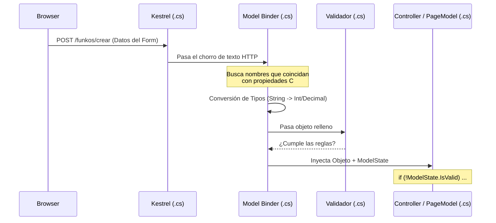
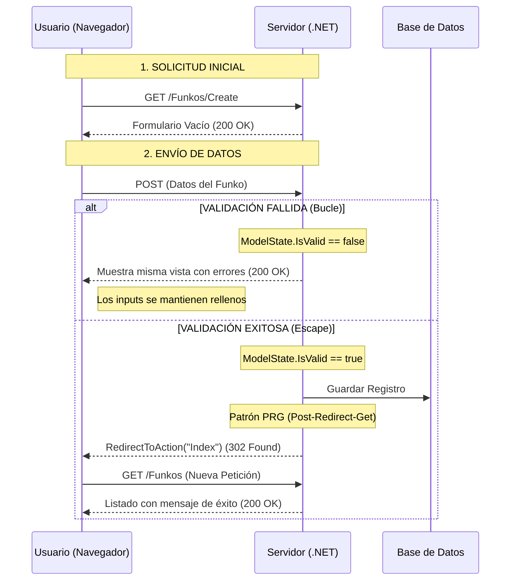
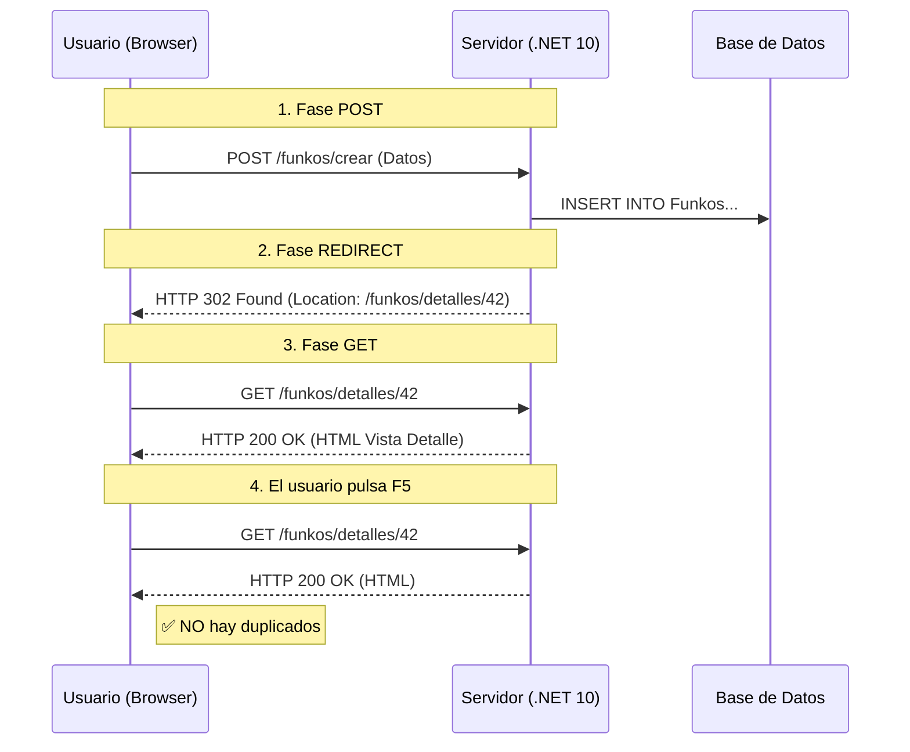

# 3. Model Binding, Formularios y Validación

## Indice

- [3. Model Binding, Formularios y Validación](#3-model-binding-formularios-y-validación)
  - [Indice](#indice)
  - [3.1. Model Binding: El Puente entre HTTP y C#](#31-model-binding-el-puente-entre-http-y-c)
    - [3.1.1. ¿Qué es el Model Binding y cómo procesa la información?](#311-qué-es-el-model-binding-y-cómo-procesa-la-información)
      - [El Ciclo de Procesamiento Técnico](#el-ciclo-de-procesamiento-técnico)
    - [3.1.2. El Ciclo de Vida del Formulario: El Bucle de Retroalimentación](#312-el-ciclo-de-vida-del-formulario-el-bucle-de-retroalimentación)
      - [La Mecánica del Re-rellenado (Data Repopulation)](#la-mecánica-del-re-rellenado-data-repopulation)
    - [3.1.3. Binding de Propiedades Simples (Tipos Primitivos)](#313-binding-de-propiedades-simples-tipos-primitivos)
    - [3.1.3. Binding de Tipos Complejos (InputModels para Formularios)](#313-binding-de-tipos-complejos-inputmodels-para-formularios)
    - [3.1.4. Binding de Colecciones y Listas (Edición Masiva)](#314-binding-de-colecciones-y-listas-edición-masiva)
    - [3.1.5. Binding de Enums y Selects Dinámicos](#315-binding-de-enums-y-selects-dinámicos)
  - [3.2. Gestión Profesional de Formularios](#32-gestión-profesional-de-formularios)
    - [3.2.1. Anatomía de un Formulario de Creación (Escenario: Nuevo Funko)](#321-anatomía-de-un-formulario-de-creación-escenario-nuevo-funko)
      - [A. Implementación en MVC (Vistas Normales)](#a-implementación-en-mvc-vistas-normales)
      - [B. Implementación en Razor Pages](#b-implementación-en-razor-pages)
    - [3.2.2. El tipo IFormFile y el Enctype](#322-el-tipo-iformfile-y-el-enctype)
    - [3.2.2. Validación de Seguridad: Magic Numbers vs Extensiones](#322-validación-de-seguridad-magic-numbers-vs-extensiones)
      - [El Validador de Seguridad (`Services/Security/FileValidator.cs`)](#el-validador-de-seguridad-servicessecurityfilevalidatorcs)
      - [A. Implementación en MVC (Controlador y Vista)](#a-implementación-en-mvc-controlador-y-vista)
      - [B. Implementación en Razor Pages (PageModel y Vista)](#b-implementación-en-razor-pages-pagemodel-y-vista)
    - [3.2.3. Servicio de Almacenamiento Profesional](#323-servicio-de-almacenamiento-profesional)
    - [3.2.4. Protección contra Ataques en Formularios](#324-protección-contra-ataques-en-formularios)
      - [Ejemplo de Anotaciones de Seguridad en Controlador:](#ejemplo-de-anotaciones-de-seguridad-en-controlador)
  - [3.3. Navegación Profesional: PRG y TempData](#33-navegación-profesional-prg-y-tempdata)
  - [3.3. Navegación Profesional: PRG y TempData](#33-navegación-profesional-prg-y-tempdata-1)
    - [3.3.1. Patrón Post-Redirect-Get (PRG)](#331-patrón-post-redirect-get-prg)
    - [3.3.2. Mensajes Flash con TempData](#332-mensajes-flash-con-tempdata)
      - [Comparativa de Implementación: MVC vs Razor Pages](#comparativa-de-implementación-mvc-vs-razor-pages)
    - [3.3.3. Implementación Híbrida Completa](#333-implementación-híbrida-completa)
      - [🛠️ Técnicas Avanzadas con TempData](#️-técnicas-avanzadas-con-tempdata)
    - [3.3.4. Protección CSRF (Antiforgery)](#334-protección-csrf-antiforgery)
      - [Mecanismo de Defensa en .NET](#mecanismo-de-defensa-en-net)
      - [A. Implementación en MVC](#a-implementación-en-mvc)
      - [B. Implementación en Razor Pages](#b-implementación-en-razor-pages-1)
      - [C. Llamadas AJAX (JavaScript)](#c-llamadas-ajax-javascript)
  - [3.4. Validación y Flujo Funcional (ROP)](#34-validación-y-flujo-funcional-rop)
    - [3.4.1. FluentValidation: Reglas de Negocio](#341-fluentvalidation-reglas-de-negocio)
    - [3.4.2. Railway Oriented Programming (ROP) con Result](#342-railway-oriented-programming-rop-con-result)
    - [3.4.3. El Controlador Funcional: El Método Match](#343-el-controlador-funcional-el-método-match)
      - [3.4.4. Visualización de Errores: Niveles y Estilo](#344-visualización-de-errores-niveles-y-estilo)
      - [3.4.5. Validación en el Cliente: El Motor Invisible (jQuery Unobtrusive)](#345-validación-en-el-cliente-el-motor-invisible-jquery-unobtrusive)
  - [3.5. Búsqueda y Filtrado Avanzado](#35-búsqueda-y-filtrado-avanzado)
    - [3.5.1. Implementación Completa de Filtros](#351-implementación-completa-de-filtros)
  - [3.6. Clean Controllers: Mapeadores por Extensión](#36-clean-controllers-mapeadores-por-extensión)
  - [3.7. Ejemplo Final: Ciclo Completo de Edición (MVC vs Razor Pages)](#37-ejemplo-final-ciclo-completo-de-edición-mvc-vs-razor-pages)
    - [3.7.1. El InputModel Compartido (`Models/InputModels/FunkoEditInput.cs`)](#371-el-inputmodel-compartido-modelsinputmodelsfunkoeditinputcs)
    - [3.7.2. Implementación en MVC (Orientado a Acciones)](#372-implementación-en-mvc-orientado-a-acciones)
    - [3.7.3. Implementación en Razor Pages (Orientado a Páginas)](#373-implementación-en-razor-pages-orientado-a-páginas)
    - [3.7.4. Paginación y Gestión de Queries: Navegación Masiva](#374-paginación-y-gestión-de-queries-navegación-masiva)
      - [A. El Motor de Paginación (Servicio)](#a-el-motor-de-paginación-servicio)
      - [B. Implementación en MVC (Vistas Normales)](#b-implementación-en-mvc-vistas-normales)
      - [C. Implementación en Razor Pages](#c-implementación-en-razor-pages)
  - [3.8. Resumen](#38-resumen)

---

## 3.1. Model Binding: El Puente entre HTTP y C#

### 3.1.1. ¿Qué es el Model Binding y cómo procesa la información?

El Model Binding es el proceso automático por el cual ASP.NET Core mapea los datos de la petición HTTP (formularios, rutas, query strings) directamente a objetos y parámetros de C#.

🎓 **Analogía del Profesor**:
> Imagina el **Model Binding** como el sistema de clasificación de equipaje de un aeropuerto. Tú (el cliente) entregas tus maletas (los datos HTTP) en el mostrador. El sistema lee las etiquetas, comprueba el peso y las dimensiones (Validación), y las envía automáticamente por las cintas transportadoras directamente a la bodega del avión que te corresponde (los parámetros de tu Controlador o las propiedades de tu PageModel). El piloto (tú, el programador) no tiene que cargar las maletas; cuando se sienta en la cabina, las maletas ya están en su sitio listas para el viaje.

#### El Ciclo de Procesamiento Técnico



### 3.1.2. El Ciclo de Vida del Formulario: El Bucle de Retroalimentación

Para el alumno, el flujo de un formulario es a menudo confuso. Debemos distinguir entre el **camino del éxito** (que termina en otra página) y el **camino del error** (que nos devuelve a la misma).



#### La Mecánica del Re-rellenado (Data Repopulation)

Muchos alumnos se preguntan: *¿Cómo es posible que el input mantenga el texto si el servidor ha procesado la petición?* La clave está en la **Cooperación Técnica** entre tres elementos:

1.  **El Modelo**: En el controlador, al hacer `return View(input)`, estás enviando de vuelta un objeto con datos.
2.  **El ModelState**: .NET guarda aquí no solo los errores, sino el **valor original** que el usuario escribió (incluso si era incorrecto, como letras en un campo de edad).
3.  **El Tag Helper `asp-for`**: Cuando Razor procesa el HTML, este Tag Helper consulta el `ModelState`. Si encuentra un valor allí, lo inyecta automáticamente en el atributo `value` del input.

```cshtml
@* Esto se convierte de esto: *@
<input asp-for="Nombre" />

@* A esto (si el usuario escribió "Funko" pero hubo otro error): *@
<input type="text" id="Nombre" name="Nombre" value="Funko" />
```

⚠️ **Regla de Oro para el Alumno**:
> Si haces un `return View();` (vacío) en lugar de `return View(miObjeto);`, el Tag Helper no tendrá de dónde sacar los datos y el usuario verá un formulario vacío, lo cual es la peor experiencia de usuario posible. **¡Devuelve siempre el objeto!**

---

### 3.1.3. Binding de Propiedades Simples (Tipos Primitivos)

Este es el escenario básico: capturar datos sueltos como un ID o un término de búsqueda.

**A. Implementación en MVC (Controladores)**
Los datos se inyectan como parámetros del método de acción.

*   **El Cerebro (`Controllers/FunkosController.cs`)**:
    ```csharp
    using Microsoft.AspNetCore.Mvc;

    namespace MiApp.Controllers;

    [Route("funkos")]
    public class FunkosController : Controller 
    {
        // GET /funkos/buscar?termino=vader&activo=true
        [HttpGet("buscar")]
        public IActionResult Buscar(string termino, bool activo) 
        {
            // .NET ha inyectado automáticamente los valores de la Query String
            return Content($"Buscando: {termino}, Estado: {activo}");
        }
    }
    ```

**B. Implementación en Razor Pages**
Los datos se inyectan en propiedades decoradas con un atributo especial.

*   **El Cerebro (`Pages/Funkos/Buscar.cshtml.cs`)**:
    ```csharp
    using Microsoft.AspNetCore.Mvc;
    using Microsoft.AspNetCore.Mvc.RazorPages;

    namespace MiApp.Pages.Funkos;

    public class BuscarModel : PageModel 
    {
        // supportsGet es vital para capturar datos en la URL
        [BindProperty(SupportsGet = true)]
        public string? Termino { get; set; }

        [BindProperty(SupportsGet = true)]
        public bool Activo { get; set; }

        public void OnGet() 
        {
            // Al entrar aquí, Termino y Activo ya tienen los valores de la URL
        }
    }
    ```

### 3.1.3. Binding de Tipos Complejos (InputModels para Formularios)

En el desarrollo profesional, agrupamos los datos en una clase dedicada llamada **InputModel**. Esto evita que los métodos tengan 20 parámetros y permite centralizar la validación.

**1. El Modelo de Entrada Común (`Models/InputModels/FunkoFormInput.cs`)**:
```csharp
using System.ComponentModel.DataAnnotations;

namespace MiApp.Models.InputModels;

public class FunkoFormInput 
{
    [Required(ErrorMessage = "Nombre obligatorio")]
    [StringLength(50, MinimumLength = 3)]
    public string Nombre { get; set; } = string.Empty;

    [Range(0.01, 999.99)]
    public decimal Precio { get; set; }

    [Display(Name = "Categoría")]
    public int CategoriaId { get; set; }
}
```

**2. Implementación en MVC**

*   **El Cerebro: El Controlador (`Controllers/FunkosController.cs`)**:
    ```csharp
    [HttpPost("crear")]
    [ValidateAntiForgeryToken]
    public IActionResult Crear(FunkoFormInput input) 
    {
        // .NET crea la instancia de FunkoFormInput y mapea los campos del POST
        if (!ModelState.IsValid) 
        {
            return View(input); // Devuelve el objeto con los errores
        }
        
        // Lógica de guardado...
        return RedirectToAction("Index");
    }
    ```

*   **El Cuerpo: La Vista (`Views/Funkos/Crear.cshtml`)**:
    ```cshtml
    @model MiApp.Models.InputModels.FunkoFormInput

    <form asp-controller="Funkos" asp-action="Crear" method="post">
        <div class="mb-3">
            <label asp-for="Nombre" class="form-label"></label>
            <input asp-for="Nombre" class="form-control" />
            <span asp-validation-for="Nombre" class="text-danger"></span>
        </div>
        <button type="submit" class="btn btn-primary">Enviar a MVC</button>
    </form>
    ```

**3. Implementación en Razor Pages**

*   **El Cerebro: El PageModel (`Pages/Funkos/Crear.cshtml.cs`)**:
    ```csharp
    using Microsoft.AspNetCore.Mvc;
    using Microsoft.AspNetCore.Mvc.RazorPages;
    using MiApp.Models.InputModels;

    namespace MiApp.Pages.Funkos;

    public class CrearModel : PageModel 
    {
        [BindProperty] // Enlaza el formulario completo con esta propiedad
        public FunkoFormInput Form { get; set; } = new();

        public IActionResult OnPost() 
        {
            if (!ModelState.IsValid) return Page();
            
            // Los datos están en this.Form
            return RedirectToPage("./Index");
        }
    }
    ```

*   **El Cuerpo: La Vista (`Pages/Funkos/Crear.cshtml`)**:
    ```cshtml
    @page "/funkos/crear"
    @model MiApp.Pages.Funkos.CrearModel

    <form method="post">
        <div class="mb-3">
            <label asp-for="Form.Nombre" class="form-label"></label>
            <input asp-for="Form.Nombre" class="form-control" />
            <span asp-validation-for="Form.Nombre" class="text-danger"></span>
        </div>
        <button type="submit" class="btn btn-success">Enviar a Razor Page</button>
    </form>
    ```

### 3.1.4. Binding de Colecciones y Listas (Edición Masiva)

¿Cómo enviamos una lista de elementos (ej: cambiar el precio de varios Funkos a la vez)? .NET utiliza índices en el atributo `name` para identificar cada objeto de la lista dentro de la colección.

**1. El InputModel de Colección (`Models/InputModels/BulkPriceInput.cs`)**:
```csharp
namespace MiApp.Models.InputModels;

public class FunkoPriceItem 
{
    public int Id { get; set; }
    public decimal Precio { get; set; }
}

public class BulkPriceInput 
{
    public List<FunkoPriceItem> Items { get; set; } = [];
}
```

**2. La Vista con Bucle (`Views/Funkos/BulkEdit.cshtml`)**:
Para que el binding funcione, los inputs deben generar nombres como `Items[0].Precio`, `Items[1].Precio`, etc.

```cshtml
@model MiApp.Models.InputModels.BulkPriceInput

<div class="container">
    <h2>Edición Masiva de Precios</h2>
    <form asp-action="UpdatePrices" method="post">
        @for (int i = 0; i < Model.Items.Count; i++) 
        {
            <div class="card mb-2 p-2">
                <input type="hidden" name="Items[@i].Id" value="@Model.Items[i].Id" />
                <div class="row">
                    <div class="col">
                        <label>Funko ID: @Model.Items[i].Id</label>
                    </div>
                    <div class="col">
                        <input name="Items[@i].Precio" 
                               value="@Model.Items[i].Precio" 
                               type="number" 
                               step="0.01" 
                               class="form-control" />
                    </div>
                </div>
            </div>
        }
        <button type="submit" class="btn btn-danger mt-3">Actualizar Todo</button>
    </form>
</div>
```

**3. El Cerebro: El Controlador Procesador**:
```csharp
[HttpPost("bulk-update")]
public IActionResult UpdatePrices(BulkPriceInput input) 
{
    // input.Items contiene la lista completa rellena desde el formulario
    // .NET ha mapeado automáticamente cada índice del HTML al objeto correspondiente
    foreach (var item in input.Items) 
    {
        _service.UpdatePrice(item.Id, item.Precio);
    }
    return RedirectToAction("Index");
}
```

### 3.1.5. Binding de Enums y Selects Dinámicos

Los Enums son fundamentales para tipos cerrados (ej: Pop, Soda, Mystery). El Model Binding los gestiona convirtiendo el valor del `<option>` (un string o int) al valor del Enum en C#.

**1. El Enum y el InputModel**:
```csharp
public enum TipoFunko { Pop, Soda, Mystery }

public class FunkoEnumInput 
{
    public TipoFunko Categoria { get; set; }
}
```

**2. La Vista Profesional con Select**:
Usamos `Html.GetEnumSelectList` para generar los `<option>` automáticamente basándonos en el Enum.

```cshtml
@model MiApp.Models.InputModels.FunkoEnumInput

<div class="mb-3">
    <label asp-for="Categoria" class="form-label">Tipo de Producto</label>
    <select asp-for="Categoria" 
            asp-items="Html.GetEnumSelectList<TipoFunko>()" 
            class="form-select">
        <option value="">-- Seleccione una opción --</option>
    </select>
    <span asp-validation-for="Categoria" class="text-danger"></span>
</div>
```

📝 **Nota del Profesor**:
> El secreto de un buen formulario es el atributo **`name`**. Si el `name` del HTML coincide exactamente con el nombre de la propiedad en C# (o sigue la jerarquía de puntos para objetos anidados o índices para listas), el Model Binding funcionará siempre. Si algo falla, lo primero que debes revisar es el código fuente generado en el navegador (F12) para verificar que los nombres de los inputs son los esperados por el Binder.

---

## 3.2. Gestión Profesional de Formularios

Un formulario profesional no es solo un conjunto de etiquetas `<input>`. Es una estructura coordinada que garantiza la integridad de los datos, la seguridad del servidor y una experiencia de usuario fluida mediante validaciones en tiempo real.

### 3.2.1. Anatomía de un Formulario de Creación (Escenario: Nuevo Funko)

Vamos a construir el flujo completo para dar de alta un Funko en nuestra base de datos, comparando cómo se organiza el código en los dos mundos de .NET 10.

#### A. Implementación en MVC (Vistas Normales)

En MVC, el flujo es una triangulación: el **InputModel** define las reglas, el **Controlador** las verifica y la **Vista** las muestra.

*   **1. El Escudo de Entrada (`Models/InputModels/FunkoCreateInput.cs`)**:
    ```csharp
    using System.ComponentModel.DataAnnotations;

    namespace MiApp.Models.InputModels;

    public class FunkoCreateInput 
    {
        [Required(ErrorMessage = "El nombre es obligatorio")]
        [StringLength(50, MinimumLength = 3, ErrorMessage = "El nombre debe tener entre 3 y 50 letras")]
        public string Nombre { get; set; } = string.Empty;

        [Required(ErrorMessage = "El precio es necesario para la venta")]
        [Range(0.1, 500.0, ErrorMessage = "El precio debe estar entre 0.1 y 500 €")]
        public decimal Precio { get; set; }

        [Display(Name = "Categoría del Funko")]
        [Required(ErrorMessage = "Debes asignar una categoría")]
        public int? CategoriaId { get; set; }
    }
    ```

*   **2. El Orquestador (`Controllers/FunkosController.cs`)**:
    ```csharp
    using Microsoft.AspNetCore.Mvc;
    using MiApp.Models.InputModels;

    [Route("funkos")]
    public class FunkosController(IFunkoService service) : Controller 
    {
        [HttpGet("crear")]
        public IActionResult Crear() => View();

        [HttpPost("crear")]
        [ValidateAntiForgeryToken] // 🛡️ Sello de seguridad obligatorio
        public async Task<IActionResult> Crear(FunkoCreateInput input) 
        {
            // El Model Binder ya ha ejecutado las validaciones del InputModel
            if (!ModelState.IsValid) 
            {
                // Si hay errores, devolvemos la vista con los datos actuales
                // para que el alumno vea los mensajes de error.
                return View(input); 
            }

            await service.CreateAsync(input);
            return RedirectToAction(nameof(Index));
        }
    }
    ```

*   **3. La Interfaz (`Views/Funkos/Crear.cshtml`)**:
    ```cshtml
    @model MiApp.Models.InputModels.FunkoCreateInput

    <div class="container mt-4">
        <h2>Registrar Nuevo Funko</h2>
        <form asp-controller="Funkos" asp-action="Crear" method="post">
            <div asp-validation-summary="ModelOnly" class="text-danger"></div>

            <div class="mb-3">
                <label asp-for="Nombre" class="form-label"></label>
                <input asp-for="Nombre" class="form-control" placeholder="Ej: Iron Man" />
                <span asp-validation-for="Nombre" class="text-danger"></span>
            </div>

            <div class="mb-3">
                <label asp-for="Precio" class="form-label"></label>
                <input asp-for="Precio" type="number" step="0.01" class="form-control" />
                <span asp-validation-for="Precio" class="text-danger"></span>
            </div>

            <button type="submit" class="btn btn-primary">Guardar en Base de Datos</button>
        </form>
    </div>
    ```

#### B. Implementación en Razor Pages

En Razor Pages, la lógica y los datos viven en un "matrimonio" indisoluble llamado **PageModel**.

*   **1. El Binomio Lógica-Dato (`Pages/Funkos/Crear.cshtml.cs`)**:
    ```csharp
    using Microsoft.AspNetCore.Mvc;
    using Microsoft.AspNetCore.Mvc.RazorPages;
    using MiApp.Models.InputModels;

    namespace MiApp.Pages.Funkos;

    public class CrearModel(IFunkoService service) : PageModel 
    {
        // El atributo [BindProperty] es la clave: 
        // le dice a .NET que rellene esta propiedad al recibir el POST.
        [BindProperty]
        public FunkoCreateInput Form { get; set; } = new();

        public void OnGet() { }

        public async Task<IActionResult> OnPostAsync() 
        {
            if (!ModelState.IsValid) 
            {
                return Page(); // Recarga la misma página mostrando errores
            }

            await service.CreateAsync(Form);
            return RedirectToPage("./Index");
        }
    }
    ```

*   **2. La Interfaz Cohesionada (`Pages/Funkos/Crear.cshtml`)**:
    ```cshtml
    @page "/funkos/crear"
    @model MiApp.Pages.Funkos.CrearModel

    <div class="container mt-4">
        <h2>Nuevo Funko (Razor Page)</h2>
        <form method="post">
            @* Accedemos a través de Model.Form gracias al tipado fuerte *@
            <div class="mb-3">
                <label asp-for="Form.Nombre" class="form-label"></label>
                <input asp-for="Form.Nombre" class="form-control" />
                <span asp-validation-for="Form.Nombre" class="text-danger"></span>
            </div>

            <button type="submit" class="btn btn-success">Guardar vía PageModel</button>
        </form>
    </div>
    ```

### 3.2.2. El tipo IFormFile y el Enctype

Para que el navegador pueda empaquetar y enviar un archivo binario...

🎓 **Analogía del Profesor**:
> Imagina que el formulario estándar es un sobre de carta normal. Puedes meter texto, pero no una piedra (un archivo). Si quieres enviar una piedra, necesitas una **caja reforzada** (`multipart/form-data`). El `IFormFile` es el **albarán de entrega** que te dice cuánto pesa la piedra, cómo se llama y qué tipo de material es, permitiéndote decidir si la metes en tu almacén o la tiras a la basura.

**A. Implementación en MVC (Vistas Normales)**

*   **1. El InputModel (`Models/InputModels/FunkoUploadInput.cs`)**:
    ```csharp
    using Microsoft.AspNetCore.Http;
    using System.ComponentModel.DataAnnotations;

    namespace MiApp.Models.InputModels;

    public class FunkoUploadInput 
    {
        [Required] public string Nombre { get; set; } = string.Empty;
        
        // Representa el archivo físico en el servidor
        public IFormFile? Imagen { get; set; } 
    }
    ```

*   **2. El Controlador (`Controllers/FunkosController.cs`)**:
    ```csharp
    [HttpPost("upload")]
    [ValidateAntiForgeryToken] // 🛡️ Protección contra CSRF
    public async Task<IActionResult> Upload(FunkoUploadInput input) 
    {
        if (input.Imagen == null || input.Imagen.Length == 0) 
        {
            ModelState.AddModelError("Imagen", "Selecciona un archivo válido");
            return View(input);
        }
        
        // Procesar archivo...
        return RedirectToAction("Index");
    }
    ```

**B. Implementación en Razor Pages**

*   **1. El PageModel (`Pages/Funkos/Upload.cshtml.cs`)**:
    ```csharp
    public class UploadModel : PageModel 
    {
        [BindProperty]
        public FunkoUploadInput Form { get; set; } = new();

        public async Task<IActionResult> OnPostAsync() 
        {
            if (!ModelState.IsValid) return Page();
            
            // Acceso directo vía this.Form.Imagen
            return RedirectToPage("./Index");
        }
    }
    ```

### 3.2.2. Validación de Seguridad: Magic Numbers vs Extensiones

Validar solo la extensión (`.jpg`) es un error de principiante. Un hacker puede renombrar `virus.exe` a `foto.jpg`. La **validación profesional** comprueba los **Magic Numbers**: los primeros bytes que identifican la firma real del archivo.

#### El Validador de Seguridad (`Services/Security/FileValidator.cs`)
Esta clase estática centraliza la lógica de inspección binaria.

```csharp
namespace MiApp.Services.Security;

public static class FileValidator 
{
    // Firmas reales de archivos (Hexadecimal)
    private static readonly Dictionary<string, byte[]> Signatures = new() {
        { ".png", [0x89, 0x50, 0x4E, 0x47] },
        { ".jpg", [0xFF, 0xD8, 0xFF] },
        { ".jpeg", [0xFF, 0xD8, 0xFF] },
        { ".gif", [0x47, 0x49, 0x46, 0x38] }
    };

    public static bool IsValidImage(IFormFile file) 
    {
        if (file == null || file.Length == 0) return false;

        var ext = Path.GetExtension(file.FileName).ToLowerInvariant();
        if (!Signatures.ContainsKey(ext)) return false;

        // Inspeccionamos los bytes del archivo
        using var stream = file.OpenReadStream();
        using var reader = new BinaryReader(stream);
        
        // Leemos los primeros 4 bytes (suficientes para la mayoría de imágenes)
        var headerBytes = reader.ReadBytes(4); 

        return headerBytes.Take(Signatures[ext].Length).SequenceEqual(Signatures[ext]);
    }
}
```

#### A. Implementación en MVC (Controlador y Vista)

En MVC, el controlador intercepta la petición, invoca al validador y decide si procesar el archivo o devolver errores al modelo.

*   **1. El Cerebro: El Controlador (`Controllers/FunkosController.cs`)**:
    ```csharp
    using Microsoft.AspNetCore.Mvc;
    using MiApp.Models.InputModels;
    using MiApp.Services.Security;

    namespace MiApp.Controllers;

    [Route("funkos")]
    public class FunkosController(IFileStorageService storage) : Controller 
    {
        [HttpGet("subir-foto")]
        public IActionResult SubirFoto() => View();

        [HttpPost("subir-foto")]
        [ValidateAntiForgeryToken]
        public async Task<IActionResult> SubirFoto(FunkoUploadInput input) 
        {
            if (!ModelState.IsValid) return View(input);

            // 🛡️ Validación de Seguridad Binaria
            if (input.Imagen != null && !FileValidator.IsValidImage(input.Imagen)) 
            {
                ModelState.AddModelError("Imagen", "El archivo no es una imagen real o está corrupto.");
                return View(input);
            }

            // Si es válida, guardamos
            var url = await storage.SaveFileAsync(input.Imagen!);
            return RedirectToAction(nameof(Index));
        }
    }
    ```

*   **2. El Cuerpo: La Vista (`Views/Funkos/SubirFoto.cshtml`)**:
    ```cshtml
    @model FunkoUploadInput

    <div class="container">
        <h3>Validación de Seguridad MVC</h3>
        <form asp-controller="Funkos" asp-action="SubirFoto" method="post" enctype="multipart/form-data">
            <div class="mb-3">
                <label asp-for="Imagen" class="form-label"></label>
                <input asp-for="Imagen" type="file" class="form-control" accept=".jpg,.png,.gif" />
                <span asp-validation-for="Imagen" class="text-danger"></span>
            </div>
            <button type="submit" class="btn btn-primary">Subir con Validación Binaria</button>
        </form>
    </div>
    ```

#### B. Implementación en Razor Pages (PageModel y Vista)

En Razor Pages, la validación se integra directamente en el flujo del Handler `OnPost`.

*   **1. El Cerebro: El PageModel (`Pages/Funkos/Upload.cshtml.cs`)**:
    ```csharp
    using Microsoft.AspNetCore.Mvc;
    using Microsoft.AspNetCore.Mvc.RazorPages;
    using MiApp.Models.InputModels;
    using MiApp.Services.Security;

    namespace MiApp.Pages.Funkos;

    public class UploadModel(IFileStorageService storage) : PageModel 
    {
        [BindProperty]
        public FunkoUploadInput Form { get; set; } = new();

        public void OnGet() { }

        public async Task<IActionResult> OnPostAsync() 
        {
            if (!ModelState.IsValid) return Page();

            // 🛡️ Validación de Seguridad Binaria
            if (Form.Imagen != null && !FileValidator.IsValidImage(Form.Imagen)) 
            {
                ModelState.AddModelError("Form.Imagen", "Firma digital del archivo incorrecta.");
                return Page();
            }

            await storage.SaveFileAsync(Form.Imagen!);
            return RedirectToPage("./Index");
        }
    }
    ```

*   **2. El Cuerpo: La Vista (`Pages/Funkos/Upload.cshtml`)**:
    ```cshtml
    @page "/funkos/upload-secure"
    @model UploadModel

    <div class="container">
        <h3>Validación de Seguridad Razor Pages</h3>
        <form method="post" enctype="multipart/form-data">
            <div class="mb-3">
                <label asp-for="Form.Imagen"></label>
                <input asp-for="Form.Imagen" type="file" class="form-control" />
                <span asp-validation-for="Form.Imagen" class="text-danger"></span>
            </div>
            <button type="submit" class="btn btn-success">Validar y Subir</button>
        </form>
    </div>
    ```

📝 **Nota del Profesor**:
> Observa que aunque el frontend use el atributo `accept=".jpg,.png"`, esto es solo una sugerencia para el usuario. Un atacante puede saltárselo fácilmente. La **única barrera real** es la inspección de bytes que hacemos en el servidor mediante el `FileValidator`. Siempre debes desconfiar de lo que llega desde el navegador.

### 3.2.3. Servicio de Almacenamiento Profesional

Nunca guardes archivos con su nombre original (ej: `vacaciones.jpg`), ya que podrían sobreescribir otros. Usa siempre **GUIDs**.

**Servicio de Disco (`Services/Storage/FileStorageService.cs`)**:
```csharp
public class FileStorageService(IWebHostEnvironment env) : IFileStorageService 
{
    private readonly string _storagePath = Path.Combine(env.WebRootPath, "uploads");

    public async Task<string> SaveFileAsync(IFormFile file) 
    {
        if (!Directory.Exists(_storagePath)) Directory.CreateDirectory(_storagePath);

        // Generamos nombre único: 550e8400-e29b-41d4-a716-446655440000.jpg
        var fileName = $"{Guid.NewGuid()}{Path.GetExtension(file.FileName)}";
        var fullPath = Path.Combine(_storagePath, fileName);

        using var stream = new FileStream(fullPath, FileMode.Create);
        await file.CopyToAsync(stream);

        return $"/uploads/{fileName}"; // URL para la base de datos
    }
}
```

### 3.2.4. Protección contra Ataques en Formularios

Un desarrollador de DAW debe implementar estas 4 capas de seguridad obligatorias:

| Ataque                 | Descripción                                                | Protección en .NET 10                                          |
| :--------------------- | :--------------------------------------------------------- | :------------------------------------------------------------- |
| **CSRF**               | El atacante envía un form desde otra web usando tu sesión. | Atributo `[ValidateAntiForgeryToken]` y Tag Helper `<form>`.   |
| **XSS**                | Inyección de scripts maliciosos en campos de texto.        | Razor hace **HTML Encoding** automático de todo `@Model.Dato`. |
| **Mass Assignment**    | El usuario envía campos ocultos (ej: `EsAdmin=true`).      | Uso obligatorio de **InputModels** en lugar de Entidades.      |
| **DDoS (Large Files)** | El atacante sube archivos de 10GB para agotar el disco.    | Anotación `[RequestSizeLimit(bytes)]` en la Acción.            |

#### Ejemplo de Anotaciones de Seguridad en Controlador:
```csharp
[HttpPost]
[ValidateAntiForgeryToken] // Evita secuestro de formularios
[RequestSizeLimit(5 * 1024 * 1024)] // Limita subida a 5MB por seguridad
public async Task<IActionResult> Guardar(FunkoUploadInput input) { ... }
```

📝 **Nota del Profesor**:
> El atributo `[ValidateAntiForgeryToken]` es como un **sello de lacre** en un sobre. Si el sobre llega al servidor y el lacre está roto o no es el original, el servidor lo quema inmediatamente (`400 Bad Request`) sin leer el contenido. En Razor Pages esto es automático, pero en MVC debes ser tú quien ponga el sello en cada acción POST.

---

## 3.3. Navegación Profesional: PRG y TempData

## 3.3. Navegación Profesional: PRG y TempData

La navegación en aplicaciones web profesionales no se deja al azar. Dos de los problemas más comunes son el **re-envío de formularios al pulsar F5** y la **pérdida de mensajes de confirmación** tras una redirección. El binomio PRG + TempData es la solución estándar de la industria.

### 3.3.1. Patrón Post-Redirect-Get (PRG)

El patrón PRG es una técnica de diseño web que evita que un usuario envíe accidentalmente un formulario varias veces.

❌ **El Problema (Ciclo sin PRG)**:
1.  El usuario hace `POST` con sus datos.
2.  El servidor guarda el dato y devuelve una `View()` (un 200 OK).
3.  El usuario pulsa **F5 (Refrescar)**.
4.  El navegador, siguiendo su naturaleza, repite la **ÚLTIMA acción**, que fue el `POST`.
5.  Resultado: El Funko se guarda dos veces. ¡Caos en el inventario!

✅ **La Solución (Ciclo PRG)**:
1.  **POST**: El usuario envía los datos.
2.  **REDIRECT**: El servidor procesa el dato y, en lugar de una vista, devuelve un **302 Redirect**.
3.  **GET**: El navegador recibe el 302 y hace automáticamente una petición `GET` a la nueva URL (ej: la lista o el detalle).
4.  Si el usuario pulsa **F5**, la última acción fue el `GET`, por lo que solo refresca la vista sin reenviar datos.



### 3.3.2. Mensajes Flash con TempData

Al usar el patrón PRG, surge un nuevo reto: ¿Cómo le digo al usuario "¡Funko guardado con éxito!" si el `Redirect` limpia la memoria de la petición actual?

La respuesta es **TempData**. Es un almacén temporal basado en sesión que **vive exactamente hasta que es leído una vez** (normalmente tras la primera redirección).

#### Comparativa de Implementación: MVC vs Razor Pages

| Característica     | En MVC                              | En Razor Pages                      |
| :----------------- | :---------------------------------- | :---------------------------------- |
| **Almacenamiento** | `TempData["Clave"] = valor;`        | `TempData["Clave"] = valor;`        |
| **Navegación**     | `return RedirectToAction("Index");` | `return RedirectToPage("./Index");` |
| **Persistencia**   | Sobrevive a 1 redirección.          | Sobrevive a 1 redirección.          |
| **Lectura**        | Se lee en la Vista (.cshtml).       | Se lee en el PageModel o la Vista.  |

### 3.3.3. Implementación Híbrida Completa

Para que el sistema sea profesional, centralizaremos la visualización en el **Layout**.

**1. El Corazón Visual: El Layout Maestro (`Views/Shared/_Layout.cshtml` o `Pages/Shared/_Layout.cshtml`)**:
```cshtml
<!DOCTYPE html>
<html>
<body>
    <div class="container mt-3">
        @* Verificamos si hay mensajes flash en la "bandeja de entrada" temporal *@
        @if (TempData["Exito"] != null)
        {
            <div class="alert alert-success alert-dismissible fade show">
                <i class="fas fa-check-circle"></i> @TempData["Exito"]
                <button type="button" class="btn-close" data-bs-dismiss="alert"></button>
            </div>
        }
        
        @if (TempData["Error"] != null)
        {
            <div class="alert alert-danger alert-dismissible fade show">
                <i class="fas fa-exclamation-triangle"></i> @TempData["Error"]
                <button type="button" class="btn-close" data-bs-dismiss="alert"></button>
            </div>
        }

        @RenderBody()
    </div>
</body>
</html>
```

**2. Escenario MVC: Redirección desde Controlador**:
```csharp
using Microsoft.AspNetCore.Mvc;

namespace MiApp.Controllers;

public class FunkosController(IFunkoService service) : Controller 
{
    [HttpPost("crear")]
    public async Task<IActionResult> Crear(FunkoCreateInput input) 
    {
        if (!ModelState.IsValid) return View(input);

        await service.CreateAsync(input);

        // 🚀 PREPARAMOS EL MENSAJE FLASH
        TempData["Exito"] = $"El Funko {input.Nombre} ha sido teletransportado a la base de datos.";

        // 🚀 APLICAMOS PRG
        return RedirectToAction(nameof(Index)); 
    }
}
```

**3. Escenario Razor Pages: Redirección desde PageModel**:
```csharp
using Microsoft.AspNetCore.Mvc;
using Microsoft.AspNetCore.Mvc.RazorPages;

namespace MiApp.Pages.Funkos;

public class CrearModel(IFunkoService service) : PageModel 
{
    [BindProperty] public FunkoCreateInput Form { get; set; } = new();

    public async Task<IActionResult> OnPostAsync() 
    {
        if (!ModelState.IsValid) return Page();

        await service.CreateAsync(Form);

        // 🚀 MISMO MECANISMO: TempData es universal en .NET
        TempData["Exito"] = $"¡Éxito! {Form.Nombre} ya es parte de la colección.";

        // 🚀 APLICAMOS PRG (RedirectToPage)
        return RedirectToPage("./Index");
    }
}
```

#### 🛠️ Técnicas Avanzadas con TempData
- **`TempData.Peek("Clave")`**: Lee el valor pero **NO lo marca para borrar**. Útil si necesitas el mensaje en el Layout y también en un script de la página.
- **`TempData.Keep("Clave")`**: Si por algún motivo vas a hacer una **segunda redirección** encadenada, esto evita que el mensaje se pierda.

📝 **Nota del Profesor**:
> TempData es como un **mensaje que se autodestruye** tras ser leído (estilo Misión Imposible). Es ideal para notificaciones porque limpia la memoria del servidor automáticamente, evitando que mensajes antiguos aparezcan cuando el usuario navega a otras secciones más tarde.

---

### 3.3.4. Protección CSRF (Antiforgery)

El **Cross-Site Request Forgery (CSRF)** es un ataque silencioso donde un sitio malicioso engaña al navegador del usuario para que realice una acción no deseada en una aplicación en la que está autenticado.

🎓 **Analogía del Profesor**:
> Imagina que dejas tu sesión de banco abierta en una pestaña. En otra pestaña, abres una web de "Premios Gratis". Esa web maliciosa envía una petición oculta a tu banco: "Transferir 500€ al hacker". Como tu navegador envía automáticamente la cookie de sesión del banco, el banco piensa que fuiste tú. El **Token Antiforgery** es una contraseña temporal única que se genera con cada formulario que pides; el hacker no tiene esa contraseña, así que su petición falsa es rechazada por el banco.

#### Mecanismo de Defensa en .NET

ASP.NET Core utiliza un **sistema de doble validación** (Double Submit Cookie):
1.  **Cookie Oculta**: El servidor envía una cookie encriptada al navegador.
2.  **Token en el Formulario**: El Tag Helper `<form>` inyecta automáticamente un `input hidden` (`__RequestVerificationToken`) con el mismo valor encriptado.

Al recibir el POST, el servidor verifica que ambos coincidan. Como el sitio del hacker no puede leer las cookies de tu dominio (por la política Same-Origin del navegador), no puede falsificar el token del formulario.

#### A. Implementación en MVC

En MVC, debes ser explícito para activar esta defensa.

*   **En la Vista**: Al usar los Tag Helpers de formulario, el token se genera solo.
    ```cshtml
    <form asp-controller="Funkos" asp-action="Crear" method="post">
        @* .NET genera oculto: <input name="__RequestVerificationToken" ... /> *@
    </form>
    ```

*   **En el Controlador**: Es obligatorio decorar la acción con el atributo.
    ```csharp
    [HttpPost]
    [ValidateAntiForgeryToken] // 🛡️ Sin esto, la puerta está abierta
    public IActionResult Crear(FunkoCreateInput input) 
    {
       // ...
    }
    ```

#### B. Implementación en Razor Pages

En Razor Pages, el equipo de ASP.NET decidió que la seguridad no debería ser opcional. **La protección CSRF está activada por defecto** para todas las peticiones POST, PUT o DELETE.

*   No necesitas el atributo `[ValidateAntiForgeryToken]`.
*   Si usas `<form method="post">`, el token se inyecta solo.
*   Si necesitas desactivarlo (ej: para un Webhook de Stripe), usas `[IgnoreAntiforgeryToken]`.

#### C. Llamadas AJAX (JavaScript)

Si usas `fetch` o `jQuery`, el token no viaja mágicamente. Debes incluirlo en la cabecera HTTP.

```javascript
fetch('/funkos/eliminar', {
    method: 'POST',
    headers: {
        // Leemos el token del formulario renderizado
        'RequestVerificationToken': document.querySelector('input[name="__RequestVerificationToken"]').value
    }
});
```

---

## 3.4. Validación y Flujo Funcional (ROP)

### 3.4.1. FluentValidation: Reglas de Negocio

**El Validador (`Validators/FunkoCreateValidator.cs`)**:
```csharp
using FluentValidation;

public class FunkoCreateValidator : AbstractValidator<FunkoCreateInput> {
    public FunkoCreateValidator() {
        RuleFor(x => x.Nombre)
            .NotEmpty().WithMessage("Nombre obligatorio")
            .Length(3, 50).WithMessage("Entre 3 y 50 caracteres");
            
        RuleFor(x => x.Imagen)
            .Must(img => img.Length < 2*1024*1024)
            .WithMessage("Máximo 2MB")
            .When(x => x.Imagen != null);
    }
}
```

### 3.4.2. Railway Oriented Programming (ROP) con Result<T>

**El Servicio (`Services/FunkoService.cs`)**:
```csharp
using CSharpFunctionalExtensions;

public class FunkoService(IFunkoRepository repo) : IFunkoService {
    public async Task<Result<Funko>> CreateAsync(FunkoCreateInput input) {
        if (string.IsNullOrEmpty(input.Nombre)) 
            return Result.Failure<Funko>("Nombre inválido");

        var funko = new Funko { Nombre = input.Nombre };
        return await repo.SaveAsync(funko);
    }
}
```

### 3.4.3. El Controlador Funcional: El Método Match

**El Controlador (`Controllers/FunkosController.cs`)**:
```csharp
[HttpPost]
public async Task<IActionResult> Crear(FunkoCreateInput input) {
    if (!ModelState.IsValid) return View(input);

    var result = await service.CreateAsync(input);

    return result.Match<IActionResult>(
        onSuccess: f => {
            TempData["Exito"] = "Creado";
            return RedirectToAction("Details", new { id = f.Id });
        },
        onFailure: err => {
            ModelState.AddModelError("", err);
            return View(input);
        }
    );
}
```

#### 3.4.4. Visualización de Errores: Niveles y Estilo

ASP.NET Core proporciona dos herramientas para informar al usuario de que algo ha ido mal.

**A. Niveles de Mensaje**
1.  **Resumen de Validación (`asp-validation-summary`)**: Se suele poner al principio del formulario. Muestra una lista de todos los errores.
    - `ModelOnly`: Solo muestra errores que no pertenecen a un campo concreto (ej: "Error interno").
    - `All`: Muestra TODO.
2.  **Mensaje de Campo (`asp-validation-for`)**: Se pone al lado o debajo de cada input. Muestra el error específico de ese dato (ej: "El precio debe ser positivo").

**B. Las Clases CSS "Mágicas"**
Cuando `ModelState.IsValid` es falso, .NET inyecta clases CSS automáticamente en el HTML generado para que puedas darles estilo.

| Elemento        | Clase CSS cuando hay error   | Propósito                                     |
| :-------------- | :--------------------------- | :-------------------------------------------- |
| **Input**       | `.input-validation-error`    | Para poner el borde del cuadro en rojo.       |
| **Span**        | `.field-validation-error`    | Para poner el texto del mensaje en rojo.      |
| **Div Summary** | `.validation-summary-errors` | Para dar formato a la caja de errores global. |

**C. Personalización en tu CSS (`site.css`):**
```css
/* Ponemos el borde rojo al input que ha fallado */
.input-validation-error {
    border: 2px solid #dc3545 !important;
}

/* El mensaje de error siempre en negrita y rojo */
.field-validation-error {
    color: #dc3545;
    font-weight: bold;
    font-size: 0.85rem;
}
```

#### 3.4.5. Validación en el Cliente: El Motor Invisible (jQuery Unobtrusive)

Muchos alumnos notan que, a veces, los errores aparecen **instantáneamente** al salir de un input sin que la página se recargue. Esto es la **Validación Client-Side**.

**A. El Contrato de Atributos `data-val`**
ASP.NET Core no envía código C# al navegador. En su lugar, traduce tus DataAnnotations (como `[Required]`) a atributos HTML5 personalizados que empiezan por `data-val-`.

```cshtml
@* Tu código C# *@
[Required(ErrorMessage = "¡Nombre ya!")]
public string Nombre { get; set; }

@* Lo que .NET genera en el navegador *@
<input type="text" 
       data-val="true" 
       data-val-required="¡Nombre ya!" 
       name="Nombre" ... />
```

**B. Los Bibliotecarios: `jQuery Unobtrusive Validation`**
Para que esos atributos `data-val` funcionen, necesitamos cargar dos scripts específicos. En .NET, esto se hace mediante la **Vista Parcial** que viene por defecto en el proyecto:

```cshtml
@section Scripts {
    @* 🚀 Esta línea activa la validación instantánea sin recargar la página *@
    <partial name="_ValidationScriptsPartial" />
}
```

**C. El Doble Muro de Seguridad**

| Nivel de Validación | Propósito                                                                        | Limitación                                                  |
| :------------------ | :------------------------------------------------------------------------------- | :---------------------------------------------------------- |
| **Cliente (JS)**    | **UX (Experiencia)**: Avisa al usuario rápido para que no espere al servidor.    | ⚠️ **Insegura**: Un hacker puede desactivar JS y saltársela. |
| **Servidor (C#)**   | **Seguridad**: Es la última palabra. Si ModelState falla aquí, el dato no entra. | 🐢 **Lenta**: Requiere un viaje de ida y vuelta al servidor. |

📝 **Nota del Profesor**: 
> Nunca confíes solo en la validación del cliente. La validación en el servidor (`ModelState.IsValid`) es la única que garantiza la integridad de tu Base de Datos. La del cliente es solo "cortesía" hacia el usuario.

---

## 3.5. Búsqueda y Filtrado Avanzado

### 3.5.1. Implementación Completa de Filtros

Para que los filtros sean eficientes, los aplicamos antes de ejecutar la consulta a la base de datos.

**1. El Lógica del Servicio**:
```csharp
public async Task<List<Funko>> GetFilteredAsync(FunkoFilterInput input) {
    var query = context.Funkos.AsQueryable();

    if (!string.IsNullOrWhiteSpace(input.Termino))
        query = query.Where(f => f.Nombre.Contains(input.Termino));

    if (input.PrecioMin.HasValue)
        query = query.Where(f => f.Precio >= input.PrecioMin.Value);

    return await query.ToListAsync();
}
```

---

## 3.6. Clean Controllers: Mapeadores por Extensión

**El Mapeador (`Mappers/FunkoMapper.cs`)**:
```csharp
public static class FunkoMapper {
    public static FunkoViewModel ToViewModel(this Funko entity) {
        return new FunkoViewModel {
            Id = entity.Id,
            Nombre = entity.Nombre,
            Precio = entity.Precio.ToString("C")
        };
    }
}
```

---

---

## 3.7. Ejemplo Final: Ciclo Completo de Edición (MVC vs Razor Pages)

Para consolidar todo lo aprendido, vamos a implementar la operación de **Edición** de un Funko. Este escenario es el más completo, ya que requiere carga de datos (GET), validación, gestión de estado (POST), persistencia y notificación al usuario.

### 3.7.1. El InputModel Compartido (`Models/InputModels/FunkoEditInput.cs`)
Este modelo es el contrato de datos para ambos paradigmas.

```csharp
using System.ComponentModel.DataAnnotations;

namespace MiApp.Models.InputModels;

public class FunkoEditInput 
{
    [Required]
    public int Id { get; set; }

    [Required(ErrorMessage = "El nombre del Funko es obligatorio")]
    [StringLength(100, MinimumLength = 3, ErrorMessage = "Nombre entre 3 y 100 caracteres")]
    public string Nombre { get; set; } = string.Empty;

    [Required(ErrorMessage = "El precio es obligatorio")]
    [Range(0.1, 999.99, ErrorMessage = "El precio debe ser real (0.1 - 999.99)")]
    public decimal Precio { get; set; }

    [Display(Name = "Categoría")]
    [Required(ErrorMessage = "Seleccione una categoría")]
    public int CategoriaId { get; set; }
}
```

---

### 3.7.2. Implementación en MVC (Orientado a Acciones)

**1. El Cerebro: El Controlador (`Controllers/FunkosController.cs`)**
```csharp
using Microsoft.AspNetCore.Mvc;
using MiApp.Models.InputModels;
using MiApp.Services;

namespace MiApp.Controllers;

[Route("funkos")] // Endpoint base: /funkos
public class FunkosController(IFunkoService service) : Controller 
{
    // GET: /funkos/editar/5
    [HttpGet("editar/{id:int}")]
    public async Task<IActionResult> Editar(int id) 
    {
        var funko = await service.GetByIdAsync(id);
        if (funko == null) return NotFound();

        // Mapeo manual a InputModel
        var input = new FunkoEditInput {
            Id = funko.Id,
            Nombre = funko.Nombre,
            Precio = funko.Precio,
            CategoriaId = funko.CategoriaId
        };

        return View(input);
    }

    // POST: /funkos/editar/5
    [HttpPost("editar/{id:int}")]
    [ValidateAntiForgeryToken] // 🛡️ Protección CSRF
    public async Task<IActionResult> Editar(int id, FunkoEditInput input) 
    {
        if (id != input.Id) return BadRequest();

        if (!ModelState.IsValid) return View(input);

        var result = await service.UpdateAsync(input);
        
        if (result.IsSuccess) {
            // 🚀 Mensaje Flash vía TempData
            TempData["Exito"] = $"¡Actualizado! El Funko {input.Nombre} ha sido modificado.";
            // 🚀 Patrón PRG
            return RedirectToAction(nameof(Index));
        }

        ModelState.AddModelError("", result.Error);
        return View(input);
    }
}
```

**2. El Cuerpo: La Vista (`Views/Funkos/Editar.cshtml`)**
```cshtml
@model MiApp.Models.InputModels.FunkoEditInput

<div class="container mt-4">
    <h2>Editar Funko (Modo MVC)</h2>
    <form asp-controller="Funkos" asp-action="Editar" asp-route-id="@Model.Id" method="post">
        <input type="hidden" asp-for="Id" />
        
        <div class="mb-3">
            <label asp-for="Nombre" class="form-label"></label>
            <input asp-for="Nombre" class="form-control" />
            <span asp-validation-for="Nombre" class="text-danger"></span>
        </div>

        <div class="mb-3">
            <label asp-for="Precio" class="form-label"></label>
            <input asp-for="Precio" type="number" step="0.01" class="form-control" />
            <span asp-validation-for="Precio" class="text-danger"></span>
        </div>

        <button type="submit" class="btn btn-warning">Guardar Cambios</button>
        <a asp-action="Index" class="btn btn-secondary">Cancelar</a>
    </form>
</div>
```

---

### 3.7.3. Implementación en Razor Pages (Orientado a Páginas)

**1. El Cerebro: El PageModel (`Pages/Funkos/Edit.cshtml.cs`)**
```csharp
using Microsoft.AspNetCore.Mvc;
using Microsoft.AspNetCore.Mvc.RazorPages;
using MiApp.Models.InputModels;
using MiApp.Services;

namespace MiApp.Pages.Funkos;

public class EditModel(IFunkoService service) : PageModel 
{
    [BindProperty] // Enlaza el formulario automáticamente
    public FunkoEditInput Form { get; set; } = default!;

    public async Task<IActionResult> OnGetAsync(int id) 
    {
        var funko = await service.GetByIdAsync(id);
        if (funko == null) return NotFound();

        Form = new FunkoEditInput {
            Id = funko.Id,
            Nombre = funko.Nombre,
            Precio = funko.Precio,
            CategoriaId = funko.CategoriaId
        };

        return Page();
    }

    public async Task<IActionResult> OnPostAsync(int id) 
    {
        if (!ModelState.IsValid) return Page();

        var result = await service.UpdateAsync(Form);

        if (result.IsSuccess) {
            // 🚀 Mensaje Flash (TempData funciona igual que en MVC)
            TempData["Exito"] = $"Cambios guardados en {Form.Nombre} vía Razor Page.";
            return RedirectToPage("./Index");
        }

        ModelState.AddModelError(string.Empty, result.Error);
        return Page();
    }
}
```

**2. El Cuerpo: La Vista (`Pages/Funkos/Edit.cshtml`)**
```cshtml
@page "/funkos/editar/{id:int}" @* 🚀 Endpoint base configurado *@
@model MiApp.Pages.Funkos.EditModel

<div class="container mt-4">
    <h2>Editar Funko (Modo Razor Page)</h2>
    <form method="post">
        <input type="hidden" asp-for="Form.Id" />
        
        <div class="mb-3">
            <label asp-for="Form.Nombre" class="form-label"></label>
            <input asp-for="Form.Nombre" class="form-control" />
            <span asp-validation-for="Form.Nombre" class="text-danger"></span>
        </div>

        <button type="submit" class="btn btn-warning">Actualizar Página</button>
        <a asp-page="./Index" class="btn btn-outline-secondary">Volver</a>
    </form>
</div>
```

---

### 3.7.4. Paginación y Gestión de Queries: Navegación Masiva

Cuando manejamos cientos o miles de registros (como una colección de Funkos), enviarlos todos al navegador es un error crítico de rendimiento. La **Paginación** consiste en trocear los datos en "páginas" y permitir al usuario navegar por ellas mediante parámetros en la URL (Query Strings).

🎓 **Analogía del Profesor**:
> Imagina una **Enciclopedia de 20 tomos**. Si intentas leerla toda a la vez, te agotas (el navegador se cuelga). La paginación es el índice que te dice: "Si quieres ver los términos de la A a la B, ve al Tomo 1". La URL `?page=2` es simplemente el marcador que te indica en qué tomo estás trabajando.

#### A. El Motor de Paginación (Servicio)
Para que la paginación sea eficiente, usamos la librería **`X.PagedList`**, que añade métodos de extensión a nuestras consultas LINQ para automatizar el cálculo de registros.

```csharp
using X.PagedList;
using X.PagedList.Extensions;

public async Task<IPagedList<Funko>> GetPagedAsync(int pageNumber, int pageSize) 
{
    // 🚀 IMPORTANTE: ToPagedList ejecuta la consulta SQL con OFFSET y FETCH (Solo trae los necesarios)
    return await _context.Funkos
        .OrderBy(f => f.Nombre)
        .ToPagedListAsync(pageNumber, pageSize);
}
```

#### B. Implementación en MVC (Vistas Normales)

En MVC, pasamos el objeto `IPagedList` como modelo de la vista y usamos un Tag Helper para generar los botones de navegación.

*   **El Controlador (`Controllers/FunkosController.cs`)**:
    ```csharp
    public async Task<IActionResult> Index(int? page) 
    {
        int pageNumber = page ?? 1; // Si no hay página, vamos a la 1
        int pageSize = 10;          // 10 Funkos por página
        
        var model = await service.GetPagedAsync(pageNumber, pageSize);
        return View(model);
    }
    ```

*   **La Vista (`Views/Funkos/Index.cshtml`)**:
    ```cshtml
    @using X.Web.PagedList
    @model IPagedList<Funko>

    @* 1. Lista de elementos *@
    @foreach(var item in Model) { <div>@item.Nombre</div> }

    @* 2. Controles de Paginación *@
    <div class="d-flex justify-content-center">
        @Html.PagedListPager(Model, page => Url.Action("Index", new { page }), 
            new PagedListRenderOptions {
                LiElementClasses = new[] { "page-item" },
                PageClasses = new[] { "page-link" }
            })
    </div>
    ```

#### C. Implementación en Razor Pages

En Razor Pages, la propiedad de la página es la que captura el valor de la URL automáticamente.

*   **El PageModel (`Pages/Funkos/Index.cshtml.cs`)**:
    ```csharp
    public class IndexModel(IFunkoService service) : PageModel 
    {
        public IPagedList<Funko> Funkos { get; set; } = default!;

        // Capturamos el parámetro "p" de la URL: /Funkos?p=2
        public async Task OnGetAsync(int? p) 
        {
            int pageNumber = p ?? 1;
            Funkos = await service.GetPagedAsync(pageNumber, 10);
        }
    }
    ```

*   **La Vista (`Pages/Funkos/Index.cshtml`)**:
    ```cshtml
    @page
    @model IndexModel

    @foreach(var item in Model.Funkos) { ... }

    @* Generación de links manual o con componente *@
    <nav>
        <ul class="pagination">
            @if (Model.Funkos.HasPreviousPage) {
                <li class="page-item"><a class="page-link" asp-route-p="@(Model.Funkos.PageNumber - 1)">Anterior</a></li>
            }
            <li class="page-item active"><span class="page-link">Página @Model.Funkos.PageNumber</span></li>
            @if (Model.Funkos.HasNextPage) {
                <li class="page-item"><a class="page-link" asp-route-p="@(Model.Funkos.PageNumber + 1)">Siguiente</a></li>
            }
        </ul>
    </nav>
    ```

📝 **Nota del Profesor**:
> La paginación profesional **siempre** debe hacerse en el servidor (SQL). Nunca traigas 1000 registros con `.ToList()` para luego mostrar solo 10, porque estarías desperdiciando memoria y ancho de banda. El método `ToPagedListAsync` se encarga de que la base de datos solo envíe los 10 registros exactos que el usuario necesita ver en ese momento.

---

## 3.8. Resumen

1. **Model Binding**: Extracción automática de datos HTTP a C#.
2. **IFormFile**: Interfaz profesional para la gestión de streams de archivos.
3. **Magic Numbers**: Única forma segura de validar tipos de ficheros.
4. **PRG**: Patrón obligatorio para evitar duplicidad de datos en POST.
5. **ROP**: Arquitectura funcional para el manejo de errores sin excepciones.
6. **Clean Architecture**: Los controladores no deben mapear ni validar; deben delegar.

---

🎯 **Preguntas de Reflexión para el Alumno:**
1. ¿Por qué el Model Binding de Razor Pages requiere `SupportsGet = true` en las búsquedas?
2. ¿Qué ventaja tiene validar Magic Numbers frente a validar solo la extensión `.png`?
3. ¿Cómo ayuda el patrón ROP a que el código sea más legible y lineal?
