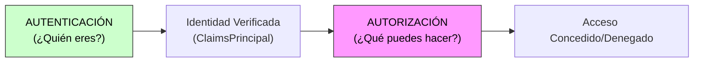
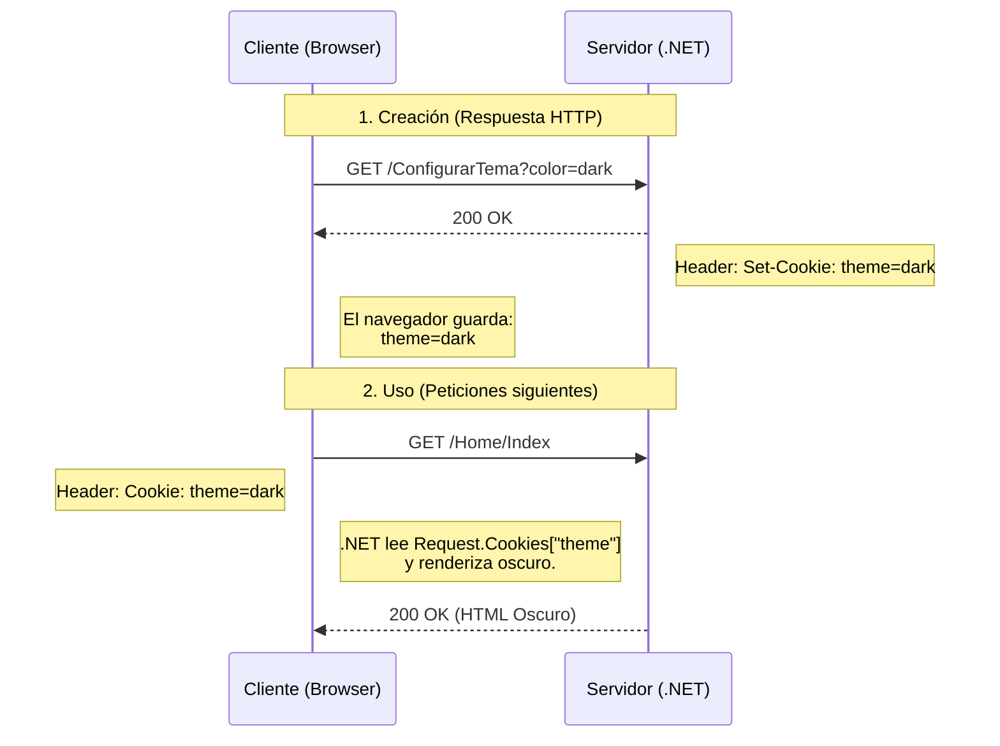
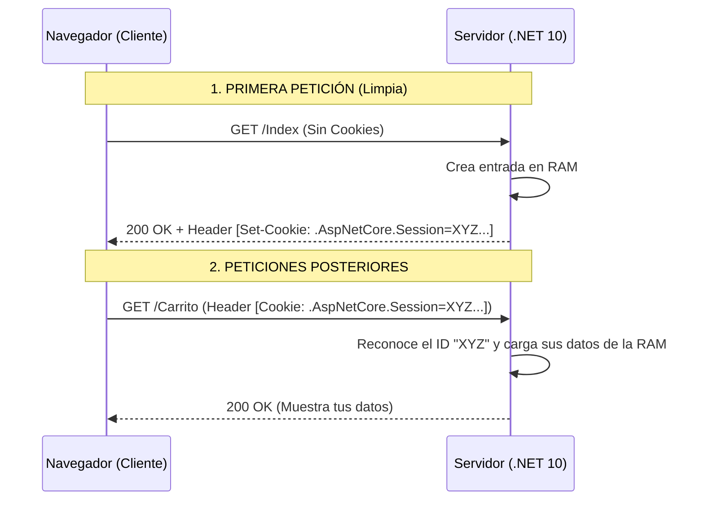
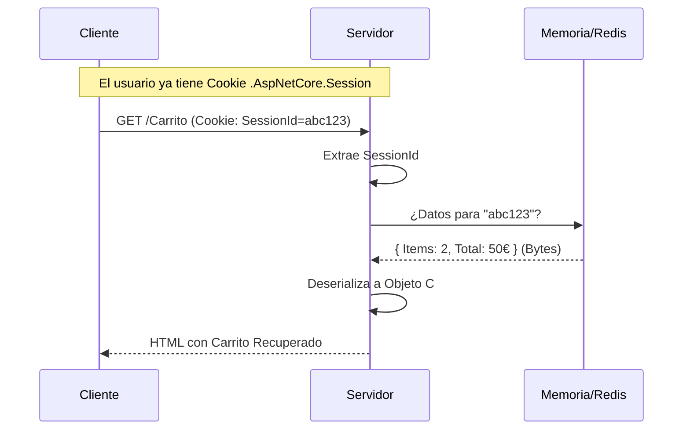
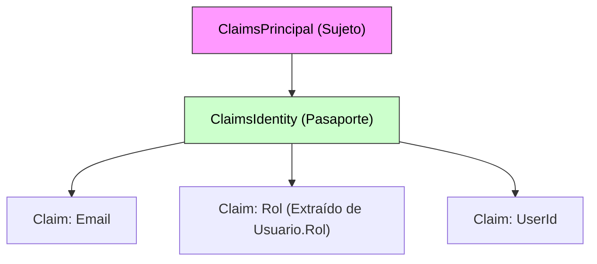
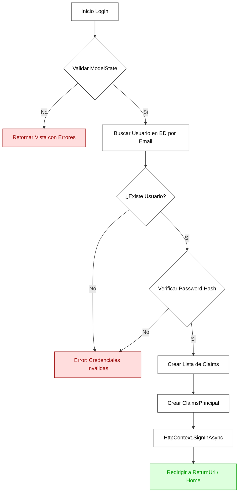
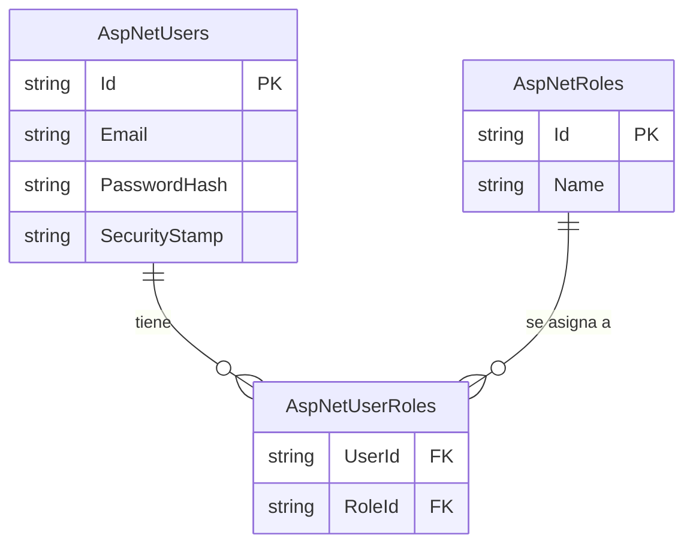
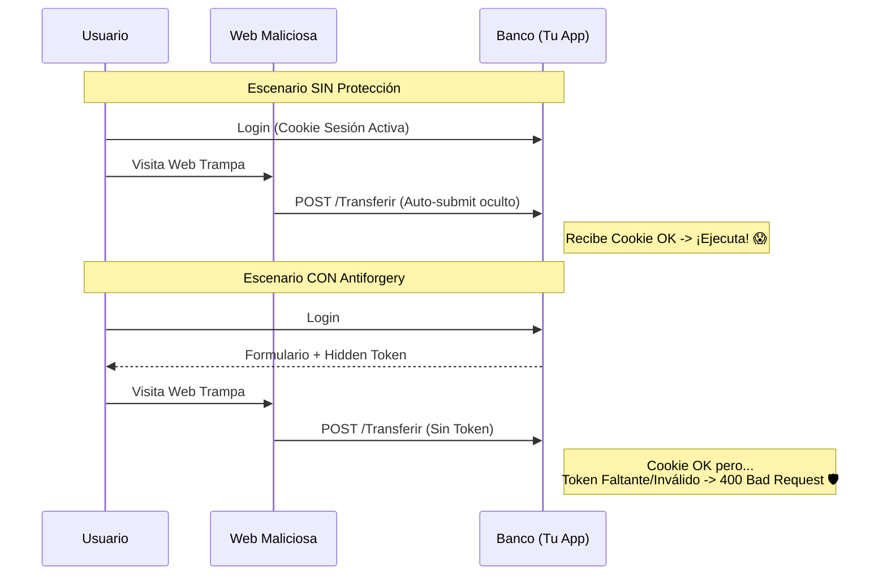

# 4. Gestión de Estado: Sesiones, Cookies y Autenticación

## Indice

- [4. Gestión de Estado: Sesiones, Cookies y Autenticación](#4-gestión-de-estado-sesiones-cookies-y-autenticación)
  - [Indice](#indice)
  - [4.1. Persistencia de Datos entre Peticiones HTTP](#41-persistencia-de-datos-entre-peticiones-http)
    - [4.1.1. Almacenes Temporales: ViewData, ViewBag y TempData](#411-almacenes-temporales-viewdata-viewbag-y-tempdata)
      - [A. ViewData y ViewBag (Simetría MVC)](#a-viewdata-y-viewbag-simetría-mvc)
      - [B. Implementación en Razor Pages (Propiedades del PageModel)](#b-implementación-en-razor-pages-propiedades-del-pagemodel)
      - [C. TempData: Persistencia en Redirecciones](#c-tempdata-persistencia-en-redirecciones)
      - [D. Comparativa técnica](#d-comparativa-técnica)
    - [4.1.2. Cookies: Persistencia en el lado del Cliente](#412-cookies-persistencia-en-el-lado-del-cliente)
      - [4.1.2.1. Tipos de cookies y Atributos de Seguridad](#4121-tipos-de-cookies-y-atributos-de-seguridad)
      - [4.1.2.2. Operaciones CRUD: Escritura y Recuperación de Cookies (.cs)](#4122-operaciones-crud-escritura-y-recuperación-de-cookies-cs)
      - [4.1.2.3. Interacción con JavaScript y Vistas](#4123-interacción-con-javascript-y-vistas)
    - [4.1.3. Sesiones (Session): Estado en el Servidor](#413-sesiones-session-estado-en-el-servidor)
      - [4.1.3.0. El Ciclo de Vida del SessionId: El Vínculo Invisible](#4130-el-ciclo-de-vida-del-sessionid-el-vínculo-invisible)
      - [4.1.3.1. Configuración del Pipeline en Program.cs (.cs)](#4131-configuración-del-pipeline-en-programcs-cs)
      - [4.1.3.2. Escritura y Lectura de Datos](#4132-escritura-y-lectura-de-datos)
      - [4.1.3.3. Sesiones Distribuidas (Redis)](#4133-sesiones-distribuidas-redis)
      - [4.1.3.4. Simetría en el Acceso al Contexto: MVC vs Razor Pages](#4134-simetría-en-el-acceso-al-contexto-mvc-vs-razor-pages)
  - [4.2. Autenticación y Autorización Manual (Cookie Auth)](#42-autenticación-y-autorización-manual-cookie-auth)
    - [4.2.1. Entidades de Dominio: Usuario y Rol](#421-entidades-de-dominio-usuario-y-rol)
    - [4.2.2. Claims y ClaimsPrincipal: El Pasaporte Digital](#422-claims-y-claimsprincipal-el-pasaporte-digital)
    - [4.2.3. Orquestación del Login: MVC vs Razor Pages (.cs)](#423-orquestación-del-login-mvc-vs-razor-pages-cs)
    - [4.2.4. Autorización Basada en Políticas y Recursos](#424-autorización-basada-en-políticas-y-recursos)
    - [4.2.5. Hashing Seguro de Contraseñas con BCrypt](#425-hashing-seguro-de-contraseñas-con-bcrypt)
  - [4.3. ASP.NET Core Identity: El Framework Profesional](#43-aspnet-core-identity-el-framework-profesional)
    - [4.3.1. Arquitectura de Modelos y DbContext (C# 14)](#431-arquitectura-de-modelos-y-dbcontext-c-14)
    - [4.3.2. Configuración del Servicio en Program.cs](#432-configuración-del-servicio-en-programcs)
    - [4.3.3. Uso de Managers: Registro y Login Real](#433-uso-de-managers-registro-y-login-real)
    - [4.3.4. Protección de Rutas y Políticas: MVC vs Razor Pages](#434-protección-de-rutas-y-políticas-mvc-vs-razor-pages)
  - [4.4. Seguridad Ofensiva: Protección contra ataques comunes](#44-seguridad-ofensiva-protección-contra-ataques-comunes)
    - [4.4.1. CSRF (Cross-Site Request Forgery)](#441-csrf-cross-site-request-forgery)
    - [4.4.2. XSS (Cross-Site Scripting)](#442-xss-cross-site-scripting)
  - [4.5. Resumen](#45-resumen)

---

## 4.1. Persistencia de Datos entre Peticiones HTTP

HTTP es un protocolo **sin estado** (*stateless*), lo que significa que cada petición es independiente y el servidor no recuerda peticiones anteriores. Para mantener información del usuario entre peticiones, necesitamos mecanismos de gestión de estado.

🎓 **Analogía del Profesor**:
> HTTP sin estado es como ir a un restaurante donde el camarero tiene amnesia. Cada vez que le pides algo, no te reconoce. Las cookies y sesiones son como una tarjeta de cliente frecuente que le recuerda quién eres y qué has pedido antes.



---

### 4.1.1. Almacenes Temporales: ViewData, ViewBag y TempData

ASP.NET Core ofrece varios mecanismos para mover datos desde la lógica (C#) hacia la interfaz (HTML) sin necesidad de persistencia permanente.

#### A. ViewData y ViewBag (Simetría MVC)

**ViewData** es un diccionario de objetos, mientras que **ViewBag** es un wrapper dinámico sobre el mismo almacén.

```csharp
// Controllers/HomeController.cs (.cs)
public class HomeController : Controller
{
    public IActionResult Index()
    {
        ViewData["Titulo"] = "Bienvenido a Funko World"; // Tipado débil
        ViewBag.Contador = 42; // Dynamic
        ViewData["Categorias"] = new List<string> { "Pop", "Soda" };
        return View();
    }
}
```

```cshtml
@* Views/Home/Index.cshtml (.cshtml) *@
<h1>@ViewData["Titulo"]</h1>
<p>Contador: @ViewBag.Contador</p>

@* Casting necesario para colecciones en ViewData *@
@{ var cats = ViewData["Categorias"] as List<string>; }
```

#### B. Implementación en Razor Pages (Propiedades del PageModel)

En Razor Pages, evitamos diccionarios en favor del tipado fuerte.

```csharp
// Pages/Index.cshtml.cs (.cs)
public class IndexModel : PageModel
{
    // ✅ Propiedades públicas = Automáticamente disponibles en la vista
    public string Titulo { get; private set; } = string.Empty;

    public void OnGet() => Titulo = "Bienvenido a Razor Pages";
}
```

#### C. TempData: Persistencia en Redirecciones

**TempData** es vital para el patrón PRG (Post-Redirect-Get). Permite almacenar datos que sobreviven a una redirección HTTP, pero solo por una petición adicional. Ideal para mensajes de confirmación o error tras operaciones POST (los famosos *flash messages*).

```csharp
// Procesar POST (.cs)
TempData["Exito"] = "Funko creado";
return RedirectToAction("Index");

// Leer en GET (.cs)
var msg = TempData["Exito"]; // Se elimina tras la primera lectura
TempData.Keep("Exito"); // Opcional: mantener para otra petición
```

#### D. Comparativa técnica

| Herramienta    | Tipo       | ¿Sobrevive Redirección? | Uso Ideal                 |
| :------------- | :--------- | :---------------------- | :------------------------ |
| **ViewData**   | Dictionary | ❌ No                    | Casos legacy.             |
| **ViewBag**    | Dynamic    | ❌ No                    | Proyectos rápidos.        |
| **TempData**   | Dictionary | ✅ Sí (1 vez)            | Mensajes de confirmación. |
| **ViewModels** | Class      | ❌ No                    | **Estándar Profesional**. |

---

### 4.1.2. Cookies: Persistencia en el lado del Cliente

Las **cookies** son pequeños fragmentos de texto almacenados en el navegador del cliente.

**Ciclo de Vida de una Cookie:**



#### 4.1.2.1. Tipos de cookies y Atributos de Seguridad

| Atributo     | Propósito                             | Recomendación Docente          |
| :----------- | :------------------------------------ | :----------------------------- |
| **HttpOnly** | Bloquea el acceso desde JavaScript.   | ✅ Siempre para IDs de sesión.  |
| **Secure**   | Solo se envía por HTTPS.              | ✅ Siempre en Producción.       |
| **SameSite** | Protege contra ataques CSRF.          | `Strict` o `Lax`.              |
| **Expires**  | Define si es persistente o de sesión. | `DateTimeOffset.UtcNow.Add...` |

#### 4.1.2.2. Operaciones CRUD: Escritura y Recuperación de Cookies (.cs)

Para que un dato sea útil, debemos ser capaces de escribirlo en la salida y recuperarlo en la entrada.

**Escenario: Sistema de Selección de Temas (Dark/Light Mode)**

```csharp
// 1. ESCRITURA PROFESIONAL (AccountController o PageModel) (.cs)
public void EstablecerPreferencia(string tema) 
{
    var options = new CookieOptions { 
        Expires = DateTimeOffset.UtcNow.AddDays(30),
        HttpOnly = true,
        Secure = true,
        SameSite = SameSiteMode.Strict
    };
    Response.Cookies.Append("User_Theme", tema, options);
}

// 2. RECUPERACIÓN Y LÓGICA (Simetría MVC vs Razor) (.cs)
// MVC Controller
string temaMvc = Request.Cookies["User_Theme"] ?? "light";

// Razor PageModel
public string TemaActual { get; set; }
public void OnGet() => TemaActual = Request.Cookies["User_Theme"] ?? "light";
```

#### 4.1.2.3. Interacción con JavaScript y Vistas

**Lectura en Vistas (.cshtml):**
```cshtml
@{
    var temaLayout = Context.Request.Cookies["User_Theme"] ?? "light";
}
<body class="theme-@temaLayout">
```

**Lectura en JavaScript (.js):**
Solo si `HttpOnly = false`.
```javascript
function getCookie(name) {
    const value = `; ${document.cookie}`;
    const parts = value.split(`; ${name}=`);
    if (parts.length === 2) return parts.pop().split(';').shift();
}
```

---

### 4.1.3. Sesiones (Session): Estado en el Servidor

La **Sesión** guarda los datos pesados en la memoria del servidor y solo un ID técnico en el cliente.

#### 4.1.3.0. El Ciclo de Vida del SessionId: El Vínculo Invisible

Es vital entender que la sesión no es mágica; depende de una cookie técnica de corta duración para funcionar. Sin esta cookie, el servidor no puede distinguir entre un usuario y otro.



**Anatomía Técnica:**
*   **Nombre por defecto**: `.AspNetCore.Session`.
*   **Contenido**: Un identificador único cifrado (no contiene tus datos, solo el ID de tu "habitación" en el servidor).
*   **Seguridad**: Por defecto es `HttpOnly` (inaccesible desde JS) y `Secure` (solo viaja por HTTPS).

**Flujo de Recuperación de Sesión:**



#### 4.1.3.1. Configuración del Pipeline en Program.cs (.cs)

```csharp
// Program.cs (.cs)
builder.Services.AddDistributedMemoryCache(); // Requisito técnico
builder.Services.AddSession(options => {
    options.IdleTimeout = TimeSpan.FromMinutes(20);
    options.Cookie.HttpOnly = true;
    options.Cookie.IsEssential = true;
    options.Cookie.Name = ".FunkoWorld.Session";
});

var app = builder.Build();
app.UseSession(); // ⚠️ DEBE IR DESPUÉS DE UseRouting
```

#### 4.1.3.2. Escritura y Lectura de Datos

**A. Datos Básicos (Cadenas y Números)**

La sesión funciona como un diccionario clave-valor. .NET proporciona métodos nativos para tipos simples. Es vital gestionar los valores nulos al recuperar datos.

```csharp
// 1. ESCRITURA (En cualquier Controller o PageModel)
HttpContext.Session.SetString("NombreUsuario", "Mario");
HttpContext.Session.SetInt32("Puntuacion", 1500);

// 2. LECTURA
// Recuperamos Strings (puede ser null)
string nombre = HttpContext.Session.GetString("NombreUsuario") ?? "Invitado";

// Recuperamos Enteros (Devuelve int? nullable)
int puntuacion = HttpContext.Session.GetInt32("Puntuacion") ?? 0;
```

**B. Objetos Complejos (JSON)**

La sesión nativa NO soporta objetos complejos directamente. Debemos serializarlos a texto (JSON) usando **Extension Methods** para mantener el código limpio.

```csharp
// Extensions/SessionExtensions.cs (.cs)
public static class SessionExtensions {
    public static void SetJson<T>(this ISession session, string key, T value) =>
        session.SetString(key, JsonSerializer.Serialize(value));

    public static T? GetJson<T>(this ISession session, string key) {
        var value = session.GetString(key);
        return value == null ? default : JsonSerializer.Deserialize<T>(value);
    }
}
```

**Uso en Lógica de Negocio (.cs):**
```csharp
// Guardar objeto complejo
var carrito = new List<CartItem> { new CartItem(1, "Funko Pop") };
HttpContext.Session.SetJson("MiCarrito", carrito);

// Recuperar objeto complejo
var miCarrito = HttpContext.Session.GetJson<List<CartItem>>("MiCarrito") ?? new();
```

#### 4.1.3.3. Sesiones Distribuidas (Redis)

Cuando tenemos varios servidores web (granja), la memoria RAM local no sirve porque cada servidor tiene la suya. Usamos **Redis** como almacén centralizado.

```csharp
// Program.cs
builder.Services.AddStackExchangeRedisCache(options => {
    options.Configuration = "localhost:6379";
});
```

#### 4.1.3.4. Simetría en el Acceso al Contexto: MVC vs Razor Pages

Dependiendo del paradigma que uses, el acceso al objeto de sesión varía ligeramente en su sintaxis, aunque el funcionamiento es idéntico.

| Característica | En MVC (Controllers) | En Razor Pages (PageModel) |
| :--- | :--- | :--- |
| **Objeto de Acceso** | `HttpContext.Session` | `Session` (Propiedad nativa) |
| **Origen** | Heredado de la clase `Controller` | Heredado de `PageModel` |

**Ejemplo Cara a Cara:**

*   **Implementación en MVC**:
    ```csharp
    public class FunkoController : Controller {
        public IActionResult Guardar() {
            // Acceso explícito al contexto HTTP
            HttpContext.Session.SetString("Usuario", "Jose");
            return View();
        }
    }
    ```

*   **Implementación en Razor Pages**:
    ```csharp
    public class IndexModel : PageModel {
        public void OnGet() {
            // Acceso directo (está expuesto en la clase base)
            Session.SetString("Usuario", "Jose");
        }
    }
    ```

📝 **Nota del Profesor**:
> Aunque en Razor Pages puedas escribir simplemente `Session`, por debajo el sistema está haciendo exactamente lo mismo que en MVC: consultar el `HttpContext`. Es puro azúcar sintáctico para que el código de la página sea más limpio.

---

## 4.2. Autenticación y Autorización Manual (Cookie Auth)

Antes de delegar en Identity, debemos ser capaces de construir el motor de seguridad desde cero.

### 4.2.1. Entidades de Dominio: Usuario y Rol

Definimos una jerarquía profesional para nuestra base de datos personalizada.

```csharp
// Models/Domain/Rol.cs (.cs)
public class Rol {
    public int Id { get; set; }
    public string Nombre { get; set; } = string.Empty; // Admin, User, etc.
}

// Models/Domain/Usuario.cs (.cs)
public class Usuario {
    public int Id { get; set; }
    public string Email { get; set; } = string.Empty;
    public string PasswordHash { get; set; } = string.Empty;
    public Rol Rol { get; set; } = default!; // 🛡️ Relación 1:1 con Rol
}
```

### 4.2.2. Claims y ClaimsPrincipal: El Pasaporte Digital

En .NET, la identidad es una cebolla de tres capas:
1.  **Claim**: El dato atómico (ej: "Email: ana@dev.com").
2.  **ClaimsIdentity**: El conjunto de claims (la página del pasaporte).
3.  **ClaimsPrincipal**: El sujeto que porta una o varias identidades.



---

### 4.2.3. Orquestación del Login: MVC vs Razor Pages (.cs)

En el modo manual, el programador orquesta la creación del Principal y llama a `SignInAsync`. Es vital entender que, aunque la lógica de fondo es la misma, la forma de recibir los datos cambia.

**Flujo Lógico de Autenticación:**



**Comparativa de Implementación:**

| Paradigma       | Características Clave                                             | Ejemplo de Código Real                                                                                                                                                                                                                                                                       |
| :-------------- | :---------------------------------------------------------------- | :------------------------------------------------------------------------------------------------------------------------------------------------------------------------------------------------------------------------------------------------------------------------------------------- |
| **MVC**         | • Acción explícita `Login`<br>• Recibe modelo por parámetro       | `public async Task<IActionResult> Login(LoginInput model)`<br>`{`<br>`    if (!ModelState.IsValid) return View(model);`<br>`    // Lógica de validación...`<br>`    await SignInAsync(...);`<br>`    return RedirectToAction("Index");`<br>`}`                                               |
| **Razor Pages** | • Handler `OnPostAsync`<br>• Modelo bindeado con `[BindProperty]` | `[BindProperty] public LoginInput Input { get; set; }`<br>`public async Task<IActionResult> OnPostAsync()`<br>`{`<br>`    if (!ModelState.IsValid) return Page();`<br>`    // Usa this.Input directamente`<br>`    await SignInAsync(...);`<br>`    return RedirectToPage("/Index");`<br>`}` |

**Lógica de Creación de Identidad (Común):**
```csharp
private async Task IniciarSesionManual(Usuario user, bool persistir) 
{
    var claims = new List<Claim> {
        new(ClaimTypes.Name, user.Email),
        new(ClaimTypes.Role, user.Rol.Nombre), // 🛡️ Asignación del rol al pasaporte
        new("IdInterno", user.Id.ToString())
    };

    var identity = new ClaimsIdentity(claims, CookieAuthenticationDefaults.AuthenticationScheme);
    var principal = new ClaimsPrincipal(identity);

    await HttpContext.SignInAsync(principal, new AuthenticationProperties { IsPersistent = persistir });
}
```

---

### 4.2.4. Autorización Basada en Políticas y Recursos

**Handlers de Recursos (Escenario Avanzado):**
¿Cómo verificamos si un usuario es el dueño de un Funko?

```csharp
// Handlers/FunkoOwnerHandler.cs (.cs)
public class FunkoOwnerHandler : AuthorizationHandler<OwnerRequirement, Funko> {
    protected override Task HandleRequirementAsync(AuthorizationHandlerContext context, 
        OwnerRequirement requirement, Funko resource) {
        if (resource.UsuarioId == context.User.FindFirstValue(ClaimTypes.NameIdentifier))
            context.Succeed(requirement);
        return Task.CompletedTask;
    }
}
```

---

### 4.2.5. Hashing Seguro de Contraseñas con BCrypt

**NUNCA** guardes en texto plano. BCrypt es el estándar por su Salt automático y su "Work Factor" (lentitud intencional). Aunque en **Identity** esto es automático, en el modo manual debemos usar la interfaz del framework.

| Algoritmo  | Seguridad | Velocidad         | Recomendación             |
| :--------- | :-------- | :---------------- | :------------------------ |
| **MD5**    | ❌ Nula    | Instantáneo       | Prohibido.                |
| **SHA256** | ⚠️ Baja    | Rápido            | No apto para contraseñas. |
| **BCrypt** | ✅ Alta    | Lento (Ajustable) | **Estándar Industrial**.  |

**Implementación Manual (.cs):**
```csharp
// Inyectamos IPasswordHasher<Usuario> en nuestro servicio de Auth
public class AuthService(IPasswordHasher<Usuario> hasher) {
    
    public void Registrar(Usuario u, string passPlana) {
        // El framework se encarga de generar el Salt y hashear
        u.PasswordHash = hasher.HashPassword(u, passPlana);
    }

    public bool Verificar(Usuario u, string passPlana) {
        var result = hasher.VerifyHashedPassword(u, u.PasswordHash, passPlana);
        return result == PasswordVerificationResult.Success;
    }
}
```

---

## 4.3. ASP.NET Core Identity: El Framework Profesional

**ASP.NET Core Identity** es la solución completa "Battery Included" de Microsoft. No solo gestiona usuarios y roles, sino tokens de email, 2FA (Doble factor), bloqueos por intentos fallidos y más.

### 4.3.1. Arquitectura de Modelos y DbContext (C# 14)

Identity abstrae la gestión mediante herencia de clases del framework, creando automáticamente un esquema de tablas optimizado.

**Esquema de Base de Datos (Simplificado):**



```csharp
// Models/ApplicationUser.cs (.cs)
// ✅ C# 14: Personalización profunda de la identidad
public class ApplicationUser : IdentityUser<Guid> {
    public string NombreCompleto { get; set; } = string.Empty;
    public DateTime FechaAlta { get; init; } = DateTime.UtcNow;
}

// Data/ApplicationDbContext.cs (.cs)
// ⚠️ Heredamos de IdentityDbContext, no de DbContext
public class ApplicationDbContext(DbContextOptions<ApplicationDbContext> options) 
    : IdentityDbContext<ApplicationUser, IdentityRole<Guid>, Guid>(options) { }
```

### 4.3.2. Configuración del Servicio en Program.cs

La configuración es más compleja que la autenticación manual, ya que debemos conectar el contexto de datos con el sistema de identidad.

```csharp
// Program.cs
builder.Services.AddDbContext<ApplicationDbContext>(options =>
    options.UseSqlServer(connectionString));

// Configuración del Sistema de Identidad
builder.Services.AddIdentity<ApplicationUser, IdentityRole<Guid>>(options => {
    // 🛡️ Políticas de Contraseña
    options.Password.RequireDigit = true;
    options.Password.RequiredLength = 8;
    options.Password.RequireNonAlphanumeric = true;
    
    // 🛡️ Bloqueo (Brute Force Protection)
    options.Lockout.DefaultLockoutTimeSpan = TimeSpan.FromMinutes(5);
    options.Lockout.MaxFailedAccessAttempts = 5;
    
    // 🛡️ Usuario
    options.User.RequireUniqueEmail = true;
})
.AddEntityFrameworkStores<ApplicationDbContext>()
.AddDefaultTokenProviders(); // Necesario para reset password / email confirm
```

### 4.3.3. Uso de Managers: Registro y Login Real

Identity nos entrega dos servicios críticos que inyectamos en nuestros controladores o PageModels: `UserManager<T>` y `SignInManager<T>`.

**A. Registro de Usuario (Controller MVC):**
```csharp
[HttpPost]
public async Task<IActionResult> Register(RegisterViewModel model) {
    if (!ModelState.IsValid) return View(model);

    var user = new ApplicationUser { 
        UserName = model.Email, 
        Email = model.Email,
        NombreCompleto = model.Nombre 
    };

    // 1. Crear usuario (Identity hashea la password automáticamente)
    var result = await _userManager.CreateAsync(user, model.Password);

    if (result.Succeeded) {
        // 2. Asignar Rol por defecto
        await _userManager.AddToRoleAsync(user, "User");
        
        // 3. Login automático tras registro
        await _signInManager.SignInAsync(user, isPersistent: false);
        return RedirectToAction("Index", "Home");
    }

    // Manejo de errores (ej: Email duplicado, password débil)
    foreach (var error in result.Errors)
        ModelState.AddModelError(string.Empty, error.Description);

    return View(model);
}
```

**B. Registro de Usuario (Razor Pages):**
```csharp
// Pages/Account/Register.cshtml.cs (.cs)
// ✅ C# 14: Uso de Primary Constructor para inyección de dependencias
public class RegisterModel(UserManager<ApplicationUser> userManager, 
                           SignInManager<ApplicationUser> signInManager) : PageModel 
{
    [BindProperty] 
    public RegisterInput Model { get; set; } = new();

    public async Task<IActionResult> OnPostAsync() 
    {
        if (!ModelState.IsValid) return Page();

        var user = new ApplicationUser { UserName = Model.Email, Email = Model.Email };
        
        // 1. Crear usuario
        var result = await userManager.CreateAsync(user, Model.Password);

        if (result.Succeeded) {
            // 2. Login automático
            await signInManager.SignInAsync(user, isPersistent: false);
            return RedirectToPage("/Index");
        }

        foreach (var error in result.Errors)
            ModelState.AddModelError(string.Empty, error.Description);

        return Page();
    }
}
```

**C. Login de Usuario:**
```csharp
[HttpPost]
public async Task<IActionResult> Login(LoginViewModel model) {
    // lockoutOnFailure: true activa el contador de bloqueos
    var result = await _signInManager.PasswordSignInAsync(
        model.Email, model.Password, model.Recordarme, lockoutOnFailure: true);

    if (result.Succeeded) return RedirectToAction("Index", "Home");
    if (result.IsLockedOut) return View("Lockout"); // Cuenta bloqueada temporalmente
    
    ModelState.AddModelError(string.Empty, "Credenciales inválidas");
    return View(model);
}
```

### 4.3.4. Protección de Rutas y Políticas: MVC vs Razor Pages

Una vez autenticado el usuario, debemos decidir **qué puede ver**. En .NET moderno, esto se hace mediante **Políticas (Policies)** que agrupan roles o claims.

**1. Definición de Políticas (Program.cs)**
Antes de proteger nada, definimos las reglas del juego en el contenedor de servicios.

```csharp
builder.Services.AddAuthorization(options =>
{
    // Política Simple: Solo requiere un Rol
    options.AddPolicy("EsAdmin", policy => policy.RequireRole("Admin"));

    // Política Avanzada: Requiere un Claim específico (Permiso granular)
    options.AddPolicy("PuedeBorrar", policy => policy.RequireClaim("Permiso", "Borrar_Usuarios"));

    // Política Combinada: Rol + Claim
    options.AddPolicy("SuperUsuario", policy => 
        policy.RequireRole("Admin").RequireClaim("Nivel", "Oro"));
});
```

**2. Aplicación en MVC (Controladores y Acciones)**
En MVC, usamos el atributo `[Authorize]` sobre la Clase (Controlador) o el Método (Acción).

```csharp
// Bloquea TODO el controlador (Rutas: /Admin/...)
[Authorize(Policy = "EsAdmin")] 
public class AdminController : Controller
{
    public IActionResult Dashboard() => View();

    // Podemos sobreescribir con [AllowAnonymous]
    [AllowAnonymous]
    public IActionResult Login() => View();
}

public class ProductosController : Controller
{
    // Bloquea solo esta acción
    [Authorize(Policy = "PuedeBorrar")] 
    public IActionResult Delete(int id) { ... }
}
```

**3. Aplicación en Razor Pages (PageModels y Convenciones)**
En Razor Pages tenemos dos formas de proteger rutas: **Atributos** (igual que MVC) o **Convenciones Globales** (más seguro para carpetas enteras).

*Opción A: Atributos en el PageModel*
```csharp
// Pages/Admin/Index.cshtml.cs
[Authorize(Policy = "EsAdmin")] // 🔒 Protege la página completa
public class IndexModel : PageModel
{
    public void OnGet() { ... }
}
```

*Opción B: Convenciones en Program.cs (Recomendado para Carpetas)*
Es más seguro bloquear una carpeta entera desde la configuración para evitar descuidos.

```csharp
builder.Services.AddRazorPages(options =>
{
    // 🔒 Protege TODA la carpeta /Admin y sus subcarpetas
    options.Conventions.AuthorizeFolder("/Admin", "EsAdmin");

    // 🔒 Protege una página específica
    options.Conventions.AuthorizePage("/Ventas/Reporte", "SuperUsuario");

    // 🔓 Permite acceso anónimo a una página dentro de una carpeta protegida
    options.Conventions.AllowAnonymousToPage("/Admin/Login");
});
```

---

## 4.4. Seguridad Ofensiva: Protección contra ataques comunes

No basta con autenticar; debemos proteger el transporte y la integridad de los datos.

### 4.4.1. CSRF (Cross-Site Request Forgery)

**El Ataque:** Una web maliciosa envía un formulario oculto a tu banco aprovechando que tienes la cookie de sesión activa.
**La Defensa (.NET):** Tokens Antiforgery. .NET inyecta un token oculto en cada formulario que debe coincidir con la cookie del usuario.



```cshtml
@* En Vistas Razor (MVC/Pages) es AUTOMÁTICO dentro de <form> *@
<form asp-action="Delete" method="post">
    @* Se genera <input type="hidden" name="__RequestVerificationToken" ... /> *@
</form>
```

```csharp
// 1. MVC: Requiere atributo explícito (RECOMENDADO Global Filter)
[HttpPost]
[ValidateAntiForgeryToken] 
public IActionResult Delete(int id) { ... }

// 2. Razor Pages: ¡Es AUTOMÁTICO!
// El framework valida el token en cada método OnPost() por defecto.
// No necesitas añadir [ValidateAntiForgeryToken] a menos que lo hayas desactivado globalmente.
```

### 4.4.2. XSS (Cross-Site Scripting)

**El Ataque:** Un usuario inyecta `<script>alert('hack')</script>` en un comentario. Si la web lo renderiza tal cual, el script se ejecuta en el navegador de otros usuarios.
**La Defensa (.NET):** Codificación automática.

```cshtml
@* Razor codifica automáticamente todo el output *@
@model.Comentario  <!-- Si contiene <script>, se renderiza como &lt;script&gt; (seguro) -->

@* ⚠️ PELIGRO: Uso de Html.Raw *@
@Html.Raw(model.Comentario) <!-- Esto ejecutaría el script. EVITAR SIEMPRE con input de usuario. -->
```

---

## 4.5. Resumen

1.  **Estado**: HTTP es amnésico; las Cookies y Sesiones son su memoria técnica.
2.  **Identidad**: Se basa en un sistema de **Claims** (el pasaporte digital).
3.  **Pipeline**: .NET permite una hibridación perfecta entre MVC y Razor Pages bajo el mismo motor de seguridad.

🎓 **Veredicto del Profesor**:
> Usa **Manual** para entender el motor de peticiones (Cookies, Claims). Usa **Identity** para el 95% de tus desarrollos profesionales reales. Configura siempre **[ValidateAntiForgeryToken]** en tus POSTs y nunca confíes en el input del usuario.

---

Elementos que tienes a tu disposición para gestionar estado y seguridad:

| Herramienta     | Almacenamiento | Persistencia  | Propósito                          |
| :-------------- | :------------- | :------------ | :--------------------------------- |
| **Cookies**     | Cliente        | Larga (Disco) | Preferencias y persistencia de ID. |
| **Sesiones**    | Servidor       | Corta (RAM)   | Carritos y estado temporal pesado. |
| **Manual Auth** | Cookies        | Sesión        | Control total del desarrollador.   |
| **Identity**    | BBDD           | Permanente    | Gestión profesional de membresía.  |

---
