# 5. Tag Helpers

## Índice

- [5. Tag Helpers](#5-tag-helpers)
  - [Índice](#índice)
  - [5.1. Tag Helpers: Simplificación de la Sintaxis HTML](#51-tag-helpers-simplificación-de-la-sintaxis-html)
    - [5.1.1. Filosofía: Del HtmlHelper al TagHelper](#511-filosofía-del-htmlhelper-al-taghelper)
    - [5.1.2. Habilitar Tag Helpers](#512-habilitar-tag-helpers)
  - [5.2. Tag Helpers Integrados](#52-tag-helpers-integrados)
    - [5.2.1. Tag Helpers de Formularios](#521-tag-helpers-de-formularios)
      - [A. `asp-for`: Binding de propiedades](#a-asp-for-binding-de-propiedades)
      - [B. Ejemplo Esencial de Formulario con Tag Helpers](#b-ejemplo-esencial-de-formulario-con-tag-helpers)
    - [5.2.2. Tag Helpers de Navegación: MVC vs Razor Pages](#522-tag-helpers-de-navegación-mvc-vs-razor-pages)
      - [A. `asp-action`, `asp-controller` y `asp-page`](#a-asp-action-asp-controller-y-asp-page)
      - [B. `asp-route-*` (Parámetros de Ruta)](#b-asp-route--parámetros-de-ruta)
    - [5.2.3. Tag Helpers de Seguridad y Validación](#523-tag-helpers-de-seguridad-y-validación)
      - [A. `asp-antiforgery` (Protección CSRF)](#a-asp-antiforgery-protección-csrf)
      - [B. Tag Helper de Validación](#b-tag-helper-de-validación)
    - [5.2.4. Tag Helpers de Caché (Rendimiento)](#524-tag-helpers-de-caché-rendimiento)
    - [5.2.5. Tag Helpers de Entorno (Environment)](#525-tag-helpers-de-entorno-environment)
    - [5.2.6. Tag Helpers de Imágenes y Scripts (Cache Busting)](#526-tag-helpers-de-imágenes-y-scripts-cache-busting)
  - [5.3. Tag Helpers Personalizados](#53-tag-helpers-personalizados)
    - [5.3.0. Anatomía de un Tag Helper: De C# a HTML](#530-anatomía-de-un-tag-helper-de-c-a-html)
    - [5.3.1. Ciclo de Vida de Procesamiento](#531-ciclo-de-vida-de-procesamiento)
    - [5.3.2. Ejemplo 1: Tag Helper para Badges de Estado (C# 14)](#532-ejemplo-1-tag-helper-para-badges-de-estado-c-14)
    - [5.3.3. Ejemplo 2: Tag Helper para Alertas de Bootstrap](#533-ejemplo-2-tag-helper-para-alertas-de-bootstrap)
    - [5.3.4. Ejemplo 3: Tag Helper para Tarjetas de Producto](#534-ejemplo-3-tag-helper-para-tarjetas-de-producto)
    - [5.3.5. Ejemplo 4: Tag Helper Condicional (Modificador)](#535-ejemplo-4-tag-helper-condicional-modificador)
  - [5.4. Resumen](#54-resumen)

---

## 5.1. Tag Helpers: Simplificación de la Sintaxis HTML

Los **Tag Helpers** son una característica de Razor que permite escribir código del lado del servidor usando sintaxis HTML natural, haciendo el código más limpio y fácil de leer.

🎓 **Analogía del Profesor**:
> Los Tag Helpers son como autocorrector inteligente para HTML. En lugar de escribir código C# mezclado con HTML (`@Html.TextBoxFor()`), escribes HTML normal (`<input asp-for="Nombre" />`) y el Tag Helper añade automáticamente todos los atributos necesarios (name, id, validación, etc.).

En .NET 10, los Tag Helpers han evolucionado para ser la forma preferida de crear componentes de UI reutilizables. Olvidad los antiguos `@Html.Helpers`; el futuro es el marcado natural. Fijaos en la diferencia de legibilidad. Los Tag Helpers permiten que el front-end y el back-end hablen el mismo idioma (HTML).

### 5.1.1. Filosofía: Del HtmlHelper al TagHelper

El cambio no es solo estético, es semántico.

```mermaid
graph LR
    subgraph "Antiguo: HTML Helpers"
        H["@Html.TextBoxFor(m => m.Nombre, <br/>new { @class = 'form-control' })"]
    end
    subgraph "Moderno: Tag Helpers"
        T["&lt;input asp-for='Nombre' <br/>class='form-control' /&gt;"]
    end
    H -->|Evolución| T
    style T fill:#cfc,stroke:#333,color:#000
```



### 5.1.2. Habilitar Tag Helpers

Para usar Tag Helpers, debemos "importarlos" en nuestras vistas. Esto se hace típicamente en el archivo `_ViewImports.cshtml`.

| Ubicación Estándar | Ruta del Fichero            | Contenido Típico                                       |
| :----------------- | :-------------------------- | :----------------------------------------------------- |
| **MVC**            | `Views/_ViewImports.cshtml` | `@addTagHelper *, Microsoft.AspNetCore.Mvc.TagHelpers` |
| **Razor Pages**    | `Pages/_ViewImports.cshtml` | `@addTagHelper *, Microsoft.AspNetCore.Mvc.TagHelpers` |

📝 **Nota del Profesor**: El asterisco `*` significa "importar todos los helpers de este ensamblado". Si creas tus propios helpers en tu proyecto `MiApp`, deberás añadir una segunda línea: `@addTagHelper *, MiApp`.

---

## 5.2. Tag Helpers Integrados

### 5.2.1. Tag Helpers de Formularios

#### A. `asp-for`: Binding de propiedades

El atributo `asp-for` conecta un `input` HTML directamente con una propiedad de tu Modelo (C#).

```cshtml
@* Sin Tag Helper (antiguo) *@
<label for="Nombre">Nombre:</label>
<input type="text" 
       id="Nombre" 
       name="Nombre" 
       value="@Model.Nombre" 
       class="form-control" />
<span class="text-danger">@Html.ValidationMessageFor(m => m.Nombre)</span>

@* ✅ Con Tag Helper (moderno) *@
<label asp-for="Nombre"></label>
<input asp-for="Nombre" class="form-control" />
<span asp-validation-for="Nombre" class="text-danger"></span>

@* El Tag Helper genera automáticamente: 
- id="Nombre"
- name="Nombre"
- value="valor_del_modelo"
- data-val="true" (validación)
- data-val-required="El nombre es obligatorio"
- type="text" (detecta el tipo desde la propiedad)
*@
```

#### B. Ejemplo Esencial de Formulario con Tag Helpers

A continuación, se muestra cómo se integran los diferentes Tag Helpers en un formulario funcional. Para ver la implementación completa con diseño avanzado y lógica de archivos, consulta el **Capítulo 3 (3.2.1)**.

```cshtml
@model CrearFunkoInputModel

<form asp-action="Crear" method="post" enctype="multipart/form-data">
    
    @* 1. Resumen de errores de validación *@
    <div asp-validation-summary="ModelOnly" class="text-danger"></div>

    @* 2. Campo de texto con Label automática *@
    <div class="mb-3">
        <label asp-for="Nombre"></label>
        <input asp-for="Nombre" class="form-control" />
        <span asp-validation-for="Nombre" class="text-danger"></span>
    </div>

    @* 3. Select con binding a Enum o Lista dinámica *@
    <div class="mb-3">
        <label asp-for="CategoriaId"></label>
        <select asp-for="CategoriaId" 
                asp-items="Model.CategoriasDisponibles" 
                class="form-select">
            <option value="">Selecciona una categoría</option>
        </select>
        <span asp-validation-for="CategoriaId" class="text-danger"></span>
    </div>

    @* 4. Checkbox con Binding booleano *@
    <div class="mb-3 form-check">
        <input asp-for="EsExclusivo" class="form-check-input" />
        <label asp-for="EsExclusivo" class="form-check-label"></label>
    </div>

    @* 5. Botones con navegación integrada *@
    <div class="mt-4">
        <button type="submit" class="btn btn-primary">Guardar</button>
        <a asp-action="Index" class="btn btn-secondary">Cancelar</a>
    </div>
</form>

@section Scripts {
    @* Inclusión del Tag Helper Partial para validación en cliente *@
    <partial name="_ValidationScriptsPartial" />
}
```

---

### 5.2.2. Tag Helpers de Navegación: MVC vs Razor Pages

Aquí es donde la simetría se rompe. Dependiendo de si usas Controladores o Páginas, usarás atributos distintos.

| Atributo            | Uso Principal                     | Paradigma       | Ejemplo                         |
| :------------------ | :-------------------------------- | :-------------- | :------------------------------ |
| `asp-controller`    | Define el Controlador destino     | **MVC**         | `<a asp-controller="Home" ...>` |
| `asp-action`        | Define la Acción (método) destino | **MVC**         | `<a asp-action="Index" ...>`    |
| `asp-page`          | Define la ruta de la Página Razor | **Razor Pages** | `<a asp-page="/Index" ...>`     |
| `asp-route-{param}` | Pasa parámetros por URL           | **Ambos**       | `<a ... asp-route-id="5">`      |

#### A. `asp-action`, `asp-controller` y `asp-page`

```cshtml
@* ════════════════════════════════════════════════════════════ *@
@* ENLACES CON TAG HELPERS                                      *@
@* ════════════════════════════════════════════════════════════ *@

@* Sin Tag Helper (antiguo) *@
<a href="/Funkos/Detalle/42">Ver Funko</a>
<a href="@Url.Action("Detalle", "Funkos", new { id = 42 })">Ver Funko</a>

@* ✅ Con Tag Helper (moderno MVC) *@
<a asp-controller="Funkos" asp-action="Detalle" asp-route-id="42">
    Ver Funko
</a>

@* ✅ Con Tag Helper (moderno Razor Pages) *@
<a asp-page="/Funkos/Detalle" asp-route-id="42">
    Ver Funko
</a>

@* ──────────────────────────────────────────────────────────── *@
@* ENLACE A LA MISMA ACCIÓN EN EL CONTROLADOR ACTUAL           *@
@* ──────────────────────────────────────────────────────────── *@

<a asp-action="Index">Volver al listado</a>
@* No necesitas especificar asp-controller, usa el actual *@
```

#### B. `asp-route-*` (Parámetros de Ruta)

```cshtml
@* ──────────────────────────────────────────────────────────── *@
@* ENLACE CON MÚLTIPLES PARÁMETROS                              *@
@* ──────────────────────────────────────────────────────────── *@

<a asp-controller="Funkos" 
   asp-action="Buscar" 
   asp-route-termino="darth" 
   asp-route-tipo="Pop"
   asp-route-pagina="2"
   class="btn btn-primary">
    Buscar Darth Vader Pop (página 2)
</a>

@* Genera: <a href="/Funkos/Buscar?termino=darth&tipo=Pop&pagina=2">... </a> *@


@* ──────────────────────────────────────────────────────────── *@
@* ENLACE CON ÁREA                                              *@
@* ──────────────────────────────────────────────────────────── *@

<a asp-area="Admin" 
   asp-controller="Dashboard" 
   asp-action="Index">
    Panel de Administración
</a>

@* Genera: <a href="/Admin/Dashboard">Panel de Administración</a> *@
```

---

### 5.2.3. Tag Helpers de Seguridad y Validación

#### A. `asp-antiforgery` (Protección CSRF)

```cshtml
@* ════════════════════════════════════════════════════════════ *@
@* PROTECCIÓN ANTI-CSRF (automática en formularios)             *@
@* ════════════════════════════════════════════════════════════ *@

<form asp-action="Crear" method="post">
    @* Tag Helper añade automáticamente el token anti-forgery *@
    @* <input name="__RequestVerificationToken" type="hidden" value="..." /> *@
    
    <!-- Campos del formulario -->
    
    <button type="submit">Enviar</button>
</form>

@* En el controlador debes tener: *@
@* [HttpPost]
   [ValidateAntiForgeryToken]
   public IActionResult Crear(CrearFunkoInputModel input) { ...  } *@


@* ──────────────────────────────────────────────────────────── *@
@* FORMULARIO SIN PROTECCIÓN CSRF (raro, no recomendado)        *@
@* ──────────────────────────────────────────────────────────── *@

<form asp-action="Crear" method="post" asp-antiforgery="false">
    <!-- Sin token anti-forgery -->
</form>
```

#### B. Tag Helper de Validación

```cshtml
@* ════════════════════════════════════════════════════════════ *@
@* RESUMEN DE VALIDACIÓN                                        *@
@* ════════════════════════════════════════════════════════════ *@

@* Opción 1: Todos los errores (incluyendo ModelState general) *@
<div asp-validation-summary="All" class="alert alert-danger"></div>

@* Opción 2: Solo errores del ModelState (no de propiedades específicas) *@
<div asp-validation-summary="ModelOnly" class="alert alert-danger"></div>

@* ════════════════════════════════════════════════════════════ *@
@* VALIDACIÓN POR CAMPO                                         *@
@* ════════════════════════════════════════════════════════════ *@

<div class="mb-3">
    <label asp-for="Nombre"></label>
    <input asp-for="Nombre" class="form-control" />
    
    @* Muestra el error de validación de 'Nombre' *@
    <span asp-validation-for="Nombre" class="text-danger"></span>
</div>
```

---

### 5.2.4. Tag Helpers de Caché (Rendimiento)

Este es un Tag Helper "superpoderoso" que permite cachear **fragmentos de HTML** en la memoria del servidor.

```cshtml
@* ════════════════════════════════════════════════════════════ *@
@* CACHE TAG HELPER (para fragmentos de vista)                  *@
@* ════════════════════════════════════════════════════════════ *@

@* Cachear durante 5 minutos *@
<cache expires-after="@TimeSpan.FromMinutes(5)">
    <div class="card">
        <h3>Funkos más vendidos</h3>
        @foreach (var funko in await _service.ObtenerMasVendidosAsync())
        {
            <p>@funko.Nombre</p>
        }
    </div>
</cache>

@* ──────────────────────────────────────────────────────────── *@
@* CACHEAR POR USUARIO                                          *@
@* ──────────────────────────────────────────────────────────── *@

<cache vary-by-user="true" expires-after="@TimeSpan.FromMinutes(30)">
    @* Caché diferente para cada usuario autenticado *@
    <p>Bienvenido, @User.Identity. Name</p>
    <p>Tus funkos favoritos: </p>
</cache>


@* ──────────────────────────────────────────────────────────── *@
@* CACHEAR POR QUERY STRING                                     *@
@* ──────────────────────────────────────────────────────────── *@

<cache vary-by-query="pagina,tamaño" expires-after="@TimeSpan.FromMinutes(15)">
    @* Caché diferente para cada combinación de pagina y tamaño *@
    
    @foreach (var funko in Model.Funkos)
    {
        <div>@funko.Nombre</div>
    }
</cache>
```

---

### 5.2.5. Tag Helpers de Entorno (Environment)

Permite renderizar contenido HTML condicionalmente según si estamos en Desarrollo, Producción o Staging.

```cshtml
@* Contenido solo en DESARROLLO *@
<environment include="Development">
    <link rel="stylesheet" href="~/css/site.css" />
    <script src="~/js/site.js"></script>
    
    <div class="alert alert-warning">
        ⚠️ Estás en modo DESARROLLO
    </div>
</environment>

@* Contenido solo en PRODUCCIÓN *@
<environment include="Production">
    <link rel="stylesheet" href="~/css/site.min.css" asp-append-version="true" />
    <script src="~/js/site.min.js" asp-append-version="true"></script>
</environment>
```

---

### 5.2.6. Tag Helpers de Imágenes y Scripts (Cache Busting)

El problema clásico del desarrollo web: cambias una imagen o un CSS, pero el navegador del cliente sigue mostrando la versión vieja cacheada.

El Tag Helper `asp-append-version` soluciona esto añadiendo un hash único al final del archivo.

```cshtml
@* ✅ CON asp-append-version *@
<link rel="stylesheet" href="~/css/site.css" asp-append-version="true" />
@* Genera:  <link rel="stylesheet" href="/css/site.css?v=abcd1234" /> *@
@* ✅ El hash cambia cuando modificas el archivo, forzando descarga *@

<script src="~/js/site. js" asp-append-version="true"></script>
@* Genera: <script src="/js/site.js?v=xyz9876"></script> *@


@* Genera:  *@
```

---

## 5.3. Tag Helpers Personalizados

Puedes crear tus propios Tag Helpers para encapsular lógica reutilizable.

### 5.3.0. Anatomía de un Tag Helper: De C# a HTML

Para un alumno, entender qué hay detrás de un `<input asp-for="...">` es clave. Un Tag Helper no es magia; es una clase C# que hereda de **`TagHelper`** y que el servidor ejecuta antes de enviar el HTML al navegador.

**Las piezas fundamentales:**
1.  **La Clase**: Debe terminar con el sufijo `TagHelper` (ej: `EmailTagHelper.cs`). Por convención, esto creará una etiqueta `<email>` en HTML.
2.  **El Método `Process`**: Es el motor. Recibe el contexto (`Context`) y genera la salida (`Output`).
3.  **Los Atributos**: Las propiedades públicas de la clase se convierten automáticamente en atributos de la etiqueta HTML (usando kebab-case).

**Ejemplo Técnico Base:**
```csharp
namespace MiApp.TagHelpers;

// Esta clase generará la etiqueta <email mail-to="...">
public class EmailTagHelper : TagHelper
{
    // Esta propiedad será el atributo mail-to en HTML
    public string? MailTo { get; set; }

    public override void Process(TagHelperContext context, TagHelperOutput output)
    {
        output.TagName = "a";    // Sustituimos <email> por <a>
        var address = MailTo ?? "soporte@funko.com";
        output.Attributes.SetAttribute("href", $"mailto:{address}");
        output.Content.SetContent(address);
    }
}
```

### 5.3.1. Ciclo de Vida de Procesamiento

Entender cómo Razor procesa tu etiqueta es vital para depurar.

```mermaid
graph TD
    A[Parser encuentra etiqueta] --> B[Instancia Clase TagHelper]
    B --> C[Inyecta Dependencias DI]
    C --> D[Asigna Propiedades Públicas]
    D --> E{¿ProcessAsync?}
    E -- Sí --> F[Ejecuta ProcessAsync]
    E -- No --> G[Ejecuta Process]
    F & G --> H[Genera Output HTML]
    H --> I[Renderiza en Navegador]
    
    style F fill:#f9f,stroke:#333,color:#000
    style G fill:#f9f,stroke:#333,color:#000
    style H fill:#cfc,stroke:#333,color:#000
```



### 5.3.2. Ejemplo 1: Tag Helper para Badges de Estado (C# 14)

```csharp
// TagHelpers/EstadoBadgeTagHelper.cs
using Microsoft.AspNetCore. Razor.TagHelpers;

namespace MiApp.TagHelpers;

// ✅ C# 14: Clase moderna
[HtmlTargetElement("estado-badge")]
public class EstadoBadgeTagHelper :  TagHelper
{
    // Usamos field para normalizar el estado automáticamente
    public string Estado { 
        get => field; 
        set => field = value?.Trim() ?? ""; 
    }

    public override void Process(TagHelperContext context, TagHelperOutput output)
    {
        // 1. Transformamos la etiqueta <estado-badge> en un <span>
        output.TagName = "span";
        
        // 2. Calculamos la clase CSS basada en el estado
        string claseCss = Estado.ToLower() switch
        {
            "activo" => "badge bg-success",
            "pendiente" => "badge bg-warning text-dark",
            "eliminado" => "badge bg-danger",
            _ => "badge bg-secondary"
        };

        // 3. Establecemos atributos y contenido
        output.Attributes.SetAttribute("class", claseCss);
        output.Content.SetContent(Estado.ToUpper());
    }
}
```

**Uso en la vista:**

```cshtml
@* Habilitar el Tag Helper en _ViewImports.cshtml *@
@* @addTagHelper *, MiApp *@

<h3>Estado del Funko</h3>

<estado-badge estado="Activo"></estado-badge>
@* Genera: <span class="badge bg-success">ACTIVO</span> *@
```

### 5.3.3. Ejemplo 2: Tag Helper para Alertas de Bootstrap

```csharp
// TagHelpers/AlertBoxTagHelper.cs
using Microsoft. AspNetCore.Razor.TagHelpers;

namespace MiApp.TagHelpers;

/// <summary>
/// Tag Helper para alertas de Bootstrap
/// Uso:  <alert-box type="success" dismissible="true">Mensaje</alert-box>
/// </summary>
[HtmlTargetElement("alert-box")]
public class AlertBoxTagHelper : TagHelper
{
    public string Type { get; set; } = "info"; // success, danger, warning, info
    public bool Dismissible { get; set; } = false;
    public string?  Icon { get; set; }

    public override async Task ProcessAsync(TagHelperContext context, TagHelperOutput output)
    {
        output.TagName = "div";
        var classes = $"alert alert-{Type}";
        if (Dismissible) classes += " alert-dismissible fade show";

        output.Attributes.SetAttribute("class", classes);
        output.Attributes.SetAttribute("role", "alert");

        var childContent = await output.GetChildContentAsync();
        var content = childContent.GetContent();
        
        // ... (Construcción del HTML con Iconos)
        output.Content.SetHtmlContent(content);
    }
}
```

### 5.3.4. Ejemplo 3: Tag Helper para Tarjetas de Producto

```csharp
// TagHelpers/ProductoCardTagHelper.cs
[HtmlTargetElement("producto-card")]
public class ProductoCardTagHelper : TagHelper
{
    public int Id { get; set; }
    public string Nombre { get; set; } = string.Empty;
    public decimal Precio { get; set; }
    public string?  ImagenUrl { get; set; }
    public bool EsNovedad { get; set; }
    
    // ... (Resto de propiedades)

    public override void Process(TagHelperContext context, TagHelperOutput output)
    {
        output.TagName = "div";
        output.Attributes.SetAttribute("class", "col");

        var html = $@"
            <div class='card h-100 {(EsNovedad ?  "border-success" : "")}'>
                {(EsNovedad ? "<div class='position-absolute top-0 end-0 m-2'><span class='badge bg-success'>✨ Novedad</span></div>" : "")}
                
                
                
                <div class='card-body'>
                    <h5 class='card-title'>{Nombre}</h5>
                    <span class='text-primary fw-bold fs-5'>{Precio:C}</span>
                </div>
            </div>";

        output.Content. SetHtmlContent(html);
    }
}
```

### 5.3.5. Ejemplo 4: Tag Helper Condicional (Modificador)

```csharp
// TagHelpers/BoldIfTagHelper.cs
[HtmlTargetElement(Attributes = "bold-if")]
public class BoldIfTagHelper : TagHelper
{
    [HtmlAttributeName("bold-if")]
    public bool Condition { get; set; }

    public override void Process(TagHelperContext context, TagHelperOutput output)
    {
        if (Condition)
        {
            output.PreContent.SetHtmlContent("<strong>");
            output.PostContent.SetHtmlContent("</strong>");
        }
        output.Attributes.RemoveAll("bold-if");
    }
}
```

---

## 5.4. Resumen

**Resumen de lo aprendido:**

*   ✅ **Tag Helpers integrados**: `asp-for`, `asp-action`, `asp-route-*`, `asp-validation-for`.
*   ✅ **Tag Helpers de formularios**:  Binding automático, validación, anti-forgery.
*   ✅ **Tag Helpers de navegación**:  Generación de URLs tipo-seguras (MVC vs Razor Pages).
*   ✅ **Tag Helpers de caché**: Optimización de rendimiento con fragmentos cacheados.
*   ✅ **Tag Helpers de entorno**: Contenido diferente por entorno (Dev/Prod).
*   ✅ **Tag Helpers personalizados**: Crear tus propios helpers reutilizables.
