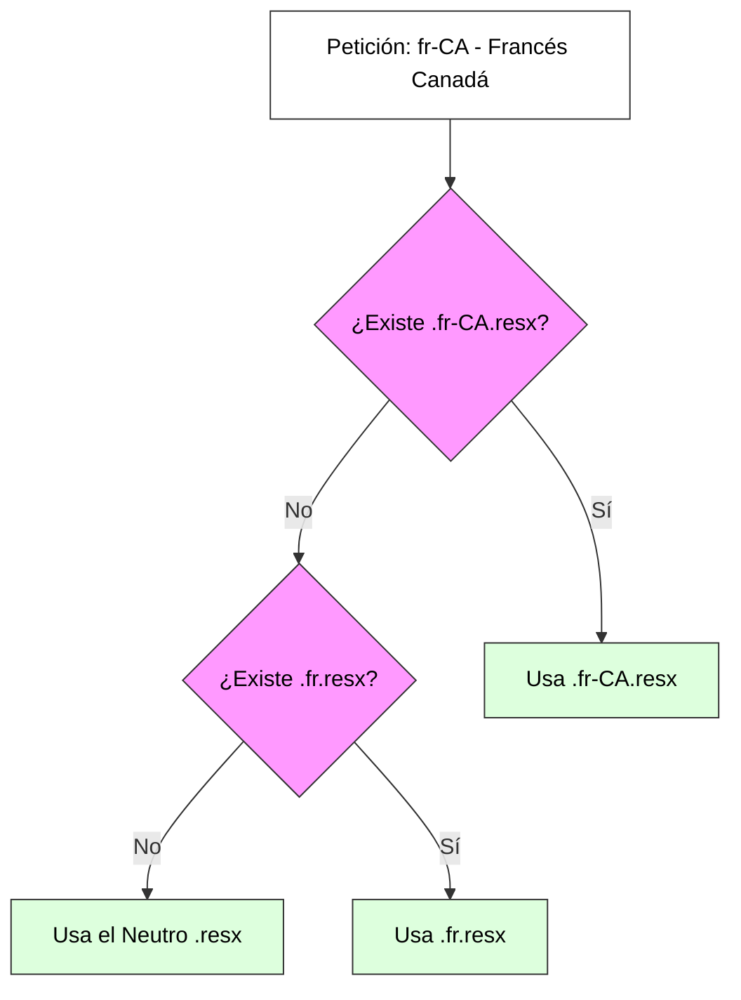
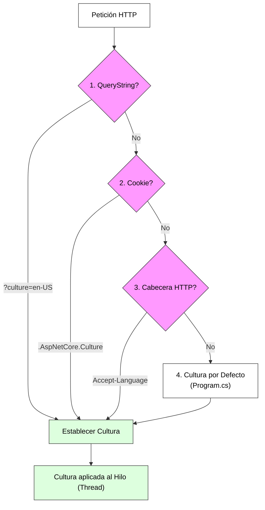

# 6. Internacionalización (I18n) y Localización

## Índice

- [6. Internacionalización (I18n) y Localización](#6-internacionalización-i18n-y-localización)
  - [Índice](#índice)
  - [6.1. Conceptos Fundamentales: Globalización vs Localización](#61-conceptos-fundamentales-globalización-vs-localización)
  - [6.2. Infraestructura de Recursos (.resx)](#62-infraestructura-de-recursos-resx)
    - [6.2.1. Tipos de Recursos y Organización](#621-tipos-de-recursos-y-organización)
    - [6.2.2. Anatomía y Creación de Ficheros .resx](#622-anatomía-y-creación-de-ficheros-resx)
    - [6.2.3. Reglas de Nomenclatura (Naming Conventions)](#623-reglas-de-nomenclatura-naming-conventions)
    - [6.2.4. Definición de un Recurso Paso a Paso](#624-definición-de-un-recurso-paso-a-paso)
    - [6.2.5. Ejemplo Completo: Simetría de Archivos .resx](#625-ejemplo-completo-simetría-de-archivos-resx)
    - [6.2.6. El Patrón SharedResource: Traducciones Globales](#626-el-patrón-sharedresource-traducciones-globales)
  - [6.3. Configuración del Pipeline en .NET 10](#63-configuración-del-pipeline-en-net-10)
    - [6.3.1. Flujo de Detección de Cultura: El Sistema de Prioridades](#631-flujo-de-detección-de-cultura-el-sistema-de-prioridades)
    - [6.3.2. Configuración en Program.cs](#632-configuración-en-programcs)
  - [6.4. Implementación en la Capa de Presentación](#64-implementación-en-la-capa-de-presentación)
    - [6.4.1. Localización en Vistas (.cshtml)](#641-localización-en-vistas-cshtml)
    - [6.4.2. Localización en Lógica: MVC vs Razor Pages](#642-localización-en-lógica-mvc-vs-razor-pages)
    - [6.4.3. Localización de DataAnnotations (Validaciones)](#643-localización-de-dataannotations-validaciones)
    - [6.4.4. Localización en JavaScript (Puente C# -\> JS)](#644-localización-en-javascript-puente-c---js)
    - [6.4.5. Localización de Enums (Desplegables)](#645-localización-de-enums-desplegables)
  - [6.5. Formatos Culturales y Detección Dinámica](#65-formatos-culturales-y-detección-dinámica)
    - [6.5.1. Comparativa de Formatos](#651-comparativa-de-formatos)
    - [6.5.2. Selector de Idioma (Cookie Provider)](#652-selector-de-idioma-cookie-provider)
    - [6.5.3. SEO: Localización en la URL (Route Localization)](#653-seo-localización-en-la-url-route-localization)
  - [6.6. Estrategias de Calidad y Testing](#66-estrategias-de-calidad-y-testing)
  - [6.7. Resumen](#67-resumen)

---

## 6.1. Conceptos Fundamentales: Globalización vs Localización

Desarrollar una aplicación para un solo mercado es limitarse. .NET proporciona un motor de globalización de primer nivel para que nuestra app hable el idioma del usuario.

*   **Globalización (G11n)**: El proceso de diseñar una app que soporte diferentes culturas sin cambios de código.
*   **Internacionalización (I18n)**: Similar a la anterior, preparar el terreno técnico.
*   **Localización (L10n)**: El proceso de adaptar la app globalizada a una cultura específica (traducciones, formatos de fecha, moneda).

🎓 **Analogía del Profesor**:
> Imagina que tu aplicación es un **Camaleón**. La **Internacionalización** es darle al camaleón la capacidad biológica de cambiar de color. La **Localización** es el entorno (la selva verde o el desierto marrón) que hace que el camaleón adopte un color específico para mimetizarse.

---

## 6.2. Infraestructura de Recursos (.resx)

Los archivos `.resx` son archivos XML que actúan como contenedores de cadenas de texto (strings), indexados por una "Clave".

### 6.2.1. Tipos de Recursos y Organización

Existen dos estrategias para organizar las traducciones:

1.  **Recursos por Clase (Específicos)**: Un archivo `.resx` por cada controlador o página (ej: `Controllers.HomeController.en.resx`).
2.  **Recursos Compartidos (Recomendado)**: Centralizar textos comunes en archivos compartidos (ej: `SharedResource.resx`).

**Estructura Profesional de Carpetas:**
```text
Resources/
├── SharedResource.resx      <-- Inglés (Neutral/Fallback)
├── SharedResource.es.resx   <-- Español (España)
├── Models/
│   └── FunkoInput.es.resx   <-- Validaciones específicas
└── Controllers/
    └── Home.es.resx
```

### 6.2.2. Anatomía y Creación de Ficheros .resx

Un archivo `.resx` es en realidad un archivo **XML** que el compilador transforma en código binario.

**Visualización del Editor de Recursos:**

| Nombre (Clave)   | Valor (Traducción)               | Comentario (Contexto) |
| :--------------- | :------------------------------- | :-------------------- |
| `Btn_Aceptar`    | Aceptar                          | Botón de confirmación |
| `Msg_ErrorLogin` | Usuario o contraseña incorrectos | Alerta en login       |

**Estructura Interna (Fragmento XML):**
```xml
<data name="Btn_Aceptar" xml:space="preserve">
  <value>Aceptar</value>
  <comment>Texto para el botón de confirmación</comment>
</data>
```

### 6.2.3. Reglas de Nomenclatura (Naming Conventions)

.NET busca los archivos siguiendo un patrón de "Herencia de Cultura".

**Jerarquía de Búsqueda:**



### 6.2.4. Definición de un Recurso Paso a Paso

1.  **Elegir una Clave (Name)**: Única y en PascalCase (ej: `Welcome_Message`).
2.  **Escribir el Valor (Value)**: El texto visible. Puede incluir parámetros `{0}`.
3.  **Comentario**: Contexto para traductores.

### 6.2.5. Ejemplo Completo: Simetría de Archivos .resx

**1. Archivo Neutro (Fallback): `SharedResource.resx`**
```xml
<root>
  <data name="Msg_Bienvenida"><value>Welcome to Funko World!</value></data>
  <data name="Carrito_Contador"><value>You have {0} items in your cart.</value></data>
</root>
```

**2. Archivo Español: `SharedResource.es.resx`**
```xml
<root>
  <data name="Msg_Bienvenida"><value>¡Bienvenido a Funko World!</value></data>
  <data name="Carrito_Contador"><value>Tienes {0} productos en tu carrito.</value></data>
</root>
```

**3. Archivo Inglés: `SharedResource.en.resx`**
```xml
<root>
  <data name="Msg_Bienvenida"><value>Hello! Welcome to Funko World.</value></data>
  <data name="Carrito_Contador"><value>There are {0} items in your basket.</value></data>
</root>
```

### 6.2.6. El Patrón SharedResource: Traducciones Globales

Repetir la palabra "Aceptar" en 50 archivos de recursos específicos es un error de mantenimiento. La solución profesional es el **Patrón SharedResource**.

**1. La Clase Marcadora**: Creamos una clase vacía en la raíz del proyecto o en una carpeta específica. Su único propósito es servir de "ancla" para los recursos.
```csharp
namespace MiApp;

// Clase vacía que actúa como clave para el localizador
public class SharedResource { }
```

**2. El Archivo de Recursos**: Creamos un archivo llamado `SharedResource.es.resx` en la carpeta `Resources/`. .NET unirá automáticamente la clase con el archivo por el nombre.

🎓 **Analogía del Profesor**:
> El Patrón SharedResource es como un **Diccionario General**. En lugar de que cada habitación de una casa tenga su propio diccionario, ponemos uno grande en el salón (SharedResource) que todos pueden consultar para las palabras comunes. Solo si una habitación necesita una palabra muy técnica, tendrá su propio glosario.

---

## 6.3. Configuración del Pipeline en .NET 10

### 6.3.1. Flujo de Detección de Cultura: El Sistema de Prioridades

Cuando llega una petición HTTP, el Middleware de Localización debe decidir qué idioma mostrar. No lo hace al azar, sino siguiendo una jerarquía estricta de proveedores. En cuanto un proveedor devuelve una cultura válida, el sistema se detiene.



**Los Tres Pilares de Detección:**
1.  **QueryStringProvider**: El más fuerte. Permite forzar el idioma mediante la URL (útil para pruebas).
2.  **CookieRequestCultureProvider**: El más persistente. Recuerda la elección del usuario en futuras visitas.
3.  **AcceptLanguageHeaderRequestCultureProvider**: El más inteligente. Lee la configuración regional del sistema operativo del usuario.

---

### 6.3.2. Configuración en Program.cs

```csharp
var supportedCultures = new[] { "es-ES", "en-US" };
var localizationOptions = new RequestLocalizationOptions()
    .SetDefaultCulture(supportedCultures[0])
    .AddSupportedCultures(supportedCultures)
    .AddSupportedUICultures(supportedCultures);

builder.Services.AddLocalization(options => options.ResourcesPath = "Resources");

builder.Services.AddControllersWithViews()
    .AddViewLocalization()
    .AddDataAnnotationsLocalization(options => {
        options.DataAnnotationLocalizerProvider = (type, factory) =>
            factory.Create(typeof(SharedResource));
    });

var app = builder.Build();
app.UseRequestLocalization(localizationOptions);
```

---

## 6.4. Implementación en la Capa de Presentación

### 6.4.1. Localización en Vistas (.cshtml)

```cshtml
@inject IViewLocalizer Localizer
<h1>@Localizer["Menu_Inicio"]</h1>
```

### 6.4.2. Localización en Lógica: MVC vs Razor Pages

Para acceder a las traducciones desde el código C#, inyectamos el servicio de localización. Debemos distinguir entre el localizador de strings puros y el de HTML (que evita el encoding).

| Herramienta          | Resultado         | Uso Ideal                                                   |
| :------------------- | :---------------- | :---------------------------------------------------------- |
| **IStringLocalizer** | `LocalizedString` | Mensajes de log, títulos, alertas de texto.                 |
| **IHtmlLocalizer**   | `HtmlString`      | Textos que contienen etiquetas HTML (ej: `<b>¡Éxito!</b>`). |

**Ejemplo de Simetría Tecnológica:**

*   **En MVC (Controller)**:
    ```csharp
    public class HomeController(IStringLocalizer<SharedResource> L) : Controller 
    {
        public IActionResult Index() {
            ViewData["Message"] = L["Bienvenida_Mensaje"];
            return View();
        }
    }
    ```

*   **En Razor Pages (PageModel)**:
    ```csharp
    public class IndexModel(IStringLocalizer<SharedResource> L) : PageModel 
    {
        public string Mensaje { get; set; } = string.Empty;
        
        public void OnGet() {
            Mensaje = L["Bienvenida_Mensaje"];
        }
    }
    ```

📝 **Nota del Profesor**: 
> Si usas `IStringLocalizer` y tu traducción tiene HTML (como `<strong>Hola</strong>`), el navegador mostrará las etiquetas como texto literal. Si quieres que el texto salga en negrita, debes usar `IHtmlLocalizer` o el helper `@Html.Raw()`).

---

### 6.4.3. Localización de DataAnnotations (Validaciones)

```csharp
public class FunkoInput {
    [Required(ErrorMessage = "CampoRequerido")]
    public string Nombre { get; set; } = string.Empty;
}
```

### 6.4.4. Localización en JavaScript (Puente C# -> JS)

JavaScript no lee recursos del servidor. Debemos "puentearlos".

**En la Vista (.cshtml):**
```cshtml
<script>
    window.Translations = {
        ConfirmarBorrado: "@L["Js_ConfirmarBorrado"]"
    };
</script>
```

**En JS externo (.js):**
```javascript
if (confirm(window.Translations.ConfirmarBorrado)) { ... }
```

### 6.4.5. Localización de Enums (Desplegables)

```csharp
public enum Categoria {
    [Display(Name = "Enum_Cine", ResourceType = typeof(SharedResource))]
    Cine
}
```

---

## 6.5. Formatos Culturales y Detección Dinámica

### 6.5.1. Comparativa de Formatos

| Concepto      | es-ES (España) | en-US (EEUU) |
| :------------ | :------------- | :----------- |
| **Decimales** | `1.234,50`     | `1,234.50`   |
| **Moneda**    | `10,00 €`      | `$10.00`     |

### 6.5.2. Selector de Idioma (Cookie Provider)

```csharp
[HttpPost]
public IActionResult SetLanguage(string culture, string returnUrl) {
    Response.Cookies.Append(
        CookieRequestCultureProvider.DefaultCookieName,
        CookieRequestCultureProvider.MakeCookieValue(new RequestCulture(culture)),
        new CookieOptions { Expires = DateTimeOffset.UtcNow.AddYears(1) }
    );
    return LocalRedirect(returnUrl);
}
```

### 6.5.3. SEO: Localización en la URL (Route Localization)

```csharp
app.MapControllerRoute(
    name: "localized",
    pattern: "{culture}/{controller=Home}/{action=Index}/{id?}");
```

---

## 6.6. Estrategias de Calidad y Testing

1.  **Cultura de Test**: Prueba tu app en un idioma que no entiendas para detectar textos olvidados.
2.  **Unit Tests de Recursos**:
```csharp
[Fact]
public void Resources_ShouldHaveSameKeys() {
    // Comprobar que SharedResource.es tiene las mismas claves que SharedResource.en
}
```

---

## 6.7. Resumen

1.  **Centraliza**: Usa recursos compartidos.
2.  **Middleware primero**: Crucial en el pipeline.
3.  **Puente JS**: No intentes leer `.resx` desde JS.
4.  **SEO**: Usa rutas localizadas para el mundo real.

🎓 **Veredicto del Profesor**:
> Un desarrollador que domina la localización es un desarrollador que piensa en global. No dejes las traducciones para el final; el coste de refactorización es 10 veces mayor que hacerlo bien desde el primer día.

---