# 7. Blazor y Blazor Server: Interactividad sin JavaScript

## Índice

- [7. Blazor y Blazor Server: Interactividad sin JavaScript](#7-blazor-y-blazor-server-interactividad-sin-javascript)
  - [Índice](#índice)
  - [7.1. Clarificación Tecnológica: Razor vs Blazor](#71-clarificación-tecnológica-razor-vs-blazor)
    - [7.1.1. Razor (.cshtml): Motor de plantillas estático (SSR Puro)](#711-razor-cshtml-motor-de-plantillas-estático-ssr-puro)
    - [7.1.2. Blazor Framework: Componentes Interactivos](#712-blazor-framework-componentes-interactivos)
    - [7.1.3. La Evolución de Blazor (.NET 10): El Modelo Unificado](#713-la-evolución-de-blazor-net-10-el-modelo-unificado)
    - [7.1.4. Criterios de decisión: ¿Cuándo usar Blazor?](#714-criterios-de-decisión-cuándo-usar-blazor)
      - [7.1.1.1. Generación HTML en servidor](#7111-generación-html-en-servidor)
      - [7.1.1.2. Sin estado entre peticiones](#7112-sin-estado-entre-peticiones)
      - [7.1.1.3. Cada interacción = nueva petición HTTP](#7113-cada-interacción--nueva-petición-http)
    - [7.1.2. Blazor Framework: Sistema de componentes interactivos con estado persistente](#712-blazor-framework-sistema-de-componentes-interactivos-con-estado-persistente)
      - [7.1.2.1. Componentes reutilizables (.razor)](#7121-componentes-reutilizables-razor)
      - [7.1.2.2. Estado persistente durante la sesión](#7122-estado-persistente-durante-la-sesión)
      - [7.1.2.3. Actualización parcial del DOM](#7123-actualización-parcial-del-dom)
    - [7.1.3. Diferencias Clave: Blazor Server (SignalR) vs Blazor WebAssembly (WASM)](#713-diferencias-clave-blazor-server-signalr-vs-blazor-webassembly-wasm)
      - [7.1.3.1. Blazor Server: Ejecución en servidor, comunicación vía SignalR](#7131-blazor-server-ejecución-en-servidor-comunicación-vía-signalr)
      - [7.1.3.2. Blazor WASM: Ejecución en cliente, descarga del runtime .NET](#7132-blazor-wasm-ejecución-en-cliente-descarga-del-runtime-net)
      - [7.1.3.3. Tabla comparativa: Latencia, escalabilidad, offline, seguridad](#7133-tabla-comparativa-latencia-escalabilidad-offline-seguridad)
    - [7.1.4. Criterios de decisión: ¿Cuándo usar Blazor?](#714-criterios-de-decisión-cuándo-usar-blazor-1)
      - [7.1.4.1. Ventajas de Blazor Server](#7141-ventajas-de-blazor-server)
        - [A. Interactividad rica sin JavaScript](#a-interactividad-rica-sin-javascript)
        - [B. Lógica compleja en C# (compartida con backend)](#b-lógica-compleja-en-c-compartida-con-backend)
        - [C. Acceso directo a servicios del servidor](#c-acceso-directo-a-servicios-del-servidor)
        - [D. Desarrollo rápido de SPAs con .NET](#d-desarrollo-rápido-de-spas-con-net)
      - [7.1.4.2. Limitaciones de Blazor Server](#7142-limitaciones-de-blazor-server)
        - [A. Escalabilidad: Cada usuario = circuito SignalR activo](#a-escalabilidad-cada-usuario--circuito-signalr-activo)
        - [B. Latencia: Dependiente de la velocidad de la conexión](#b-latencia-dependiente-de-la-velocidad-de-la-conexión)
        - [C. Requisito de conexión persistente (problemas con móviles)](#c-requisito-de-conexión-persistente-problemas-con-móviles)
        - [D. Consumo de memoria en servidor por cada sesión](#d-consumo-de-memoria-en-servidor-por-cada-sesión)
      - [7.1.4.3. Casos de uso ideales para cada tecnología: Guía de Decisión](#7143-casos-de-uso-ideales-para-cada-tecnología-guía-de-decisión)
        - [A. MVC y Razor Pages: El estándar para la Web Pública](#a-mvc-y-razor-pages-el-estándar-para-la-web-pública)
        - [B. Blazor Server (Interactive Server): Aplicaciones de Gestión](#b-blazor-server-interactive-server-aplicaciones-de-gestión)
        - [C. Blazor WebAssembly (Interactive WASM): Aplicaciones Cliente-Céntricas](#c-blazor-webassembly-interactive-wasm-aplicaciones-cliente-céntricas)
        - [D. Blazor Auto (El Modelo Unificado de .NET 10)](#d-blazor-auto-el-modelo-unificado-de-net-10)
      - [Tabla de Decisión Rápida](#tabla-de-decisión-rápida)
      - [Tabla resumen de decisión:](#tabla-resumen-de-decisión)
  - [7.2. Convivencia e Hibridación (Empotrar Blazor en MVC)](#72-convivencia-e-hibridación-empotrar-blazor-en-mvc)
    - [7.2.1. Configuración de Blazor en un proyecto MVC](#721-configuración-de-blazor-en-un-proyecto-mvc)
      - [7.2.1.1. Instalación de servicios en Program.cs](#7211-instalación-de-servicios-en-programcs)
      - [7.2.1.2. Referencia al script de Blazor en \_Layout.cshtml](#7212-referencia-al-script-de-blazor-en-_layoutcshtml)
    - [7.2.2. Inyección de Componentes: Tag Helper ](#722-inyección-de-componentes-tag-helper-)
      - [7.2.2.1. Sintaxis del tag helper component](#7221-sintaxis-del-tag-helper-component)
      - [7.2.2.2. El Ecosistema de Render Modes en .NET 10](#7222-el-ecosistema-de-render-modes-en-net-10)
        - [A. Static SSR (Static Server-Side Rendering)](#a-static-ssr-static-server-side-rendering)
        - [B. Interactive Server (Blazor Server)](#b-interactive-server-blazor-server)
        - [C. Interactive WebAssembly (WASM)](#c-interactive-webassembly-wasm)
        - [D. Interactive Auto (El Modelo Inteligente)](#d-interactive-auto-el-modelo-inteligente)
        - [E. La importancia de la Hidratación](#e-la-importancia-de-la-hidratación)
  - [7.3. Fundamentos de la Reactividad en Blazor](#73-fundamentos-de-la-reactividad-en-blazor)
    - [7.3.1. Estado del Componente y Ciclo de Vida](#731-estado-del-componente-y-ciclo-de-vida)
      - [7.3.1.1. Métodos del ciclo de vida: OnInitialized, OnParametersSet, OnAfterRender](#7311-métodos-del-ciclo-de-vida-oninitialized-onparametersset-onafterrender)
        - [1. OnInitialized / Async](#1-oninitialized--async)
        - [2. OnParametersSet / Async](#2-onparametersset--async)
        - [3. OnAfterRender / Async](#3-onafterrender--async)
        - [4. IDisposable / Dispose](#4-idisposable--dispose)
      - [7.3.1.2. StateHasChanged(): Forzar re-renderizado](#7312-statehaschanged-forzar-re-renderizado)
        - [Cuándo usar StateHasChanged(): Guía de Decisión](#cuándo-usar-statehaschanged-guía-de-decisión)
      - [7.3.1.3. IDisposable para limpieza de recursos](#7313-idisposable-para-limpieza-de-recursos)
    - [7.3.2. Manejo de Eventos en tiempo real](#732-manejo-de-eventos-en-tiempo-real)
      - [7.3.2.1. Eventos de ratón: @onclick, @ondblclick](#7321-eventos-de-ratón-onclick-ondblclick)
      - [7.3.2.2. Eventos de teclado: @onkeydown, @onkeyup](#7322-eventos-de-teclado-onkeydown-onkeyup)
      - [7.3.2.3. Eventos de formulario: @onsubmit, @oninput, @onchange](#7323-eventos-de-formulario-onsubmit-oninput-onchange)
      - [7.3.2.4. EventCallback y EventCallback para comunicación entre componentes](#7324-eventcallback-y-eventcallback-para-comunicación-entre-componentes)
        - [Resumen de EventCallback vs EventCallback](#resumen-de-eventcallback-vs-eventcallback)
    - [7.3.3. Data Binding: El flujo de datos](#733-data-binding-el-flujo-de-datos)
      - [7.3.3.1. Binding unidireccional: value="@variable"](#7331-binding-unidireccional-valuevariable)
      - [7.3.3.2. Binding bidireccional: @bind="variable"](#7332-binding-bidireccional-bindvariable)
      - [7.3.3.3. @bind con eventos personalizados: @bind-value y @bind-value: event](#7333-bind-con-eventos-personalizados-bind-value-y-bind-value-event)
        - [Resumen de Estrategias de Data Binding](#resumen-de-estrategias-de-data-binding)
    - [7.3.4. Lógica Visual y Directivas Razor](#734-lógica-visual-y-directivas-razor)
      - [7.3.4.1. Directivas condicionales: @if, @else if, @else](#7341-directivas-condicionales-if-else-if-else)
      - [7.3.4.2. Bucles: @foreach con @key para optimización](#7342-bucles-foreach-con-key-para-optimización)
      - [7.3.4.3. @switch para múltiples casos](#7343-switch-para-múltiples-casos)
      - [7.3.5. Formularios y Validación Reactiva](#735-formularios-y-validación-reactiva)
        - [A. Comparativa: form (MVC) vs EditForm (Blazor)](#a-comparativa-form-mvc-vs-editform-blazor)
        - [B. Componentes del Ecosistema EditForm](#b-componentes-del-ecosistema-editform)
        - [C. Ejemplo: Formulario Profesional de Registro](#c-ejemplo-formulario-profesional-de-registro)
  - [7.4. Caso Práctico: To-Do List Reactivo con Notas y Prioridades](#74-caso-práctico-to-do-list-reactivo-con-notas-y-prioridades)
    - [7.4.1. Definición del Dominio](#741-definición-del-dominio)
      - [7.4.1.1. Modelo de dominio NotaTodo](#7411-modelo-de-dominio-notatodo)
      - [7.4.1.2. InputModel para creación: CrearNotaInputModel](#7412-inputmodel-para-creación-crearnotainputmodel)
    - [7.4.2. Servicio con Estado (Scoped)](#742-servicio-con-estado-scoped)
      - [7.4.2.1. Definición de la interfaz ITodoService](#7421-definición-de-la-interfaz-itodoservice)
      - [7.4.2.2. Implementación con Dictionary\<Guid, NotaTodo\> en memoria](#7422-implementación-con-dictionaryguid-notatodo-en-memoria)
      - [7.4.2.3. Registro del servicio en Program.cs](#7423-registro-del-servicio-en-programcs)
        - [Comparativa de Lifetimes (Ciclos de Vida) en Blazor Server](#comparativa-de-lifetimes-ciclos-de-vida-en-blazor-server)
    - [7.4.3. Anatomía del Componente .razor](#743-anatomía-del-componente-razor)
      - [7.4.3.1. Sección de marcado HTML](#7431-sección-de-marcado-html)
      - [7.4.3.2. Bloque @code con lógica del componente](#7432-bloque-code-con-lógica-del-componente)
    - [7.4.4. Interactividad pura en C#](#744-interactividad-pura-en-c)
      - [7.4.4.1. Estado en el servidor: Cómo la lista "vive" en la sesión del circuito](#7441-estado-en-el-servidor-cómo-la-lista-vive-en-la-sesión-del-circuito)
        - [El Viaje de una Actualización (Paso a Paso)](#el-viaje-de-una-actualización-paso-a-paso)
      - [7.4.4.2. Eventos reactivos: Añadir y borrar elementos sin refresco de página](#7442-eventos-reactivos-añadir-y-borrar-elementos-sin-refresco-de-página)
      - [7.4.4.3. Funcionalidad de búsqueda en tiempo real](#7443-funcionalidad-de-búsqueda-en-tiempo-real)
      - [7.4.4.4. Ordenación automática por prioridad](#7444-ordenación-automática-por-prioridad)
    - [7.4.5. Integración en página Razor MVC](#745-integración-en-página-razor-mvc)
      - [7.4.5.1. Creación de TodoList.cshtml en Views/Todo](#7451-creación-de-todolistcshtml-en-viewstodo)
      - [7.4.5.2. Inyección del componente Blazor](#7452-inyección-del-componente-blazor)
      - [7.4.5.3. Controlador TodoController con acción Index](#7453-controlador-todocontroller-con-acción-index)
    - [7.4.6. Eficiencia: El protocolo SignalR](#746-eficiencia-el-protocolo-signalr)
      - [7.4.6.1. Cómo funciona el protocolo SignalR](#7461-cómo-funciona-el-protocolo-signalr)
        - [Anatomía del Mensaje Binario (BlazorPack)](#anatomía-del-mensaje-binario-blazorpack)
      - [7.4.6.2. Diff del DOM virtual](#7462-diff-del-dom-virtual)
      - [7.4.6.3. Demostración con herramientas de desarrollo](#7463-demostración-con-herramientas-de-desarrollo)
  - [7.5. Resiliencia: Gestión de Errores con ErrorBoundary](#75-resiliencia-gestión-de-errores-con-errorboundary)
      - [¿Cómo funciona?](#cómo-funciona)
    - [7.5.2. Integración de Blazor en Razor Pages](#752-integración-de-blazor-en-razor-pages)
      - [A. Registro en Program.cs](#a-registro-en-programcs)
      - [B. Uso en una Página (.cshtml)](#b-uso-en-una-página-cshtml)
      - [C. Simetría y Diferencias Clave](#c-simetría-y-diferencias-clave)
      - [7.5.3. Navegación Programática y JS Interop](#753-navegación-programática-y-js-interop)
        - [A. NavigationManager: El Redirect de Blazor](#a-navigationmanager-el-redirect-de-blazor)
        - [B. JS Interop: El puente con el navegador](#b-js-interop-el-puente-con-el-navegador)
  - [7.6. Resumen](#76-resumen)
    - [7.6.1. Clarificación Tecnológica](#761-clarificación-tecnológica)
    - [7.6.2. Convivencia e Hibridación](#762-convivencia-e-hibridación)
    - [7.6.3. Fundamentos de la Reactividad](#763-fundamentos-de-la-reactividad)
    - [7.6.4. Caso Práctico y Eficiencia](#764-caso-práctico-y-eficiencia)
    - [7.6.5. Guía de Selección y Conclusiones](#765-guía-de-selección-y-conclusiones)
      - [Tabla de Decisión Final](#tabla-de-decisión-final)
      - [Ventajas Clave de la Ecosistema Blazor](#ventajas-clave-de-la-ecosistema-blazor)


---


## 7.1. Clarificación Tecnológica: Razor vs Blazor

Antes de profundizar en Blazor, es crucial entender las diferencias fundamentales entre **Razor Pages/MVC** y **Blazor**, ya que ambos utilizan archivos con sintaxis similar pero tienen arquitecturas y comportamientos muy distintos.

### 7.1.1. Razor (.cshtml): Motor de plantillas estático (SSR Puro)

Es el modelo tradicional de "Página por Petición".

- **Generación HTML en servidor**: El servidor procesa el archivo `.cshtml`, genera un string HTML gigante y lo envía al navegador.
- **Sin estado entre peticiones**: Cada vez que haces clic en un enlace, el navegador "muere" y nace de nuevo con la siguiente página.
- **Carga completa**: Cada interacción implica descargar de nuevo todo el layout, CSS y JS.

### 7.1.2. Blazor Framework: Componentes Interactivos

Blazor transforma la web en una **aplicación real** que vive en el navegador sin recargas constantes.

- **Componentes reutilizables (.razor)**: Se definen piezas de UI (botones, listas, formularios) que se comportan como objetos C#.
- **Estado persistente**: El componente mantiene sus variables vivas mientras el usuario interactúa con él.
- **Actualización parcial (DOM Diffing)**: Si solo cambia un número en una lista, Blazor solo envía el cambio de ese número, no toda la página.

### 7.1.3. La Evolución de Blazor (.NET 10): El Modelo Unificado

En .NET 10, ya no elegimos estrictamente entre "Server" o "WebAssembly" al crear el proyecto. Usamos el **Blazor Web App**, que nos permite decidir el **Render Mode** componente por componente.

| Modo de Renderizado         | ¿Dónde se ejecuta? | Características                                      |
| :-------------------------- | :----------------- | :--------------------------------------------------- |
| **Static SSR**              | Servidor           | Como Razor Pages. Sin interactividad JS.             |
| **Interactive Server**      | Servidor (SignalR) | **Blazor Server**. Muy rápido de arrancar.           |
| **Interactive WebAssembly** | Cliente (WASM)     | **Blazor WASM**. Funciona offline.                   |
| **Interactive Auto**        | Mixto              | Arranca en Server y se pasa a WASM en segundo plano. |

🎓 **Analogía del Profesor**:
> Imagina una **Obra de Teatro** (Razor Pages) vs un **Videojuego** (Blazor). En la obra, el escenario cambia por completo entre actos (recarga de página). En el videojuego, tú te mueves libremente y solo cambian los elementos que tocas, mientras el mundo sigue vivo a tu alrededor.

📝 **Nota del Profesor**:
> Blazor **no es JavaScript**. Es C# ejecutándose en el navegador (vía WebAssembly) o en el servidor enviando instrucciones de UI. Es el paraíso para un desarrollador de .NET porque puedes usar tus mismos DTOs, validadores y lógica en ambos lados del 

---

### 7.1.4. Criterios de decisión: ¿Cuándo usar Blazor?

**Razor** es el motor de plantillas de ASP.NET Core que genera HTML en el servidor y lo envía al cliente como una página completa.

#### 7.1.1.1. Generación HTML en servidor

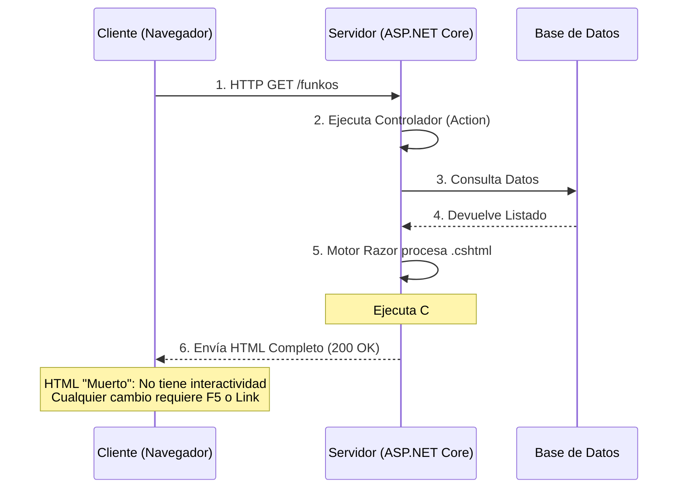

**Ejemplo de vista Razor pura:**

```cshtml
@* Views/Funkos/Index.cshtml *@
@model FunkosIndexViewModel

<div class="container">
    <h1>Catálogo de Funkos</h1>
    
    @* ════════════════════════════════════════════════════════ *@
    @* Este código C# se ejecuta EN EL SERVIDOR una sola vez   *@
    @* ════════════════════════════════════════════════════════ *@
    
    @foreach (var funko in Model.Funkos)
    {
        <div class="card">
            <h5>@funko.Nombre</h5>
            <p>@funko.Precio.ToString("C")</p>
            
            @* Cualquier interacción requiere nueva petición *@
            <a asp-action="Detalle" asp-route-id="@funko.Id">Ver detalles</a>
        </div>
    }
</div>

@* HTML generado final (lo que llega al navegador): 
<div class="container">
    <h1>Catálogo de Funkos</h1>
    <div class="card">
        <h5>Darth Vader</h5>
        <p>24,99 €</p>
        <a href="/Funkos/Detalle/1">Ver detalles</a>
    </div>
    <!-- Más cards...  -->
</div>

NO HAY CÓDIGO C# EN EL HTML FINAL
*@
```

---

#### 7.1.1.2. Sin estado entre peticiones

#### 7.1.1.3. Cada interacción = nueva petición HTTP

```cshtml
@* Ejemplo:  Formulario de búsqueda con Razor puro *@

<form asp-action="Buscar" method="get">
    <input type="text" name="termino" placeholder="Buscar..." />
    <button type="submit">Buscar</button>
</form>

@* ════════════════════════════════════════════════════════ *@
@* FLUJO DE INTERACCIÓN (Petición Completa)                 *@
@* ════════════════════════════════════════════════════════ *@

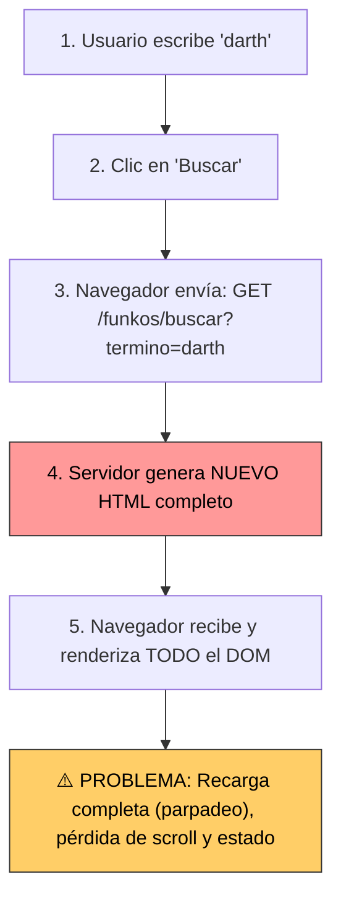

**Comparación de tamaños de respuesta:**

```
Búsqueda tradicional (Razor puro):
    GET /funkos/buscar?termino=darth
    ↓
    RESPUESTA: ~50 KB (HTML completo:  header, navbar, footer, resultados, scripts)

Búsqueda con JavaScript (AJAX):
    GET /api/funkos/buscar?termino=darth
    ↓
    RESPUESTA: ~2 KB (JSON: solo los datos de los resultados)
    Cliente actualiza solo la sección de resultados

Búsqueda con Blazor Server:
    SignalR mensaje: "Buscar 'darth'"
    ↓
    RESPUESTA: ~500 bytes (binario: solo los cambios del DOM)
    Cliente actualiza solo los elementos modificados
```

---

### 7.1.2. Blazor Framework: Sistema de componentes interactivos con estado persistente

**Blazor** es un framework de UI que permite crear componentes web interactivos usando C# en lugar de JavaScript. 

#### 7.1.2.1. Componentes reutilizables (.razor)

```razor
@* Components/FunkoCard.razor *@

@* ════════════════════════════════════════════════════════════ *@
@* COMPONENTE BLAZOR:   Marcado + Lógica en el mismo archivo    *@
@* ════════════════════════════════════════════════════════════ *@

<div class="card @CssClass">
    @if (!  string.IsNullOrEmpty(ImagenUrl))
    {
        
    }
    
    <div class="card-body">
        @if (EsNovedad)
        {
            <span class="badge bg-success">✨ Novedad</span>
        }
        
        <h5 class="card-title">@Nombre</h5>
        <p class="card-text">@Precio.ToString("C")</p>
        
        @* Evento interactivo sin recargar página *@
        <button class="btn btn-primary" @onclick="OnAgregarCarrito">
            <i class="fas fa-cart-plus"></i> Agregar
        </button>
    </div>
</div>

@code {
    // ════════════════════════════════════════════════════════
    // PARÁMETROS DEL COMPONENTE (inputs)
    // ════════════════════════════════════════════════════════
    
    [Parameter]
    public int Id { get; set; }
    
    [Parameter]
    public string Nombre { get; set; } = string.Empty;
    
    [Parameter]
    public decimal Precio { get; set; }
    
    [Parameter]
    public string?   ImagenUrl { get; set; }
    
    [Parameter]
    public bool EsNovedad { get; set; }
    
    [Parameter]
    public EventCallback<int> OnAgregarAlCarrito { get; set; }
    
    // ════════════════════════════════════════════════════════
    // ESTADO INTERNO DEL COMPONENTE
    // ════════════════════════════════════════════════════════
    
    private bool agregando = false;
    
    // ════════════════════════════════════════════════════════
    // PROPIEDADES CALCULADAS
    // ════════════════════════════════════════════════════════
    
    private string CssClass => EsNovedad ? "border-success shadow" : "";
    
    // ════════════════════════════════════════════════════════
    // MÉTODOS DE EVENTOS
    // ════════════════════════════════════════════════════════
    
    private async Task OnAgregarCarrito()
    {
        agregando = true;
        
        // Notificar al componente padre
        await OnAgregarAlCarrito.InvokeAsync(Id);
        
        await Task.Delay(500); // Simular operación
        
        agregando = false;
    }
}
```

**Uso del componente:**

```razor
@* Components/FunkoList.razor *@

<div class="row">
    @foreach (var funko in Funkos)
    {
        <div class="col-md-3">
            @* ════════════════════════════════════════════════ *@
            @* COMPONENTE REUTILIZABLE                          *@
            @* ════════════════════════════════════════════════ *@
            
            <FunkoCard Id="@funko.Id"
                       Nombre="@funko.Nombre"
                       Precio="@funko. Precio"
                       ImagenUrl="@funko.ImagenUrl"
                       EsNovedad="@funko.EsNovedad"
                       OnAgregarAlCarrito="AgregarAlCarrito" />
        </div>
    }
</div>

@code {
    [Parameter]
    public List<FunkoDto> Funkos { get; set; } = new();
    
    private async Task AgregarAlCarrito(int funkoId)
    {
        // Lógica para agregar al carrito
        Console.WriteLine($"Agregando funko {funkoId} al carrito");
    }
}
```

---

#### 7.1.2.2. Estado persistente durante la sesión

```razor
@* Components/Contador.razor *@

<div class="card">
    <div class="card-body text-center">
        <h3>Contador:  @contador</h3>
        
        <div class="btn-group">
            <button class="btn btn-danger" @onclick="Decrementar">
                <i class="fas fa-minus"></i>
            </button>
            <button class="btn btn-secondary" @onclick="Resetear">
                <i class="fas fa-redo"></i>
            </button>
            <button class="btn btn-success" @onclick="Incrementar">
                <i class="fas fa-plus"></i>
            </button>
        </div>
        
        <p class="mt-3 text-muted">
            El contador persiste mientras estés conectado
        </p>
    </div>
</div>

@code {
    // ════════════════════════════════════════════════════════
    // ESTADO DEL COMPONENTE (persiste en el servidor)
    // ════════════════════════════════════════════════════════
    
    private int contador = 0;
    
    // ════════════════════════════════════════════════════════
    // MÉTODOS QUE MODIFICAN EL ESTADO
    // ════════════════════════════════════════════════════════
    
    private void Incrementar()
    {
        contador++;
        // StateHasChanged() se llama automáticamente después del evento
        // El cambio se envía al cliente vía SignalR
    }
    
    private void Decrementar()
    {
        contador--;
    }
    
    private void Resetear()
    {
        contador = 0;
    }
}
```

**Flujo de estado persistente:**

```mermaid
graph TD
    subgraph "BLAZOR SERVER (Stateful)"
        B1["Acción 1: Clic '+'"] --> B2["Servidor: contador 0 -> 1<br/>(Instancia en RAM)"]
        B2 --> B3["SignalR: 'Actualiza <h3> a 1'"]
        B3 --> B4["Cliente: Cambia solo el texto"]
        B4 --> B5["Acción 2: Clic '+'"]
        B5 --> B6["Servidor: contador 1 -> 2<br/>(Mantiene Memoria)"]
        B6 --> B7["SignalR: 'Actualiza <h3> a 2'"]
        style B2 fill:#cfc,color:#000
        style B6 fill:#cfc,color:#000
    end

    subgraph "RAZOR MVC (Stateless)"
        M1["Acción 1: GET /inc"] --> M2["Servidor: crea contador=0 -> 1<br/>(Nace y Muere)"]
        M2 --> M3["Envia HTML completo"]
        M3 --> M4["Acción 2: GET /inc"]
        M4 --> M5["Servidor: RE-CREA contador=0 -> 1<br/>(Olvido total)"]
        style M2 fill:#f99,color:#000
        style M5 fill:#f99,color:#000
    end
```

---

#### 7.1.2.3. Actualización parcial del DOM

```razor
@* Components/ListaDinamica.razor *@

<div class="card">
    <div class="card-header">
        <h5>Lista Dinámica</h5>
    </div>
    
    <div class="card-body">
        <input type="text" 
               class="form-control mb-3" 
               placeholder="Nuevo elemento..." 
               @bind="nuevoElemento" 
               @onkeydown="OnKeyDown" />
        
        <button class="btn btn-primary mb-3" @onclick="Agregar">
            <i class="fas fa-plus"></i> Agregar
        </button>
        
        @* ════════════════════════════════════════════════════ *@
        @* LISTA QUE SE ACTUALIZA PARCIALMENTE                  *@
        @* ════════════════════════════════════════════════════ *@
        
        <ul class="list-group">
            @foreach (var item in elementos)
            {
                <li class="list-group-item d-flex justify-content-between">
                    <span>@item</span>
                    <button class="btn btn-sm btn-danger" 
                            @onclick="() => Eliminar(item)">
                        <i class="fas fa-trash"></i>
                    </button>
                </li>
            }
        </ul>
        
        @if (! elementos.Any())
        {
            <div class="alert alert-info mt-3">
                No hay elementos.   ¡Agrega el primero! 
            </div>
        }
    </div>
</div>

@code {
    private List<string> elementos = new();
    private string nuevoElemento = string.Empty;
    
    private void Agregar()
    {
        if (! string.IsNullOrWhiteSpace(nuevoElemento))
        {
            elementos.Add(nuevoElemento);
            nuevoElemento = string.Empty;
            
            // ════════════════════════════════════════════════
            // BLAZOR ACTUALIZA SOLO LO NECESARIO: 
            // ════════════════════════════════════════════════
            // 1. Calcula el diff del DOM virtual
            // 2. Ve que se añadió un <li> nuevo
            // 3. Envía por SignalR:   "Añade <li> con este HTML"
            // 4. Cliente inserta solo ese <li> en el DOM
            // 
            // ❌ NO RECARGA toda la lista
            // ❌ NO RECARGA toda la página
            // ✅ Solo añade el nuevo elemento
        }
    }
    
    private void Eliminar(string item)
    {
        elementos. Remove(item);
        
        // Blazor envía:  "Elimina el <li> con id X"
        // Cliente solo elimina ese elemento del DOM
    }
    
    private async Task OnKeyDown(KeyboardEventArgs e)
    {
        if (e.Key == "Enter")
        {
            Agregar();
        }
    }
}
```

**Visualización del diff del DOM:**

```html
<!-- DOM INICIAL -->
<ul class="list-group">
    <li class="list-group-item">Elemento 1</li>
    <li class="list-group-item">Elemento 2</li>
</ul>

<!-- Usuario agrega "Elemento 3" -->

<!-- BLAZOR CALCULA EL DIFF -->
Diferencias encontradas:
  - Añadir:  <li class="list-group-item">Elemento 3</li> al final de <ul>

<!-- BLAZOR ENVÍA VÍA SIGNALR -->
Mensaje binario (~100 bytes): 
  "AppendChild en nodo <ul>, HTML:  '<li class=\"list-group-item\">Elemento 3</li>'"

<!-- CLIENTE APLICA EL CAMBIO -->
<ul class="list-group">
    <li class="list-group-item">Elemento 1</li>
    <li class="list-group-item">Elemento 2</li>
    <li class="list-group-item">Elemento 3</li>  ← AÑADIDO
</ul>

<!-- ✅ SOLO SE MODIFICÓ LO NECESARIO -->
<!-- ❌ NO SE RECARGÓ NADA MÁS -->
```

---

### 7.1.3. Diferencias Clave: Blazor Server (SignalR) vs Blazor WebAssembly (WASM)

#### 7.1.3.1. Blazor Server: Ejecución en servidor, comunicación vía SignalR

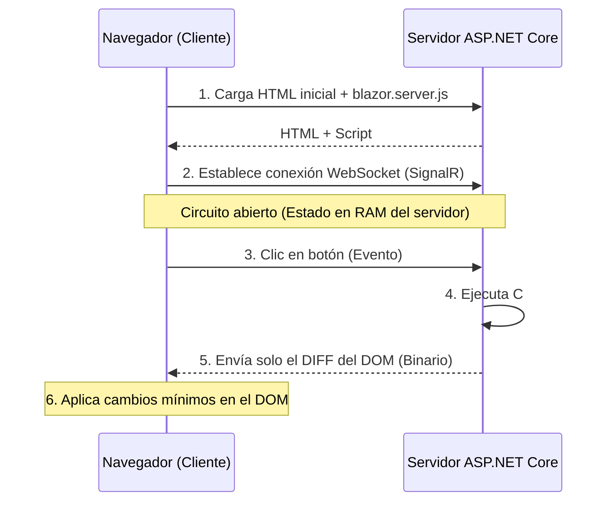

**Ejemplo de mensaje SignalR:**

```json
// Mensaje enviado por SignalR (formato simplificado)
{
  "type": "RenderBatch",
  "edits": [
    {
      "type": "updateText",
      "componentId": 5,
      "elementRef": 12,
      "newText": "42"
    }
  ],
  "referenceFrames": []
}

// Tamaño real:  ~50-200 bytes (binario con MessagePack)
```

---

#### 7.1.3.2. Blazor WASM: Ejecución en cliente, descarga del runtime .NET

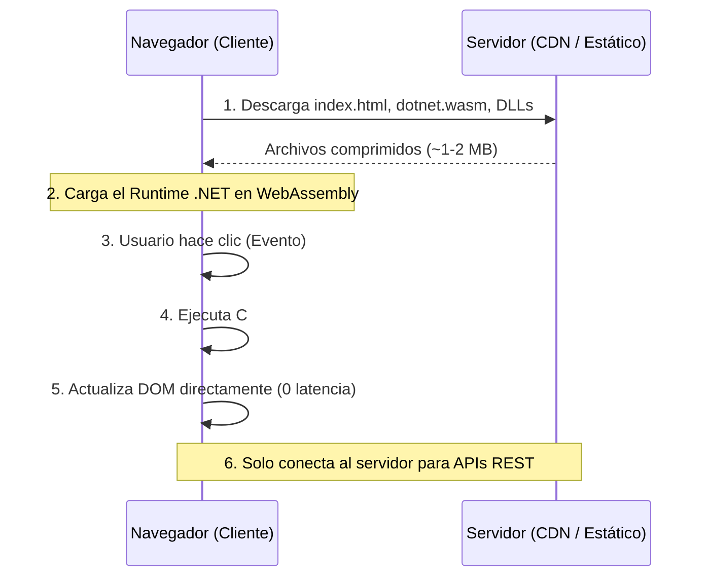

**Tamaños de descarga reales:**

```
BLAZOR SERVER:
  HTML inicial: ~50 KB
  blazor.server.js:  ~200 KB
  TOTAL: ~250 KB
  Tiempo de carga: < 1 segundo

BLAZOR WEBASSEMBLY:
  HTML:  ~10 KB
  blazor.webassembly.js: ~300 KB
  dotnet.wasm (runtime): ~1. 5 MB
  System.*. dll (librerías): ~1-2 MB
  MiApp.dll (tu código): ~100-500 KB
  TOTAL: 2-5 MB (con compresión Brotli:  ~500 KB - 1. 5 MB)
  Tiempo de carga: 3-10 segundos (primera vez)
```

---

#### 7.1.3.3. Tabla comparativa: Latencia, escalabilidad, offline, seguridad

| Aspecto              | **Static SSR** (Razor Pages/MVC) | **Interactive Server** (Blazor Server) | **Interactive WebAssembly** (WASM) | **Interactive Auto** (El Híbrido) |
| :------------------- | :------------------------------- | :------------------------------------- | :--------------------------------- | :-------------------------------- |
| **Ejecución**        | 🖥️ Servidor                       | 🖥️ Servidor (SignalR)                   | 💻 Cliente (Navegador)              | 🔄 Mixto (Servidor -> Cliente)     |
| **Interactividad**   | ❌ Nula (solo links/forms)        | ✅ Alta (C# en tiempo real)             | ✅ Máxima (Local)                   | ✅ Alta (en ambos lados)           |
| **Descarga inicial** | ✅ Mínima (~50 KB)                | ✅ Pequeña (~250 KB)                    | ⚠️ Grande (2-5 MB)                  | ⚠️ Grande (en 2º plano)            |
| **Tiempo de carga**  | ✅ Instantáneo                    | ✅ Instantáneo                          | 🐢 Lento (primera vez)              | 🚀 Rápido (arranca en Server)      |
| **Offline**          | ❌ No                             | ❌ No                                   | ✅ Sí (PWA)                         | ✅ Sí (tras descarga inicial)      |
| **Escalabilidad**    | ✅ Muy Alta (Sin estado)          | ⚠️ Limitada (RAM/Circuito)              | ✅ Infinita (Estático)              | ⚠️/✅ Evoluciona a Alta             |
| **Seguridad Código** | ✅ Código oculto                  | ✅ Código oculto                        | ❌ Código visible (DLLs)            | ❌ Lógica de cliente visible       |
| **Ideal para...**    | SEO, Blogs, Webs Públicas        | Dashboards, CRMs, Intranets            | Apps Offline, Juegos Web           | La mejor UX (complejo)            |

📝 **Nota del Profesor**:
> El modo **Interactive Auto** es la joya de la corona de .NET 10. Combina lo mejor de dos mundos: la rapidez de arranque del servidor y la fluidez de ejecución local del navegador. Sin embargo, requiere que programes tus componentes pensando que pueden ejecutarse en ambos sitios, lo que obliga a usar APIs REST para los datos.

---

### 7.1.4. Criterios de decisión: ¿Cuándo usar Blazor?

#### 7.1.4.1. Ventajas de Blazor Server

##### A. Interactividad rica sin JavaScript

```razor
@* Ejemplo: Calculadora interactiva SIN JAVASCRIPT *@
@* Components/Calculadora.razor *@

<div class="card">
    <div class="card-body">
        <h3 class="text-center mb-4">@resultado</h3>
        
        <div class="row g-2">
            @foreach (var numero in new[] { 7, 8, 9, 4, 5, 6, 1, 2, 3, 0 })
            {
                <div class="col-3">
                    <button class="btn btn-outline-secondary w-100" 
                            @onclick="() => AgregarNumero(numero)">
                        @numero
                    </button>
                </div>
            }
            
            <div class="col-3">
                <button class="btn btn-primary w-100" @onclick="Sumar">+</button>
            </div>
            <div class="col-3">
                <button class="btn btn-primary w-100" @onclick="Restar">-</button>
            </div>
            <div class="col-3">
                <button class="btn btn-success w-100" @onclick="Calcular">=</button>
            </div>
            <div class="col-3">
                <button class="btn btn-danger w-100" @onclick="Limpiar">C</button>
            </div>
        </div>
    </div>
</div>

@code {
    private decimal resultado = 0;
    private decimal operando = 0;
    private string operacion = "";
    
    // ════════════════════════════════════════════════════════
    // TODA LA LÓGICA EN C# (sin una línea de JavaScript)
    // ════════════════════════════════════════════════════════
    
    private void AgregarNumero(int numero)
    {
        resultado = resultado * 10 + numero;
    }
    
    private void Sumar()
    {
        operando = resultado;
        resultado = 0;
        operacion = "+";
    }
    
    private void Restar()
    {
        operando = resultado;
        resultado = 0;
        operacion = "-";
    }
    
    private void Calcular()
    {
        resultado = operacion switch
        {
            "+" => operando + resultado,
            "-" => operando - resultado,
            _ => resultado
        };
        operacion = "";
    }
    
    private void Limpiar()
    {
        resultado = 0;
        operando = 0;
        operacion = "";
    }
}

@* ✅ Interacción instantánea *@
@* ✅ Sin escribir JavaScript *@
@* ✅ Lógica reutilizable (misma que en backend) *@
```

##### B. Lógica compleja en C# (compartida con backend)

```csharp
// Services/CalculadoraService.cs (compartido entre Blazor y MVC)
public interface ICalculadoraService
{
    Result<decimal> CalcularPrecioConImpuestos(decimal precioBase, string paisCodigo);
    Result<decimal> AplicarDescuento(decimal precio, int porcentaje, TipoCliente tipoCliente);
}

public class CalculadoraService : ICalculadoraService
{
    // Lógica de negocio compleja compartida
    public Result<decimal> CalcularPrecioConImpuestos(decimal precioBase, string paisCodigo)
    {
        var impuesto = paisCodigo switch
        {
            "ES" => 0.21m, // IVA España
            "FR" => 0.20m, // TVA Francia
            "DE" => 0.19m, // MwSt Alemania
            "US" => 0.00m, // Varía por estado
            _ => 0.00m
        };
        
        return Result. Success(precioBase * (1 + impuesto));
    }
    
    public Result<decimal> AplicarDescuento(decimal precio, int porcentaje, TipoCliente tipoCliente)
    {
        if (porcentaje < 0 || porcentaje > 100)
            return Result. Failure<decimal>("Porcentaje inválido");
        
        // Clientes VIP tienen descuento extra
        var descuentoExtra = tipoCliente == TipoCliente.VIP ? 5 : 0;
        var descuentoTotal = Math.Min(porcentaje + descuentoExtra, 50); // Máximo 50%
        
        return Result.Success(precio * (1 - descuentoTotal / 100m));
    }
}
```

```razor
@* Componente Blazor usa el MISMO servicio *@
@inject ICalculadoraService CalculadoraService

<div>
    <input type="number" @bind="precioBase" />
    <select @bind="paisSeleccionado">
        <option value="ES">España</option>
        <option value="FR">Francia</option>
    </select>
    
    <button @onclick="Calcular">Calcular</button>
    
    @if (! string.IsNullOrEmpty(precioFinal))
    {
        <p>Precio final: @precioFinal</p>
    }
</div>

@code {
    private decimal precioBase;
    private string paisSeleccionado = "ES";
    private string precioFinal = "";
    
    private void Calcular()
    {
        var resultado = CalculadoraService.CalcularPrecioConImpuestos(precioBase, paisSeleccionado);
        
        precioFinal = resultado.IsSuccess 
            ? resultado.Value.ToString("C") 
            : resultado.Error;
    }
}
```

**Ventajas de compartir código:**
- ✅ Misma lógica de validación en cliente y servidor
- ✅ Evita duplicación de código
- ✅ Mantenimiento más fácil (un solo lugar)
- ✅ Tests unitarios se reutilizan

##### C. Acceso directo a servicios del servidor

```razor
@* Components/DashboardVentas.razor *@
@inject IVentasService VentasService
@inject IFunkoService FunkoService
@inject IUsuarioService UsuarioService

<div class="row">
    <div class="col-md-4">
        <div class="card bg-primary text-white">
            <div class="card-body">
                <h3>@ventasHoy</h3>
                <p>Ventas hoy</p>
            </div>
        </div>
    </div>
    
    <div class="col-md-4">
        <div class="card bg-success text-white">
            <div class="card-body">
                <h3>@totalFunkos</h3>
                <p>Total Funkos</p>
            </div>
        </div>
    </div>
    
    <div class="col-md-4">
        <div class="card bg-info text-white">
            <div class="card-body">
                <h3>@usuariosActivos</h3>
                <p>Usuarios activos</p>
            </div>
        </div>
    </div>
</div>

<button class="btn btn-primary mt-3" @onclick="ActualizarDatos">
    <i class="fas fa-sync"></i> Actualizar
</button>

@code {
    private int ventasHoy;
    private int totalFunkos;
    private int usuariosActivos;
    
    protected override async Task OnInitializedAsync()
    {
        await CargarDatos();
    }
    
    private async Task CargarDatos()
    {
        // ════════════════════════════════════════════════════
        // ACCESO DIRECTO A SERVICIOS DEL SERVIDOR
        // Sin necesidad de crear APIs REST intermedias
        // ════════════════════════════════════════════════════
        
        var ventasResult = await VentasService.ObtenerVentasDeHoy();
        ventasHoy = ventasResult. IsSuccess ? ventasResult.Value.Count() : 0;
        
        var funkosResult = await FunkoService.ObtenerTodos();
        totalFunkos = funkosResult.IsSuccess ? funkosResult.Value.Count() : 0;
        
        var usuariosResult = await UsuarioService.ObtenerUsuariosActivos();
        usuariosActivos = usuariosResult.IsSuccess ? usuariosResult.Value.Count() : 0;
    }
    
    private async Task ActualizarDatos()
    {
        await CargarDatos();
    }
}

@* ✅ Sin APIs REST intermedias *@
@* ✅ Acceso directo a servicios *@
@* ✅ Inyección de dependencias como en MVC *@
```

##### D. Desarrollo rápido de SPAs con .NET

```razor
@* Ejemplo:  CRUD completo en un solo componente *@
@* Components/GestionFunkos.razor *@

@inject IFunkoService FunkoService

<div class="container">
    @* ════════════════════════════════════════════════════ *@
    @* FORMULARIO DE CREACIÓN                               *@
    @* ════════════════════════════════════════════════════ *@
    
    <div class="card mb-4">
        <div class="card-body">
            <h5>@(editando ? "Editar" :  "Crear") Funko</h5>
            
            <div class="mb-3">
                <input class="form-control" placeholder="Nombre" @bind="funko.  Nombre" />
            </div>
            <div class="mb-3">
                <input type="number" class="form-control" placeholder="Precio" @bind="funko. Precio" />
            </div>
            
            <button class="btn btn-primary" @onclick="Guardar">
                <i class="fas fa-save"></i> @(editando ? "Actualizar" : "Crear")
            </button>
            
            @if (editando)
            {
                <button class="btn btn-secondary" @onclick="Cancelar">
                    <i class="fas fa-times"></i> Cancelar
                </button>
            }
        </div>
    </div>
    
    @* ════════════════════════════════════════════════════ *@
    @* LISTA CON EDICIÓN Y ELIMINACIÓN                      *@
    @* ════════════════════════════════════════════════════ *@
    
    <div class="table-responsive">
        <table class="table">
            <thead>
                <tr>
                    <th>ID</th>
                    <th>Nombre</th>
                    <th>Precio</th>
                    <th>Acciones</th>
                </tr>
            </thead>
            <tbody>
                @foreach (var f in funkos)
                {
                    <tr>
                        <td>@f.Id</td>
                        <td>@f.Nombre</td>
                        <td>@f. Precio. ToString("C")</td>
                        <td>
                            <button class="btn btn-sm btn-warning" @onclick="() => Editar(f)">
                                <i class="fas fa-edit"></i>
                            </button>
                            <button class="btn btn-sm btn-danger" @onclick="() => Eliminar(f. Id)">
                                <i class="fas fa-trash"></i>
                            </button>
                        </td>
                    </tr>
                }
            </tbody>
        </table>
    </div>
</div>

@code {
    private List<FunkoDto> funkos = new();
    private CrearFunkoInputModel funko = new();
    private bool editando = false;
    private int idEditando;
    
    protected override async Task OnInitializedAsync()
    {
        await CargarFunkos();
    }
    
    private async Task CargarFunkos()
    {
        var resultado = await FunkoService.ObtenerTodos();
        if (resultado.IsSuccess)
        {
            funkos = resultado. Value. ToList();
        }
    }
    
    private async Task Guardar()
    {
        if (editando)
        {
            await FunkoService. Actualizar(idEditando, funko);
        }
        else
        {
            await FunkoService.Crear(funko);
        }
        
        funko = new();
        editando = false;
        await CargarFunkos();
    }
    
    private void Editar(FunkoDto f)
    {
        idEditando = f.Id;
        funko = new CrearFunkoInputModel
        {
            Nombre = f.Nombre,
            Precio = f.Precio
        };
        editando = true;
    }
    
    private async Task Eliminar(int id)
    {
        await FunkoService.Eliminar(id);
        await CargarFunkos();
    }
    
    private void Cancelar()
    {
        funko = new();
        editando = false;
    }
}

@* ✅ CRUD completo funcional *@
@* ✅ Sin recargas de página *@
@* ✅ Desarrollado en minutos *@
@* ✅ Un solo lenguaje (C#) *@
```

---

#### 7.1.4.2. Limitaciones de Blazor Server

##### A. Escalabilidad: Cada usuario = circuito SignalR activo

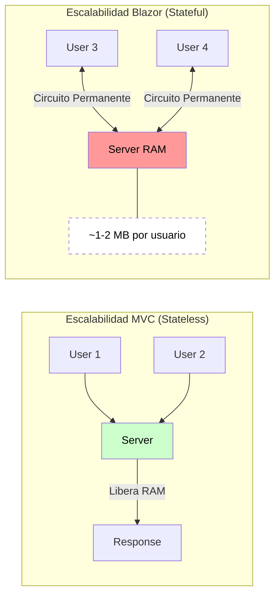

**Cálculo de capacidad:**

```csharp
// Ejemplo de consumo de memoria en un servidor típico

// ════════════════════════════════════════════════════════════
// SERVIDOR:   16 GB RAM
// ════════════════════════════════════════════════════════════

// Sistema operativo y ASP.NET Core:  ~2 GB
// Memoria disponible para aplicación:  14 GB

// ════════════════════════════════════════════════════════════
// BLAZOR SERVER
// ════════════════════════════════════════════════════════════

// Memoria por circuito Blazor:  ~1 MB promedio
// Usuarios concurrentes máximos:  14,000

// PERO:  Con componentes complejos y mucho estado: 
// Memoria por circuito:   ~2-3 MB
// Usuarios concurrentes:   ~5,000-7,000

// ════════════════════════════════════════════════════════════
// MVC TRADICIONAL
// ════════════════════════════════════════════════════════════

// Sin estado persistente
// Usuarios concurrentes:  LIMITADO SOLO POR CPU
// Típicamente:   50,000-100,000 req/seg

// ════════════════════════════════════════════════════════════
// SOLUCIÓN PARA BLAZOR:   Escalado horizontal con Redis
// ════════════════════════════════════════════════════════════

// 3 servidores x 5,000 usuarios = 15,000 usuarios
// Pero añade complejidad y costo
```

**Demostración de consumo de memoria:**

```csharp
// Program.cs - Logging de circuitos activos
app.MapBlazorHub().AddHubOptions<ComponentHub>(options =>
{
    options. MaximumReceiveMessageSize = 32 * 1024; // 32 KB
});

// Servicio para monitorear circuitos
public class CircuitCounterService
{
    private int _activeCircuits = 0;
    
    public void IncrementCircuit()
    {
        Interlocked.Increment(ref _activeCircuits);
        Console.WriteLine($"Circuitos activos:   {_activeCircuits}");
    }
    
    public void DecrementCircuit()
    {
        Interlocked.Decrement(ref _activeCircuits);
        Console.WriteLine($"Circuitos activos:  {_activeCircuits}");
    }
    
    public int GetActiveCircuits() => _activeCircuits;
}
```

---

##### B. Latencia: Dependiente de la velocidad de la conexión

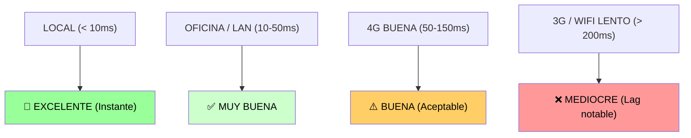

**Código de ejemplo con indicador de latencia:**

```razor
@* Components/LatencyIndicator.razor *@
@implements IDisposable

<div class="position-fixed top-0 end-0 m-3">
    <div class="badge @GetBadgeClass()">
        <i class="fas fa-signal"></i> @latenciaMs ms
    </div>
</div>

@code {
    private int latenciaMs = 0;
    private System.Threading.Timer? timer;
    
    protected override void OnInitialized()
    {
        // Medir latencia cada 5 segundos
        timer = new System.Threading.Timer(async _ =>
        {
            var inicio = DateTime. UtcNow;
            
            // Simular ping al servidor
            await Task.Delay(1);
            
            var fin = DateTime.UtcNow;
            latenciaMs = (int)(fin - inicio).TotalMilliseconds;
            
            await InvokeAsync(StateHasChanged);
        }, null, TimeSpan.Zero, TimeSpan.FromSeconds(5));
    }
    
    private string GetBadgeClass()
    {
        return latenciaMs switch
        {
            < 50 => "bg-success",
            < 150 => "bg-warning",
            _ => "bg-danger"
        };
    }
    
    public void Dispose()
    {
        timer?.Dispose();
    }
}
```

---

##### C. Requisito de conexión persistente (problemas con móviles)

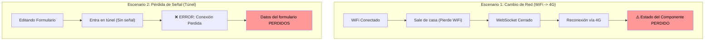

**Configuración de reconexión:**

```csharp
// Program.cs
builder.Services.AddServerSideBlazor(options =>
{
    // Configuración de reconexión
    options. DetailedErrors = builder.Environment.IsDevelopment();
    
    // Aumentar timeout para conexiones lentas
    options.JSInteropDefaultCallTimeout = TimeSpan.FromMinutes(1);
    
    // Tamaño máximo de mensaje
    options.MaxBufferedUnacknowledgedRenderBatches = 10;
});
```

```html
<!-- En _Layout.cshtml -->
<script src="_framework/blazor.server. js" autostart="false"></script>
<script>
    Blazor.start({
        reconnectionOptions: {
            maxRetries:  5,
            retryIntervalMilliseconds: 2000
        },
        reconnectionHandler: {
            onConnectionDown: () => {
                // Mostrar mensaje al usuario
                document.getElementById('reconnecting-modal').style.display = 'block';
            },
            onConnectionUp: () => {
                // Ocultar mensaje
                document.getElementById('reconnecting-modal').style.display = 'none';
            }
        }
    });
</script>

<!-- Modal de reconexión -->
<div id="reconnecting-modal" style="display: none; position: fixed; top: 0; left: 0; right: 0; bottom: 0; background: rgba(0,0,0,0.8); z-index: 9999;">
    <div style="position: absolute; top: 50%; left: 50%; transform: translate(-50%, -50%); background: white; padding: 2rem; border-radius: 8px; text-align: center;">
        <div class="spinner-border text-primary" role="status"></div>
        <p class="mt-3">Reconectando al servidor...</p>
    </div>
</div>
```

---

##### D. Consumo de memoria en servidor por cada sesión

```csharp
// Ejemplo de componente que consume mucha memoria

// ❌ MAL: Cargar todos los funkos en memoria del componente
@code {
    private List<FunkoDto> todosFunkos = new(); // ← Puede ser 10,000 items
    
    protected override async Task OnInitializedAsync()
    {
        // Carga 10,000 funkos en memoria del circuito
        var resultado = await FunkoService.ObtenerTodos();
        todosFunkos = resultado.Value. ToList();
        
        // ⚠️ Si tienes 1,000 usuarios: 
        //    1,000 circuitos x 10,000 funkos c/u = 10,000,000 objetos en RAM
    }
}

// ✅ BIEN:   Paginación y carga bajo demanda
@code {
    private List<FunkoDto> funkosPaginaActual = new(); // ← Solo 20 items
    private int paginaActual = 1;
    private const int itemsPorPagina = 20;
    
    protected override async Task OnInitializedAsync()
    {
        await CargarPagina(1);
    }
    
    private async Task CargarPagina(int pagina)
    {
        // Solo carga 20 funkos
        var resultado = await FunkoService.ObtenerPaginados(pagina, itemsPorPagina);
        funkosPaginaActual = resultado.Value.ToList();
        paginaActual = pagina;
        
        // ✅ 1,000 usuarios x 20 funkos = 20,000 objetos en RAM (aceptable)
    }
}
```

**Análisis de memoria con diferentes escenarios:**

```
COMPONENTE SIMPLE (Contador):
  Estado:   1 int (4 bytes)
  Overhead Blazor:  ~300 KB
  TOTAL POR USUARIO:  ~300 KB

COMPONENTE MEDIANO (Lista de 50 items):
  Estado:  List<T> con 50 objetos (~50 KB)
  Overhead Blazor:  ~300 KB
  TOTAL POR USUARIO:  ~350 KB

COMPONENTE COMPLEJO (Dashboard con múltiples listas):
  Estado:  5 listas x 100 objetos (~500 KB)
  Overhead Blazor:  ~300 KB
  Gráficos/Cache:  ~500 KB
  TOTAL POR USUARIO:  ~1. 3 MB

COMPONENTE MAL DISEÑADO (carga todo en memoria):
  Estado:  10,000 objetos (~10 MB)
  Overhead Blazor:  ~300 KB
  TOTAL POR USUARIO:  ~10. 3 MB
  ❌ PROBLEMA:   100 usuarios = 1 GB de RAM! 
```

---

#### 7.1.4.3. Casos de uso ideales para cada tecnología: Guía de Decisión

Elegir la tecnología adecuada es la decisión más importante de un arquitecto de software. No existe una "bala de plata", sino herramientas optimizadas para problemas específicos.

##### A. MVC y Razor Pages: El estándar para la Web Pública

Es la opción por defecto cuando el objetivo es el alcance masivo y el posicionamiento en buscadores.

```
✅ IDEAL PARA: 

1. SITIOS WEB PÚBLICOS
   - Blog corporativo, portafolios, sitios de noticias.
   RAZÓN: SEO excelente, bajo consumo de recursos.

2. FORMULARIOS DE CONTACTO SIMPLES
   - Newsletter, registros básicos.
   RAZÓN: No requiere interactividad compleja.

3. E-COMMERCE (PARTE PÚBLICA)
   - Catálogo de productos, landing de ofertas.
   RAZÓN: SEO crítico para ventas, tráfico alto.
```

##### B. Blazor Server (Interactive Server): Aplicaciones de Gestión

Es la mejor opción para aplicaciones donde la velocidad de desarrollo y el acceso a datos son prioritarios.

1. **Dashboards Administrativos**
   - Estadísticas en tiempo real y monitoreo de sistemas.
   - **RAZÓN**: Requiere actualización constante, usuarios limitados (empleados).

2. **CRM (Customer Relationship Management)**
   - Gestión de clientes, seguimiento de leads y pipeline de ventas.
   - **RAZÓN**: Mucha interactividad, lógica compleja, usuarios internos.

3. **ERP (Enterprise Resource Planning)**
   - Gestión de inventario, contabilidad y recursos humanos.
   - **RAZÓN**: Aplicaciones masivas en red corporativa.

4. **Aplicaciones de Back-Office**
   - Gestión de pedidos y herramientas internas.
   - **RAZÓN**: SEO irrelevante, usuarios limitados, red rápida.

**Ejemplo de dashboard Blazor ideal:**

```razor
@* Components/DashboardVentas.razor *@
@inject IVentasService VentasService
@implements IDisposable

<div class="row">
    @* ════════════════════════════════════════════════════ *@
    @* ACTUALIZACIÓN EN TIEMPO REAL cada 5 segundos        *@
    @* ════════════════════════════════════════════════════ *@
    
    <div class="col-md-3">
        <div class="card bg-primary text-white">
            <div class="card-body">
                <h3>@ventasHoy.ToString("C")</h3>
                <p>Ventas Hoy</p>
                <small>@(cambioVentas >= 0 ? "+" : "")@cambioVentas.ToString("P1") vs ayer</small>
            </div>
        </div>
    </div>
    
    <div class="col-md-3">
        <div class="card bg-success text-white">
            <div class="card-body">
                <h3>@pedidosPendientes</h3>
                <p>Pedidos Pendientes</p>
                <button class="btn btn-light btn-sm mt-2" @onclick="VerPedidos">Ver Detalles</button>
            </div>
        </div>
    </div>
</div>

@if (mostrarPedidos)
{
    <div class="modal show d-block" tabindex="-1">
        <div class="modal-dialog modal-lg">
            <div class="modal-content">
                <div class="modal-header">
                    <h5>Pedidos Pendientes</h5>
                    <button type="button" class="btn-close" @onclick="CerrarPedidos"></button>
                </div>
                <div class="modal-body">
                    <table class="table">
                        <thead>
                            <tr><th>ID</th><th>Cliente</th><th>Total</th><th>Acción</th></tr>
                        </thead>
                        <tbody>
                            @foreach (var pedido in pedidos)
                            {
                                <tr>
                                    <td>@pedido.Id</td>
                                    <td>@pedido.ClienteNombre</td>
                                    <td>@pedido.Total.ToString("C")</td>
                                    <td>
                                        <button class="btn btn-sm btn-success" @onclick="() => ProcesarPedido(pedido.Id)">Procesar</button>
                                    </td>
                                </tr>
                            }
                        </tbody>
                    </table>
                </div>
            </div>
        </div>
    </div>
}

@code {
    private decimal ventasHoy;
    private decimal cambioVentas;
    private int pedidosPendientes;
    private bool mostrarPedidos;
    private List<PedidoDto> pedidos = new();
    private System.Threading.Timer? timer;
    
    protected override async Task OnInitializedAsync()
    {
        await ActualizarDatos();
        timer = new System.Threading.Timer(async _ =>
        {
            await ActualizarDatos();
            await InvokeAsync(StateHasChanged);
        }, null, TimeSpan.FromSeconds(5), TimeSpan.FromSeconds(5));
    }
    
    private async Task ActualizarDatos()
    {
        var resultado = await VentasService.ObtenerResumenHoy();
        if (resultado.IsSuccess)
        {
            ventasHoy = resultado.Value.Total;
            cambioVentas = resultado.Value.CambioVsAyer;
            pedidosPendientes = resultado.Value.PedidosPendientes;
        }
    }
    
    private async Task VerPedidos()
    {
        var resultado = await VentasService.ObtenerPedidosPendientes();
        if (resultado.IsSuccess)
        {
            pedidos = resultado.Value.ToList();
            mostrarPedidos = true;
        }
    }
    
    private void CerrarPedidos() => mostrarPedidos = false;
    
    private async Task ProcesarPedido(int id)
    {
        await VentasService.ProcesarPedido(id);
        await ActualizarDatos();
        await VerPedidos();
    }
    
    public void Dispose() => timer?.Dispose();
}
```

##### C. Blazor WebAssembly (Interactive WASM): Aplicaciones Cliente-Céntricas

Ideal para aplicaciones que deben comportarse como un programa de escritorio.

*   **Progressive Web Apps (PWAs)**: Apps instalables con funcionamiento offline.
*   **Herramientas de Productividad**: Editores de imagen, diseñadores, calculadoras científicas.
*   **RAZÓN**: Ejecución local sin latencia de red tras la descarga inicial.

##### D. Blazor Auto (El Modelo Unificado de .NET 10)

Es la opción para aplicaciones SaaS de alto nivel que buscan la mejor UX posible.

---

#### Tabla de Decisión Rápida

| Objetivo Principal                       | Tecnología Recomendada |
| :--------------------------------------- | :--------------------- |
| **Aparecer el primero en Google (SEO)**  | MVC / Razor Pages      |
| **Crear una herramienta interna rápido** | Blazor Server          |
| **Aplicación que funcione sin Internet** | Blazor WASM (PWA)      |
| **La mejor experiencia posible (UX)**    | Blazor Auto            |


#### Tabla resumen de decisión:

| Criterio                    | MVC/Razor         | Blazor Server      | Blazor WASM          | Blazor Auto              |
| :-------------------------- | :---------------- | :----------------- | :------------------- | :----------------------- |
| **Público objetivo**        | Usuarios externos | Empleados internos | Usuarios externos    | Usuarios Premium / SaaS  |
| **Tipo de red**             | Internet público  | LAN corporativa    | Internet público     | Internet / Híbrida       |
| **Importancia SEO**         | ✅ Crítico         | ❌ Irrelevante      | ⚠️ Requiere prerender | ✅ Bueno (arranca SSR)    |
| **Interactividad**          | ⚠️ Limitada        | ✅ Alta             | ✅ Máxima             | ✅ Máxima (Evolutiva)     |
| **Usuarios concurrentes**   | ✅ 100,000+        | ⚠️ 5,000-10,000     | ✅ Ilimitados         | 🔄 Progresiva             |
| **Conexión requerida**      | ⚠️ Por acción      | ❌ Persistente      | ✅ Solo para datos    | ❌ Inicial / ✅ Solo datos |
| **Latencia**                | ⚠️ Alta (recarga)  | ⚠️ Media (red)      | ✅ Mínima (local)     | 🚀 Mínima (tras descarga) |
| **Costo de hosting**        | ✅ Bajo            | ⚠️ Medio-Alto       | ✅ Mínimo (estático)  | ⚠️ Medio                  |
| **Complejidad desarrollo**  | ✅ Simple          | ⚠️ Media            | ⚠️ Media-Alta         | ❌ Alta (Abstracción)     |
| **Tiempo de carga inicial** | ✅ < 1 seg         | ✅ < 1 seg          | ❌ 3-10 seg           | ✅ Rápido (vía Server)    |
| **Funciona offline**        | ❌ No              | ❌ No               | ✅ Sí (PWA)           | ✅ Sí (PWA)               |

---

## 7.2. Convivencia e Hibridación (Empotrar Blazor en MVC)

### 7.2.1. Configuración de Blazor en un proyecto MVC

#### 7.2.1.1. Instalación de servicios en Program.cs

```csharp
// Program.cs
var builder = WebApplication.CreateBuilder(args);

// ════════════════════════════════════════════════════════════
// SERVICIOS MVC (ya existentes)
// ════════════════════════════════════════════════════════════
builder.Services.AddControllersWithViews();

// Autenticación, sesión, etc.
builder.Services. AddAuthentication(/* ... */);
builder.Services.AddSession(/* ... */);

// Servicios de negocio
builder.Services.AddScoped<IFunkoService, FunkoService>();
builder.Services.AddScoped<ITodoService, TodoService>();

// ════════════════════════════════════════════════════════════
// AÑADIR BLAZOR SERVER
// ════════════════════════════════════════════════════════════

builder.Services.AddServerSideBlazor(options =>
{
    // ────────────────────────────────────────────────────────
    // OPCIONES DE CONFIGURACIÓN
    // ────────────────────────────────────────────────────────
    
    // Mostrar errores detallados en desarrollo
    options.DetailedErrors = builder.Environment.IsDevelopment();
    
    // Timeout para llamadas de JavaScript Interop
    options.JSInteropDefaultCallTimeout = TimeSpan.FromMinutes(1);
    
    // Número máximo de render batches sin confirmación
    options.MaxBufferedUnacknowledgedRenderBatches = 10;
    
    // Desconectar circuito después de X tiempo inactivo
    options.DisconnectedCircuitRetentionPeriod = TimeSpan.FromMinutes(3);
    
    // Máximo de circuitos inactivos a retener
    options.DisconnectedCircuitMaxRetained = 100;
});

// ════════════════════════════════════════════════════════════
// CONFIGURACIÓN DEL HUB DE SIGNALR (opcional)
// ════════════════════════════════════════════════════════════

builder.Services.AddSignalR(options =>
{
    // Tamaño máximo de mensaje (por defecto 32 KB)
    options.MaximumReceiveMessageSize = 64 * 1024; // 64 KB
    
    // Timeout de handshake
    options.HandshakeTimeout = TimeSpan.FromSeconds(15);
    
    // Keep-alive interval
    options.KeepAliveInterval = TimeSpan.FromSeconds(15);
    
    // Client timeout
    options.ClientTimeoutInterval = TimeSpan.FromSeconds(30);
});

var app = builder.Build();

// ════════════════════════════════════════════════════════════
// CONFIGURACIÓN DEL PIPELINE
// ════════════════════════════════════════════════════════════

if (!app.Environment.IsDevelopment())
{
    app.UseExceptionHandler("/Error");
    app.UseHsts();
}

app.UseHttpsRedirection();
app.UseStaticFiles();

app.UseRouting();

app.UseAuthentication();
app.UseAuthorization();

app.UseSession();

// ════════════════════════════════════════════════════════════
// MAPEAR EL HUB DE BLAZOR (CRÍTICO)
// ════════════════════════════════════════════════════════════

app.MapBlazorHub();
// ☝️ Esto crea el endpoint:   /_blazor para la conexión SignalR

// O con opciones avanzadas:
app.MapBlazorHub("/blazor-hub"); // Endpoint personalizado

// Rutas MVC
app.MapControllerRoute(
    name: "default",
    pattern: "{controller=Home}/{action=Index}/{id? }");

app.Run();
```

---

#### 7.2.1.2. Referencia al script de Blazor en _Layout.cshtml

```cshtml
@* Views/Shared/_Layout.cshtml *@
<! DOCTYPE html>
<html lang="es">
<head>
    <meta charset="utf-8" />
    <meta name="viewport" content="width=device-width, initial-scale=1.0" />
    <title>@ViewData["Title"] - Funko World</title>
    
    <!-- CSS -->
    <link rel="stylesheet" href="~/lib/bootstrap/dist/css/bootstrap. min.css" />
    <link rel="stylesheet" href="~/css/site.css" asp-append-version="true" />
    
    @await RenderSectionAsync("Styles", required: false)
</head>
<body>
    <header>
        <!-- Navbar -->
    </header>
    
    <main>
        @RenderBody()
    </main>
    
    <footer>
        <!-- Footer -->
    </footer>
    
    <!-- Scripts globales -->
    <script src="~/lib/jquery/dist/jquery.min.js"></script>
    <script src="~/lib/bootstrap/dist/js/bootstrap. bundle.min.js"></script>
    <script src="~/js/site.js" asp-append-version="true"></script>
    
    @* ════════════════════════════════════════════════════ *@
    @* SCRIPT DE BLAZOR (REQUERIDO)                         *@
    @* ════════════════════════════════════════════════════ *@
    
    <script src="_framework/blazor.server.js"></script>
    @* ☝️ Este script:  *@
    @* • Establece la conexión SignalR *@
    @* • Gestiona el DOM virtual *@
    @* • Maneja eventos del cliente *@
    @* • Aplica cambios del servidor *@
    
    @* ────────────────────────────────────────────────── *@
    @* SCRIPT CON CONFIGURACIÓN AVANZADA (opcional)       *@
    @* ────────────────────────────────────────────────── *@
    
    @* <script src="_framework/blazor. server.js" autostart="false"></script>
    <script>
        Blazor.start({
            // Configuración de reconexión
            reconnectionOptions: {
                maxRetries:  8,
                retryIntervalMilliseconds: 2000
            },
            
            // Configuración de logging
            configureSignalR: function (builder) {
                builder.withAutomaticReconnect([0, 1000, 2000, 5000, 10000]);
            },
            
            // Handlers de eventos
            reconnectionHandler: {
                onConnectionDown: () => mostrarModalReconexion(),
                onConnectionUp: () => ocultarModalReconexion()
            }
        });
        
        function mostrarModalReconexion() {
            document.getElementById('reconexion-modal').classList.add('show');
        }
        
        function ocultarModalReconexion() {
            document.getElementById('reconexion-modal').classList.remove('show');
        }
    </script> *@
    
    @await RenderSectionAsync("Scripts", required: false)
</body>
</html>
```

**Modal de reconexión (opcional pero recomendado):**

```cshtml
@* Añadir al final del body en _Layout.cshtml *@

<div id="reconexion-modal" class="modal-reconexion">
    <div class="modal-contenido">
        <div class="spinner-border text-primary mb-3" role="status"></div>
        <h5>Reconectando...</h5>
        <p class="text-muted">Se perdió la conexión con el servidor.   Intentando reconectar...</p>
    </div>
</div>

<style>
    .modal-reconexion {
        display: none;
        position: fixed;
        top: 0;
        left: 0;
        right: 0;
        bottom:  0;
        background:  rgba(0, 0, 0, 0.8);
        z-index: 9999;
        align-items: center;
        justify-content: center;
    }
    
    .modal-reconexion.show {
        display: flex;
    }
    
    .modal-contenido {
        background: white;
        padding: 2rem;
        border-radius: 8px;
        text-align: center;
        max-width: 400px;
    }
</style>
```

---

### 7.2.2. Inyección de Componentes: Tag Helper <component>

#### 7.2.2.1. Sintaxis del tag helper component

```cshtml
@* ════════════════════════════════════════════════════════════ *@
@* SINTAXIS BÁSICA                                              *@
@* ════════════════════════════════════════════════════════════ *@

<component type="typeof(NombreDelComponente)" render-mode="ServerPrerendered" />

@* ────────────────────────────────────────────────────────────── *@
@* EJEMPLO 1: Componente sin parámetros                           *@
@* ────────────────────────────────────────────────────────────── *@

<component type="typeof(TodoListComponent)" 
           render-mode="ServerPrerendered" />

@* ────────────────────────────────────────────────────────────── *@
@* EJEMPLO 2: Componente con parámetros                           *@
@* ────────────────────────────────────────────────────────────── *@

<component type="typeof(FunkoCard)" 
           render-mode="ServerPrerendered"
           param-Id="42"
           param-Nombre="@Model.Nombre"
           param-Precio="@Model.Precio"
           param-ImagenUrl="@Model.ImagenUrl" />

@* ☝️ Los parámetros se pasan con prefijo "param-" *@

#### 7.2.2.3. Paso de Parámetros desde MVC: El Canal de Comunicación

Es vital entender que un componente Blazor no está "aislado". Podemos abrir un canal de comunicación desde nuestra vista MVC hacia el componente interactivo utilizando los atributos con el prefijo **`param-`**.

**El Flujo de Datos (Paso a Paso):**

1.  **En el Componente (`.razor`)**: Debes declarar una propiedad pública con el atributo `[Parameter]`.
    ```razor
    @* Components/Saludo.razor *@
    <h3>¡Hola, @NombreUsuario!</h3>
    @code {
        [Parameter] public string NombreUsuario { get; set; } = "Invitado";
    }
    ```

2.  **En el Controlador MVC (`.cs`)**: Cargas los datos y los pasas a la vista mediante el modelo.
    ```csharp
    public IActionResult Perfil() {
        var nombre = "Jose Luis";
        return View("Perfil", nombre); 
    }
    ```

3.  **En la Vista MVC (`.cshtml`)**: Inyectas el componente y mapeas el parámetro.
    ```cshtml
    @model string
    <div class="alert alert-info">
        <component type="typeof(Saludo)" 
                   render-mode="ServerPrerendered" 
                   param-NombreUsuario="@Model" />
    </div>
    ```

⚠️ **Regla de Oro del Profesor**:
> El nombre tras el prefijo `param-` debe coincidir **exactamente** (case-sensitive) con el nombre de la propiedad en el archivo `.razor`.

📝 **Nota Técnica**:
> Los parámetros se serializan a JSON para viajar del servidor al circuito de Blazor. Esto permite pasar objetos complejos (clases o listas), pero se recomienda pasar únicamente **DTOs** ligeros para no sobrecargar el inicio de la conexión SignalR.

@* EJEMPLO 3: Componente con namespace completo                   *@
@* ────────────────────────────────────────────────────────────── *@

<component type="typeof(MiApp.Components.TodoListComponent)" 
           render-mode="ServerPrerendered" />

@* ────────────────────────────────────────────────────────────── *@
@* EJEMPLO 4: Usando expresiones dinámicas                        *@
@* ────────────────────────────────────────────────────────────── *@

@{
    var componentType = Model.UsarVersionNueva 
        ? typeof(TodoListComponent) 
        : typeof(TodoListComponentLegacy);
}

<component type="@componentType" render-mode="ServerPrerendered" />
```

---

#### 7.2.2.2. El Ecosistema de Render Modes en .NET 10

Los **Render Modes** son el cerebro de la arquitectura Blazor Web App. Determinan dónde se ejecuta el código C#, qué descarga el navegador y cómo se alcanza la interactividad.

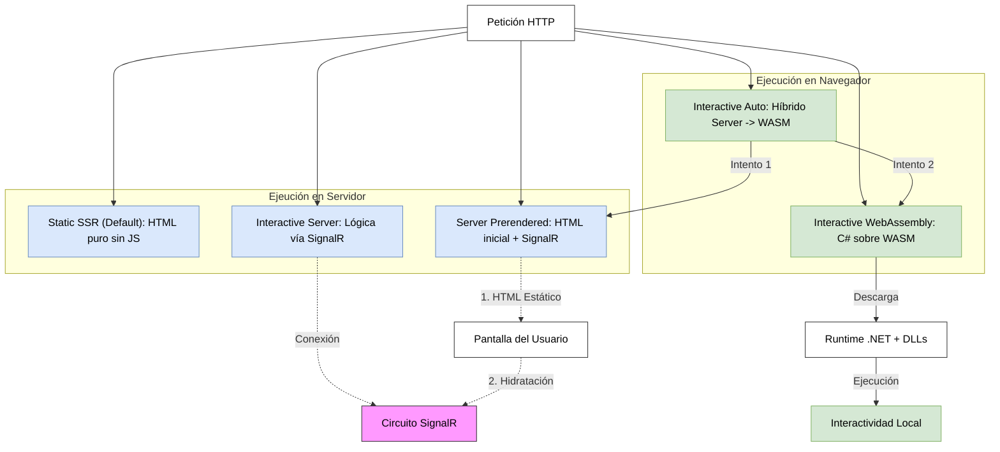

##### A. Static SSR (Static Server-Side Rendering)
Es el modo base. El servidor renderiza el componente una vez y envía HTML "muerto".
*   **🎯 Uso**: Páginas de solo lectura (Legal, FAQs).
*   **✅ Pro**: Consumo cero de recursos tras el envío.

##### B. Interactive Server (Blazor Server)
Mantiene un "circuito" abierto entre cliente y servidor.
*   **🎯 Uso**: Aplicaciones que requieren acceso constante a datos privados.
*   **⚠️ Nota**: Puede usarse con o sin *Prerender*. El *Prerender* evita la pantalla de "Cargando...".

##### C. Interactive WebAssembly (WASM)
Todo el código C# viaja al navegador.
*   **🎯 Uso**: Herramientas de diseño, juegos o apps que deben funcionar sin internet (PWA).
*   **⚠️ Nota**: El navegador debe descargar el motor de .NET (unos 2MB).

##### D. Interactive Auto (El Modelo Inteligente)
Es la optimización definitiva de .NET 10.
*   **Flujo**: La primera vez arranca como **Server** (para que el usuario no espere la descarga). Mientras el usuario trabaja, el navegador descarga los archivos WASM en segundo plano. La siguiente vez que el usuario entre, la app arrancará directamente en el **Cliente**.

##### E. La importancia de la Hidratación
En los modos con *Prerender*, ocurre un fenómeno llamado **Hidratación**: el navegador recibe HTML estático para que el usuario vea algo rápido, y milisegundos después "despierta" el JavaScript de Blazor para conectar los botones y eventos. 

📝 **Nota del Profesor**:
> Si no gestionas bien el estado durante la hidratación, el usuario podría ver cómo los datos cambian dos veces (flicker). .NET 10 incluye el componente `<PersistComponentState>` para evitar que el servidor consulte la base de datos dos veces en estos casos.

---

**Ejemplo comparativo de los 5 modos en una vista MVC:**

```cshtml
@* Views/Demos/RenderModes.cshtml *@
@using Microsoft.AspNetCore.Components.Web

<div class="container mt-4">
    <h1>Estrategias de Renderizado .NET 10</h1>
    
    <div class="row g-4 mt-2">
        @* 1. STATIC SSR: Solo HTML *@
        <div class="col-md-4">
            <div class="card h-100 border-secondary">
                <div class="card-header bg-secondary text-white">Static SSR</div>
                <div class="card-body">
                    <component type="typeof(Contador)" render-mode="Static" />
                </div>
                <div class="card-footer small">❌ Sin interactividad. Consumo 0 RAM.</div>
            </div>
        </div>

        @* 2. INTERACTIVE SERVER: SignalR directo *@
        <div class="col-md-4">
            <div class="card h-100 border-primary">
                <div class="card-header bg-primary text-white">Interactive Server</div>
                <div class="card-body">
                    <component type="typeof(Contador)" render-mode="Server" />
                </div>
                <div class="card-footer small">✅ Carga rápida. Requiere conexión permanente.</div>
            </div>
        </div>

        @* 3. SERVER PRERENDERED: El Estándar *@
        <div class="col-md-4">
            <div class="card h-100 border-success">
                <div class="card-header bg-success text-white">Server Prerendered</div>
                <div class="card-body">
                    <component type="typeof(Contador)" render-mode="ServerPrerendered" />
                </div>
                <div class="card-footer small">⭐ Ideal SEO. Visible mientras conecta SignalR.</div>
            </div>
        </div>

        @* 4. INTERACTIVE WASM: Ejecución Local *@
        <div class="col-md-4">
            <div class="card h-100 border-warning">
                <div class="card-header bg-warning">Interactive WebAssembly</div>
                <div class="card-body">
                    <component type="typeof(Contador)" render-mode="WebAssemblyPrerendered" />
                </div>
                <div class="card-footer small">🚀 Fluidez total tras descargar ~2MB de motor .NET.</div>
            </div>
        </div>

        @* 5. INTERACTIVE AUTO: La Inteligencia de .NET 10 *@
        <div class="col-md-4">
            <div class="card h-100 border-info">
                <div class="card-header bg-info">Interactive Auto</div>
                <div class="card-body">
                    <component type="typeof(Contador)" render-mode="AutoPrerendered" />
                </div>
                <div class="card-footer small">🔄 Arranca en Server y conmuta a WASM en 2º plano.</div>
            </div>
        </div>
    </div>
</div>

```

**Guía de Selección Técnica:**

```csharp
// 1. ¿Necesitas SEO y es información estática? 
// -> Use RenderMode.Static

// 2. ¿Es una aplicación de gestión interna (LAN)? 
// -> Use RenderMode.InteractiveServer

// 3. ¿Es una herramienta compleja (ej: Excel web) o requiere modo offline? 
// -> Use RenderMode.InteractiveWebAssembly

// 4. ¿Quieres la mejor UX posible y tienes presupuesto para desarrollo extra? 
// -> Use RenderMode.InteractiveAuto
```

---

## 7.3. Fundamentos de la Reactividad en Blazor

### 7.3.1. Estado del Componente y Ciclo de Vida

Blazor gestiona el ciclo de vida de un componente a través de una serie de métodos asíncronos que podemos sobreescribir.

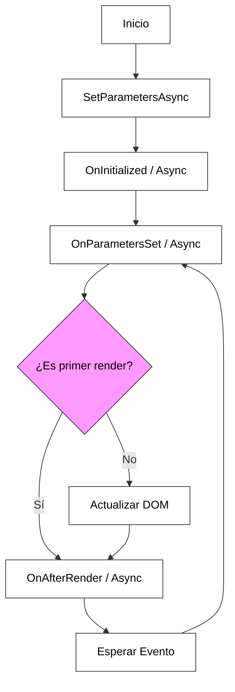

#### 7.3.1.1. Métodos del ciclo de vida: OnInitialized, OnParametersSet, OnAfterRender

El ciclo de vida es el conjunto de etapas por las que pasa un componente desde que el servidor lo instancia hasta que el usuario cierra la página. Comprender este flujo es crítico para evitar errores de carga de datos o fugas de memoria.

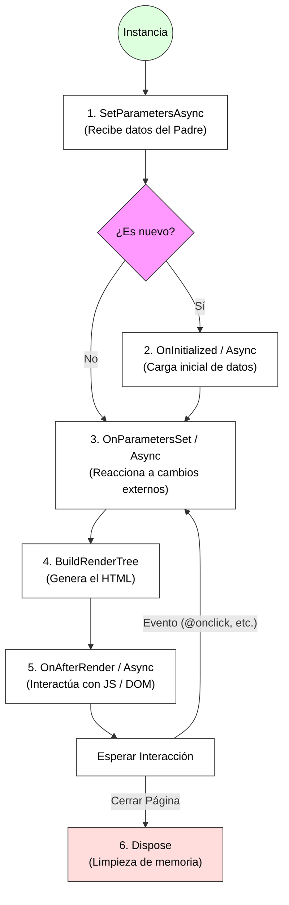

##### 1. OnInitialized / Async
Se ejecuta **una sola vez**. Es el lugar perfecto para llamar a servicios, consultar bases de datos o inicializar variables de estado.
*   **🎓 Analogía**: Es como **encender la luz** al entrar en una habitación; solo lo haces al llegar.

##### 2. OnParametersSet / Async
Se ejecuta después de la inicialización y **cada vez** que el componente padre cambia un valor que te ha pasado.
*   **🎓 Analogía**: Es como **ajustar el termostato** cuando cambia el clima; lo haces tantas veces como sea necesario.

##### 3. OnAfterRender / Async
Se ejecuta cuando el HTML ya está en la pantalla del usuario. Tiene un parámetro `bool firstRender`. Es el **único lugar seguro** para ejecutar código JavaScript (JS Interop).
*   **🎓 Analogía**: Es como **limpiar las huellas** de la pared después de haber terminado de pintar; no puedes hacerlo antes de que la pintura esté ahí.

##### 4. IDisposable / Dispose
Es el método de limpieza. Se ejecuta cuando el componente se destruye. Imprescindible para cancelar timers o desuscribirse de eventos globales.

---

**Ejemplo completo con todos los métodos del ciclo de vida:**

```razor
@* Components/ComponenteConCicloCompleto.razor *@
@inject IJSRuntime JSRuntime
@implements IDisposable

<div class="card">
    <div class="card-header">
        <h5>Demostración del Ciclo de Vida</h5>
    </div>
    <div class="card-body">
        <h6>Parámetro actual: @Titulo</h6>
        <p>Contador: @contador</p>
        
        <button class="btn btn-primary" @onclick="Incrementar">
            Incrementar
        </button>
        
        <div class="mt-3">
            <h6>Log de ejecución:</h6>
            <div class="border p-2" style="max-height: 200px; overflow-y: auto;">
                @foreach (var log in logs)
                {
                    <small class="d-block">@log</small>
                }
            </div>
        </div>
    </div>
</div>

@code {
    // ════════════════════════════════════════════════════════
    // PARÁMETROS
    // ════════════════════════════════════════════════════════
    
    [Parameter]
    public string Titulo { get; set; } = "Sin título";
    
    // ════════════════════════════════════════════════════════
    // ESTADO DEL COMPONENTE
    // ════════════════════════════════════════════════════════
    
    private int contador = 0;
    private List<string> logs = new();
    private System.Threading.Timer? timer;
    
    // ════════════════════════════════════════════════════════
    // 1. SetParametersAsync (manual, raramente necesario)
    // ════════════════════════════════════════════════════════
    
    public override async Task SetParametersAsync(ParameterView parameters)
    {
        AgregarLog("1. SetParametersAsync - Recibiendo parámetros");
        
        // Llamar al base para que Blazor procese los parámetros
        await base.SetParametersAsync(parameters);
    }
    
    // ════════════════════════════════════════════════════════
    // 2. OnInitialized - Versión síncrona
    // ════════════════════════════════════════════════════════
    
    protected override void OnInitialized()
    {
        AgregarLog("2. OnInitialized - Primera inicialización (sync)");
        
        // Código síncrono de inicialización
        contador = 0;
    }
    
    // ════════════════════════════════════════════════════════
    // 2b. OnInitializedAsync - Versión asíncrona (RECOMENDADO)
    // ════════════════════════════════════════════════════════
    
    protected override async Task OnInitializedAsync()
    {
        AgregarLog("2b. OnInitializedAsync - Cargando datos async");
        
        // ✅ Ideal para: 
        // • Llamadas a APIs
        // • Consultas a base de datos
        // • Cargar configuración
        
        await Task.Delay(100); // Simular carga de datos
        
        AgregarLog("2b. OnInitializedAsync - Datos cargados");
        
        // Iniciar timer
        timer = new System.Threading. Timer(async _ =>
        {
            contador++;
            await InvokeAsync(StateHasChanged);
        }, null, TimeSpan.FromSeconds(5), TimeSpan.FromSeconds(5));
    }
    
    // ════════════════════════════════════════════════════════
    // 3. OnParametersSet - Se ejecuta cuando cambian parámetros
    // ════════════════════════════════════════════════════════
    
    protected override void OnParametersSet()
    {
        AgregarLog($"3. OnParametersSet - Título cambió a: {Titulo}");
        
        // ✅ Ideal para: 
        // • Reaccionar a cambios de parámetros
        // • Recargar datos cuando cambia un filtro
        // • Validar parámetros
    }
    
    // ════════════════════════════════════════════════════════
    // 3b. OnParametersSetAsync - Versión asíncrona
    // ════════════════════════════════════════════════════════
    
    protected override async Task OnParametersSetAsync()
    {
        AgregarLog("3b. OnParametersSetAsync - Procesando cambios async");
        
        // Si el título cambió, recargar datos
        if (! string.IsNullOrEmpty(Titulo))
        {
            await Task.Delay(50); // Simular carga
        }
    }
    
    // ════════════════════════════════════════════════════════
    // 6. OnAfterRender - Después de renderizar
    // ════════════════════════════════════════════════════════
    
    protected override void OnAfterRender(bool firstRender)
    {
        if (firstRender)
        {
            AgregarLog("6. OnAfterRender - Primera renderización completada");
            
            // ✅ Ideal para:
            // • Inicializar librerías JavaScript
            // • Focus en inputs
            // • Medir tamaño de elementos
        }
        else
        {
            AgregarLog("6. OnAfterRender - Re-renderización completada");
        }
    }
    
    // ════════════════════════════════════════════════════════
    // 6b. OnAfterRenderAsync - Versión asíncrona (RECOMENDADO para JS Interop)
    // ════════════════════════════════════════════════════════
    
    protected override async Task OnAfterRenderAsync(bool firstRender)
    {
        if (firstRender)
        {
            AgregarLog("6b. OnAfterRenderAsync - Interactuando con JavaScript");
            
            // ✅ Llamadas a JavaScript
            await JSRuntime.InvokeVoidAsync("console.log", "Componente renderizado");
        }
    }
    
    // ════════════════════════════════════════════════════════
    // MÉTODOS DEL COMPONENTE
    // ════════════════════════════════════════════════════════
    
    private void Incrementar()
    {
        contador++;
        AgregarLog($"Evento: Contador incrementado a {contador}");
        
        // StateHasChanged() se llama automáticamente después de eventos
        // Pero puedes llamarlo manualmente si es necesario
    }
    
    private void AgregarLog(string mensaje)
    {
        var timestamp = DateTime.Now.ToString("HH:mm:ss. fff");
        logs.Add($"[{timestamp}] {mensaje}");
        
        // Mantener solo los últimos 20 logs
        if (logs.Count > 20)
        {
            logs.RemoveAt(0);
        }
    }
    
    // ════════════════════════════════════════════════════════
    // 11. Dispose - Limpieza de recursos
    // ════════════════════════════════════════════════════════
    
    public void Dispose()
    {
        AgregarLog("11. Dispose - Liberando recursos");
        
        // ✅ Limpieza obligatoria: 
        // • Cancelar timers
        // • Desuscribirse de eventos
        // • Cerrar conexiones
        // • Liberar memoria
        
        timer?.Dispose();
        
        Console.WriteLine("Componente destruido correctamente");
    }
}
```

**Reglas de oro del ciclo de vida:**

```csharp
// ✅ REGLA 1: Usar versión async para operaciones asíncronas
protected override async Task OnInitializedAsync()
{
    // CORRECTO: Llamada async
    datos = await _service.ObtenerDatosAsync();
}

// ❌ INCORRECTO:  Llamada async en método sync
protected override void OnInitialized()
{
    // Esto NO funciona correctamente
    datos = _service.ObtenerDatosAsync().Result;
}

// ✅ REGLA 2: No llamar StateHasChanged en OnInitialized (innecesario)
protected override void OnInitialized()
{
    contador = 0;
    // StateHasChanged(); ← INNECESARIO, se llama automáticamente
}

// ✅ REGLA 3: JavaScript Interop SOLO en OnAfterRender
protected override async Task OnAfterRenderAsync(bool firstRender)
{
    if (firstRender)
    {
        // CORRECTO: El DOM ya existe
        await JSRuntime.InvokeVoidAsync("inicializarMapa", "map-container");
    }
}

// ❌ INCORRECTO: JavaScript en OnInitialized
protected override async Task OnInitializedAsync()
{
    // El DOM aún no existe, esto fallará
    await JSRuntime. InvokeVoidAsync("inicializarMapa", "map-container");
}

// ✅ REGLA 4: Siempre implementar IDisposable para timers/suscripciones
@implements IDisposable

@code {
    private Timer? timer;
    
    protected override void OnInitialized()
    {
        timer = new Timer(_ => { /* ...  */ }, null, 0, 1000);
    }
    
    public void Dispose()
    {
        timer?.Dispose(); // CRÍTICO: Evita memory leaks
    }
}
```

---

#### 7.3.1.2. StateHasChanged(): Forzar re-renderizado

```razor
@* Components/EjemploStateHasChanged. razor *@
@inject IFunkoService FunkoService

<div class="card">
    <div class="card-body">
        <h5>Funkos:  @funkos. Count</h5>
        
        <button class="btn btn-primary" @onclick="CargarFunkos">
            Cargar Funkos
        </button>
        
        <button class="btn btn-secondary" @onclick="CargarFunkosEnBackground">
            Cargar en Background (sin StateHasChanged)
        </button>
        
        <div class="mt-3">
            @foreach (var funko in funkos)
            {
                <div class="badge bg-info me-1">@funko. Nombre</div>
            }
        </div>
    </div>
</div>

@code {
    private List<FunkoDto> funkos = new();
    
    // ════════════════════════════════════════════════════════
    // EJEMPLO 1: StateHasChanged automático (en eventos)
    // ════════════════════════════════════════════════════════
    
    private async Task CargarFunkos()
    {
        var resultado = await FunkoService.ObtenerTodos();
        
        if (resultado.IsSuccess)
        {
            funkos = resultado.Value. ToList();
            
            // ✅ StateHasChanged() se llama AUTOMÁTICAMENTE
            // después de que termina este método
            // NO es necesario llamarlo explícitamente
        }
    }
    
    // ════════════════════════════════════════════════════════
    // EJEMPLO 2: StateHasChanged NECESARIO (tareas en background)
    // ════════════════════════════════════════════════════════
    
    private async Task CargarFunkosEnBackground()
    {
        // Iniciar tarea en background
        _ = Task.Run(async () =>
        {
            await Task. Delay(2000); // Simular operación lenta
            
            var resultado = await FunkoService. ObtenerTodos();
            
            if (resultado.IsSuccess)
            {
                funkos = resultado.Value.ToList();
                
                // ⚠️ CRÍTICO: StateHasChanged NECESARIO
                // porque estamos en un thread diferente
                await InvokeAsync(StateHasChanged);
                // ☝️ InvokeAsync asegura que se ejecute en el thread UI
            }
        });
        
        // El método termina inmediatamente (no espera)
    }
    
    // ════════════════════════════════════════════════════════
    // EJEMPLO 3:  Actualización progresiva (barra de progreso)
    // ════════════════════════════════════════════════════════
    
    private int progreso = 0;
    
    private async Task ProcesarConProgreso()
    {
        progreso = 0;
        
        for (int i = 1; i <= 100; i++)
        {
            await Task. Delay(50);
            progreso = i;
            
            // ✅ StateHasChanged para actualizar UI en cada iteración
            StateHasChanged();
        }
    }
    
    // ════════════════════════════════════════════════════════
    // EJEMPLO 4: Timer que actualiza periódicamente
    // ════════════════════════════════════════════════════════
    
    private int contador = 0;
    private Timer? timer;
    
    protected override void OnInitialized()
    {
        timer = new Timer(_ =>
        {
            contador++;
            
            // ✅ NECESARIO: El timer ejecuta en otro thread
            InvokeAsync(StateHasChanged);
            
        }, null, TimeSpan.Zero, TimeSpan.FromSeconds(1));
    }
    
    // ════════════════════════════════════════════════════════
    // EJEMPLO 5: Suscripción a eventos externos
    // ════════════════════════════════════════════════════════
    
    [Inject]
    private NotificationService NotificationService { get; set; } = default!;
    
    private string ultimaNotificacion = "";
    
    protected override void OnInitialized()
    {
        // Suscribirse a evento externo
        NotificationService.OnNotification += HandleNotification;
    }
    
    private void HandleNotification(string mensaje)
    {
        ultimaNotificacion = mensaje;
        
        // ✅ NECESARIO: El evento viene de fuera del componente
        InvokeAsync(StateHasChanged);
    }
    
    public void Dispose()
    {
        // Limpiar suscripción
        NotificationService.OnNotification -= HandleNotification;
        timer?.Dispose();
    }
}
```

##### Cuándo usar StateHasChanged(): Guía de Decisión

`StateHasChanged()` es el método que notifica al motor de renderizado de Blazor que el estado del componente ha cambiado y que debe refrescar la interfaz. Aunque Blazor lo llama automáticamente en la mayoría de los casos, hay escenarios donde debemos intervenir manualmente.

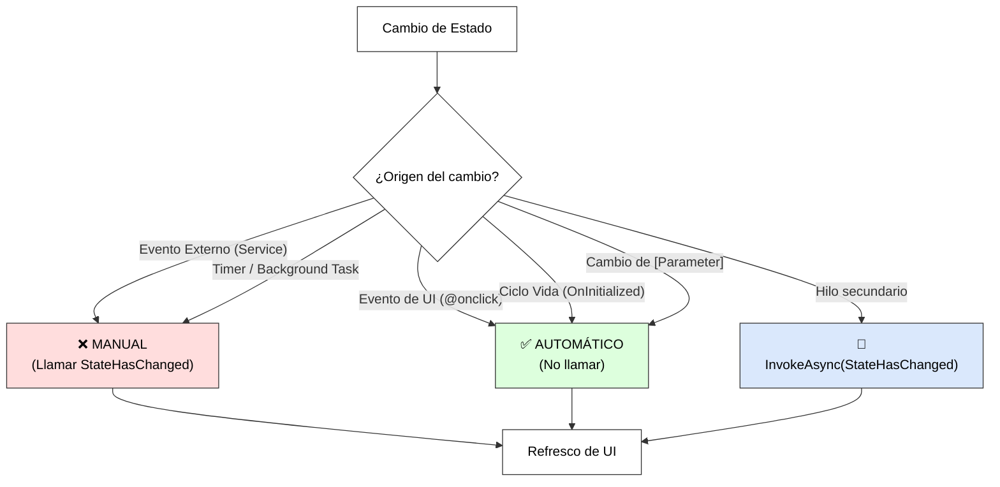

| Tipo de Escenario        | ¿Llamar StateHasChanged? | Razón Técnica                                                   |
| :----------------------- | :----------------------- | :-------------------------------------------------------------- |
| **Eventos de UI**        | ❌ No                     | Blazor envuelve los manejadores (@onclick) y llama al terminar. |
| **Timers/Suscripciones** | ✅ Sí                     | El sistema no sabe que una variable cambió fuera de su flujo.   |
| **Tasks en background**  | ✅ Sí (con InvokeAsync)   | Asegura que el refresco ocurra en el hilo de la UI.             |

📝 **Nota del Profesor**: 
> No abuses de `StateHasChanged()`. Llamarlo innecesariamente obliga al servidor a recalcular el DOM virtual y consume CPU. Úsalo solo cuando la UI no se actualice por sí sola tras un cambio en una variable que el usuario deba ver.


---

#### 7.3.1.3. IDisposable para limpieza de recursos

```razor
@* Components/ComponenteConLimpieza.razor *@
@inject HttpClient HttpClient
@implements IDisposable

<div class="card">
    <div class="card-body">
        <h5>Datos en tiempo real</h5>
        <p>Últimos datos:  @ultimoDato</p>
        <p>Actualizaciones recibidas: @contadorActualizaciones</p>
    </div>
</div>

@code {
    // ════════════════════════════════════════════════════════
    // RECURSOS QUE NECESITAN LIMPIEZA
    // ════════════════════════════════════════════════════════
    
    private Timer? timer;
    private HttpClient? httpClientLocal;
    private CancellationTokenSource? cts;
    private IDisposable? suscripcion;
    
    private string ultimoDato = "";
    private int contadorActualizaciones = 0;
    
    protected override void OnInitialized()
    {
        // ────────────────────────────────────────────────────
        // RECURSO 1: Timer
        // ────────────────────────────────────────────────────
        timer = new Timer(async _ =>
        {
            await ActualizarDatos();
            contadorActualizaciones++;
            await InvokeAsync(StateHasChanged);
        }, null, TimeSpan.Zero, TimeSpan.FromSeconds(5));
        
        // ────────────────────────────────────────────────────
        // RECURSO 2: HttpClient propio
        // ────────────────────────────────────────────────────
        httpClientLocal = new HttpClient
        {
            BaseAddress = new Uri("https://api.ejemplo.com")
        };
        
        // ────────────────────────────────────────────────────
        // RECURSO 3: CancellationTokenSource
        // ────────────────────────────────────────────────────
        cts = new CancellationTokenSource();
        
        // Iniciar tarea de larga duración
        _ = TareaLargaDuracion(cts.Token);
        
        // ────────────────────────────────────────────────────
        // RECURSO 4: Suscripción a servicio
        // ────────────────────────────────────────────────────
        // suscripcion = notificationService.Subscribe(OnNotification);
    }
    
    private async Task ActualizarDatos()
    {
        try
        {
            // Simular obtención de datos
            ultimoDato = DateTime.Now.ToString("HH:mm:ss");
        }
        catch
        {
            // Manejar error
        }
    }
    
    private async Task TareaLargaDuracion(CancellationToken cancellationToken)
    {
        try
        {
            while (!cancellationToken.IsCancellationRequested)
            {
                await Task.Delay(10000, cancellationToken);
                // Procesar... 
            }
        }
        catch (TaskCanceledException)
        {
            // Tarea cancelada correctamente
        }
    }
    
    // ════════════════════════════════════════════════════════
    // DISPOSE:  LIMPIEZA DE TODOS LOS RECURSOS
    // ════════════════════════════════════════════════════════
    
    public void Dispose()
    {
        // ────────────────────────────────────────────────────
        // LIMPIAR TODOS LOS RECURSOS EN ORDEN
        // ────────────────────────────────────────────────────
        
        // 1. Cancelar tareas en ejecución
        cts?.Cancel();
        cts?.Dispose();
        
        // 2. Detener y liberar timer
        timer?.Dispose();
        
        // 3. Liberar HttpClient propio
        httpClientLocal?.Dispose();
        
        // 4. Desuscribirse de eventos
        suscripcion?. Dispose();
        
        Console.WriteLine("Componente limpiado correctamente");
    }
}
```

**Patrón de IDisposable con try-finally:**

```csharp
// Patrón robusto para Dispose
public void Dispose()
{
    try
    {
        // Cancelar operaciones asíncronas
        cts?.Cancel();
    }
    catch (Exception ex)
    {
        Console.WriteLine($"Error al cancelar:   {ex.Message}");
    }
    finally
    {
        // Siempre liberar recursos
        cts?.Dispose();
        timer?.Dispose();
        httpClient?.Dispose();
    }
}
```

**Errores comunes y soluciones:**

```csharp
// ❌ ERROR 1: No implementar IDisposable cuando hay timer
@code {
    private Timer? timer;
    
    protected override void OnInitialized()
    {
        timer = new Timer(_ => { }, null, 0, 1000);
    }
    
    // PROBLEMA: El timer sigue ejecutándose aunque el componente se destruya
    // SOLUCIÓN: Implementar IDisposable y llamar timer.Dispose()
}

// ❌ ERROR 2: Dispose sin protección contra null
public void Dispose()
{
    timer. Dispose(); // ← NullReferenceException si timer es null
}

// ✅ CORRECTO: Usar null-conditional operator
public void Dispose()
{
    timer?.Dispose(); // ← Seguro
}

// ❌ ERROR 3: No desuscribirse de eventos
protected override void OnInitialized()
{
    EventService.OnDataChanged += HandleDataChanged;
}

// PROBLEMA: Memory leak - el componente no se puede liberar
// SOLUCIÓN:  Desuscribirse en Dispose

public void Dispose()
{
    EventService.OnDataChanged -= HandleDataChanged;
}

// ❌ ERROR 4: Usar Dispose para lógica de negocio
public void Dispose()
{
    // Esto NO está garantizado que se ejecute
    await _service.GuardarCambiosAsync();
}

// PROBLEMA: Dispose puede no ejecutarse (crash, cierre abrupto)
// SOLUCIÓN: Guardar cambios en eventos explícitos (botón Guardar)
```

---

### 7.3.2. Manejo de Eventos en tiempo real

#### 7.3.2.1. Eventos de ratón: @onclick, @ondblclick

```razor
@* Components/EventosRaton.razor *@

<div class="card">
    <div class="card-body">
        <h5>Eventos de Ratón</h5>
        
        @* ════════════════════════════════════════════════════ *@
        @* @onclick - Clic simple                               *@
        @* ════════════════════════════════════════════════════ *@
        
        <button class="btn btn-primary" @onclick="OnClick">
            Clic Simple (contador: @contadorClics)
        </button>
        
        @* ────────────────────────────────────────────────────── *@
        @* @onclick con parámetros                                *@
        @* ────────────────────────────────────────────────────── *@
        
        <button class="btn btn-success" @onclick="() => IncrementarPor(5)">
            Incrementar por 5
        </button>
        
        <button class="btn btn-info" @onclick="@(e => OnClickConEvento(e))">
            Clic con info del evento
        </button>
        
        @* ════════════════════════════════════════════════════ *@
        @* @ondblclick - Doble clic                             *@
        @* ════════════════════════════════════════════════════ *@
        
        <button class="btn btn-warning" @ondblclick="OnDobleClick">
            Doble Clic (contador: @contadorDobleClics)
        </button>
        
        @* ════════════════════════════════════════════════════ *@
        @* @onmousedown / @onmouseup - Presionar/Soltar         *@
        @* ════════════════════════════════════════════════════ *@
        
        <button class="btn btn-secondary" 
                @onmousedown="OnMouseDown" 
                @onmouseup="OnMouseUp">
            Mantén presionado:  @(presionado ? "PRESIONADO" : "Soltado")
        </button>
        
        @* ════════════════════════════════════════════════════ *@
        @* @onmouseover / @onmouseout - Hover                   *@
        @* ════════════════════════════════════════════════════ *@
        
        <div class="border p-3 mt-3" 
             @onmouseover="OnMouseOver" 
             @onmouseout="OnMouseOut"
             style="background-color: @colorHover;">
            Pasa el ratón por encima
        </div>
        
        @* ════════════════════════════════════════════════════ *@
        @* @onmousemove - Movimiento del ratón                  *@
        @* ════════════════════════════════════════════════════ *@
        
        <div class="border p-3 mt-3" @onmousemove="OnMouseMove">
            Mueve el ratón aquí:  X=@mouseX, Y=@mouseY
        </div>
        
        @* ════════════════════════════════════════════════════ *@
        @* @oncontextmenu - Clic derecho                        *@
        @* ════════════════════════════════════════════════════ *@
        
        <div class="border p-3 mt-3" 
             @oncontextmenu="OnContextMenu" 
             @oncontextmenu:preventDefault="true">
            Clic derecho aquí (menú personalizado)
            @if (mostrarMenuContexto)
            {
                <div class="position-absolute bg-white border shadow p-2">
                    <div class="menu-item" @onclick="AccionContexto1">Opción 1</div>
                    <div class="menu-item" @onclick="AccionContexto2">Opción 2</div>
                </div>
            }
        </div>
    </div>
</div>

@code {
    // ════════════════════════════════════════════════════════
    // ESTADO DEL COMPONENTE
    // ════════════════════════════════════════════════════════
    
    private int contadorClics = 0;
    private int contadorDobleClics = 0;
    private bool presionado = false;
    private string colorHover = "white";
    private double mouseX = 0;
    private double mouseY = 0;
    private bool mostrarMenuContexto = false;
    
    // ════════════════════════════════════════════════════════
    // HANDLERS DE EVENTOS
    // ════════════════════════════════════════════════════════
    
    // Clic simple sin parámetros
    private void OnClick()
    {
        contadorClics++;
    }
    
    // Clic con parámetro custom
    private void IncrementarPor(int cantidad)
    {
        contadorClics += cantidad;
    }
    
    // Clic con acceso al evento
    private void OnClickConEvento(MouseEventArgs e)
    {
        Console.WriteLine($"Clic en posición: X={e.ClientX}, Y={e.ClientY}");
        Console.WriteLine($"Botón: {e.Button}"); // 0=izq, 1=medio, 2=der
        Console.WriteLine($"Shift presionado: {e.ShiftKey}");
        Console.WriteLine($"Ctrl presionado: {e.CtrlKey}");
        Console.WriteLine($"Alt presionado:  {e.AltKey}");
    }
    
    // Doble clic
    private void OnDobleClick()
    {
        contadorDobleClics++;
    }
    
    // Mouse down/up
    private void OnMouseDown()
    {
        presionado = true;
    }
    
    private void OnMouseUp()
    {
        presionado = false;
    }
    
    // Hover
    private void OnMouseOver()
    {
        colorHover = "lightblue";
    }
    
    private void OnMouseOut()
    {
        colorHover = "white";
    }
    
    // Movimiento
    private void OnMouseMove(MouseEventArgs e)
    {
        mouseX = e.ClientX;
        mouseY = e. ClientY;
    }
    
    // Clic derecho
    private void OnContextMenu(MouseEventArgs e)
    {
        mostrarMenuContexto = true;
    }
    
    private void AccionContexto1()
    {
        Console.WriteLine("Acción 1");
        mostrarMenuContexto = false;
    }
    
    private void AccionContexto2()
    {
        Console.WriteLine("Acción 2");
        mostrarMenuContexto = false;
    }
}
```

---

#### 7.3.2.2. Eventos de teclado: @onkeydown, @onkeyup

```razor
@* Components/EventosTeclado.razor *@

<div class="card">
    <div class="card-body">
        <h5>Eventos de Teclado</h5>
        
        @* ════════════════════════════════════════════════════ *@
        @* @onkeydown - Tecla presionada                        *@
        @* ════════════════════════════════════════════════════ *@
        
        <div class="mb-3">
            <label>Presiona teclas (muestra KeyCode)</label>
            <input type="text" 
                   class="form-control" 
                   @onkeydown="OnKeyDown" 
                   placeholder="Escribe aquí..." />
            <small>Última tecla: @ultimaTecla</small>
        </div>
        
        @* ════════════════════════════════════════════════════ *@
        @* @onkeyup - Tecla soltada                             *@
        @* ════════════════════════════════════════════════════ *@
        
        <div class="mb-3">
            <label>Cuenta caracteres al soltar tecla</label>
            <input type="text" 
                   class="form-control" 
                   @onkeyup="OnKeyUp" 
                   @bind="textoContador" />
            <small>Caracteres: @textoContador. Length</small>
        </div>
        
        @* ════════════════════════════════════════════════════ *@
        @* Enter para enviar                                    *@
        @* ════════════════════════════════════════════════════ *@
        
        <div class="mb-3">
            <label>Presiona Enter para agregar</label>
            <input type="text" 
                   class="form-control" 
                   @bind="nuevoItem" 
                   @onkeydown="OnKeyDownEnter" 
                   placeholder="Escribe y presiona Enter" />
            
            <ul class="mt-2">
                @foreach (var item in items)
                {
                    <li>@item</li>
                }
            </ul>
        </div>
        
        @* ════════════════════════════════════════════════════ *@
        @* Atajos de teclado (Ctrl+S, etc.)                    *@
        @* ════════════════════════════════════════════════════ *@
        
        <div class="mb-3">
            <label>Prueba atajos de teclado</label>
            <textarea class="form-control" 
                      rows="4" 
                      @onkeydown="OnKeyDownAtajos" 
                      @bind="textoEditor"></textarea>
            <small class="text-muted">
                Atajos: Ctrl+S (Guardar), Ctrl+B (Negrita), Esc (Cancelar)
            </small>
            <div class="mt-2">
                @if (! string.IsNullOrEmpty(mensajeAtajo))
                {
                    <div class="alert alert-info">@mensajeAtajo</div>
                }
            </div>
        </div>
        
        @* ════════════════════════════════════════════════════ *@
        @* Navegación con flechas                               *@
        @* ════════════════════════════════════════════════════ *@
        
        <div class="mb-3">
            <label>Navega con las flechas</label>
            <div class="border p-3" 
                 tabindex="0" 
                 @onkeydown="OnKeyDownFlechas">
                <div style="text-align: center;">
                    <div style="margin-bottom: 10px;">↑</div>
                    <div>← Posición:  (@posX, @posY) →</div>
                    <div style="margin-top: 10px;">↓</div>
                </div>
            </div>
        </div>
    </div>
</div>

@code {
    // ════════════════════════════════════════════════════════
    // ESTADO
    // ════════════════════════════════════════════════════════
    
    private string ultimaTecla = "";
    private string textoContador = "";
    private string nuevoItem = "";
    private List<string> items = new();
    private string textoEditor = "";
    private string mensajeAtajo = "";
    private int posX = 0;
    private int posY = 0;
    
    // ════════════════════════════════════════════════════════
    // HANDLERS
    // ════════════════════════════════════════════════════════
    
    private void OnKeyDown(KeyboardEventArgs e)
    {
        ultimaTecla = $"Key: {e.Key}, Code: {e.Code}, KeyCode: {e.KeyCode}";
        
        // Propiedades útiles de KeyboardEventArgs: 
        // e.Key      - "a", "Enter", "ArrowUp", etc.
        // e.Code     - "KeyA", "Enter", "ArrowUp", etc.
        // e. KeyCode  - Código numérico (obsoleto pero disponible)
        // e. CtrlKey  - true si Ctrl está presionado
        // e.ShiftKey - true si Shift está presionado
        // e. AltKey   - true si Alt está presionado
        // e.MetaKey  - true si Cmd (Mac) o Win está presionado
    }
    
    private void OnKeyUp(KeyboardEventArgs e)
    {
        // textoContador ya está actualizado por @bind
    }
    
    private void OnKeyDownEnter(KeyboardEventArgs e)
    {
        if (e.Key == "Enter" && !  string.IsNullOrWhiteSpace(nuevoItem))
        {
            items.Add(nuevoItem);
            nuevoItem = "";
        }
    }
    
    private async Task OnKeyDownAtajos(KeyboardEventArgs e)
    {
        mensajeAtajo = "";
        
        // Ctrl+S: Guardar
        if (e. CtrlKey && e.Key == "s")
        {
            e.PreventDefault(); // Evitar guardar página del navegador
            mensajeAtajo = "💾 Guardado!";
            await Task.Delay(2000);
            mensajeAtajo = "";
        }
        
        // Ctrl+B: Negrita
        else if (e.CtrlKey && e.Key == "b")
        {
            e.PreventDefault();
            textoEditor += " **texto en negrita** ";
        }
        
        // Escape: Cancelar
        else if (e.Key == "Escape")
        {
            textoEditor = "";
            mensajeAtajo = "❌ Cancelado";
            await Task.Delay(2000);
            mensajeAtajo = "";
        }
    }
    
    private void OnKeyDownFlechas(KeyboardEventArgs e)
    {
        switch (e.Key)
        {
            case "ArrowUp": 
                posY--;
                break;
            case "ArrowDown":
                posY++;
                break;
            case "ArrowLeft":
                posX--;
                break;
            case "ArrowRight":
                posX++;
                break;
        }
    }
}
```

---

#### 7.3.2.3. Eventos de formulario: @onsubmit, @oninput, @onchange

```razor
@* Components/EventosFormulario.razor *@

<div class="card">
    <div class="card-body">
        <h5>Eventos de Formulario</h5>
        
        @* ════════════════════════════════════════════════════ *@
        @* @onsubmit - Envío de formulario                      *@
        @* ════════════════════════════════════════════════════ *@
        
        <form @onsubmit="OnSubmit" @onsubmit:preventDefault="true">
            <div class="mb-3">
                <label>Nombre</label>
                <input type="text" class="form-control" @bind="nombre" />
            </div>
            
            <div class="mb-3">
                <label>Email</label>
                <input type="email" class="form-control" @bind="email" />
            </div>
            
            <button type="submit" class="btn btn-primary">Enviar</button>
        </form>
        
        @if (formularioEnviado)
        {
            <div class="alert alert-success mt-3">
                Formulario enviado:   @nombre - @email
            </div>
        }
        
        <hr />
        
        @* ════════════════════════════════════════════════════ *@
        @* @oninput - Cambio en tiempo real (cada tecla)        *@
        @* ════════════════════════════════════════════════════ *@
        
        <div class="mb-3">
            <label>Búsqueda en tiempo real</label>
            <input type="text" 
                   class="form-control" 
                   @oninput="OnInputBusqueda" 
                   placeholder="Escribe para buscar..." />
            <small>Buscando: @terminoBusqueda</small>
            
            @if (! string.IsNullOrEmpty(terminoBusqueda))
            {
                <div class="mt-2">
                    <strong>Resultados filtrados:</strong>
                    @foreach (var resultado in resultadosFiltrados)
                    {
                        <div class="badge bg-info me-1">@resultado</div>
                    }
                </div>
            }
        </div>
        
        <hr />
        
        @* ════════════════════════════════════════════════════ *@
        @* @onchange - Cambio al perder foco                    *@
        @* ════════════════════════════════════════════════════ *@
        
        <div class="mb-3">
            <label>Edad (se valida al salir del campo)</label>
            <input type="number" 
                   class="form-control" 
                   @onchange="OnChangeEdad" 
                   placeholder="Introduce tu edad" />
            
            @if (!  string.IsNullOrEmpty(mensajeValidacion))
            {
                <div class="alert alert-@(edadValida ? "success" : "danger") mt-2">
                    @mensajeValidacion
                </div>
            }
        </div>
        
        <hr />
        
        @* ════════════════════════════════════════════════════ *@
        @* @onfocus / @onblur - Enfoque y desenfoque            *@
        @* ════════════════════════════════════════════════════ *@
        
        <div class="mb-3">
            <label>Campo con indicador de foco</label>
            <input type="text" 
                   class="form-control @(tieneFoco ? "border-primary" : "")" 
                   @onfocus="OnFocus" 
                   @onblur="OnBlur" 
                   placeholder="Haz clic aquí" />
            <small>Estado: @(tieneFoco ? "CON FOCO" : "Sin foco")</small>
        </div>
        
        <hr />
        
        @* ════════════════════════════════════════════════════ *@
        @* Select con @onchange                                 *@
        @* ════════════════════════════════════════════════════ *@
        
        <div class="mb-3">
            <label>Categoría</label>
            <select class="form-select" @onchange="OnChangeCategoria">
                <option value="">Selecciona... </option>
                <option value="Pop">Funko Pop</option>
                <option value="Soda">Funko Soda</option>
                <option value="Mystery">Mystery Box</option>
            </select>
            
            @if (! string.IsNullOrEmpty(categoriaSeleccionada))
            {
                <div class="mt-2">
                    Seleccionaste: <strong>@categoriaSeleccionada</strong>
                </div>
            }
        </div>
        
        <hr />
        
        @* ════════════════════════════════════════════════════ *@
        @* Checkbox con @onchange                               *@
        @* ════════════════════════════════════════════════════ *@
        
        <div class="mb-3">
            <div class="form-check">
                <input type="checkbox" 
                       class="form-check-input" 
                       id="acepto" 
                       @onchange="OnChangeCheckbox" />
                <label class="form-check-label" for="acepto">
                    Acepto términos y condiciones
                </label>
            </div>
            
            <button class="btn btn-success mt-2" disabled="@(!aceptoTerminos)">
                Continuar
            </button>
        </div>
    </div>
</div>

@code {
    // ════════════════════════════════════════════════════════
    // ESTADO
    // ════════════════════════════════════════════════════════
    
    // Formulario
    private string nombre = "";
    private string email = "";
    private bool formularioEnviado = false;
    
    // Búsqueda
    private string terminoBusqueda = "";
    private List<string> todosLosItems = new() 
    { 
        "Darth Vader", "Luke Skywalker", "Princess Leia", 
        "Han Solo", "Yoda", "Chewbacca" 
    };
    private List<string> resultadosFiltrados = new();
    
    // Validación
    private string mensajeValidacion = "";
    private bool edadValida = false;
    
    // Foco
    private bool tieneFoco = false;
    
    // Select
    private string categoriaSeleccionada = "";
    
    // Checkbox
    private bool aceptoTerminos = false;
    
    // ════════════════════════════════════════════════════════
    // HANDLERS
    // ════════════════════════════════════════════════════════
    
    private void OnSubmit()
    {
        formularioEnviado = true;
        Console.WriteLine($"Formulario enviado:   {nombre}, {email}");
    }
    
    private void OnInputBusqueda(ChangeEventArgs e)
    {
        terminoBusqueda = e.Value?.ToString() ?? "";
        
        // Filtrar en tiempo real
        if (string.IsNullOrWhiteSpace(terminoBusqueda))
        {
            resultadosFiltrados. Clear();
        }
        else
        {
            resultadosFiltrados = todosLosItems
                .Where(item => item.  Contains(terminoBusqueda, StringComparison.OrdinalIgnoreCase))
                .ToList();
        }
    }
    
    private void OnChangeEdad(ChangeEventArgs e)
    {
        if (int.TryParse(e. Value?.ToString(), out int edad))
        {
            if (edad < 0)
            {
                mensajeValidacion = "La edad no puede ser negativa";
                edadValida = false;
            }
            else if (edad < 18)
            {
                mensajeValidacion = "Debes ser mayor de 18 años";
                edadValida = false;
            }
            else if (edad > 120)
            {
                mensajeValidacion = "Edad no válida";
                edadValida = false;
            }
            else
            {
                mensajeValidacion = "✓ Edad válida";
                edadValida = true;
            }
        }
        else
        {
            mensajeValidacion = "Introduce un número válido";
            edadValida = false;
        }
    }
    
    private void OnFocus()
    {
        tieneFoco = true;
    }
    
    private void OnBlur()
    {
        tieneFoco = false;
    }
    
    private void OnChangeCategoria(ChangeEventArgs e)
    {
        categoriaSeleccionada = e.Value?.ToString() ?? "";
    }
    
    private void OnChangeCheckbox(ChangeEventArgs e)
    {
        aceptoTerminos = (bool)(e.Value ??  false);
    }
}
```

---

#### 7.3.2.4. EventCallback y EventCallback<T> para comunicación entre componentes

```razor
@* ════════════════════════════════════════════════════════════ *@
@* COMPONENTE HIJO:  Botón con evento                            *@
@* ════════════════════════════════════════════════════════════ *@

@* Components/BotonPersonalizado.razor *@

<button class="btn btn-@Tipo" @onclick="OnClickInterno">
    @if (Cargando)
    {
        <span class="spinner-border spinner-border-sm me-2"></span>
    }
    @Texto
</button>

@code {
    [Parameter]
    public string Texto { get; set; } = "Click";
    
    [Parameter]
    public string Tipo { get; set; } = "primary"; // primary, success, danger, etc.
    
    [Parameter]
    public bool Cargando { get; set; }
    
    // ════════════════════════════════════════════════════════
    // EventCallback SIN parámetros
    // ════════════════════════════════════════════════════════
    [Parameter]
    public EventCallback OnClick { get; set; }
    
    private async Task OnClickInterno()
    {
        // Notificar al componente padre
        await OnClick.InvokeAsync();
    }
}

@* ════════════════════════════════════════════════════════════ *@
@* COMPONENTE HIJO:   Input con evento tipado                     *@
@* ════════════════════════════════════════════════════════════ *@

@* Components/BuscadorPersonalizado.razor *@

<div class="input-group">
    <input type="text" 
           class="form-control" 
           placeholder="@Placeholder" 
           @bind="valorActual" 
           @oninput="OnInputInterno" />
    
    @if (! string.IsNullOrEmpty(valorActual))
    {
        <button class="btn btn-outline-secondary" @onclick="Limpiar">
            <i class="fas fa-times"></i>
        </button>
    }
</div>

@code {
    [Parameter]
    public string Placeholder { get; set; } = "Buscar...";
    
    private string valorActual = "";
    
    // ════════════════════════════════════════════════════════
    // EventCallback<T> CON parámetro (string en este caso)
    // ════════════════════════════════════════════════════════
    [Parameter]
    public EventCallback<string> OnBusqueda { get; set; }
    
    [Parameter]
    public EventCallback OnLimpiar { get; set; }
    
    private async Task OnInputInterno(ChangeEventArgs e)
    {
        valorActual = e.Value?. ToString() ?? "";
        
        // Notificar al padre con el nuevo valor
        await OnBusqueda.InvokeAsync(valorActual);
    }
    
    private async Task Limpiar()
    {
        valorActual = "";
        await OnLimpiar. InvokeAsync();
    }
}

@* ════════════════════════════════════════════════════════════ *@
@* COMPONENTE PADRE:   Usando los componentes hijos              *@
@* ════════════════════════════════════════════════════════════ *@

@* Components/PaginaPadre.razor *@

<div class="container">
    <h3>Comunicación entre componentes</h3>
    
    @* ────────────────────────────────────────────────────── *@
    @* Uso de BotonPersonalizado                             *@
    @* ────────────────────────────────────────────────────── *@
    
    <div class="mb-3">
        <BotonPersonalizado 
            Texto="Guardar" 
            Tipo="success" 
            Cargando="@guardando"
            OnClick="Guardar" />
        
        <BotonPersonalizado 
            Texto="Cancelar" 
            Tipo="secondary" 
            OnClick="Cancelar" />
    </div>
    
    @* ────────────────────────────────────────────────────── *@
    @* Uso de BuscadorPersonalizado                          *@
    @* ────────────────────────────────────────────────────── *@
    
    <div class="mb-3">
        <BuscadorPersonalizado 
            Placeholder="Buscar funkos..." 
            OnBusqueda="HandleBusqueda"
            OnLimpiar="HandleLimpiar" />
    </div>
    
    <div>
        <p>Término de búsqueda: @terminoBusqueda</p>
        
        @if (resultados.Any())
        {
            <ul>
                @foreach (var resultado in resultados)
                {
                    <li>@resultado</li>
                }
            </ul>
        }
    </div>
</div>

@code {
    // ════════════════════════════════════════════════════════
    // ESTADO DEL PADRE
    // ════════════════════════════════════════════════════════
    
    private bool guardando = false;
    private string terminoBusqueda = "";
    private List<string> todosLosItems = new() 
    { 
        "Darth Vader", "Luke Skywalker", "Yoda", "Chewbacca" 
    };
    private List<string> resultados = new();
    
    // ════════════════════════════════════════════════════════
    // HANDLERS DE EVENTOS DE COMPONENTES HIJOS
    // ════════════════════════════════════════════════════════
    
    private async Task Guardar()
    {
        guardando = true;
        await Task.Delay(2000); // Simular guardado
        guardando = false;
        
        Console.WriteLine("Guardado completado");
    }
    
    private void Cancelar()
    {
        Console.WriteLine("Operación cancelada");
    }
    
    private void HandleBusqueda(string termino)
    {
        terminoBusqueda = termino;
        
        if (string.IsNullOrWhiteSpace(termino))
        {
            resultados.Clear();
        }
        else
        {
            resultados = todosLosItems
                .Where(item => item.Contains(termino, StringComparison.OrdinalIgnoreCase))
                .ToList();
        }
    }
    
    private void HandleLimpiar()
    {
        terminoBusqueda = "";
        resultados.Clear();
    }
}
```

**Ejemplo avanzado:    Comunicación bidireccional compleja**

```razor
@* Components/EditorFunko.razor (hijo) *@

<div class="card">
    <div class="card-header">
        Editor de Funko
    </div>
    <div class="card-body">
        <div class="mb-3">
            <label>Nombre</label>
            <input class="form-control" @bind="funkoLocal. Nombre" />
        </div>
        
        <div class="mb-3">
            <label>Precio</label>
            <input type="number" class="form-control" @bind="funkoLocal. Precio" />
        </div>
        
        <button class="btn btn-primary" @onclick="Guardar">Guardar</button>
        <button class="btn btn-secondary" @onclick="Cancelar">Cancelar</button>
    </div>
</div>

@code {
    [Parameter]
    public FunkoDto Funko { get; set; } = new();
    
    // ════════════════════════════════════════════════════════
    // Múltiples EventCallbacks con diferentes tipos
    // ════════════════════════════════════════════════════════
    
    [Parameter]
    public EventCallback<FunkoDto> OnGuardar { get; set; }
    
    [Parameter]
    public EventCallback OnCancelar { get; set; }
    
    [Parameter]
    public EventCallback<string> OnError { get; set; }
    
    private FunkoDto funkoLocal = new();
    
    protected override void OnParametersSet()
    {
        // Clonar para no modificar el original hasta guardar
        funkoLocal = new FunkoDto
        {
            Id = Funko.Id,
            Nombre = Funko. Nombre,
            Precio = Funko.Precio
        };
    }
    
    private async Task Guardar()
    {
        // Validar
        if (string.IsNullOrWhiteSpace(funkoLocal.Nombre))
        {
            await OnError.InvokeAsync("El nombre es obligatorio");
            return;
        }
        
        if (funkoLocal.Precio <= 0)
        {
            await OnError.InvokeAsync("El precio debe ser mayor que 0");
            return;
        }
        
        // Notificar al padre con el funko modificado
        await OnGuardar.InvokeAsync(funkoLocal);
    }
    
    private async Task Cancelar()
    {
        await OnCancelar.InvokeAsync();
    }
}

@* Componente padre que usa EditorFunko *@

@* Pages/GestionFunkos.razor *@

<div class="container">
    @if (editando)
    {
        <EditorFunko 
            Funko="@funkoSeleccionado" 
            OnGuardar="HandleGuardar"
            OnCancelar="HandleCancelar"
            OnError="HandleError" />
    }
    else
    {
        <div class="row">
            @foreach (var funko in funkos)
            {
                <div class="col-md-4">
                    <div class="card">
                        <div class="card-body">
                            <h5>@funko.Nombre</h5>
                            <p>@funko.Precio. ToString("C")</p>
                            <button class="btn btn-sm btn-warning" 
                                    @onclick="() => Editar(funko)">
                                Editar
                            </button>
                        </div>
                    </div>
                </div>
            }
        </div>
    }
    
    @if (!  string.IsNullOrEmpty(mensajeError))
    {
        <div class="alert alert-danger mt-3">@mensajeError</div>
    }
</div>

@code {
    private List<FunkoDto> funkos = new();
    private FunkoDto funkoSeleccionado = new();
    private bool editando = false;
    private string mensajeError = "";
    
    private void Editar(FunkoDto funko)
    {
        funkoSeleccionado = funko;
        editando = true;
    }
    
    private async Task HandleGuardar(FunkoDto funkoModificado)
    {
        // Actualizar en la lista
        var index = funkos.FindIndex(f => f.Id == funkoModificado.Id);
        if (index >= 0)
        {
            funkos[index] = funkoModificado;
        }
        
        editando = false;
        mensajeError = "";
        
        // Aquí guardarías en BD
        // await _service.ActualizarAsync(funkoModificado);
    }
    
    private void HandleCancelar()
    {
        editando = false;
        mensajeError = "";
    }
    
    private void HandleError(string error)
    {
        mensajeError = error;
    }
}
```

---

##### Resumen de EventCallback vs EventCallback<T>

La comunicación entre componentes en Blazor se basa en el patrón de **Subida de Eventos**. Mientras que los datos bajan del padre al hijo vía `[Parameter]`, las acciones e información suben del hijo al padre mediante `EventCallback`.

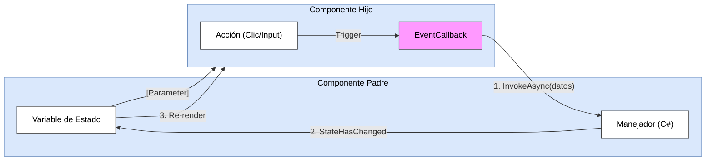

| Tipo de Callback     | ¿Envía Datos? | Caso de Uso                                         | Ejemplo de Invocación                  |
| :------------------- | :------------ | :-------------------------------------------------- | :------------------------------------- |
| **EventCallback**    | ❌ No          | Notificaciones simples (Cerrar, Cancelar).          | `await OnClose.InvokeAsync();`         |
| **EventCallback<T>** | ✅ Sí          | Enviar información tipada (ID seleccionado, Texto). | `await OnSearch.InvokeAsync("vader");` |

**¿Por qué usar EventCallback en lugar de un `Action` de C#?**
Blazor es inteligente: cuando usas `EventCallback`, el framework sabe que el **Componente Padre** probablemente ha cambiado su estado. Por ello, llama automáticamente a `StateHasChanged()` en el padre tras ejecutarse el método, ahorrándote líneas de código y asegurando que la interfaz se refresque siempre.

📝 **Nota del Profesor**: 
> Nunca uses `Action` o `Func` para eventos de UI. Aunque funcionan como delegados de C#, no disparan el refresco de la interfaz en Blazor, lo que dejaría tu aplicación "congelada" visualmente aunque los datos hayan cambiado por detrás.


---

### 7.3.3. Data Binding: El flujo de datos

#### 7.3.3.1. Binding unidireccional: value="@variable"

```razor
@* Components/BindingUnidireccional.razor *@

<div class="card">
    <div class="card-body">
        <h5>Binding Unidireccional</h5>
        
        @* ════════════════════════════════════════════════════ *@
        @* SOLO LECTURA:  La variable fluye hacia la vista      *@
        @* ════════════════════════════════════════════════════ *@
        
        <div class="mb-3">
            <label>Nombre (solo lectura)</label>
            <input type="text" class="form-control" value="@nombre" readonly />
            <small>El input muestra el valor pero no puede modificarlo</small>
        </div>
        
        @* ────────────────────────────────────────────────────── *@
        @* Para cambiar el valor, usar botones                    *@
        @* ────────────────────────────────────────────────────── *@
        
        <button class="btn btn-primary" @onclick="CambiarNombre">
            Cambiar nombre
        </button>
        
        <hr />
        
        @* ════════════════════════════════════════════════════ *@
        @* MOSTRAR VALORES EN TEXTO                             *@
        @* ════════════════════════════════════════════════════ *@
        
        <div class="mb-3">
            <p>Contador: <strong>@contador</strong></p>
            <p>Precio: <strong>@precio. ToString("C")</strong></p>
            <p>Fecha: <strong>@fecha. ToString("dd/MM/yyyy")</strong></p>
            <p>Activo: <strong>@(activo ? "Sí" : "No")</strong></p>
        </div>
        
        <div class="btn-group">
            <button class="btn btn-success" @onclick="() => contador++">+</button>
            <button class="btn btn-danger" @onclick="() => contador--">-</button>
        </div>
    </div>
</div>

@code {
    private string nombre = "Darth Vader";
    private int contador = 0;
    private decimal precio = 24.99m;
    private DateTime fecha = DateTime.Now;
    private bool activo = true;
    
    private void CambiarNombre()
    {
        nombre = nombre == "Darth Vader" ?  "Luke Skywalker" :  "Darth Vader";
    }
}
```

---

#### 7.3.3.2. Binding bidireccional: @bind="variable"

```razor
@* Components/BindingBidireccional.razor *@

<div class="card">
    <div class="card-body">
        <h5>Binding Bidireccional</h5>
        
        @* ════════════════════════════════════════════════════ *@
        @* @bind - AUTOMÁTICO (onchange por defecto)            *@
        @* ════════════════════════════════════════════════════ *@
        
        <div class="mb-3">
            <label>Nombre</label>
            <input type="text" class="form-control" @bind="nombre" />
            <small>Valor actual: @nombre</small>
        </div>
        
        @* Binding con diferentes tipos *@
        
        <div class="mb-3">
            <label>Edad</label>
            <input type="number" class="form-control" @bind="edad" />
            <small>Tipo: int - Valor: @edad</small>
        </div>
        
        <div class="mb-3">
            <label>Precio</label>
            <input type="number" step="0.01" class="form-control" @bind="precio" />
            <small>Tipo: decimal - Valor: @precio. ToString("C")</small>
        </div>
        
        <div class="mb-3">
            <label>Fecha de nacimiento</label>
            <input type="date" class="form-control" @bind="fechaNacimiento" />
            <small>Tipo: DateTime - Valor: @fechaNacimiento.ToString("dd/MM/yyyy")</small>
        </div>
        
        <div class="mb-3 form-check">
            <input type="checkbox" class="form-check-input" id="activo" @bind="activo" />
            <label class="form-check-label" for="activo">Activo</label>
            <small class="d-block">Tipo: bool - Valor: @activo</small>
        </div>
        
        <div class="mb-3">
            <label>Categoría</label>
            <select class="form-select" @bind="categoria">
                <option value="">Selecciona... </option>
                <option value="Pop">Funko Pop</option>
                <option value="Soda">Funko Soda</option>
                <option value="Mystery">Mystery Box</option>
            </select>
            <small>Valor: @categoria</small>
        </div>
        
        <div class="mb-3">
            <label>Descripción</label>
            <textarea class="form-control" rows="3" @bind="descripcion"></textarea>
            <small>Caracteres: @descripcion.Length</small>
        </div>
        
        @* ════════════════════════════════════════════════════ *@
        @* Radio buttons                                        *@
        @* ════════════════════════════════════════════════════ *@
        
        <div class="mb-3">
            <label>Prioridad</label>
            <div>
                <div class="form-check form-check-inline">
                    <input class="form-check-input" type="radio" name="prioridad" 
                           id="baja" value="Baja" @onchange="@(() => prioridad = "Baja")" 
                           checked="@(prioridad == "Baja")" />
                    <label class="form-check-label" for="baja">Baja</label>
                </div>
                <div class="form-check form-check-inline">
                    <input class="form-check-input" type="radio" name="prioridad" 
                           id="alta" value="Alta" @onchange="@(() => prioridad = "Alta")" 
                           checked="@(prioridad == "Alta")" />
                    <label class="form-check-label" for="alta">Alta</label>
                </div>
            </div>
            <small>Prioridad seleccionada: @prioridad</small>
        </div>
        
        @* ════════════════════════════════════════════════════ *@
        @* RESUMEN DE TODOS LOS VALORES                         *@
        @* ════════════════════════════════════════════════════ *@
        
        <div class="alert alert-info">
            <h6>Valores actuales:</h6>
            <ul>
                <li>Nombre: @nombre</li>
                <li>Edad: @edad</li>
                <li>Precio: @precio.ToString("C")</li>
                <li>Fecha: @fechaNacimiento.ToString("dd/MM/yyyy")</li>
                <li>Activo:  @activo</li>
                <li>Categoría: @categoria</li>
                <li>Descripción: @descripcion</li>
                <li>Prioridad:  @prioridad</li>
            </ul>
        </div>
    </div>
</div>

@code {
    private string nombre = "Darth Vader";
    private int edad = 45;
    private decimal precio = 24.99m;
    private DateTime fechaNacimiento = new DateTime(1977, 5, 25);
    private bool activo = true;
    private string categoria = "";
    private string descripcion = "";
    private string prioridad = "Baja";
}
```

---

#### 7.3.3.3. @bind con eventos personalizados: @bind-value y @bind-value: event

```razor
@* Components/BindingAvanzado.razor *@

<div class="card">
    <div class="card-body">
        <h5>Binding Avanzado con Eventos Personalizados</h5>
        
        @* ════════════════════════════════════════════════════ *@
        @* @bind-value: event="oninput"                          *@
        @* Actualiza en CADA TECLA (en lugar de onchange)      *@
        @* ════════════════════════════════════════════════════ *@
        
        <div class="mb-3">
            <label>Búsqueda en tiempo real (oninput)</label>
            <input type="text" 
                   class="form-control" 
                   @bind-value="busqueda" 
                   @bind-value:event="oninput" 
                   placeholder="Escribe para buscar..." />
            <small>Buscando: "@busqueda" (actualiza en cada tecla)</small>
            
            @if (! string.IsNullOrEmpty(busqueda))
            {
                <div class="mt-2">
                    <strong>Resultados:</strong>
                    @foreach (var resultado in resultadosFiltrados)
                    {
                        <div class="badge bg-info me-1">@resultado</div>
                    }
                </div>
            }
        </div>
        
        <hr />
        
        @* ════════════════════════════════════════════════════ *@
        @* Comparación:  onchange vs oninput                     *@
        @* ════════════════════════════════════════════════════ *@
        
        <div class="row mb-3">
            <div class="col-md-6">
                <label>Con @bind (onchange por defecto)</label>
                <input type="text" class="form-control" @bind="texto1" />
                <small class="text-muted">
                    Actualiza al perder foco o presionar Enter
                </small>
                <div class="mt-2">Valor: "@texto1"</div>
            </div>
            
            <div class="col-md-6">
                <label>Con @bind-value: event="oninput"</label>
                <input type="text" 
                       class="form-control" 
                       @bind-value="texto2" 
                       @bind-value:event="oninput" />
                <small class="text-muted">
                    Actualiza en cada tecla
                </small>
                <div class="mt-2">Valor: "@texto2"</div>
            </div>
        </div>
        
        <hr />
        
        @* ════════════════════════════════════════════════════ *@
        @* Binding con formato de fecha                         *@
        @* ════════════════════════════════════════════════════ *@
        
        <div class="mb-3">
            <label>Fecha con formato personalizado</label>
            <input type="date" 
                   class="form-control" 
                   @bind-value="fechaSeleccionada" 
                   @bind-value: format="yyyy-MM-dd" />
            <small>Fecha seleccionada: @fechaSeleccionada.ToString("dd/MM/yyyy")</small>
        </div>
        
        <hr />
        
        @* ════════════════════════════════════════════════════ *@
        @* Binding con conversión custom                        *@
        @* ════════════════════════════════════════════════════ *@
        
        <div class="mb-3">
            <label>Precio (con símbolo €)</label>
            <div class="input-group">
                <input type="text" 
                       class="form-control" 
                       value="@precioCustom. ToString("F2")" 
                       @oninput="HandlePrecioInput" />
                <span class="input-group-text">€</span>
            </div>
            <small>Valor numérico: @precioCustom</small>
        </div>
        
        <hr />
        
        @* ════════════════════════════════════════════════════ *@
        @* Debouncing: Actualizar después de un delay           *@
        @* ════════════════════════════════════════════════════ *@
        
        <div class="mb-3">
            <label>Búsqueda con debouncing (500ms)</label>
            <input type="text" 
                   class="form-control" 
                   value="@busquedaDebounced" 
                   @oninput="HandleBusquedaDebounced" 
                   placeholder="Escribe para buscar (espera 500ms)..." />
            <small>Última búsqueda ejecutada: "@busquedaEjecutada"</small>
        </div>
        
        <hr />
        
        @* ════════════════════════════════════════════════════ *@
        @* Binding con validación en tiempo real                *@
        @* ════════════════════════════════════════════════════ *@
        
        <div class="mb-3">
            <label>Email con validación</label>
            <input type="email" 
                   class="form-control @(emailValido ? "is-valid" :  (string.IsNullOrEmpty(email) ? "" : "is-invalid"))" 
                   @bind-value="email" 
                   @bind-value:event="oninput" 
                   placeholder="tu@email.com" />
            
            @if (! string.IsNullOrEmpty(email))
            {
                @if (emailValido)
                {
                    <div class="valid-feedback d-block">✓ Email válido</div>
                }
                else
                {
                    <div class="invalid-feedback d-block">✗ Email inválido</div>
                }
            }
        </div>
    </div>
</div>

@code {
    // ════════════════════════════════════════════════════════
    // ESTADO
    // ════════════════════════════════════════════════════════
    
    private string busqueda = "";
    private List<string> todosLosItems = new() 
    { 
        "Darth Vader", "Luke Skywalker", "Princess Leia", 
        "Han Solo", "Yoda", "Chewbacca", "Boba Fett" 
    };
    private List<string> resultadosFiltrados = new();
    
    private string texto1 = "";
    private string texto2 = "";
    
    private DateTime fechaSeleccionada = DateTime. Today;
    
    private decimal precioCustom = 24.99m;
    
    private string busquedaDebounced = "";
    private string busquedaEjecutada = "";
    private System.Threading.Timer? debounceTimer;
    
    private string email = "";
    private bool emailValido = false;
    
    // ════════════════════════════════════════════════════════
    // LÓGICA DE BÚSQUEDA EN TIEMPO REAL
    // ════════════════════════════════════════════════════════
    
    private void OnBusquedaChanged()
    {
        if (string.IsNullOrWhiteSpace(busqueda))
        {
            resultadosFiltrados. Clear();
        }
        else
        {
            resultadosFiltrados = todosLosItems
                .Where(item => item. Contains(busqueda, StringComparison.OrdinalIgnoreCase))
                .ToList();
        }
    }
    
    // Se llama automáticamente cuando cambia 'busqueda' con oninput
    protected override void OnParametersSet()
    {
        OnBusquedaChanged();
    }
    
    // Alternativa: Usar un watcher manual
    private string _busquedaAnterior = "";
    
    protected override void OnAfterRender(bool firstRender)
    {
        if (_busquedaAnterior != busqueda)
        {
            _busquedaAnterior = busqueda;
            OnBusquedaChanged();
            StateHasChanged();
        }
    }
    
    // ════════════════════════════════════════════════════════
    // BINDING CON CONVERSIÓN CUSTOM
    // ════════════════════════════════════════════════════════
    
    private void HandlePrecioInput(ChangeEventArgs e)
    {
        var valor = e.Value?. ToString() ?? "";
        
        // Limpiar caracteres no numéricos
        valor = new string(valor.Where(c => char.IsDigit(c) || c == '.' || c == ',').ToArray());
        
        // Reemplazar coma por punto
        valor = valor. Replace(',', '.');
        
        // Intentar parsear
        if (decimal.TryParse(valor, System.Globalization.NumberStyles. Any, 
            System.Globalization.CultureInfo.InvariantCulture, out decimal precio))
        {
            precioCustom = precio;
        }
    }
    
    // ════════════════════════════════════════════════════════
    // DEBOUNCING
    // ════════════════════════════════════════════════════════
    
    private void HandleBusquedaDebounced(ChangeEventArgs e)
    {
        busquedaDebounced = e.Value?.ToString() ?? "";
        
        // Cancelar timer anterior
        debounceTimer?.Dispose();
        
        // Crear nuevo timer que se ejecuta después de 500ms
        debounceTimer = new System.Threading.Timer(_ =>
        {
            busquedaEjecutada = busquedaDebounced;
            InvokeAsync(StateHasChanged);
            
            // Aquí harías la búsqueda real (API, BD, etc.)
            Console.WriteLine($"Buscando: {busquedaEjecutada}");
            
        }, null, 500, Timeout.Infinite);
    }
    
    // ════════════════════════════════════════════════════════
    // VALIDACIÓN DE EMAIL
    // ════════════════════════════════════════════════════════
    
    private void ValidarEmail()
    {
        if (string.IsNullOrEmpty(email))
        {
            emailValido = false;
            return;
        }
        
        // Validación simple (regex básico)
        var regex = new System.Text.RegularExpressions.Regex(@"^[^@\s]+@[^@\s]+\.[^@\s]+$");
        emailValido = regex.IsMatch(email);
    }
    
    protected override void OnAfterRender(bool firstRender)
    {
        ValidarEmail();
    }
    
    // ════════════════════════════════════════════════════════
    // LIMPIEZA
    // ════════════════════════════════════════════════════════
    
    public void Dispose()
    {
        debounceTimer?.Dispose();
    }
}
```

##### Resumen de Estrategias de Data Binding

El **Data Binding** es la sincronización de datos entre el código C# (estado) y el HTML (interfaz). Dependiendo de si solo queremos mostrar datos o también capturar cambios del usuario, elegiremos una de estas vías:

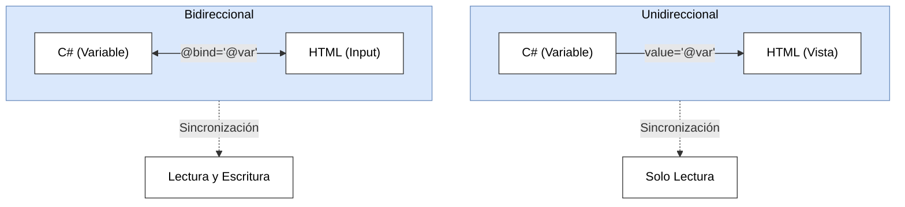

| Sintaxis                 | Dirección        | Disparador (Evento)       | Caso de Uso                                |
| :----------------------- | :--------------- | :------------------------ | :----------------------------------------- |
| `value="@miVar"`         | ➡️ Unidireccional | N/A                       | Mostrar valores en inputs de solo lectura. |
| `@bind="miVar"`          | ↔️ Bidireccional  | `onchange` (Foco perdido) | Formularios estándar de edición.           |
| `@bind:event="oninput"`  | ↔️ Bidireccional  | `oninput` (Al teclear)    | Buscadores, filtros en tiempo real.        |
| `@bind:format="yyyy-MM"` | ↔️ Bidireccional  | N/A                       | Formatear fechas o números monetarios.     |

📝 **Nota del Profesor**: 
> Recuerda que `@bind` es en realidad un "atajo" (syntax sugar). Por debajo, Blazor crea un atributo `value` para leer y un evento `onchange` para escribir. Entender esto es vital cuando quieres añadir lógica personalizada durante la escritura usando el patrón de **Propiedad con Backing Field**.


---

### 7.3.4. Lógica Visual y Directivas Razor

#### 7.3.4.1. Directivas condicionales: @if, @else if, @else

```razor
@* Components/RenderizadoCondicional.razor *@
@inject IFunkoService FunkoService

<div class="card">
    <div class="card-body">
        <h5>Renderizado Condicional</h5>
        
        @* ════════════════════════════════════════════════════ *@
        @* @if simple                                           *@
        @* ════════════════════════════════════════════════════ *@
        
        @if (cargando)
        {
            <div class="text-center py-5">
                <div class="spinner-border text-primary" role="status"></div>
                <p class="mt-2">Cargando datos...</p>
            </div>
        }
        
        @* ════════════════════════════════════════════════════ *@
        @* @if con @else                                        *@
        @* ════════════════════════════════════════════════════ *@
        
        @if (usuario != null)
        {
            <div class="alert alert-success">
                <i class="fas fa-user"></i> Bienvenido, @usuario. Nombre
            </div>
        }
        else
        {
            <div class="alert alert-info">
                <i class="fas fa-sign-in-alt"></i> 
                <a href="/login">Inicia sesión</a> para continuar
            </div>
        }
        
        @* ════════════════════════════════════════════════════ *@
        @* @if - @else if - @else                               *@
        @* ════════════════════════════════════════════════════ *@
        
        @if (funkos.Count == 0)
        {
            <div class="alert alert-warning">
                <i class="fas fa-exclamation-triangle"></i>
                No hay funkos disponibles
            </div>
        }
        else if (funkos.Count == 1)
        {
            <div class="alert alert-info">
                <i class="fas fa-info-circle"></i>
                Hay 1 funko disponible
            </div>
        }
        else if (funkos.Count < 10)
        {
            <div class="alert alert-success">
                <i class="fas fa-check"></i>
                Hay @funkos.Count funkos disponibles
            </div>
        }
        else
        {
            <div class="alert alert-primary">
                <i class="fas fa-fire"></i>
                ¡Catálogo completo! @funkos.Count funkos disponibles
            </div>
        }
        
        @* ════════════════════════════════════════════════════ *@
        @* Condiciones anidadas                                 *@
        @* ════════════════════════════════════════════════════ *@
        
        @if (pedido != null)
        {
            <div class="card mt-3">
                <div class="card-header">
                    Pedido #@pedido.Id
                </div>
                <div class="card-body">
                    @if (pedido.Estado == EstadoPedido. Pendiente)
                    {
                        <div class="alert alert-warning">
                            <strong>Pendiente</strong>
                            <p>Tu pedido está siendo procesado</p>
                            
                            @if (pedido.TiempoEstimado > 0)
                            {
                                <small>Tiempo estimado: @pedido.TiempoEstimado minutos</small>
                            }
                        </div>
                    }
                    else if (pedido. Estado == EstadoPedido. Enviado)
                    {
                        <div class="alert alert-info">
                            <strong>Enviado</strong>
                            <p>Tu pedido está en camino</p>
                            
                            @if (! string.IsNullOrEmpty(pedido.NumeroSeguimiento))
                            {
                                <p>Seguimiento: <strong>@pedido.NumeroSeguimiento</strong></p>
                            }
                        </div>
                    }
                    else if (pedido.Estado == EstadoPedido.Entregado)
                    {
                        <div class="alert alert-success">
                            <strong>Entregado</strong>
                            <p>Tu pedido fue entregado el @pedido.FechaEntrega. ToString("dd/MM/yyyy")</p>
                            
                            @if (!pedido.Valorado)
                            {
                                <button class="btn btn-primary btn-sm" @onclick="ValorarPedido">
                                    Valorar pedido
                                </button>
                            }
                            else
                            {
                                <p class="text-success">✓ Gracias por tu valoración</p>
                            }
                        </div>
                    }
                    else
                    {
                        <div class="alert alert-secondary">
                            Estado: @pedido.Estado
                        </div>
                    }
                </div>
            </div>
        }
        
        @* ════════════════════════════════════════════════════ *@
        @* Condiciones con operadores lógicos                   *@
        @* ════════════════════════════════════════════════════ *@
        
        @if (usuario != null && usuario.EsAdmin)
        {
            <div class="alert alert-danger">
                <i class="fas fa-crown"></i>
                Panel de Administrador
            </div>
        }
        
        @if (funko != null && (funko.Descuento > 0 || funko.EsNovedad))
        {
            <div class="badge bg-primary">¡Oferta especial!</div>
        }
        
        @if (carrito != null && carrito.Items.Any() && carrito.Total > 50)
        {
            <div class="alert alert-success">
                ✓ ¡Envío gratis! (pedidos superiores a 50€)
            </div>
        }
    </div>
</div>

@code {
    private bool cargando = true;
    private UsuarioDto?  usuario = null;
    private List<FunkoDto> funkos = new();
    private PedidoDto? pedido = null;
    private FunkoDto? funko = null;
    private CarritoDto? carrito = null;
    
    protected override async Task OnInitializedAsync()
    {
        cargando = true;
        
        // Simular carga de datos
        await Task.Delay(1000);
        
        funkos = new List<FunkoDto> { /* datos */ };
        
        cargando = false;
    }
    
    private void ValorarPedido()
    {
        if (pedido != null)
        {
            pedido.Valorado = true;
        }
    }
}

public enum EstadoPedido
{
    Pendiente,
    Procesando,
    Enviado,
    Entregado,
    Cancelado
}
```

---

#### 7.3.4.2. Bucles: @foreach con @key para optimización

```razor
@* Components/BuclesReactivos.razor *@

<div class="card">
    <div class="card-body">
        <h5>Bucles Reactivos</h5>
        
        @* ════════════════════════════════════════════════════ *@
        @* @foreach básico                                      *@
        @* ════════════════════════════════════════════════════ *@
        
        <h6>Lista simple: </h6>
        <ul>
            @foreach (var item in items)
            {
                <li>@item</li>
            }
        </ul>
        
        @* ════════════════════════════════════════════════════ *@
        @* @foreach con índice                                  *@
        @* ════════════════════════════════════════════════════ *@
        
        <h6>Con índice:</h6>
        <ol>
            @foreach (var (item, index) in items.Select((i, idx) => (i, idx)))
            {
                <li>[@(index + 1)] @item</li>
            }
        </ol>
        
        @* ════════════════════════════════════════════════════ *@
        @* @foreach con @key para optimización                  *@
        @* ════════════════════════════════════════════════════ *@
        
        <h6>Lista de funkos (con @key):</h6>
        <div class="row">
            @foreach (var funko in funkos)
            {
                @* ☝️ @key le dice a Blazor qué elemento cambió *@
                @* Esto optimiza el rendering (solo actualiza lo necesario) *@
                
                <div class="col-md-4 mb-3" @key="funko.Id">
                    <div class="card">
                        <div class="card-body">
                            <h6>@funko.Nombre</h6>
                            <p>@funko.Precio. ToString("C")</p>
                            <button class="btn btn-sm btn-danger" 
                                    @onclick="() => EliminarFunko(funko.Id)">
                                Eliminar
                            </button>
                        </div>
                    </div>
                </div>
            }
        </div>
        
        @* ════════════════════════════════════════════════════ *@
        @* Bucle anidado                                        *@
        @* ════════════════════════════════════════════════════ *@
        
        <h6>Categorías con funkos:</h6>
        @foreach (var categoria in categorias)
        {
            <div class="card mb-3" @key="categoria.Id">
                <div class="card-header">
                    <strong>@categoria.Nombre</strong> (@categoria.Funkos.Count)
                </div>
                <div class="card-body">
                    <div class="row">
                        @foreach (var funko in categoria. Funkos)
                        {
                            <div class="col-md-3" @key="funko.Id">
                                <div class="badge bg-info">@funko.Nombre</div>
                            </div>
                        }
                    </div>
                </div>
            </div>
        }
        
        @* ════════════════════════════════════════════════════ *@
        @* Tabla con @foreach                                   *@
        @* ════════════════════════════════════════════════════ *@
        
        <h6>Tabla de pedidos:</h6>
        <table class="table">
            <thead>
                <tr>
                    <th>#</th>
                    <th>Cliente</th>
                    <th>Total</th>
                    <th>Estado</th>
                </tr>
            </thead>
            <tbody>
                @foreach (var pedido in pedidos)
                {
                    <tr @key="pedido.Id">
                        <td>@pedido.Id</td>
                        <td>@pedido.ClienteNombre</td>
                        <td>@pedido.Total. ToString("C")</td>
                        <td>
                            <span class="badge bg-@GetEstadoClass(pedido.Estado)">
                                @pedido.Estado
                            </span>
                        </td>
                    </tr>
                }
            </tbody>
        </table>
        
        @* ════════════════════════════════════════════════════ *@
        @* Lista vacía con mensaje                              *@
        @* ════════════════════════════════════════════════════ *@
        
        <h6>Notificaciones:</h6>
        @if (notificaciones.Any())
        {
            <div class="list-group">
                @foreach (var notif in notificaciones)
                {
                    <div class="list-group-item" @key="notif.Id">
                        <div class="d-flex justify-content-between">
                            <strong>@notif.Titulo</strong>
                            <small>@notif.Fecha. ToString("HH:mm")</small>
                        </div>
                        <p class="mb-0">@notif.Mensaje</p>
                    </div>
                }
            </div>
        }
        else
        {
            <div class="alert alert-info">
                No tienes notificaciones
            </div>
        }
        
        @* ════════════════════════════════════════════════════ *@
        @* @for como alternativa (cuando necesitas el índice)   *@
        @* ════════════════════════════════════════════════════ *@
        
        <h6>Paginación con @for:</h6>
        <nav>
            <ul class="pagination">
                @for (int i = 1; i <= totalPaginas; i++)
                {
                    var pagina = i; // Capturar variable para closure
                    <li class="page-item @(pagina == paginaActual ? "active" : "")">
                        <button class="page-link" @onclick="() => CambiarPagina(pagina)">
                            @pagina
                        </button>
                    </li>
                }
            </ul>
        </nav>
    </div>
</div>

@code {
    // ════════════════════════════════════════════════════════
    // DATOS
    // ════════════════════════════════════════════════════════
    
    private List<string> items = new() { "Item 1", "Item 2", "Item 3" };
    
    private List<FunkoDto> funkos = new()
    {
        new() { Id = 1, Nombre = "Darth Vader", Precio = 24.99m },
        new() { Id = 2, Nombre = "Luke Skywalker", Precio = 29.99m },
        new() { Id = 3, Nombre = "Yoda", Precio = 19.99m }
    };
    
    private List<CategoriaConFunkosDto> categorias = new();
    private List<PedidoDto> pedidos = new();
    private List<NotificacionDto> notificaciones = new();
    
    private int paginaActual = 1;
    private int totalPaginas = 10;
    
    // ════════════════════════════════════════════════════════
    // MÉTODOS
    // ════════════════════════════════════════════════════════
    
    private void EliminarFunko(int id)
    {
        funkos.RemoveAll(f => f.Id == id);
        
        // ✅ Blazor detecta el cambio y solo elimina ese elemento del DOM
        // No reconstruye toda la lista gracias a @key
    }
    
    private string GetEstadoClass(string estado)
    {
        return estado switch
        {
            "Pendiente" => "warning",
            "Enviado" => "info",
            "Entregado" => "success",
            "Cancelado" => "danger",
            _ => "secondary"
        };
    }
    
    private void CambiarPagina(int pagina)
    {
        paginaActual = pagina;
        // Aquí cargarías los datos de esa página
    }
}
```

**Importancia de @key:**

```razor
@* ❌ SIN @key (ineficiente) *@
@foreach (var funko in funkos)
{
    <div class="card">
        <h5>@funko.Nombre</h5>
    </div>
}

@* Problema: Si eliminas un elemento del medio, 
   Blazor reconstruye TODOS los elementos siguientes *@

@* ✅ CON @key (eficiente) *@
@foreach (var funko in funkos)
{
    <div class="card" @key="funko.Id">
        <h5>@funko.Nombre</h5>
    </div>
}

@* Ventaja:  Blazor sabe exactamente qué elemento cambió/eliminó
   Solo actualiza ese elemento específico en el DOM *@
```

---

#### 7.3.4.3. @switch para múltiples casos

```razor
@* Components/SwitchExample.razor *@

<div class="card">
    <div class="card-body">
        <h5>Switch para Múltiples Casos</h5>
        
        @* ════════════════════════════════════════════════════ *@
        @* @switch básico                                       *@
        @* ════════════════════════════════════════════════════ *@
        
        <div class="mb-3">
            <label>Estado del pedido:</label>
            <select class="form-select" @bind="estadoPedido">
                <option value="Pendiente">Pendiente</option>
                <option value="Procesando">Procesando</option>
                <option value="Enviado">Enviado</option>
                <option value="Entregado">Entregado</option>
                <option value="Cancelado">Cancelado</option>
            </select>
        </div>
        
        @switch (estadoPedido)
        {
            case "Pendiente":
                <div class="alert alert-warning">
                    <i class="fas fa-clock"></i>
                    <strong>Pendiente</strong>
                    <p>Tu pedido está en cola de procesamiento</p>
                </div>
                break;
            
            case "Procesando": 
                <div class="alert alert-info">
                    <i class="fas fa-cog fa-spin"></i>
                    <strong>Procesando</strong>
                    <p>Estamos preparando tu pedido</p>
                    <div class="progress">
                        <div class="progress-bar progress-bar-striped progress-bar-animated" 
                             style="width: 50%"></div>
                    </div>
                </div>
                break;
            
            case "Enviado":
                <div class="alert alert-primary">
                    <i class="fas fa-shipping-fast"></i>
                    <strong>Enviado</strong>
                    <p>Tu pedido está en camino</p>
                    <button class="btn btn-sm btn-primary">Ver seguimiento</button>
                </div>
                break;
            
            case "Entregado": 
                <div class="alert alert-success">
                    <i class="fas fa-check-circle"></i>
                    <strong>Entregado</strong>
                    <p>¡Tu pedido fue entregado con éxito!</p>
                    <button class="btn btn-sm btn-success">Valorar experiencia</button>
                </div>
                break;
            
            case "Cancelado": 
                <div class="alert alert-danger">
                    <i class="fas fa-times-circle"></i>
                    <strong>Cancelado</strong>
                    <p>El pedido fue cancelado</p>
                    <button class="btn btn-sm btn-danger">Ver motivo</button>
                </div>
                break;
            
            default:
                <div class="alert alert-secondary">
                    Estado desconocido
                </div>
                break;
        }
        
        <hr />
        
        @* ════════════════════════════════════════════════════ *@
        @* Switch con enum                                      *@
        @* ════════════════════════════════════════════════════ *@
        
        <div class="mb-3">
            <label>Tipo de Funko:</label>
            <select class="form-select" @bind="tipoFunko">
                @foreach (TipoFunko tipo in Enum.GetValues(typeof(TipoFunko)))
                {
                    <option value="@tipo">@tipo</option>
                }
            </select>
        </div>
        
        @switch (tipoFunko)
        {
            case TipoFunko.Pop:
                <div class="card border-primary">
                    <div class="card-body">
                        <i class="fas fa-box fa-3x text-primary"></i>
                        <h5>Funko Pop</h5>
                        <p>El clásico Funko con cabeza grande</p>
                    </div>
                </div>
                break;
            
            case TipoFunko.Soda:
                <div class="card border-success">
                    <div class="card-body">
                        <i class="fas fa-wine-bottle fa-3x text-success"></i>
                        <h5>Funko Soda</h5>
                        <p>Figuras en latas de soda coleccionables</p>
                    </div>
                </div>
                break;
            
            case TipoFunko.VinylSoda:
                <div class="card border-info">
                    <div class="card-body">
                        <i class="fas fa-record-vinyl fa-3x text-info"></i>
                        <h5>Vinyl Soda</h5>
                        <p>Edición especial en lata de vinilo</p>
                    </div>
                </div>
                break;
            
            case TipoFunko.Mystery:
                <div class="card border-warning">
                    <div class="card-body">
                        <i class="fas fa-question-circle fa-3x text-warning"></i>
                        <h5>Mystery Box</h5>
                        <p>¡Sorpresa! No sabes qué Funko te tocará</p>
                    </div>
                </div>
                break;
        }
        
        <hr />
        
        @* ════════════════════════════════════════════════════ *@
        @* Switch con múltiples casos al mismo bloque           *@
        @* ════════════════════════════════════════════════════ *@
        
        <div class="mb-3">
            <label>Día de la semana:</label>
            <select class="form-select" @bind="diaSemana">
                <option value="Lunes">Lunes</option>
                <option value="Martes">Martes</option>
                <option value="Miércoles">Miércoles</option>
                <option value="Jueves">Jueves</option>
                <option value="Viernes">Viernes</option>
                <option value="Sábado">Sábado</option>
                <option value="Domingo">Domingo</option>
            </select>
        </div>
        
        @switch (diaSemana)
        {
            case "Lunes":
            case "Martes":
            case "Miércoles": 
            case "Jueves":
            case "Viernes":
                <div class="alert alert-primary">
                    <i class="fas fa-briefcase"></i>
                    <strong>Día laboral</strong>
                    <p>Horario:  9:00 - 18:00</p>
                </div>
                break;
            
            case "Sábado":
            case "Domingo":
                <div class="alert alert-success">
                    <i class="fas fa-umbrella-beach"></i>
                    <strong>¡Fin de semana!</strong>
                    <p>Disfruta tu día libre</p>
                </div>
                break;
        }
    </div>
</div>

@code {
    private string estadoPedido = "Pendiente";
    private TipoFunko tipoFunko = TipoFunko. Pop;
    private string diaSemana = "Lunes";
}

public enum TipoFunko
{
    Pop,
    Soda,
    VinylSoda,
    Mystery
}
```

#### 7.3.5. Formularios y Validación Reactiva

En Blazor, el manejo de formularios evoluciona desde el `<form>` tradicional hacia el componente especializado **`<EditForm>`**. Este componente automatiza la validación y el seguimiento del estado de los campos.

##### A. Comparativa: form (MVC) vs EditForm (Blazor)

| Característica | MVC / Razor Pages                | Blazor (EditForm)                    |
| :------------- | :------------------------------- | :----------------------------------- |
| **Envío**      | HTTP POST (Recarga página)       | Evento C# (Sin recarga)              |
| **Validación** | `ModelState.IsValid` en servidor | `OnValidSubmit` disparado localmente |
| **Binding**    | Vía atributo `name`              | Vía directiva `@bind-Value`          |
| **Feedback**   | Tras viaje al servidor           | Instantáneo en el circuito           |

##### B. Componentes del Ecosistema EditForm
Para que un formulario sea profesional, debe incluir estos subcomponentes:
1.  **`<DataAnnotationsValidator />`**: Lee los atributos `[Required]`, `[StringLength]`, etc., de tu clase C#.
2.  **`<ValidationSummary />`**: Muestra la lista de todos los errores al principio.
3.  **`<ValidationMessage For="..." />`**: Muestra el error específico bajo cada input.

##### C. Ejemplo: Formulario Profesional de Registro

```razor
@* Components/FormularioFunko.razor *@
<EditForm Model="@nuevoFunko" OnValidSubmit="GuardarFunko">
    <DataAnnotationsValidator />
    <ValidationSummary />

    <div class="mb-3">
        <label>Nombre del Funko:</label>
        <InputText @bind-Value="nuevoFunko.Nombre" class="form-control" />
        <ValidationMessage For="@(() => nuevoFunko.Nombre)" class="text-danger" />
    </div>

    <div class="mb-3">
        <label>Precio:</label>
        <InputNumber @bind-Value="nuevoFunko.Precio" class="form-control" />
        <ValidationMessage For="@(() => nuevoFunko.Precio)" class="text-danger" />
    </div>

    <button type="submit" class="btn btn-primary">Registrar Funko</button>
</EditForm>

@code {
    private FunkoCreateInput nuevoFunko = new();

    private void GuardarFunko() {
        // Este método SOLO se ejecuta si la validación es correcta
        Console.WriteLine($"Guardando {nuevoFunko.Nombre}...");
    }
}
```

---

## 7.4. Caso Práctico: To-Do List Reactivo con Notas y Prioridades

### 7.4.1. Definición del Dominio

#### 7.4.1.1. Modelo de dominio NotaTodo

```csharp
// Models/NotaTodo.cs
namespace MiApp.Models;

public class NotaTodo
{
    // ════════════════════════════════════════════════════════
    // PROPIEDADES
    // ════════════════════════════════════════════════════════
    
    /// <summary>
    /// Identificador único de la nota (generado automáticamente)
    /// </summary>
    public Guid Id { get; set; } = Guid.NewGuid();
    
    /// <summary>
    /// Texto de la nota (máximo 200 caracteres)
    /// </summary>
    public string Texto { get; set; } = string.Empty;
    
    /// <summary>
    /// Timestamp de creación
    /// </summary>
    public DateTime CreatedAt { get; set; } = DateTime.Now;
    
    /// <summary>
    /// Prioridad de la nota (Alta o Baja)
    /// </summary>
    public Prioridad Prioridad { get; set; } = Prioridad. Baja;
    
    /// <summary>
    /// Indica si la nota está completada
    /// </summary>
    public bool Completada { get; set; } = false;
    
    /// <summary>
    /// Fecha de completado (null si no está completada)
    /// </summary>
    public DateTime? FechaCompletada { get; set; }
}

/// <summary>
/// Enum para la prioridad de las notas
/// </summary>
public enum Prioridad
{
    Baja = 1,
    Alta = 2
}
```

#### 7.4.1.2. InputModel para creación: CrearNotaInputModel

```csharp
// InputModels/CrearNotaInputModel.cs
namespace MiApp. InputModels;

public class CrearNotaInputModel
{
    public string Texto { get; set; } = string.Empty;
    public Prioridad Prioridad { get; set; } = Prioridad.Baja;
}
```

```csharp
// Validators/CrearNotaInputModelValidator.cs
using FluentValidation;

namespace MiApp.Validators;

public class CrearNotaInputModelValidator : AbstractValidator<CrearNotaInputModel>
{
    public CrearNotaInputModelValidator()
    {
        RuleFor(x => x.Texto)
            .NotEmpty()
            .WithMessage("El texto de la nota es obligatorio")
            .MaximumLength(200)
            .WithMessage("El texto no puede superar 200 caracteres");
        
        RuleFor(x => x.Prioridad)
            .IsInEnum()
            .WithMessage("Prioridad inválida");
    }
}
```

---

### 7.4.2. Servicio con Estado (Scoped)

#### 7.4.2.1. Definición de la interfaz ITodoService

```csharp
// Services/ITodoService. cs
using CSharpFunctionalExtensions;

namespace MiApp.Services;

public interface ITodoService
{
    /// <summary>
    /// Obtiene todas las notas ordenadas por prioridad (Alta primero) y luego por fecha
    /// </summary>
    Result<IEnumerable<NotaTodo>> ObtenerTodasOrdenadas();
    
    /// <summary>
    /// Crea una nueva nota
    /// </summary>
    /// <param name="texto">Texto de la nota</param>
    /// <param name="prioridad">Prioridad de la nota</param>
    /// <returns>La nota creada</returns>
    Result<NotaTodo> CrearNota(string texto, Prioridad prioridad);
    
    /// <summary>
    /// Elimina una nota por su ID
    /// </summary>
    Result EliminarNota(Guid id);
    
    /// <summary>
    /// Marca/desmarca una nota como completada
    /// </summary>
    Result ToggleCompletada(Guid id);
    
    /// <summary>
    /// Busca notas que contengan el texto especificado
    /// </summary>
    Result<IEnumerable<NotaTodo>> BuscarPorTexto(string query);
    
    /// <summary>
    /// Obtiene estadísticas de las notas
    /// </summary>
    Result<TodoStats> ObtenerEstadisticas();
}

public class TodoStats
{
    public int Total { get; set; }
    public int Completadas { get; set; }
    public int Pendientes { get; set; }
    public int PrioridadAlta { get; set; }
    public int PrioridadBaja { get; set; }
}
```

#### 7.4.2.2. Implementación con Dictionary<Guid, NotaTodo> en memoria

```csharp
// Services/TodoService.cs
using CSharpFunctionalExtensions;

namespace MiApp.Services;

// ✅ C# 14: Primary Constructor en el Servicio
public class TodoService(ILogger<TodoService> logger) : ITodoService
{
    // ════════════════════════════════════════════════════════
    // ALMACENAMIENTO EN MEMORIA
    // ════════════════════════════════════════════════════════
    
    private readonly Dictionary<Guid, NotaTodo> _notas = new();
    
    // ════════════════════════════════════════════════════════
    // MÉTODOS PÚBLICOS
    // ════════════════════════════════════════════════════════
    
    public Result<IEnumerable<NotaTodo>> ObtenerTodasOrdenadas()
    {
        try
        {
            var notas = _notas.Values
                .OrderByDescending(n => n. Prioridad) // Alta (2) antes que Baja (1)
                .ThenByDescending(n => n.CreatedAt)   // Más recientes primero
                .ToList();
            
            logger.LogInformation("Obtenidas {Count} notas", notas.Count);
            
            return Result.Success<IEnumerable<NotaTodo>>(notas);
        }
        catch (Exception ex)
        {
            logger.LogError(ex, "Error al obtener notas");
            return Result. Failure<IEnumerable<NotaTodo>>("Error al obtener las notas");
        }
    }
    
    public Result<NotaTodo> CrearNota(string texto, Prioridad prioridad)
    {
        try
        {
            // Validación
            if (string.IsNullOrWhiteSpace(texto))
            {
                return Result.Failure<NotaTodo>("El texto de la nota es obligatorio");
            }
            
            if (texto.Length > 200)
            {
                return Result.Failure<NotaTodo>("El texto no puede superar 200 caracteres");
            }
            
            // Crear nota
            var nota = new NotaTodo
            {
                Id = Guid.NewGuid(),
                Texto = texto. Trim(),
                Prioridad = prioridad,
                CreatedAt = DateTime.Now,
                Completada = false
            };
            
            // Guardar en diccionario
            _notas[nota.Id] = nota;
            
            _logger.LogInformation("Nota creada: {Id} - {Texto}", nota.Id, nota.Texto);
            
            return Result. Success(nota);
        }
        catch (Exception ex)
        {
            _logger.LogError(ex, "Error al crear nota");
            return Result.Failure<NotaTodo>("Error al crear la nota");
        }
    }
    
    public Result EliminarNota(Guid id)
    {
        try
        {
            if (! _notas.ContainsKey(id))
            {
                return Result.Failure("Nota no encontrada");
            }
            
            _notas.Remove(id);
            
            _logger.LogInformation("Nota eliminada: {Id}", id);
            
            return Result.Success();
        }
        catch (Exception ex)
        {
            _logger.LogError(ex, "Error al eliminar nota {Id}", id);
            return Result.Failure("Error al eliminar la nota");
        }
    }
    
    public Result ToggleCompletada(Guid id)
    {
        try
        {
            if (!_notas.TryGetValue(id, out var nota))
            {
                return Result.Failure("Nota no encontrada");
            }
            
            nota.Completada = !nota.Completada;
            nota.FechaCompletada = nota.Completada ? DateTime.Now : null;
            
            _logger.LogInformation("Nota {Id} marcada como {Estado}", 
                id, nota.Completada ? "completada" : "pendiente");
            
            return Result.Success();
        }
        catch (Exception ex)
        {
            _logger.LogError(ex, "Error al actualizar nota {Id}", id);
            return Result.Failure("Error al actualizar la nota");
        }
    }
    
    public Result<IEnumerable<NotaTodo>> BuscarPorTexto(string query)
    {
        try
        {
            if (string.IsNullOrWhiteSpace(query))
            {
                return ObtenerTodasOrdenadas();
            }
            
            var notas = _notas.Values
                .Where(n => n.Texto.Contains(query, StringComparison.OrdinalIgnoreCase))
                .OrderByDescending(n => n. Prioridad)
                .ThenByDescending(n => n.CreatedAt)
                .ToList();
            
            _logger.LogInformation("Búsqueda '{Query}' encontró {Count} notas", query, notas.Count);
            
            return Result.Success<IEnumerable<NotaTodo>>(notas);
        }
        catch (Exception ex)
        {
            _logger.LogError(ex, "Error al buscar notas");
            return Result.Failure<IEnumerable<NotaTodo>>("Error al buscar notas");
        }
    }
    
    public Result<TodoStats> ObtenerEstadisticas()
    {
        try
        {
            var notas = _notas.Values;
            
            var stats = new TodoStats
            {
                Total = notas.Count(),
                Completadas = notas.Count(n => n. Completada),
                Pendientes = notas.Count(n => !n.Completada),
                PrioridadAlta = notas.Count(n => n. Prioridad == Prioridad.Alta),
                PrioridadBaja = notas.Count(n => n. Prioridad == Prioridad.Baja)
            };
            
            return Result.Success(stats);
        }
        catch (Exception ex)
        {
            _logger. LogError(ex, "Error al obtener estadísticas");
            return Result.Failure<TodoStats>("Error al obtener estadísticas");
        }
    }
}
```

#### 7.4.2.3. Registro del servicio en Program.cs

```csharp
// Program.cs

var builder = WebApplication.CreateBuilder(args);

// ════════════════════════════════════════════════════════════
// Servicios MVC y Blazor
// ════════════════════════════════════════════════════════════

builder.Services. AddControllersWithViews();
builder.Services.AddServerSideBlazor();

// ════════════════════════════════════════════════════════════
// REGISTRAR TodoService como SCOPED
// ════════════════════════════════════════════════════════════

builder.Services. AddScoped<ITodoService, TodoService>();

// ☝️ SCOPED significa: 
// • Se crea UNA instancia por CIRCUITO SignalR
// • Mientras el usuario esté conectado, usa la misma instancia
// • Al desconectar, la instancia se destruye
// • Diferente instancia para cada usuario

// Alternativas:
// • Singleton: UNA instancia para TODOS los usuarios (compartida)
//   builder.Services.AddSingleton<ITodoService, TodoService>();
//   ⚠️ PROBLEMA: Todos los usuarios verían las mismas notas
//
// • Transient:  NUEVA instancia en CADA inyección
//   builder.Services. AddTransient<ITodoService, TodoService>();
//   ⚠️ PROBLEMA:  Perdería el estado entre llamadas

// Otros servicios
builder.Services.AddScoped<IFunkoService, FunkoService>();

var app = builder.Build();

// Configuración del pipeline
app.UseStaticFiles();
app.UseRouting();
app.MapBlazorHub();
app.MapControllerRoute(
    name: "default",
    pattern: "{controller=Home}/{action=Index}/{id?}");

app.Run();
```

##### Comparativa de Lifetimes (Ciclos de Vida) en Blazor Server

Elegir el ciclo de vida correcto es la diferencia entre una aplicación que funciona y un desastre de seguridad donde los usuarios ven los datos de otros. En Blazor Server, el comportamiento de **Scoped** es único y fundamental.

```mermaid
graph TD
    subgraph APP [Toda la Aplicación]
        SNG["AddSingleton: 1 sola instancia GLOBAL"]
    end

    subgraph CIRCUIT [Circuito SignalR (Usuario A)]
        SC1["AddScoped: Instancia por USUARIO"]
        TR1["AddTransient: Nueva en cada uso"]
    end

    subgraph CIRCUIT2 [Circuito SignalR (Usuario B)]
        SC2["AddScoped: Instancia por USUARIO"]
        TR2["AddTransient: Nueva en cada uso"]
    end

    classDef default fill:#fff,stroke:#333,color:#000
    classDef singleton fill:#fdd,stroke:#333,color:#000
    classDef scoped fill:#dfd,stroke:#333,color:#000
    classDef transient fill:#dae8fc,stroke:#333,color:#000
    
    class SNG singleton
    class SC1,SC2 scoped
    class TR1,TR2 transient
```

| Lifetime      | Registro       | Comportamiento en Blazor Server          | ¿Cuándo usar?                     |
| :------------ | :------------- | :--------------------------------------- | :-------------------------------- |
| **Singleton** | `AddSingleton` | Compartido por **TODOS** los usuarios.   | Caché global, configuración.      |
| **Scoped**    | `AddScoped`    | Compartido solo durante el **CIRCUITO**. | **Estado de sesión del usuario.** |
| **Transient** | `AddTransient` | Creado **CADA VEZ** que se pide.         | Lógica pura sin variables.        |

⚠️ **Regla Crítica del Profesor**:
> En MVC clásico, `AddScoped` dura lo que dura una petición HTTP (milisegundos). En **Blazor Server**, `AddScoped` dura lo que dura la pestaña abierta (minutos u horas). Por eso es el lugar perfecto para guardar el carrito de la compra o la lista de tareas, ya que los datos "viajan" con el usuario por toda la aplicación.

---


### 7.4.3. Anatomía del Componente .razor

#### 7.4.3.1. Sección de marcado HTML

```razor
@* Components/TodoListComponent.razor *@
@inject ITodoService TodoService

<div class="card shadow-lg">
    <div class="card-header bg-primary text-white">
        <h3 class="mb-0">
            <i class="fas fa-tasks"></i> 
            To-Do List Reactivo
        </h3>
    </div>
    
    <div class="card-body">
        @* ════════════════════════════════════════════════════ *@
        @* FORMULARIO DE CREACIÓN DE NOTA                       *@
        @* ════════════════════════════════════════════════════ *@
        
        <div class="row mb-4">
            <div class="col-md-8">
                <input type="text" 
                       class="form-control form-control-lg" 
                       placeholder="Nueva tarea..." 
                       @bind="nuevaNota" 
                       @onkeydown="OnKeyDown"
                       maxlength="200" />
                <small class="text-muted">@nuevaNota.Length / 200 caracteres</small>
            </div>
            
            @* SELECT DE PRIORIDAD *@
            <div class="col-md-2">
                <select class="form-select form-select-lg" @bind="prioridadSeleccionada">
                    <option value="@Prioridad. Baja">🟢 Baja</option>
                    <option value="@Prioridad.Alta">🔴 Alta</option>
                </select>
            </div>
            
            <div class="col-md-2">
                <button class="btn btn-primary btn-lg w-100" 
                        @onclick="CrearNota"
                        disabled="@string.IsNullOrWhiteSpace(nuevaNota)">
                    <i class="fas fa-plus"></i> Añadir
                </button>
            </div>
        </div>
        
        @* Mensaje de error *@
        @if (! string.IsNullOrEmpty(mensajeError))
        {
            <div class="alert alert-danger alert-dismissible fade show">
                <i class="fas fa-exclamation-triangle"></i>
                @mensajeError
                <button type="button" class="btn-close" @onclick="() => mensajeError = string.Empty"></button>
            </div>
        }
        
        @* ════════════════════════════════════════════════════ *@
        @* INPUT DE BÚSQUEDA                                    *@
        @* ════════════════════════════════════════════════════ *@
        
        <div class="mb-3">
            <div class="input-group">
                <span class="input-group-text">
                    <i class="fas fa-search"></i>
                </span>
                <input type="text" 
                       class="form-control" 
                       placeholder="Buscar tareas..." 
                       @bind-value="textoBusqueda" 
                       @bind-value:event="oninput" />
                @if (! string.IsNullOrEmpty(textoBusqueda))
                {
                    <button class="btn btn-outline-secondary" @onclick="LimpiarBusqueda">
                        <i class="fas fa-times"></i>
                    </button>
                }
            </div>
        </div>
        
        @* ════════════════════════════════════════════════════ *@
        @* ESTADÍSTICAS                                         *@
        @* ════════════════════════════════════════════════════ *@
        
        @if (estadisticas != null)
        {
            <div class="row mb-4">
                <div class="col-md-3">
                    <div class="card bg-light">
                        <div class="card-body text-center">
                            <h4 class="mb-0">@estadisticas.Total</h4>
                            <small class="text-muted">Total</small>
                        </div>
                    </div>
                </div>
                <div class="col-md-3">
                    <div class="card bg-warning text-white">
                        <div class="card-body text-center">
                            <h4 class="mb-0">@estadisticas.Pendientes</h4>
                            <small>Pendientes</small>
                        </div>
                    </div>
                </div>
                <div class="col-md-3">
                    <div class="card bg-success text-white">
                        <div class="card-body text-center">
                            <h4 class="mb-0">@estadisticas.Completadas</h4>
                            <small>Completadas</small>
                        </div>
                    </div>
                </div>
                <div class="col-md-3">
                    <div class="card bg-danger text-white">
                        <div class="card-body text-center">
                            <h4 class="mb-0">@estadisticas.PrioridadAlta</h4>
                            <small>Alta Prioridad</small>
                        </div>
                    </div>
                </div>
            </div>
        }
        
        @* ════════════════════════════════════════════════════ *@
        @* LISTA DE NOTAS                                       *@
        @* ════════════════════════════════════════════════════ *@
        
        @if (cargando)
        {
            <div class="text-center py-5">
                <div class="spinner-border text-primary" role="status"></div>
                <p class="mt-2">Cargando tareas...</p>
            </div>
        }
        else if (! notas.Any())
        {
            <div class="text-center py-5 text-muted">
                <i class="fas fa-clipboard-check fa-4x mb-3"></i>
                <p class="lead">No hay tareas</p>
                <p>¡Crea tu primera tarea arriba!</p>
            </div>
        }
        else
        {
            <div class="list-group">
                @foreach (var nota in notas)
                {
                    <div class="list-group-item @(nota.Completada ? "list-group-item-success" : "")" 
                         @key="nota.Id">
                        <div class="d-flex align-items-start">
                            @* Checkbox para completar *@
                            <div class="form-check me-3">
                                <input type="checkbox" 
                                       class="form-check-input" 
                                       id="check-@nota.Id"
                                       checked="@nota.Completada" 
                                       @onchange="() => ToggleCompletada(nota.Id)" />
                            </div>
                            
                            @* Contenido de la nota *@
                            <div class="flex-grow-1">
                                @* Prioridad badge *@
                                @if (nota.Prioridad == Prioridad.Alta)
                                {
                                    <span class="badge bg-danger me-2">🔴 Alta</span>
                                }
                                else
                                {
                                    <span class="badge bg-success me-2">🟢 Baja</span>
                                }
                                
                                @* Texto de la nota *@
                                <span class="@(nota.Completada ? "text-decoration-line-through text-muted" : "")">
                                    @HighlightTexto(nota.Texto, textoBusqueda)
                                </span>
                                
                                @* Información de fechas *@
                                <div class="mt-1">
                                    <small class="text-muted">
                                        <i class="fas fa-clock"></i> 
                                        Creada: @nota.CreatedAt. ToString("dd/MM/yyyy HH:mm")
                                        
                                        @if (nota. Completada && nota.FechaCompletada. HasValue)
                                        {
                                            <span class="ms-2">
                                                <i class="fas fa-check-circle"></i>
                                                Completada:  @nota.FechaCompletada.Value.ToString("dd/MM/yyyy HH:mm")
                                            </span>
                                        }
                                    </small>
                                </div>
                            </div>
                            
                            @* Botón eliminar *@
                            <button class="btn btn-sm btn-outline-danger ms-2" 
                                    @onclick="() => EliminarNota(nota.Id)"
                                    title="Eliminar">
                                <i class="fas fa-trash"></i>
                            </button>
                        </div>
                    </div>
                }
            </div>
        }
    </div>
    
    @* ════════════════════════════════════════════════════ *@
    @* FOOTER                                               *@
    @* ════════════════════════════════════════════════════ *@
    
    <div class="card-footer text-muted">
        <div class="d-flex justify-content-between align-items-center">
            <small>
                <i class="fas fa-sync-alt"></i> 
                Última actualización: @ultimaActualizacion. ToString("HH:mm: ss")
            </small>
            
            @if (notas.Any())
            {
                <button class="btn btn-sm btn-outline-danger" 
                        @onclick="LimpiarCompletadas"
                        disabled="@(! notas.Any(n => n.Completada))">
                    <i class="fas fa-trash"></i> Limpiar completadas
                </button>
            }
        </div>
    </div>
</div>
```

#### 7.4.3.2. Bloque @code con lógica del componente

```razor
@code {
    // ════════════════════════════════════════════════════════
    // INYECCIÓN DEL SERVICIO
    // ════════════════════════════════════════════════════════
    
    // Ya se inyectó arriba con:  @inject ITodoService TodoService
    
    // ════════════════════════════════════════════════════════
    // VARIABLES DE ESTADO
    // ════════════════════════════════════════════════════════
    
    private List<NotaTodo> notas = new();
    private string nuevaNota = string.Empty;
    private Prioridad prioridadSeleccionada = Prioridad.Baja;
    private string textoBusqueda = string.Empty;
    private string mensajeError = string.Empty;
    private bool cargando = true;
    private DateTime ultimaActualizacion = DateTime.Now;
    private TodoStats?  estadisticas;
    
    // ════════════════════════════════════════════════════════
    // CICLO DE VIDA
    // ════════════════════════════════════════════════════════
    
    protected override async Task OnInitializedAsync()
    {
        await CargarNotas();
        await CargarEstadisticas();
        cargando = false;
    }
    
    // ════════════════════════════════════════════════════════
    // MÉTODOS DE EVENTOS
    // ════════════════════════════════════════════════════════
    
    private async Task CrearNota()
    {
        mensajeError = string.Empty;
        
        var resultado = TodoService.CrearNota(nuevaNota, prioridadSeleccionada);
        
        if (resultado.IsSuccess)
        {
            nuevaNota = string.Empty;
            prioridadSeleccionada = Prioridad.Baja;
            await CargarNotas();
            await CargarEstadisticas();
        }
        else
        {
            mensajeError = resultado. Error;
        }
    }
    
    private async Task EliminarNota(Guid id)
    {
        var resultado = TodoService.EliminarNota(id);
        
        if (resultado.IsSuccess)
        {
            await CargarNotas();
            await CargarEstadisticas();
        }
        else
        {
            mensajeError = resultado. Error;
        }
    }
    
    private async Task ToggleCompletada(Guid id)
    {
        var resultado = TodoService.ToggleCompletada(id);
        
        if (resultado.IsSuccess)
        {
            await CargarNotas();
            await CargarEstadisticas();
        }
    }
    
    private async Task OnKeyDown(KeyboardEventArgs e)
    {
        if (e.Key == "Enter" && !string.IsNullOrWhiteSpace(nuevaNota))
        {
            await CrearNota();
        }
    }
    
    private async Task LimpiarBusqueda()
    {
        textoBusqueda = string.Empty;
        await BuscarNotas();
    }
    
    private async Task LimpiarCompletadas()
    {
        var completadas = notas.Where(n => n.Completada).ToList();
        
        foreach (var nota in completadas)
        {
            TodoService.EliminarNota(nota.Id);
        }
        
        await CargarNotas();
        await CargarEstadisticas();
    }
    
    // ════════════════════════════════════════════════════════
    // MÉTODOS PRIVADOS
    // ════════════════════════════════════════════════════════
    
    private async Task CargarNotas()
    {
        if (string.IsNullOrWhiteSpace(textoBusqueda))
        {
            var resultado = TodoService.ObtenerTodasOrdenadas();
            
            if (resultado.IsSuccess)
            {
                notas = resultado. Value. ToList();
            }
        }
        else
        {
            await BuscarNotas();
        }
        
        ultimaActualizacion = DateTime. Now;
    }
    
    private async Task BuscarNotas()
    {
        var resultado = TodoService.BuscarPorTexto(textoBusqueda);
        
        if (resultado.IsSuccess)
        {
            notas = resultado.Value.ToList();
        }
        
        ultimaActualizacion = DateTime. Now;
    }
    
    private async Task CargarEstadisticas()
    {
        var resultado = TodoService.ObtenerEstadisticas();
        
        if (resultado.IsSuccess)
        {
            estadisticas = resultado.Value;
        }
    }
    
    // ════════════════════════════════════════════════════════
    // MÉTODOS AUXILIARES
    // ════════════════════════════════════════════════════════
    
    private MarkupString HighlightTexto(string texto, string busqueda)
    {
        if (string.IsNullOrEmpty(busqueda))
        {
            return (MarkupString)texto;
        }
        
        var index = texto.IndexOf(busqueda, StringComparison.OrdinalIgnoreCase);
        
        if (index == -1)
        {
            return (MarkupString)texto;
        }
        
        var highlighted = texto.Insert(index + busqueda.Length, "</mark>")
                               .Insert(index, "<mark class='bg-warning'>");
        
        return (MarkupString)highlighted;
    }
    
    // ════════════════════════════════════════════════════════
    // WATCH:  Reaccionar a cambios en textoBusqueda
    // ════════════════════════════════════════════════════════
    
    private string _textoBusquedaAnterior = string.Empty;
    
    protected override async Task OnAfterRenderAsync(bool firstRender)
    {
        if (_textoBusquedaAnterior != textoBusqueda)
        {
            _textoBusquedaAnterior = textoBusqueda;
            await BuscarNotas();
            StateHasChanged();
        }
    }
}
```

---

### 7.4.4. Interactividad pura en C#

#### 7.4.4.1. Estado en el servidor: Cómo la lista "vive" en la sesión del circuito

Blazor Server rompe el paradigma tradicional de "petición-respuesta". En su lugar, crea un **entorno de ejecución persistente** en el servidor llamado **Circuito**. Este circuito es un hilo lógico que mantiene la instancia real de tus clases C# mientras el usuario tenga la pestaña abierta.

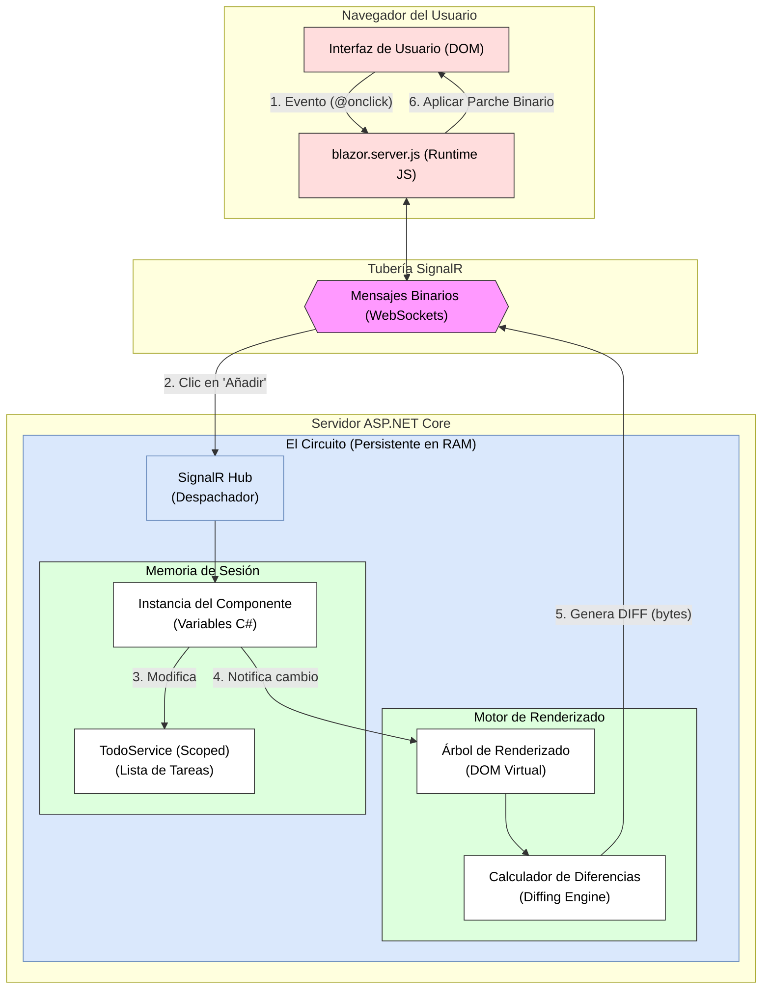

##### El Viaje de una Actualización (Paso a Paso)
1.  **Disparo del Evento**: El usuario hace clic en el botón. El pequeño script `blazor.server.js` intercepta el evento y lo empaqueta.
2.  **Transmisión Binaria**: Se envía un mensaje ultraligero (apenas unos bytes) por el WebSocket hacia el servidor. No viaja el formulario entero, solo la instrucción: *"El usuario pulsó el botón X"*.
3.  **Ejecución C#**: El servidor recibe el mensaje en el **Hub**, localiza el **Circuito** de ese usuario y ejecuta el método C# correspondiente. Las variables cambian en la RAM del servidor.
4.  **DOM Virtual y Diffing**: Blazor no genera todo el HTML de nuevo. Compara la interfaz antigua con la nueva en memoria (**DOM Virtual**) y detecta exactamente qué caracteres o etiquetas han cambiado.
5.  **El Parche (The Patch)**: El servidor envía solo las diferencias (ej: *"Añade este <li> al final"*). El navegador recibe el "parche" y actualiza solo ese punto de la pantalla sin parpadeos.

⚠️ **Nota del Profesor sobre el "Efecto Memoria"**:
> Imagina que el servidor es un **Hotel**. Cada cliente tiene una **Habitación (Circuito)** asignada. Todo lo que el cliente deja en la habitación (sus variables, sus notas) se queda allí mientras el cliente no haga el *Check-out* (cerrar la pestaña). Si el hotel se queda sin habitaciones vacías (RAM llena), no podrá aceptar más clientes. Por eso, optimizar el tamaño de los objetos en Blazor Server es una habilidad crítica.

---


**Diferencia con otros lifetimes:**

```csharp
// ❌ SINGLETON:  TODOS los usuarios compartirían las mismas notas
builder.Services.AddSingleton<ITodoService, TodoService>();

Usuario A crea "Comprar leche"
Usuario B ve "Comprar leche" también (NO deseado)

// ✅ SCOPED:  Cada usuario tiene sus propias notas (aislado)
builder.Services.AddScoped<ITodoService, TodoService>();

Usuario A crea "Comprar leche"
Usuario B NO la ve (tiene su propia lista)

// ❌ TRANSIENT: Se perdería el estado entre llamadas
builder.Services.AddTransient<ITodoService, TodoService>();

Usuario A crea "Comprar leche"
Usuario A hace otra acción → NUEVA instancia → notas perdidas
```

---

#### 7.4.4.2. Eventos reactivos: Añadir y borrar elementos sin refresco de página

```razor
@* Demostración del flujo reactivo *@

@code {
    // ════════════════════════════════════════════════════════
    // FLUJO AL CREAR UNA NOTA
    // ════════════════════════════════════════════════════════
    
    private async Task CrearNota()
    {
        // 1. Usuario hace clic en "Añadir"
        //    Evento @onclick se dispara
        
        // 2. Código C# se ejecuta EN EL SERVIDOR
        mensajeError = string.Empty;
        
        // 3. Llamada al servicio (también en el servidor)
        var resultado = TodoService.CrearNota(nuevaNota, prioridadSeleccionada);
        
        if (resultado.IsSuccess)
        {
            // 4. Actualizar estado local del componente
            nuevaNota = string.Empty;
            prioridadSeleccionada = Prioridad. Baja;
            
            // 5. Recargar lista desde el servicio
            await CargarNotas();
            await CargarEstadisticas();
            
            // 6. Blazor detecta cambios de estado
            //    StateHasChanged() se llama automáticamente
            
            // 7. Blazor calcula el DIFF del DOM virtual: 
            //    ANTES: <div class="list-group"><!-- 0 items --></div>
            //    DESPUÉS: <div class="list-group"><!-- 1 item --></div>
            //    DIFF:  Añadir <div class="list-group-item">... </div>
            
            // 8. Envía SOLO el diff por SignalR (~200 bytes):
            //    "AppendChild en . list-group con HTML:  '<div... >'"
            
            // 9. Cliente recibe mensaje y actualiza DOM
            //    SIN recargar la página
        }
        else
        {
            mensajeError = resultado.Error;
        }
    }
    
    // ════════════════════════════════════════════════════════
    // FLUJO AL ELIMINAR UNA NOTA
    // ════════════════════════════════════════════════════════
    
    private async Task EliminarNota(Guid id)
    {
        // 1. Usuario hace clic en botón eliminar
        
        // 2. Llamada al servicio para eliminar
        var resultado = TodoService.EliminarNota(id);
        
        if (resultado.IsSuccess)
        {
            // 3. Recargar lista (sin el elemento eliminado)
            await CargarNotas();
            await CargarEstadisticas();
            
            // 4. Blazor calcula DIFF:
            //    ANTES: Lista con 3 items
            //    DESPUÉS: Lista con 2 items
            //    DIFF: RemoveChild del <div> con @key="id-eliminado"
            
            // 5. Cliente recibe: "RemoveElement con id X"
            //    DOM actualizado sin parpadeo
        }
    }
    
    // ════════════════════════════════════════════════════════
    // FLUJO AL COMPLETAR UNA NOTA
    // ════════════════════════════════════════════════════════
    
    private async Task ToggleCompletada(Guid id)
    {
        // 1. Usuario marca/desmarca checkbox
        
        // 2. Actualizar en el servicio
        var resultado = TodoService.ToggleCompletada(id);
        
        if (resultado.IsSuccess)
        {
            // 3. Recargar lista
            await CargarNotas();
            
            // 4. Blazor calcula DIFF:
            //    ANTES: <div class="list-group-item">
            //    DESPUÉS: <div class="list-group-item list-group-item-success">
            //    DIFF: SetAttribute "class" en elemento
            
            // 5. Cliente recibe: "SetAttribute('class', 'list-group-item-success')"
            //    Cambio de estilo sin reconstruir elemento
        }
    }
}
```

**Visualización del tráfico de red:**

```
CREAR NOTA:
  Cliente → Servidor (SignalR):  ~50 bytes
  {
    "invocation": "OnClick",
    "target": "CrearNota"
  }

  Servidor → Cliente (SignalR):  ~300 bytes
  {
    "type": "RenderBatch",
    "updates": [{
      "type": "appendElement",
      "parent": ".list-group",
      "html": "<div class='list-group-item'>Comprar leche</div>"
    }, {
      "type": "updateText",
      "element": ".card-footer small",
      "text": "Última actualización: 14:23: 45"
    }]
  }

COMPARACIÓN CON MVC TRADICIONAL:
  Cliente → Servidor (HTTP):  ~200 bytes (request headers)
  
  Servidor → Cliente (HTTP):  ~50 KB (HTML completo)
  <!DOCTYPE html>
  <html>
    <head>... </head>
    <body>
      <header>...</header>
      <main>
        <!-- TODO el HTML de la página -->
      </main>
      <footer>...</footer>
    </body>
  </html>

  ⚠️ 166x más datos enviados
  ⚠️ Página completa se recarga (parpadeo)
```

---

#### 7.4.4.3. Funcionalidad de búsqueda en tiempo real

```razor
@code {
    // ════════════════════════════════════════════════════════
    // BÚSQUEDA EN TIEMPO REAL CON @bind-value: event="oninput"
    // ════════════════════════════════════════════════════════
    
    private string textoBusqueda = string.Empty;
    private string _textoBusquedaAnterior = string.Empty;
    
    // Opción 1: Usar OnAfterRenderAsync (watcher manual)
    protected override async Task OnAfterRenderAsync(bool firstRender)
    {
        // Detectar si cambió el texto de búsqueda
        if (_textoBusquedaAnterior != textoBusqueda)
        {
            _textoBusquedaAnterior = textoBusqueda;
            
            // Ejecutar búsqueda
            await BuscarNotas();
            
            // Forzar re-render
            StateHasChanged();
        }
    }
    
    // Método de búsqueda
    private async Task BuscarNotas()
    {
        var resultado = TodoService.BuscarPorTexto(textoBusqueda);
        
        if (resultado. IsSuccess)
        {
            notas = resultado.Value.ToList();
        }
        
        ultimaActualizacion = DateTime. Now;
    }
    
    // ════════════════════════════════════════════════════════
    // FLUJO DE BÚSQUEDA EN TIEMPO REAL: 
    // ════════════════════════════════════════════════════════
    
    // Usuario escribe "c" en el input: 
    //   1. @bind-value:event="oninput" actualiza textoBusqueda = "c"
    //   2. OnAfterRenderAsync detecta el cambio
    //   3. Llama a BuscarNotas()
    //   4. Filtra notas en el servicio
    //   5. Actualiza lista local
    //   6. StateHasChanged() rerenderiza
    //   7. Cliente ve resultados filtrados (sin recarga)
    
    // Usuario escribe "o" (ahora "co"):
    //   1. textoBusqueda = "co"
    //   2. OnAfterRenderAsync detecta cambio
    //   3. Nueva búsqueda con "co"
    //   4. Lista actualizada
    //   5. DOM actualizado instantáneamente
    
    // ✅ TODO en tiempo real, sin HTTP requests adicionales
}
```

**Highlight de coincidencias:**

```csharp
private MarkupString HighlightTexto(string texto, string busqueda)
{
    if (string.IsNullOrEmpty(busqueda))
    {
        return (MarkupString)texto;
    }
    
    var index = texto.IndexOf(busqueda, StringComparison.OrdinalIgnoreCase);
    
    if (index == -1)
    {
        return (MarkupString)texto;
    }
    
    // Resaltar la coincidencia con <mark>
    var highlighted = texto.Insert(index + busqueda.Length, "</mark>")
                           .Insert(index, "<mark class='bg-warning'>");
    
    // Ejemplo: 
    // Texto: "Comprar leche"
    // Búsqueda: "leche"
    // Resultado: "Comprar <mark class='bg-warning'>leche</mark>"
    
    return (MarkupString)highlighted;
}
```

---

#### 7.4.4.4. Ordenación automática por prioridad

```csharp
// Services/TodoService.cs

public Result<IEnumerable<NotaTodo>> ObtenerTodasOrdenadas()
{
    try
    {
        var notas = _notas.Values
            // ════════════════════════════════════════════════
            // ORDENACIÓN MULTINIVEL
            // ════════════════════════════════════════════════
            
            // 1. Primero por prioridad (Alta antes que Baja)
            .OrderByDescending(n => n. Prioridad)
            //    Alta = 2, Baja = 1
            //    OrderByDescending:  2, 2, 1, 1
            
            // 2. Dentro de cada prioridad, por fecha (más recientes primero)
            .ThenByDescending(n => n.CreatedAt)
            //    Alta (2): 14:30, 14:25, 14:20
            //    Baja (1): 14:15, 14:10, 14:05
            
            . ToList();
        
        // Resultado final: 
        // [Alta-14:30, Alta-14:25, Alta-14:20, Baja-14:15, Baja-14:10, Baja-14:05]
        
        return Result.Success<IEnumerable<NotaTodo>>(notas);
    }
    catch (Exception ex)
    {
        return Result. Failure<IEnumerable<NotaTodo>>("Error al obtener las notas");
    }
}
```

**Visualización de ordenación:**

```
ANTES DE ORDENAR (_notas Dictionary sin orden):
  {
    guid1: { Texto: "Tarea C", Prioridad:  Baja, CreatedAt: 14:05 },
    guid2: { Texto: "Tarea A", Prioridad: Alta, CreatedAt: 14:30 },
    guid3: { Texto: "Tarea B", Prioridad: Alta, CreatedAt: 14:25 },
    guid4: { Texto: "Tarea D", Prioridad: Baja, CreatedAt: 14:10 }
  }

DESPUÉS DE ORDENAR: 
  [
    { Texto: "Tarea A", Prioridad: Alta, CreatedAt: 14:30 },  ← Alta, más reciente
    { Texto: "Tarea B", Prioridad: Alta, CreatedAt: 14:25 },  ← Alta
    { Texto: "Tarea D", Prioridad: Baja, CreatedAt: 14:10 },  ← Baja, más reciente
    { Texto: "Tarea C", Prioridad: Baja, CreatedAt: 14:05 }   ← Baja
  ]

RENDERIZADO EN LA VISTA:
  🔴 Alta  - Tarea A (14:30)
  🔴 Alta  - Tarea B (14:25)
  🟢 Baja  - Tarea D (14:10)
  🟢 Baja  - Tarea C (14:05)
```

---

### 7.4.5. Integración en página Razor MVC

#### 7.4.5.1. Creación de TodoList.cshtml en Views/Todo

```cshtml
@* Views/Todo/Index.cshtml *@

@{
    ViewData["Title"] = "To-Do List Reactivo";
}

<div class="container mt-4">
    <div class="row">
        <div class="col-lg-8 offset-lg-2">
            <div class="mb-4">
                <h1>
                    <i class="fas fa-tasks text-primary"></i> 
                    Gestor de Tareas
                </h1>
                <p class="lead text-muted">
                    Aplicación interactiva construida con Blazor Server.  
                    Todas las operaciones se realizan sin recargar la página.
                </p>
            </div>
            
            @* ════════════════════════════════════════════════ *@
            @* INYECCIÓN DEL COMPONENTE BLAZOR                  *@
            @* ════════════════════════════════════════════════ *@
            
            <component type="typeof(MiApp.Components.TodoListComponent)" 
                       render-mode="ServerPrerendered" />
            
            @* ────────────────────────────────────────────────── *@
            @* INFORMACIÓN ADICIONAL (HTML estático de MVC)       *@
            @* ────────────────────────────────────────────────── *@
            
            <div class="card mt-4">
                <div class="card-body">
                    <h5 class="card-title">
                        <i class="fas fa-info-circle"></i> 
                        Características
                    </h5>
                    <ul>
                        <li>✅ Actualización en tiempo real sin recargar página</li>
                        <li>✅ Búsqueda instantánea mientras escribes</li>
                        <li>✅ Ordenación automática por prioridad</li>
                        <li>✅ Estadísticas actualizadas automáticamente</li>
                        <li>✅ Datos persistentes durante la sesión</li>
                    </ul>
                </div>
            </div>
        </div>
    </div>
</div>
```

#### 7.4.5.2. Inyección del componente Blazor

Ya mostrado arriba con: 
```cshtml
<component type="typeof(MiApp.Components.TodoListComponent)" 
           render-mode="ServerPrerendered" />
```

#### 7.4.5.3. Controlador TodoController con acción Index

```csharp
// Controllers/TodoController.cs
using Microsoft.AspNetCore.Mvc;

namespace MiApp.Controllers;

public class TodoController : Controller
{
    /// <summary>
    /// Muestra la página con el componente Blazor de To-Do List
    /// </summary>
    /// <returns>Vista con el componente embebido</returns>
    public IActionResult Index()
    {
        // No necesita pasar ningún modelo
        // El componente Blazor maneja su propio estado
        return View();
    }
}
```

---

### 7.4.6. Eficiencia: El protocolo SignalR

Blazor Server no envía páginas completas, sino "paquetes de diferencia" (diffs) binarios a través de un canal abierto llamado **Circuito SignalR**.

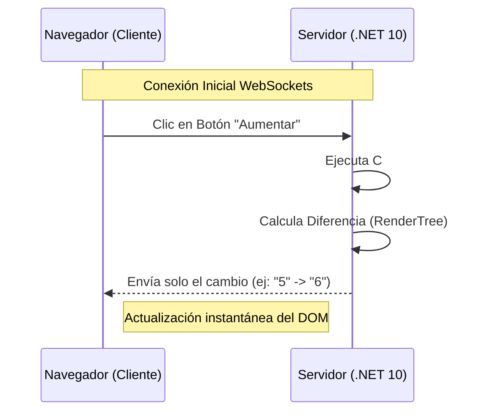

#### 7.4.6.1. Cómo funciona el protocolo SignalR

El protocolo SignalR es la espina dorsal de Blazor Server. A diferencia de las peticiones HTTP tradicionales que se abren y cierran, SignalR mantiene una **tubería de datos abierta** que permite al servidor "empujar" cambios al navegador sin que este los pida.

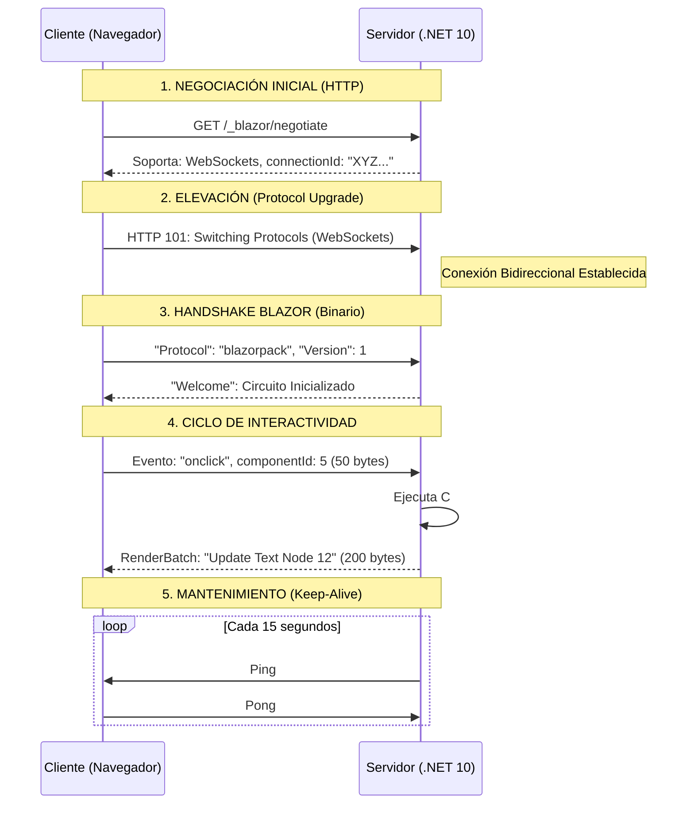

##### Anatomía del Mensaje Binario (BlazorPack)
SignalR en Blazor utiliza un formato llamado **MessagePack** en lugar de JSON. Esto es lo que permite que la comunicación sea tan eficiente:
*   **Eficiencia**: Un mensaje JSON de 1KB puede reducirse a **100 bytes** en binario.
*   **Velocidad**: El navegador no tiene que "parsear" texto largo; el runtime de Blazor lee los bytes directamente hacia el DOM.
*   **Dúplex**: El servidor puede enviar una notificación (ej: "Nueva venta") en cualquier momento, sin esperar a que el usuario haga clic.

📝 **Nota del Profesor**: 
> Si abres las herramientas de desarrollador (F12) y vas a la pestaña **Network -> WS**, podrás ver los mensajes volar en tiempo real. Verás que son indescifrables para un humano (porque son binarios), pero verás que son extremadamente pequeños y constantes.


#### 7.4.6.2. Diff del DOM virtual

```csharp
// Blazor internamente (simplificado):

// PASO 1: Renderizar componente en memoria (DOM virtual)
var domVirtual = RenderComponent();

// PASO 2: Comparar con renderizado anterior
var diff = CalculateDiff(domVirtualAnterior, domVirtual);

// Ejemplo de diff:
// {
//   updates: [
//     { type: "updateText", componentId: 5, elementRef: 12, newText: "42" },
//     { type: "setAttribute", componentId: 5, elementRef: 15, attrName: "class", value: "active" },
//     { type: "removeElement", componentId: 5, elementRef: 20 }
//   ]
// }

// PASO 3: Serializar diff con MessagePack (formato binario)
var mensaje = MessagePack.Serialize(diff);
// Tamaño: ~200 bytes

// PASO 4: Enviar por WebSocket
await websocket.SendAsync(mensaje);

// PASO 5: Cliente recibe y aplica cambios
// blazor. server.js:
// function applyRenderBatch(batch) {
//   foreach (update in batch.updates) {
//     switch (update.type) {
//       case "updateText": 
//         element.textContent = update.newText;
//         break;
//       case "setAttribute":
//         element.setAttribute(update.attrName, update.value);
//         break;
//       case "removeElement":
//         element. remove();
//         break;
//     }
//   }
// }
```

**Ejemplo concreto con To-Do List:**

```
ACCIÓN:  Usuario marca nota como completada

ANTES (DOM virtual):
  <div class="list-group-item" data-blazor-ref="15">
    <input type="checkbox" checked="false" data-blazor-ref="16" />
    <span>Comprar leche</span>
  </div>

DESPUÉS (DOM virtual):
  <div class="list-group-item list-group-item-success" data-blazor-ref="15">
    <input type="checkbox" checked="true" data-blazor-ref="16" />
    <span class="text-decoration-line-through">Comprar leche</span>
  </div>

DIFF CALCULADO:
  [
    { 
      type: "setAttribute", 
      ref: 15, 
      attr: "class", 
      value: "list-group-item list-group-item-success" 
    },
    { 
      type: "setAttribute", 
      ref: 16, 
      attr: "checked", 
      value: "true" 
    },
    { 
      type: "setAttribute", 
      ref: 17, 
      attr: "class", 
      value: "text-decoration-line-through" 
    }
  ]

MENSAJE ENVIADO (MessagePack binario):
  Tamaño: ~180 bytes

COMPARACIÓN CON MVC TRADICIONAL:
  HTTP POST /todo/toggle/abc123
  Respuesta HTML completa:  ~50 KB
  
  Blazor es ~277x más eficiente en este caso
```

#### 7.4.6.3. Demostración con herramientas de desarrollo

**Inspeccionar tráfico SignalR en DevTools:**

```
1. Abrir DevTools (F12)
2. Ir a la pestaña "Network" (Red)
3. Filtrar por "WS" (WebSocket)
4. Ver conexión "_blazor? id=..."

MENSAJES ENVIADOS (↑):
  Type: Binary Frame
  Length: 52 bytes
  Payload: [0x95, 0x01, 0x82, 0xa1, 0x45, ...]
  Decodificado (MessagePack): 
    { type: "EventCallback", handler: 5 }

MENSAJES RECIBIDOS (↓):
  Type: Binary Frame
  Length: 287 bytes
  Payload: [0x93, 0x02, 0x91, 0x85, ...]
  Decodificado (MessagePack):
    { 
      type: "RenderBatch",
      updates: [...]
    }
```

**Script para mostrar estadísticas:**

```javascript
// Añadir al final de _Layout.cshtml para debugging

<script>
    // Contador de mensajes SignalR
    let mensajesEnviados = 0;
    let mensajesRecibidos = 0;
    let bytesEnviados = 0;
    let bytesRecibidos = 0;
    
    // Interceptar WebSocket
    const originalWebSocket = window.WebSocket;
    window.WebSocket = function(... args) {
        const ws = new originalWebSocket(...args);
        
        const originalSend = ws.send;
        ws.send = function(data) {
            mensajesEnviados++;
            bytesEnviados += data. byteLength || data.length;
            console.log(`📤 Mensaje enviado: ${data.byteLength || data.length} bytes`);
            return originalSend.call(this, data);
        };
        
        ws.addEventListener('message', function(event) {
            mensajesRecibidos++;
            const size = event.data.size || event.data.byteLength || event.data.length;
            bytesRecibidos += size;
            console.log(`📥 Mensaje recibido: ${size} bytes`);
        });
        
        return ws;
    };
    
    // Mostrar estadísticas cada 5 segundos
    setInterval(() => {
        console. log(`
📊 Estadísticas SignalR:
  Mensajes enviados: ${mensajesEnviados}
  Bytes enviados: ${bytesEnviados} (${(bytesEnviados/1024).toFixed(2)} KB)
  Mensajes recibidos: ${mensajesRecibidos}
  Bytes recibidos: ${bytesRecibidos} (${(bytesRecibidos/1024).toFixed(2)} KB)
  Total: ${((bytesEnviados + bytesRecibidos)/1024).toFixed(2)} KB
        `);
    }, 5000);
</script>
```

**Resultados típicos en To-Do List:**

```
SESIÓN DE 5 MINUTOS (usuario activo):
  Acciones realizadas: 
    - Crear 10 notas
    - Completar 5 notas
    - Eliminar 3 notas
    - Buscar 2 veces
    
  Tráfico total: 
    📤 Enviado: ~2 KB
    📥 Recibido: ~8 KB
    ━━━━━━━━━━━━━━━━
    📊 TOTAL: ~10 KB

COMPARACIÓN CON MVC TRADICIONAL:
  Mismas acciones (18 operaciones):
    - 18 POST requests
    - 18 HTML responses completas (~50 KB cada una)
    
  Tráfico total:
    📤 Enviado: ~36 KB (requests + headers)
    📥 Recibido: ~900 KB (HTML completo)
    ━━━━━━━━━━━━━━━━
    📊 TOTAL: ~936 KB
    
  🎯 Blazor es ~93x más eficiente en ancho de banda
```

---

## 7.5. Resiliencia: Gestión de Errores con ErrorBoundary

En Blazor Server, un error no controlado en un componente puede provocar la caída de todo el "circuito" de SignalR del usuario. Para evitar esto, .NET 10 potencia el uso de **Error Boundaries**.

#### ¿Cómo funciona?
Envolvemos las secciones críticas de nuestra UI con el componente `<ErrorBoundary>`. Si algo falla dentro, el error se captura y el resto de la página sigue funcionando.

```razor
<ErrorBoundary @ref="errorBoundary">
    <ChildContent>
        <FunkoList />
    </ChildContent>
    <ErrorContent>
        <div class="alert alert-danger">
            <i class="fas fa-exclamation-triangle"></i> 
            Error al cargar la lista. <button class="btn btn-link" @onclick="Recover">Reintentar</button>
        </div>
    </ErrorContent>
</ErrorBoundary>

@code {
    private ErrorBoundary? errorBoundary;

    private void Recover()
    {
        errorBoundary?.Recover(); // ✅ Intenta recargar solo el componente fallido
    }
}
```

### 7.5.2. Integración de Blazor en Razor Pages

Aunque el enfoque principal de este tema ha sido MVC, la integración en **Razor Pages** es igualmente potente y sigue una mecánica muy similar, con sutiles diferencias en el enrutamiento.

#### A. Registro en Program.cs
Al igual que en MVC, debemos registrar los servicios de componentes de Razor y el renderizado interactivo.

```csharp
// Program.cs
builder.Services.AddRazorPages(); // Ya existente
builder.Services.AddRazorComponents()
    .AddInteractiveServerComponents();

var app = builder.Build();

app.MapRazorPages(); // Enrutamiento de páginas
app.MapRazorComponents<App>()
    .AddInteractiveServerRenderMode();
```

#### B. Uso en una Página (.cshtml)
Para inyectar un componente interactivo en una Razor Page, utilizamos el mismo Tag Helper `<component>`. La gran ventaja es que podemos pasar datos desde el `PageModel` al componente Blazor como parámetros.

```cshtml
@page "/ventas-real-time"
@model MiApp.Pages.VentasModel

<div class="container">
    <h1>Panel de Control de Ventas</h1>
    
    @* Inyección del componente Blazor Server *@
    <component type="typeof(MiApp.Components.DashboardVentas)" 
               render-mode="ServerPrerendered" 
               param-UsuarioActual='@Model.NombreUsuario' />
</div>
```

#### C. Simetría y Diferencias Clave
| Aspecto           | En MVC                                    | En Razor Pages                       |
| :---------------- | :---------------------------------------- | :----------------------------------- |
| **Ubicación**     | Vistas (`Views/Home/Index.cshtml`)        | Páginas (`Pages/Index.cshtml`)       |
| **Paso de Datos** | Desde `ViewBag` o `Model` del Controller. | Desde propiedades del `PageModel`.   |
| **Layout**        | Requiere script en `_Layout.cshtml`.      | Requiere script en `_Layout.cshtml`. |

> una vez que el script `blazor.server.js` carga en el navegador, el circuito SignalR se establece independientemente de si la página base nació de un Controlador o de una Razor Page.

#### 7.5.3. Navegación Programática y JS Interop

Para construir aplicaciones fluidas, a veces necesitamos cambiar de página mediante código (tras guardar un dato) o invocar funciones JavaScript existentes.

##### A. NavigationManager: El Redirect de Blazor
En MVC usamos `return RedirectToAction()`. En Blazor, inyectamos el servicio `NavigationManager` y llamamos al método `.NavigateTo()`.

```razor
@inject NavigationManager Navigator

<button @onclick="IrAlListado">Volver al Inicio</button>

@code {
    private void IrAlListado() {
        // Redirige al usuario sin recargar el navegador
        Navigator.NavigateTo("/funkos/listado");
    }
}
```

##### B. JS Interop: El puente con el navegador
Blazor permite llamar a cualquier función de JavaScript desde C# inyectando `IJSRuntime`. Esto es vital para usar librerías de alertas, mapas o acceder al almacenamiento local (LocalStorage).

```razor
@inject IJSRuntime JS

<button @onclick="ConfirmarBorrado">Eliminar Funko</button>

@code {
    private async Task ConfirmarBorrado() {
        // Llamada a la función nativa 'confirm' del navegador
        bool confirmado = await JS.InvokeAsync<bool>("confirm", "¿Estás seguro?");
        
        if (confirmado) {
            // Lógica de borrado...
            await JS.InvokeVoidAsync("alert", "¡Funko eliminado!");
        }
    }
}
```

🎓 **Analogía del Profesor**:
> El **JS Interop** es como un **intérprete diplomático**. C# y JavaScript hablan idiomas distintos y viven en mundos diferentes, pero `IJSRuntime` permite que C# le diga a JavaScript: "Haz este favor por mí", y que JavaScript le devuelva la respuesta en un idioma que C# entienda.

---


## 7.6. Resumen

### 7.6.1. Clarificación Tecnológica
- **Razor vs Blazor**: Razor genera HTML estático, Blazor es interactivo y con estado.
- **Blazor Web App (.NET 10)**: Modelo unificado con Render Modes (Server, WASM, Auto).
- **Cuándo usar cada uno**: MVC para SEO/Público, Blazor para Dashboards/Interactividad.

### 7.6.2. Convivencia e Hibridación
- **Configuración**: `AddRazorComponents` y `MapRazorComponents` en .NET 10.
- **Tag helper <component>**: Permite inyectar interactividad Blazor en vistas MVC clásicas.
- **Render modes**: ServerPrerendered para velocidad inicial, Static para solo lectura.

### 7.6.3. Fundamentos de la Reactividad
- **Ciclo de vida**: `OnInitialized`, `OnParametersSet`, `OnAfterRender` y `Dispose`.
- **StateHasChanged**: Notifica al framework que debe refrescar la interfaz.
- **Data binding**: Soporte para enlace unidireccional y bidireccional (`@bind`).

### 7.6.4. Caso Práctico y Eficiencia
- **Estado en Servidor**: Los datos viven en el "circuito" mientras el usuario está conectado.
- **Protocolo SignalR**: Envío de paquetes binarios mínimos con las diferencias del DOM.
- **Productividad**: Desarrollo Full-stack usando únicamente C# y .NET.

---

### 7.6.5. Guía de Selección y Conclusiones

Para finalizar, debemos consolidar el criterio de ingeniería que nos permitirá elegir la arquitectura adecuada para cada proyecto en el ecosistema .NET 10.

#### Tabla de Decisión Final

| Si tu proyecto es...   | La tecnología ideal es... | Justificación Técnica                                                                                                           |
| :--------------------- | :------------------------ | :------------------------------------------------------------------------------------------------------------------------------ |
| **Web Pública / SEO**  | **MVC o Razor Pages**     | El **Stateless** total garantiza escalabilidad infinita y el HTML plano es el mejor amigo de los indexadores de Google.         |
| **Intranet / Gestión** | **Blazor Server**         | La interactividad es nativa. Ahorras meses de desarrollo al no tener que crear y asegurar una API REST intermedia.              |
| **Offline / PWA**      | **Blazor WebAssembly**    | El código se descarga y "vive" en el cliente. Ideal para zonas con mala cobertura o aplicaciones de uso intensivo de CPU local. |
| **SaaS de Alto Nivel** | **Blazor Web App (Auto)** | Es la experiencia definitiva: arranca rápido en el servidor y migra al cliente de forma transparente para una fluidez total.    |

#### Ventajas Clave de la Ecosistema Blazor

1. **Unificación de Lenguaje (C#)**
   *   Elimina el "context switching" (cambio de mentalidad) entre C# y JavaScript.
   *   Toda la solución se compila, lo que detecta errores de tipos antes de llegar a producción.

2. **Reutilización de Modelos y Lógica**
   *   Los mismos **InputModels** y validadores de FluentValidation sirven para el formulario interactivo y para la persistencia en base de datos.

3. **Interactividad de Próxima Generación**
   *   Experiencia de aplicación de escritorio (Single Page Application) sin la complejidad de configurar Webpack, NPM o frameworks JS externos.

4. **Eficiencia Extrema de Red**
   *   El protocolo SignalR optimizado con MessagePack reduce el tráfico de datos en más de un 90% respecto a las recargas de página tradicionales.

🎓 **Veredicto del Profesor**:
> Blazor no ha venido a sustituir a MVC, sino a complementarlo. Como profesional de DAW, tu objetivo es saber cuándo usar la "fuerza bruta" del HTML estático y cuándo la "elegancia reactiva" de Blazor. Dominar ambos mundos es lo que te define como un desarrollador Full-Stack senior en .NET.

---
