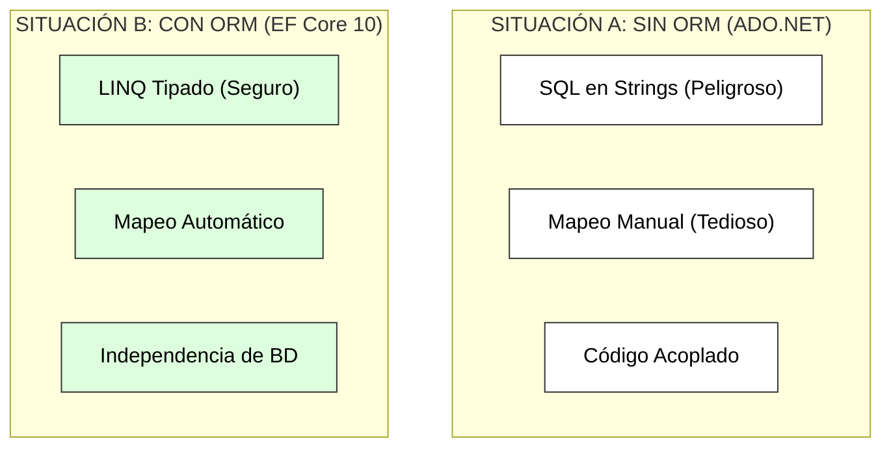
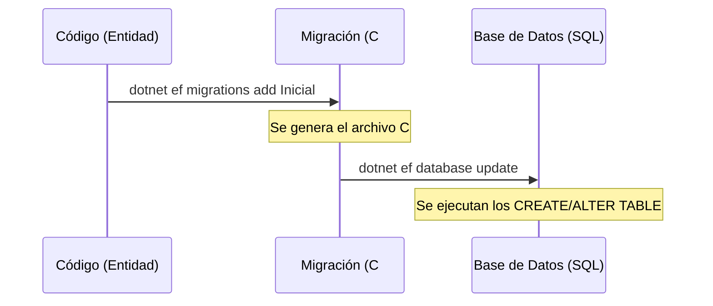
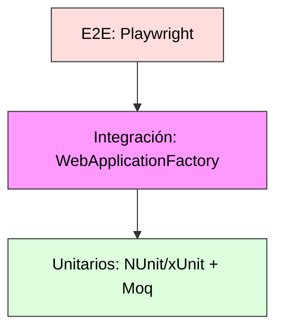
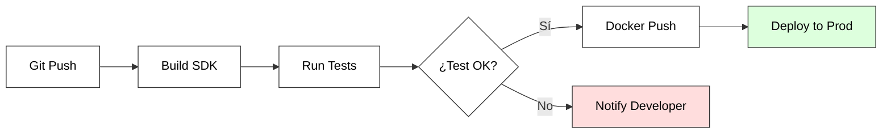

# 8. Persistencia, Calidad y Despliegue

## Índice

- [8. Persistencia, Calidad y Despliegue](#8-persistencia-calidad-y-despliegue)
  - [Índice](#índice)
  - [8.1. Persistencia de Datos con EF Core 10](#81-persistencia-de-datos-con-ef-core-10)
    - [8.1.1. Introducción al ORM Moderno](#811-introducción-al-orm-moderno)
    - [8.1.2. Configuración del DbContext y DI](#812-configuración-del-dbcontext-y-di)
    - [8.1.3. Migraciones y Gestión del Esquema](#813-migraciones-y-gestión-del-esquema)
      - [Estrategias de Retroceso (Rollback)](#estrategias-de-retroceso-rollback)
      - [Migraciones en Producción](#migraciones-en-producción)
    - [8.1.4. Patrón Repository Asíncrono](#814-patrón-repository-asíncrono)
    - [8.1.5. Manejo de Errores con Result (ROP)](#815-manejo-de-errores-con-result-rop)
    - [8.1.6. Auditoría Automática (Interceptors)](#816-auditoría-automática-interceptors)
  - [8.2. Calidad y Testing de la Presentación](#82-calidad-y-testing-de-la-presentación)
    - [8.2.1. La Pirámide de Pruebas](#821-la-pirámide-de-pruebas)
    - [8.2.2. Pruebas Unitarias: MVC vs Razor Pages](#822-pruebas-unitarias-mvc-vs-razor-pages)
    - [8.2.3. Pruebas de Integración: El Eslabón Perdido](#823-pruebas-de-integración-el-eslabón-perdido)
    - [8.2.4. Pruebas E2E con Playwright](#824-pruebas-e2e-con-playwright)
  - [8.3. Despliegue y DevOps: De Local a Producción](#83-despliegue-y-devops-de-local-a-producción)
    - [8.3.1. Publicación y Entornos](#831-publicación-y-entornos)
    - [8.3.2. Dockerización Profesional](#832-dockerización-profesional)
      - [8.3.2.1. Orquestación con Docker Compose](#8321-orquestación-con-docker-compose)
      - [8.3.2.2. Observabilidad: Logging Estructurado con Serilog](#8322-observabilidad-logging-estructurado-con-serilog)
      - [8.3.2.3. Resiliencia: Health Checks (Monitorización)](#8323-resiliencia-health-checks-monitorización)
    - [8.3.3. Pipeline de CI/CD Automatizado](#833-pipeline-de-cicd-automatizado)
  - [8.4. Optimización y Rendimiento: El Poder de la Caché](#84-optimización-y-rendimiento-el-poder-de-la-caché)
    - [8.4.1. Estrategias de Caché](#841-estrategias-de-caché)
    - [8.4.2. Output Cache: El Estándar de .NET 10](#842-output-cache-el-estándar-de-net-10)
      - [C. Invalidación por Etiquetas (Eviction)](#c-invalidación-por-etiquetas-eviction)
  - [8.5. Resumen](#85-resumen)

---

## 8.1. Persistencia de Datos con EF Core 10

¿Por qué usar un ORM moderno como **Entity Framework Core** en lugar de ADO.NET puro? Simplemente por productividad, seguridad y mantenibilidad. EF Core abstrae las complejidades del acceso a datos, permitiéndote centrarte en la lógica de negocio.



### 8.1.1. Introducción al ORM Moderno

Un **ORM (Object-Relational Mapping)** es el puente que permite que tus objetos C# "hablen" con las tablas de una base de datos relacional sin que tú tengas que escribir SQL manualmente para cada operación.

🎓 **Analogía del Profesor**:
> Trabajar con **ADO.NET** es como escribir una carta a mano, meterla en un sobre y llevarla a correos cada vez que quieres decir algo. **EF Core** es como tener una conexión de telepatía: tú piensas en cambiar un dato en tu objeto y la base de datos se actualiza sola.

#### A. Ventajas de EF Core 10
*   **LINQ**: Consultas potentes validadas en tiempo de compilación.
*   **Change Tracking**: El framework detecta qué propiedades han cambiado y solo actualiza esas columnas.
*   **Migraciones**: Control de versiones para tu base de datos (igual que Git para tu código).
*   **Bulk Operations**: Capacidad de actualizar o borrar miles de registros con una sola sentencia SQL (`ExecuteUpdate`, `ExecuteDelete`).

---

### 8.1.2. Configuración del DbContext y DI

El **DbContext** es la pieza central. Representa una sesión con la base de datos y es donde definimos nuestras tablas (`DbSet`).

#### A. Definición del Contexto (C# 14)

Utilizamos **Primary Constructors** para una inyección de dependencias más limpia.

```csharp
// Data/AppDbContext.cs (.cs)
namespace MiApp.Data;

public class AppDbContext(DbContextOptions<AppDbContext> options) : DbContext(options)
{
    public DbSet<Funko> Funkos => Set<Funko>();
    public DbSet<Categoria> Categorias => Set<Categoria>();

    protected override void OnModelCreating(ModelBuilder modelBuilder)
    {
        base.OnModelCreating(modelBuilder);
        
        // Aplicamos configuraciones de forma automática desde el ensamblado
        modelBuilder.ApplyConfigurationsFromAssembly(typeof(AppDbContext).Assembly);

        // Seed Data: Datos iniciales para el alumno
        modelBuilder.Entity<Categoria>().HasData(
            new Categoria { Id = 1, Nombre = "Star Wars" },
            new Categoria { Id = 2, Nombre = "Marvel" }
        );
    }
}
```

#### B. Registro en el Pipeline (Program.cs)

Es vital configurar el ciclo de vida como **Scoped** (una instancia por cada petición HTTP).

```csharp
// Program.cs (.cs)
builder.Services.AddDbContext<AppDbContext>(options =>
{
    options.UseSqlServer(builder.Configuration.GetConnectionString("DefaultConnection"));
    
    if (builder.Environment.IsDevelopment())
    {
        options.EnableSensitiveDataLogging(); 
        options.EnableDetailedErrors();
    }
});
```

---

### 8.1.3. Migraciones y Gestión del Esquema

Las migraciones permiten evolucionar el esquema de la BD sin perder datos. Es el "control de versiones" de tu base de datos.

**Flujo de Trabajo Operativo:**



#### Estrategias de Retroceso (Rollback)
Si una migración causa problemas, .NET permite volver atrás de dos formas:
1. **Temporal**: `dotnet ef database update NombreDeLaMigracionAnterior`. Esto deshace los cambios en la BD pero mantiene el archivo de migración.
2. **Total**: `dotnet ef migrations remove`. Elimina el último archivo de migración (solo si aún no se ha aplicado a la base de datos).

#### Migraciones en Producción
⚠️ **Regla de Oro del Profesor**: Nunca uses `database update` en un servidor de producción real.
*   **Enfoque Manual**: Genera un script SQL (`dotnet ef migrations script`) y entrégaselo al administrador de sistemas.
*   **Enfoque Automatizado**: Usa `context.Database.MigrateAsync()` en el arranque de `Program.cs` para que la app se actualice sola al arrancar (ideal para contenedores Docker).

---

### 8.1.4. Patrón Repository Asíncrono

Para desacoplar la lógica de negocio de EF Core, utilizamos repositorios. Esto facilita enormemente el **Testing** (Sección 8.2) y permite cambiar de base de datos sin tocar los controladores.

🎓 **Analogía del Profesor**:
> El **Repositorio** es como el **encargado del almacén**. El Controlador (el cliente) no entra a buscar las cajas entre las estanterías (las tablas); simplemente le pide al encargado: "Dame el Funko 42". Al Controlador no le importa si el encargado lo saca de una estantería SQL, de un cajón NoSQL o de una caja de zapatos (memoria).

#### A. Implementación Profesional Completa (C# 14)
Un repositorio profesional debe cubrir todo el ciclo de vida del dato (CRUD) y gestionar las posibles excepciones de concurrencia o integridad.

```csharp
// Repositories/FunkoRepository.cs (.cs)
public class FunkoRepository(AppDbContext context) : IFunkoRepository
{
    // LECTURA: Usamos AsNoTracking() en consultas de solo lectura para ganar velocidad
    public async Task<IEnumerable<Funko>> GetAllAsync() 
        => await context.Funkos.AsNoTracking().Include(f => f.Categoria).ToListAsync();

    public async Task<Funko?> GetByIdAsync(Guid id) 
        => await context.Funkos.AsNoTracking().FirstOrDefaultAsync(f => f.Id == id);

    // CREACIÓN
    public async Task<Funko> AddAsync(Funko entity)
    {
        await context.Funkos.AddAsync(entity);
        await context.SaveChangesAsync();
        return entity;
    }

    // ACTUALIZACIÓN: Controlamos si el registro existe antes de intentar salvar
    public async Task<bool> UpdateAsync(Funko entity)
    {
        var existing = await context.Funkos.AnyAsync(f => f.Id == entity.Id);
        if (!existing) return false;

        context.Funkos.Update(entity);
        return await context.SaveChangesAsync() > 0;
    }

    // BORRADO: Implementación eficiente
    public async Task<bool> DeleteAsync(Guid id)
    {
        var entity = await context.Funkos.FindAsync(id);
        if (entity == null) return false;

        context.Funkos.Remove(entity);
        return await context.SaveChangesAsync() > 0;
    }
}
```

📝 **Nota del Profesor**:
> Fíjate en el uso de **`AsNoTracking()`**. Por defecto, EF Core "vigila" todos los objetos que descargas. Si solo vas a mostrarlos en una lista y no vas a editarlos, decirle que no los vigile ahorra mucha memoria y CPU. ¡Es un truco de experto para aplicaciones de alto rendimiento!

---

### 8.1.5. Manejo de Errores con Result (ROP)

Usamos el patrón **Result** para capturar errores de base de datos y devolverlos de forma didáctica.

```csharp
public async Task<Result<Funko>> SafeAddAsync(Funko funko)
{
    try 
    {
        await context.Funkos.AddAsync(funko);
        await context.SaveChangesAsync();
        return Result.Success(funko);
    }
    catch (DbUpdateException)
    {
        return Result.Failure<Funko>("Error: Ya existe un registro con ese nombre.");
    }
}
```

---

### 8.1.6. Auditoría Automática (Interceptors)

```csharp
public override Task<int> SaveChangesAsync(CancellationToken ct = default)
{
    var entries = ChangeTracker.Entries()
        .Where(e => e.State == EntityState.Added || e.State == EntityState.Modified);

    foreach (var entry in entries)
    {
        entry.Property("UpdatedAt").CurrentValue = DateTime.UtcNow;
        if (entry.State == EntityState.Added)
            entry.Property("CreatedAt").CurrentValue = DateTime.UtcNow;
    }
    return base.SaveChangesAsync(ct);
}
```

---

## 8.2. Calidad y Testing de la Presentación

Una aplicación sin tests es una aplicación que ya está rota. En ASP.NET Core, el testing es un ciudadano de primera clase.

### 8.2.1. La Pirámide de Pruebas



🎓 **Analogía del Profesor**:
> Un **Test Unitario** es probar si una bombilla luce. Un **Test E2E (Playwright)** es probar si una persona entra en la habitación, pulsa el interruptor y ve correctamente el cuadro de la pared.

---

### 8.2.2. Pruebas Unitarias: MVC vs Razor Pages

Las pruebas unitarias se centran en la lógica aislada. Para que sean efectivas, usamos **Moq** para simular la base de datos y **FluentAssertions** para que los resultados se lean como frases en inglés.

#### A. Ejemplo MVC (Controller)
```csharp
[Test]
public async Task Index_ReturnsView_WithListOfFunkos()
{
    // Arrange (Preparación)
    var mockService = new Mock<IFunkoService>();
    mockService.Setup(s => s.GetAllAsync()).ReturnsAsync(new List<FunkoDto> { new() { Nombre = "Spiderman" } });
    var controller = new FunkosController(mockService.Object);

    // Act (Acción)
    var result = await controller.Index() as ViewResult;

    // Assert (Verificación con FluentAssertions)
    result.Should().NotBeNull();
    var model = result!.Model.Should().BeAssignableTo<IEnumerable<FunkoDto>>().Subject;
    model.Should().HaveCount(1);
    model.First().Nombre.Should().Be("Spiderman");
}
```

#### B. Ejemplo Razor Pages (PageModel)
```csharp
[Test]
public async Task OnGetAsync_PopulatesFunkosList()
{
    // Arrange
    var mockService = new Mock<IFunkoService>();
    mockService.Setup(s => s.GetAllAsync()).ReturnsAsync(new List<FunkoDto> { new() { Nombre = "Vader" } });
    var pageModel = new IndexModel(mockService.Object);

    // Act
    await pageModel.OnGetAsync();

    // Assert
    pageModel.Funkos.Should().NotBeNull();
    pageModel.Funkos.Should().HaveCount(1);
    mockService.Verify(s => s.GetAllAsync(), Times.Once);
}
```

### 8.2.3. Pruebas de Integración: El Eslabón Perdido

Mientras que los tests unitarios prueban piezas sueltas, los **Tests de Integración** prueban cómo encajan esas piezas con el sistema de rutas, la inyección de dependencias y la base de datos (usando una BD en memoria).

Para ello usamos **`WebApplicationFactory<T>`**, que levanta un servidor web "en miniatura" dentro de tus tests.

```csharp
public class FunkoIntegrationTests : IClassFixture<WebApplicationFactory<Program>>
{
    private readonly HttpClient _client;

    public FunkoIntegrationTests(WebApplicationFactory<Program> factory)
    {
        _client = factory.CreateClient();
    }

    [Fact]
    public async Task Get_Index_ReturnsSuccessAndCorrectContentType()
    {
        // Act: Hacemos una petición real al servidor interno
        var response = await _client.GetAsync("/Funkos");

        // Assert
        response.EnsureSuccessStatusCode(); // Verifica que sea un 200 OK
        response.Content.Headers.ContentType!.ToString().Should().Be("text/html; charset=utf-8");
    }
}
```

🎓 **Analogía del Profesor**:
> El Test Unitario comprueba que el motor del coche gira. El Test de Integración comprueba que, al girar el motor, las ruedas se mueven y el coche avanza. Es la prueba definitiva de que tu configuración en `Program.cs` es correcta.

### 8.2.4. Pruebas E2E con Playwright

**Playwright** automatiza el navegador real (Chrome/Firefox).

```csharp
[Test]
public async Task Should_Login_Successfully()
{
    using var playwright = await Playwright.CreateAsync();
    await using var browser = await playwright.Chromium.LaunchAsync(new() { Headless = false });
    var page = await browser.NewPageAsync();

    await page.GotoAsync("https://localhost:5001/Account/Login");
    await page.FillAsync("input[name='Email']", "admin@dev.com");
    await page.FillAsync("input[name='Password']", "Password123!");
    await page.ClickAsync("button[type='submit']");

    await Expect(page.Locator("text=Bienvenido, Admin")).ToBeVisibleAsync();
}
```

---

## 8.3. Despliegue y DevOps: De Local a Producción

### 8.3.1. Publicación y Entornos

**Comando de Publicación:**
```bash
dotnet publish -c Release -o ./dist
```

### 8.3.2. Dockerización Profesional

Docker permite empaquetar tu aplicación con todas sus dependencias para que funcione igual en tu PC que en el servidor de producción.

```dockerfile
# Fase de Compilación
FROM mcr.microsoft.com/dotnet/sdk:10.0 AS build
WORKDIR /src
COPY . .
RUN dotnet publish -c Release -o /app

# Fase de Ejecución
FROM mcr.microsoft.com/dotnet/aspnet:10.0 AS final
WORKDIR /app
COPY --from=build /app .
ENTRYPOINT ["dotnet", "MiProyecto.dll"]
```

#### 8.3.2.1. Orquestación con Docker Compose
En una aplicación real, no solo tienes la web, sino también la Base de Datos. **Docker Compose** permite levantar ambos servicios coordinados.

```yaml
services:
  web:
    build: .
    ports: ["8080:80"]
    depends_on: [db]
    environment:
      ConnectionStrings__DefaultConnection: "Server=db;Database=FunkosDB;User Id=sa;Password=Password123!;"

  db:
    image: "mcr.microsoft.com/mssql/server:2022-latest"
    environment:
      SA_PASSWORD: "Password123!"
      ACCEPT_EULA: "Y"
```

#### 8.3.2.2. Observabilidad: Logging Estructurado con Serilog
En un servidor real no tenemos consola. Si la app falla, necesitamos saber qué pasó. Los logs tradicionales son texto plano difícil de buscar; el **Logging Estructurado** guarda los datos en formato JSON para que podamos filtrar por "ID de Usuario" o "Producto".

*   **Configuración Profesional**:
    ```csharp
    // Program.cs
    Log.Logger = new LoggerConfiguration()
        .WriteTo.Console()
        .WriteTo.File("logs/log-.txt", rollingInterval: RollingInterval.Day)
        .CreateLogger();
    
    builder.Host.UseSerilog();
    ```

*   **Uso en Código**:
    ```csharp
    _logger.LogInformation("Funko {Nombre} comprado por {UsuarioId}", funko.Nombre, user.Id);
    // ☝️ Blazor/MVC guardará el objeto JSON con los campos 'Nombre' y 'UsuarioId'
    ```

#### 8.3.2.3. Resiliencia: Health Checks (Monitorización)
¿Cómo sabe Docker o Kubernetes que nuestra app está lista para recibir visitas? Usamos los **Health Checks**. Son puntos de comprobación que verifican si la base de datos y los servicios están respondiendo.

```csharp
// 1. Registro
builder.Services.AddHealthChecks()
    .AddSqlServer(builder.Configuration.GetConnectionString("DefaultConnection"));

// 2. Endpoint (Pipeline)
app.MapHealthChecks("/health"); 
// ☝️ Si entramos en /health y todo va bien, responderá "Healthy"
```

🎓 **Analogía del Profesor**:
> El **Health Check** es como el **pulso de un paciente**. El orquestador (Docker) le toma el pulso constantemente. Si el pulso desaparece (la BD cae), el orquestador reinicia la app automáticamente para intentar salvarla.

---

### 8.3.3. Pipeline de CI/CD Automatizado



---

## 8.4. Optimización y Rendimiento: El Poder de la Caché

En una aplicación de alto tráfico, la base de datos es el cuello de botella. La caché permite servir datos instantáneamente desde la RAM.

### 8.4.1. Estrategias de Caché

1.  **In-Memory Cache**: Guarda objetos C# en la RAM del servidor. Ideal para datos que no cambian (ej: lista de países).
2.  **Distributed Cache (Redis)**: Caché compartida entre múltiples servidores.
3.  **Output Cache**: Guarda el HTML completo generado por una página o acción.

---

### 8.4.2. Output Cache: El Estándar de .NET 10

A diferencia de la caché de respuesta antigua, el **Output Cache** permite invalidar entradas por etiquetas (Tags) y tiene un control total desde el servidor.

#### A. Configuración Global (Program.cs)
```csharp
builder.Services.AddOutputCache(options =>
{
    // Política por defecto: 1 minuto
    options.AddBasePolicy(builder => builder.Expire(TimeSpan.FromMinutes(1)));
    
    // Política personalizada para el catálogo
    options.AddPolicy("FunkosCache", builder => 
        builder.Expire(TimeSpan.FromMinutes(10)).Tag("tag-funkos"));
});

// ... después de builder.Build()
app.UseOutputCache();
```

#### B. Aplicación MVC vs Razor Pages

| Paradigma | Implementación |
| :--- | :--- |
| **MVC** | Atributo `[OutputCache(PolicyName = "FunkosCache")]` en la Acción. |
| **Razor Pages** | Atributo `[OutputCache(PolicyName = "FunkosCache")]` en el PageModel. |

#### C. Invalidación por Etiquetas (Eviction)
¿Qué pasa si un usuario edita un Funko? ¡La caché mostraría datos antiguos! Para evitarlo, usamos la **Invalidación Quirúrgica**:

```csharp
// En el método Update del Controlador o PageModel
public async Task<IActionResult> OnPostAsync(IOutputCacheStore cache)
{
    // ... lógica de guardado ...
    
    // 🚀 MAGIA: Borra todas las páginas cacheadas que tengan el tag "tag-funkos"
    await cache.EvictByTagAsync("tag-funkos", default);
    
    return RedirectToPage("./Index");
}
```

📝 **Nota del Profesor**: 
> La invalidación por etiquetas es el "Santo Grial" del rendimiento. Te permite cachear el catálogo durante horas, pero en el milisegundo en que alguien cambia un precio, la caché se limpia y el siguiente usuario verá el dato actualizado. ¡Eficiencia máxima sin sacrificar la frescura!

---

## 8.5. Resumen

1.  **Persistencia**: EF Core 10 es el motor. Usa **Migraciones** para el esquema y **Repositorios** para desacoplar.
2.  **Calidad**: No te saltes la **Pirámide de Tests**. Moq para unitarios y **Playwright** para la experiencia real de usuario.
3.  **Despliegue**: Usa **Docker** para garantizar la portabilidad y **CI/CD** para eliminar el error humano.
4.  **Rendimiento**: La caché no es opcional en producción. **Output Cache** es tu mejor aliado.

🎓 **Veredicto del Profesor**:
> Dominar el ciclo completo (Datos -> Tests -> Despliegue) es lo que diferencia a un programador de un **Ingeniero de Software**. Este capítulo es el manual de vuelo para que tu app despegue del servidor local y conquiste la nube.

---
