# 9. Resumen y Conclusiones

## 9.1. Mapa Conceptual de la Unidad

```mermaid
graph TD
    UD05["UD05: Desarrollo de páginas web dinámicas en .NET/ASP.NET Core"] --> FUND[Fundamentos y Arquitectura]
    UD05 --> RAZOR[Motor Razor]
    UD05 --> FORMS[Formularios y Binding]
    UD05 --> SEC[Estado y Seguridad]
    UD05 --> I18N[I18n y Localización]
    UD05 --> BLAZOR[Blazor .NET 10]
    UD05 --> DATA[Persistencia y Despliegue]

    FUND --> MVC[Patrón MVC]
    FUND --> PIPE[Pipeline: MapStaticAssets]
    FUND --> OPTIONS[Patrón Options Tipado]

    RAZOR --> SYNTAX["Sintaxis @"]
    RAZOR --> TAGS[Tag Helpers: Anatomía Custom]

    FORMS --> BIND[Model Binding]
    FORMS --> PAG[Paginación Server-Side]

    SEC --> STATE[SessionId & Cookies]
    SEC --> AUTH[AuthorizeFolder vs Atributos]

    I18N --> SHARED[Patrón SharedResource]
    I18N --> PRIOR[Prioridad de Proveedores]

    BLAZOR --> MODES[Render Modes: Auto/WASM]
    BLAZOR --> CIRC[Circuito y Diffing DOM]

    DATA --> REPO[Repository & Result ROP]
    DATA --> OBS[Serilog & Health Checks]
    DATA --> TEST["Testing (Unit/Integration/E2E)"]
```

## 9.2. Conceptos Clave Detallados

### Arquitectura y Fundamentos profesional
| Concepto | Descripción | Importancia |
|----------|-------------|-------------|
| **Middleware Pipeline** | Cadena de componentes que procesan la petición HTTP. | Define el comportamiento global (Auth, StaticFiles, Routing). |
| **MapStaticAssets** | Gestión optimizada de activos con huella digital (Fingerprinting). | Mejora el rendimiento y soluciona problemas de caché en .NET 10. |
| **Patrón Options** | Mapeo tipado de la configuración `appsettings.json` a clases C#. | Elimina la "magia" de los strings y permite validación al arrancar. |
| **Global Exception Middleware** | Atrapa cualquier error no controlado en el servidor. | Evita que el usuario vea errores técnicos y asegura logs profesionales. |

### Motor Razor e Internacionalización
- **I18n y Localización**: Uso de archivos `.resx`, el **Patrón SharedResource** y la jerarquía de proveedores de cultura.
- **Tag Helpers**: Atributos HTML procesados en servidor. Incluye la creación de **Tag Helpers Personalizados** heredando de la clase base.
- **Simetría Contextual**: Acceso unificado al `HttpContext` y `Session` tanto en MVC como en Razor Pages.

### Gestión de Datos y Formularios
- **Paginación Server-Side**: Uso de `X.PagedList` para procesar grandes volúmenes de datos de forma eficiente en SQL.
- **PRG (Post-Redirect-Get)**: Patrón obligatorio para evitar duplicidad de datos y mejorar la navegación con mensajes flash (TempData).
- **Result ROP**: Manejo funcional de errores en la capa de servicio para evitar el abuso de excepciones.

### Blazor .NET 10
- **Modelo Unificado**: Elección granular del modo de renderizado (Static, Server, WASM o **Interactive Auto**).
- **Circuito SignalR**: Entorno de ejecución persistente en RAM con sincronización binaria vía MessagePack.
- **JS Interop**: Puente diplomático para invocar librerías JavaScript desde C# mediante `IJSRuntime`.

### Persistencia y Despliegue Profesional
- **Observabilidad**: Implementación de **Logging Estructurado (Serilog)** para depuración en entornos de producción.
- **Resiliencia**: Configuración de **Health Checks** para que los orquestadores (Docker) monitoricen la salud de la app.
- **Docker Compose**: Orquestación de contenedores para levantar la Web y la Base de Datos SQL Server coordinadamente.
- **Testing**: Pirámide completa con Unitarios, Integración (`WebApplicationFactory`) y E2E (**Playwright**).

## 9.3. Checklist de Supervivencia Final

- [ ] ¿Sé configurar el orden correcto de middlewares (Exception -> Auth -> Routing)?
- [ ] ¿Entiendo la ventaja de `MapStaticAssets` sobre `UseStaticFiles` en .NET 10?
- [ ] ¿Puedo implementar el **Patrón Options** para leer la configuración de forma tipada?
- [ ] ¿Sé internacionalizar una app usando el **Patrón SharedResource** y recursos .resx?
- [ ] ¿Entiendo cuándo usar `Interactive Auto` frente a `Interactive Server` en Blazor?
- [ ] ¿Sé implementar la auditoría automática en EF Core mediante la sobrescritura de `SaveChangesAsync`?
- [ ] ¿Puedo configurar **Serilog** para generar logs estructurados en formato JSON?
- [ ] ¿Sé escribir un test de integración con `WebApplicationFactory` y uno E2E con **Playwright**?

📝 **Nota del Profesor:** Esta unidad te ha llevado desde los fundamentos básicos hasta los patrones que se utilizan en aplicaciones empresariales reales. La robustez y el desacoplamiento son tus mejores aliados.

💡 **Tip del Examinador:** No olvides que en Blazor Server, el estado vive en el servidor. Si el usuario pierde la conexión WiFi, el circuito se rompe y el estado podría perderse. Tenlo siempre en cuenta al diseñar la experiencia de usuario.